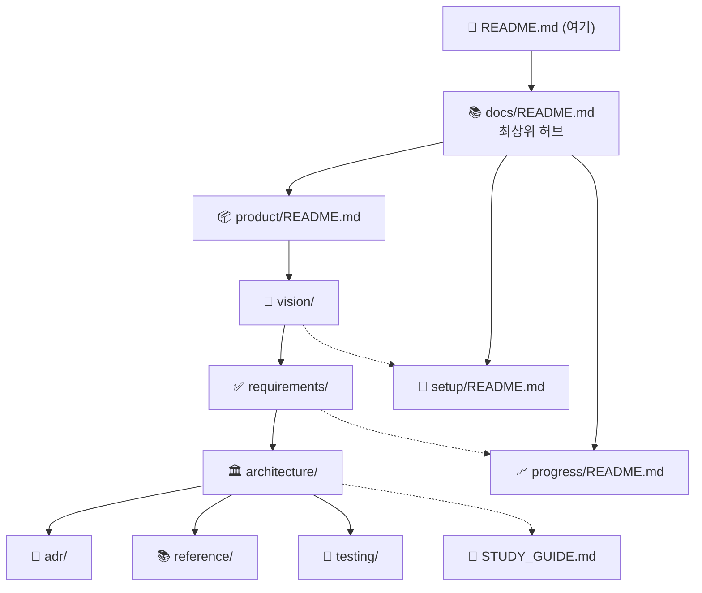

# 🤖 my-setup-proj

> Windows / macOS / Linux 어디서든 켜는 생산성 대시보드 + Claude AI 에이전트.
> 우숭대학교 "AI 컴퓨터 운영체제 실습" 강의(14주)의 실습 환경 겸 최종 프로젝트.

**시작** 2026-09-02 · **목표 완성** 2026-11-30

---

## 🖥️ 대시보드 주요 기능

앱은 **"대시보드 OS"** 다 — 아래 기능들이 각각 **위젯**으로 셸에 올라가 이동·리사이즈되고, 위젯마다 사용자가 색·밀도·표시 옵션을 꾸민다 ([DASHBOARD_OS.md](docs/product/vision/DASHBOARD_OS.md) · [UI_SPEC.md](docs/product/reference/UI_SPEC.md) · [requirements/WIDGET.md](docs/product/requirements/WIDGET.md)). 현재 코드는 아직 고정 패널이며 위젯 셸은 Phase C5~C6.

| 기능 | 설명 | 요구사항 | 상태 |
|---|---|---|---|
| **위젯 셸 (대시보드 OS)** | 각 기능을 위젯으로 배치·이동·리사이즈·최소화, 레이아웃 저장/복원, 위젯별 테마·표시 옵션 | FR-WIDGET-01~08 | ⏳ C5~C6 ([ADR-0020~0022](docs/product/architecture/adr/)) |
| **할 일 관리** | 할일 추가·수정·완료·삭제. 우선순위·마감일. 로컬 SQLite 영속 | FR-TASK-01~05 | 🚧 B3 (백엔드·DB ✅, 프론트 배선 중) |
| **프로젝트 진행도 추적** | 프로젝트 카드 + 0–100% 진행 바, 상태(active/done/on_hold). Notion 연동(읽기) | FR-PROJ-01~04 | ⏳ C2 |
| **캘린더 일정** | 오늘/내일 일정 위젯. Google Calendar 를 에이전트가 로컬 캐시에 동기화 | FR-CAL-01~03 | ⏳ C3 |
| **Daily Brief 브리핑** | 매일 아침 Claude 가 할일·메일·일정을 모아 우선순위 브리핑 생성 (cron 자동) | FR-AGENT-01~06 | ⏳ D1~D3 |
| **이메일 통합** | 여러 계정의 미읽은 메일을 한 곳에서 확인·요약 | FR-MAIL-01~03 | ⏳ D2, E |
| **프로젝트 다이어그램 뷰어** | `docs/**/*.md` 의 Mermaid(아키텍처·로드맵·오케스트레이션·모듈 의존)를 대시보드에서 렌더 — 저장소를 열지 않고 구조·진행 파악 | FR-UI-05 | ⏳ C4 ([ADR-0014](docs/product/architecture/adr/ADR-0014-dashboard-diagram-viewer.md)) |
| 공통 | 모든 위젯은 로딩/비어있음/정상/에러 4상태를 독립 렌더. 한 위젯 실패가 셸·다른 위젯을 가리지 않음 | FR-UI-01·04, FR-WIDGET-07 | 🚧 |

> 데이터 흐름: React 대시보드 ↔ Express REST(`:3000/api`) ↔ 로컬 SQLite. 외부 API(Gmail·Calendar·Notion·Claude)는 Python 에이전트가 전담해 SQLite 캐시에 쓴다 ([DESIGN.md](docs/product/architecture/DESIGN.md) §3, [ADR-0006](docs/product/architecture/adr/ADR-0006-agent-owns-external-apis.md)).

---

## 📚 문서 지도 — 어디로 갈까

**모든 폴더에 `README.md` 가 있고 서로 링크된다.** 어느 README 에서 시작해도 상단 네비게이션 바로 상위·형제 폴더로 이동할 수 있다. 이 표에서 원하는 폴더 README 로 들어가면, 그 안에 문서별 `무엇 / 언제 참조 / ⚠️ 놓치기 쉬운 것` 표가 있다.

### 진입점

| 나는… | → |
|---|---|
| **처음이다** (15분 온보딩 — 읽는 순서·규칙·명령) | [docs/ONBOARDING.md](docs/ONBOARDING.md) |
| **폴더를 훑고 싶다** (최상위 허브) | [docs/README.md](docs/README.md) |
| **아키텍처를 더 공부하고 싶다** | [docs/STUDY_GUIDE.md](docs/STUDY_GUIDE.md) |

### 폴더 README (여기서 각 폴더 안으로)



| README | 질문 | 대표 문서 | 바로 이럴 때 |
|---|---|---|---|
| [docs/](docs/README.md) | 전체 허브 | ONBOARDING · STUDY_GUIDE | 어디로 갈지 모를 때 |
| [product/](docs/product/README.md) | 무엇을 만드나 (5 카테고리 허브) | — | 제품 전반 |
| [product/vision/](docs/product/vision/README.md) | 왜·완료의 정의 | VISION · DASHBOARD_OS · AS_IS · RISKS | 방향·범위 판단 |
| [product/requirements/](docs/product/requirements/README.md) | 무엇을 만족해야 | FR · NFR · TRACEABILITY · TASK/UI/AGENT/PROJ/WIDGET | "이거 어느 FR인가" |
| [product/architecture/](docs/product/architecture/README.md) | 어떻게 만드나 (구조·결정) | ARCHITECTURE §0 뷰 지도 · DESIGN · DRIVERS · RUNTIME/DATA/CROSSCUTTING/EVOLUTION | 구현 착수 전 |
| [product/architecture/adr/](docs/product/architecture/adr/README.md) | 결정 이력 | ADR-0001~0023 (채택/제안) | "왜 이렇게 정했나" |
| [product/reference/](docs/product/reference/README.md) | 정확한 계약 | API_REFERENCE · UI_SPEC · DATA_DICTIONARY · GLOSSARY | 코드 작성 중 |
| [product/testing/](docs/product/testing/README.md) | 어떻게 검증 | TEST_PLAN (피라미드·TC-·머지 게이트) | PR 전 자기 점검 |
| [setup/](docs/setup/README.md) | 환경·도구·규칙 | SETUP · CONVENTIONS · GIT_WORKFLOW · ORCHESTRATION · AUTOMATION · DIAGRAMS · CLAUDE_INTEGRATION | 세팅·커밋·파이프라인 |
| [progress/](docs/progress/README.md) | 지금 어디까지 | PROGRESS · COURSE_MAPPING · (루트 [작업로그.md](작업로그.md)) | 다음 할 일 |

카테고리 밖 (product/ 루트): [ROADMAP.md](docs/product/ROADMAP.md) 주차별 일정 · [DOC_PLAN.md](docs/product/DOC_PLAN.md) 문서 계획(메타)

---

## ⚡ 빠른 시작

```bash
git clone https://github.com/gamercross/my-setup-proj.git
cd my-setup-proj
bash setup.sh     # frontend/backend npm install + agent venv + .env 준비
bash verify.sh    # 환경·문법 점검
```

### 앱 실행 (개발 모드)

현재는 **백엔드와 프론트를 각각 실행**한다 (한 번에 띄우는 통합 스크립트는 없음 — 아래 "미정" 참고).

```bash
# 터미널 A — 백엔드 API (:3000)
cd backend && npm start

# 터미널 B — Vite dev + Electron (:5173)
cd frontend && npm run dev
```

- `frontend/` 의 `npm run dev` 는 Vite 와 Electron 만 띄운다. 백엔드가 안 떠 있으면 대시보드는 `ErrorBanner`("백엔드에 연결할 수 없습니다") 를 보여주고, 앱 자체는 죽지 않는다 (FR-UI-04).
- CORS 는 C1(2026-09-03)에서 처리됨 — dev 오리진 `localhost:5173`, prod Electron `file://`(`Origin: null`) 허용.
- **미정 (Week 5~ / 패키징 전 결정):** ① Electron 이 백엔드 프로세스를 자동 기동할지(`child_process`) vs 계속 분리. ② 패키징된 앱에서 백엔드 실행 주체. ③ 백엔드 비정상 종료 시 앱의 재연결 정책. → 결정 시 ADR + [DESIGN.md](docs/product/architecture/DESIGN.md) §실행 구조에 반영.

전체 환경 구축 절차는 [SETUP.md](docs/setup/SETUP.md), 프로젝트 맥락은 [ONBOARDING.md](docs/ONBOARDING.md) 를 본다.

---

## 🗂️ 저장소 구조

```
my-setup-proj/
├─ frontend/   Electron + React 데스크톱 앱 (Vite + React 마운트 ✅ B1, 데이터 배선 중 — B3)
├─ backend/    Node.js + Express API (tasks/projects CRUD + better-sqlite3, db/schema.sql)
├─ agent/      Python Claude 에이전트 (뼈대 + 서비스 스텁)
├─ scripts/    작업로그·슬랙·다이어그램 자동화 스크립트
├─ tests/      테스트 (Phase A3 에서 채움)
├─ docs/       ONBOARDING + product / setup / progress
└─ .claude/    에이전트 팀 정의 + /feature 파이프라인
```

---

## 📊 현재 상태 (2026-09-04)

| 영역 | 상태 |
|---|---|
| 개념 설계 · 요구사항 · 아키텍처 문서 (뷰별 심화 + ADR-0001~0023) | ✅ (`docs/product/`) |
| 자동화 인프라 (에이전트 팀 · 작업로그 · CI · GIT_WORKFLOW) | ✅ 동작 |
| 로컬 개발 환경 (node 26 · python 3.14 · venv) | ✅ Phase A2 |
| 자동화 테스트 | ✅ backend 39 · agent 3, CI 초록 (A3·B2·C1·C2) |
| 프론트엔드 React (Vite 마운트) | ✅ Phase B1 |
| DB (SQLite, better-sqlite3 · WAL · `DATABASE_PATH`) | ✅ Phase B2 |
| 백엔드 tasks/projects CRUD + 미들웨어(CORS·로깅·에러) + 오류 매핑 | ✅ B2·C1·C2 |
| 프론트↔백엔드 배선 (할일 B3 · 프로젝트 C2) | ✅ 코드 — 브라우저 E2E(TC-UI-10~16) 로컬 수동 확인 대기 |
| AI 에이전트 | 🚧 뼈대 + 스텁 |
| 캘린더 위젯 / 다이어그램 뷰어 / 위젯 셸 | ⏳ C3 / C4 ([ADR-0014](docs/product/architecture/adr/ADR-0014-dashboard-diagram-viewer.md)) / C5~C6 ([ADR-0020~0022](docs/product/architecture/adr/README.md), 제안) |

정확한 최신은 [AS_IS.md](docs/product/vision/AS_IS.md) · [TRACEABILITY.md](docs/product/requirements/TRACEABILITY.md) · `git log`. 다음 할 일은 [PROGRESS.md](docs/progress/PROGRESS.md).

---

## 🔧 개발 방식

기능 하나를 `/feature <설명>` 으로 시작하면 네 에이전트가 순서대로 처리한다:

```
planner(계획) → developer(구현) → supervisor(리뷰·검증) → finisher(커밋·푸시)
```

`/build-next` 는 로드맵([DESIGN §8](docs/product/architecture/DESIGN.md))을 스스로 따라가며 이 파이프라인을 반복 실행하고,
사람이 결정할 지점(제안 ADR·API 키·대화형)에서만 멈춘다.

- 상태 그래프·정지 조건: [ORCHESTRATION.md](docs/setup/ORCHESTRATION.md)
- 규칙: [CONVENTIONS.md](docs/setup/CONVENTIONS.md) · 커밋·푸시: [GIT_WORKFLOW.md](docs/setup/GIT_WORKFLOW.md) · 전체: [AUTOMATION.md](docs/setup/AUTOMATION.md)
- 브랜치: `feature/* → PR → main` ([ADR-0023](docs/product/architecture/adr/ADR-0023-branch-model.md)). `main` 직접 커밋·`develop`·Git Flow 안 씀.
- 미결정 설계는 **제안** 상태 ADR ([목록·상태](docs/product/architecture/adr/README.md)) — 관련 Phase 착수 전 사용자 결정. 0013~0022 제안 / 0001~0012·0023 채택.

---

## 📞 참고

- 강의 자료: https://wikidocs.net/book/10238
- Claude 문서: https://docs.claude.com
- 개인 학습 목적 프로젝트

---

> 📚 **문서 탐색:** [docs/README.md](docs/README.md) (허브) · [ONBOARDING](docs/ONBOARDING.md) · [product/](docs/product/README.md) · [setup/](docs/setup/README.md) · [progress/](docs/progress/README.md)
