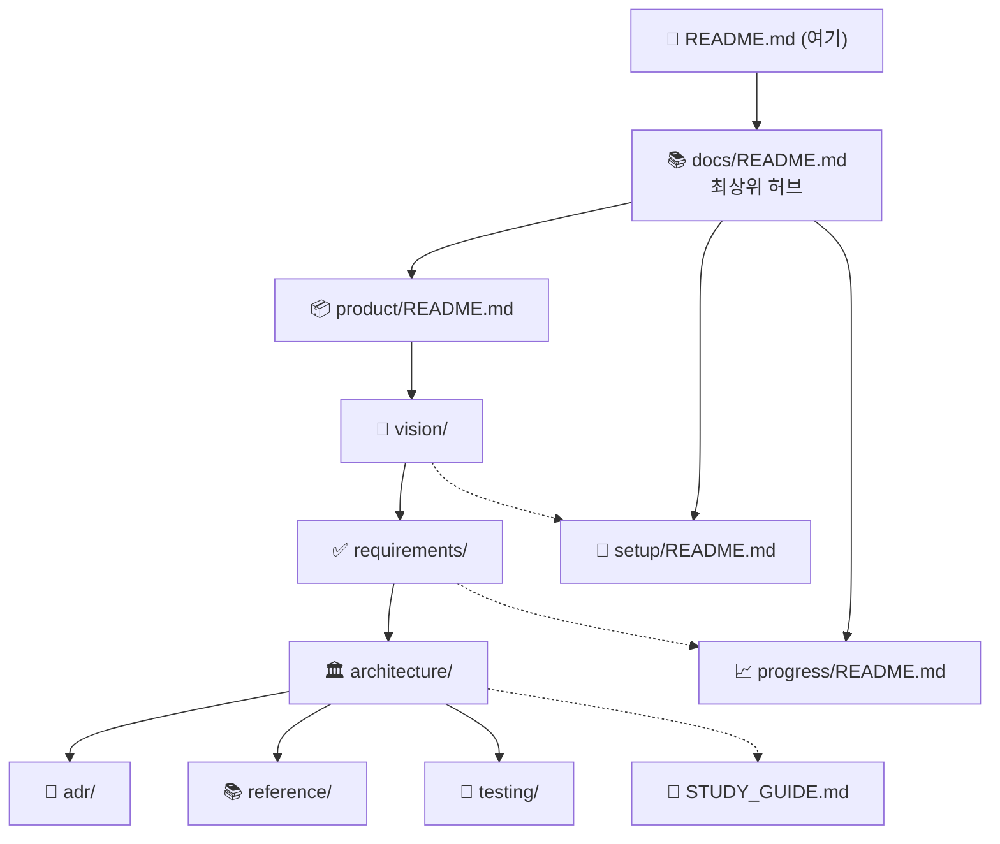
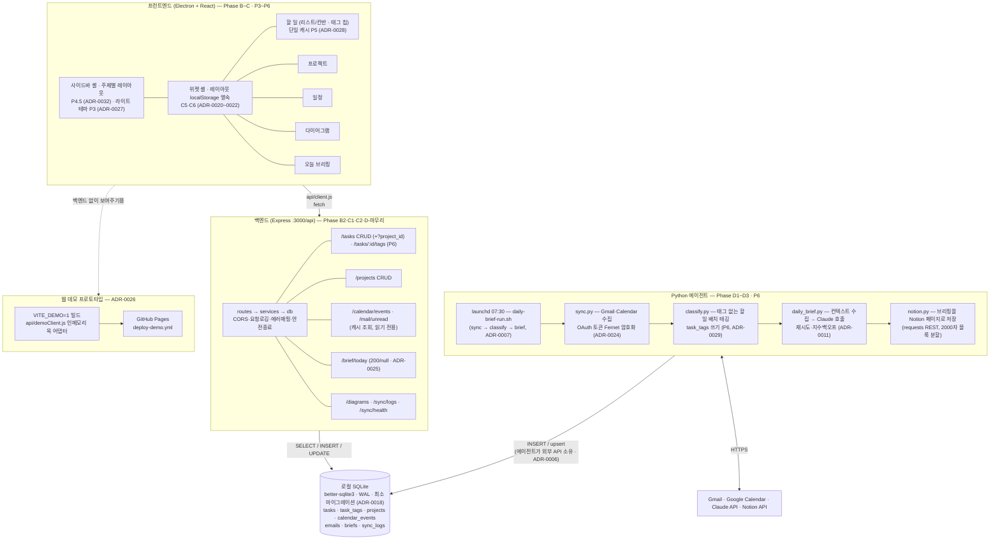

# 🤖 my-setup-proj — 대시보드 OS

> **목적은 진척률이 아니라 지식이다.** 흩어진 프로젝트·경험을 시각화·도식화해 지식의
> 가치를 올리고, 그 지식이 쌓여 역량이 느는 방향을 한눈에 보이게 하는 개인 생산성
> 대시보드 — Windows / macOS / Linux 어디서든 켜는 Electron 앱 + Claude AI 에이전트.
> 자세한 "왜"는 [docs/REVERSE_PLAN.md](docs/REVERSE_PLAN.md) §1-0·§6-0.
>
> 우송대학교 2026-2학기 3개 강의(AI 컴퓨터 운영체제 실습 / AI시대소프트웨어공학 / AITool기반소프트웨어공학)의 공통 실습 환경이자 제출 산출물이다. 각 강의가 보는 층이 다르다 — 런타임·환경(A) / AI 활용 개발 프로세스(B) / SW공학 산출물(C). 상세: [docs/progress/COURSE_MAPPING.md](docs/progress/COURSE_MAPPING.md).

**시작** 2026-09-02 · **목표 완성** 2026-11-30 · **공개 쇼케이스** [gamercross.github.io/my-setup-proj-story](https://gamercross.github.io/my-setup-proj-story/)

---

## 🔗 지금 보기 / 작업하는 곳

| 무엇 | 링크 | 설명 |
|---|---|---|
| **라이브 데모** | **<https://gamercross.github.io/my-setup-proj/>** | 지금까지 만든 대시보드를 브라우저에서 바로 — 백엔드·로그인 없이 샘플 데이터로 동작 ([ADR-0026](docs/product/architecture/adr/ADR-0026-web-demo-mode.md)). `main` 의 `frontend/` 변경 시 자동 재배포 |
| **데모 피드백** | [docs/progress/DEMO_FEEDBACK.md](docs/progress/DEMO_FEEDBACK.md) | 데모 체크 시나리오·한계·피드백 로그. 버그·개선점은 여기에 |
| **진행 현황** | [docs/progress/PROGRESS.md](docs/progress/PROGRESS.md) · [작업로그.md](작업로그.md) | 주간 체크리스트 / 날짜별 작업 요약 |
| **무엇이 어디까지** | [docs/product/requirements/TRACEABILITY.md](docs/product/requirements/TRACEABILITY.md) · [DESIGN §8](docs/product/architecture/DESIGN.md) | FR별 상태 / Phase 표 |
| **다음 방향** | [docs/product/vision/PERSONAL_OS.md](docs/product/vision/PERSONAL_OS.md) | 개인 생산성 OS (라이트 테마 · OKR · 칸반 · 자동분류 · 에이전트 UI) — 문서→디자인→빌드 |
| **저장소·PR** | [github.com/gamercross/my-setup-proj](https://github.com/gamercross/my-setup-proj) | `feature/* → PR → main` ([ADR-0023](docs/product/architecture/adr/ADR-0023-branch-model.md)) |

---

## 🖥️ 대시보드 주요 기능

앱은 **"대시보드 OS"** 다 — 아래 기능들이 각각 **위젯**으로 셸에 올라가 이동·리사이즈되고, 위젯마다 사용자가 색·밀도·표시 옵션을 꾸민다 ([DASHBOARD_OS.md](docs/product/vision/DASHBOARD_OS.md) · [UI_SPEC.md](docs/product/reference/UI_SPEC.md) · [requirements/WIDGET.md](docs/product/requirements/WIDGET.md)).

**핵심 서사 (2026-09-15):** OKR은 단독 화면이 아니라 **프로젝트 카드 안에** 있다 — 기대정렬
7질문 체크인의 답이 그 프로젝트 Objective·Key Result의 기초 데이터가 되고, 진행은 같은
카드 안에서 GitHub 최근 커밋과 함께 추적된다. 왜 이 구조인지는
[REVERSE_PLAN.md §1-0](docs/REVERSE_PLAN.md) 참고.

| 위젯 | 한 줄 | 상태 |
|---|---|---|
| **할 일** | 리스트↔칸반, 자유 태그(다중) + 에이전트 자동 태깅(사용자 태그는 절대 안 건드림) | ✅ |
| **프로젝트** | 진행 바 + 기대정렬 체크인(시작 근거) → 내장 OKR(진행) → GitHub 최근 커밋(작업물 위치) | ✅ |
| **일정** | 오늘·내일 일정. Google Calendar를 에이전트가 로컬 캐시에 동기화 | ✅ |
| **기대정렬 체크인** | 뭘·왜·언제까지·목표·전략·구체적으로·상태 — 7질문 자기 점검을 시간순으로 기록 | ✅ P10 |
| **주간 플래너** | 지난주·이번주·다음주 버킷, 기대정렬 키워드에서 뽑은 카테고리 태그와 연동 | ✅ |
| **에이전트 활동** | sync·분류·브리핑 실행 로그 + "지금 실행" 즉시 트리거 | ✅ |
| **진행 현황 · 파일 탐색** | 저장소를 열지 않고 앱 안에서 문서·ADR·결정 과정을 그대로 읽음 | ✅ P9 |
| **다이어그램 뷰어** | `docs/**/*.md`의 mermaid 구조도를 읽기 전용으로 렌더 | ✅ |
| **Daily Brief** | 매일 아침 Claude가 메일·일정·할일을 요약, Notion에도 저장 | ✅ |
| **위젯 셸** | 배치·이동·리사이즈, 위젯별 테마·표시 옵션, 레이아웃 영속 | ✅ |

> 데이터 흐름: React 대시보드 ↔ Express REST(`:3000/api`) ↔ 로컬 SQLite. 외부 API(Gmail·Calendar·Notion·Claude)는 Python 에이전트가 전담해 SQLite 캐시에 쓴다 ([DESIGN.md](docs/product/architecture/DESIGN.md) §3, [ADR-0006](docs/product/architecture/adr/ADR-0006-agent-owns-external-apis.md)).
> 전체 기능-근거-구현 매핑은 [REVERSE_PLAN.md §5](docs/REVERSE_PLAN.md).

---

## 📚 문서 지도 — 어디로 갈까

**모든 폴더에 `README.md` 가 있고 서로 링크된다.** 어느 README 에서 시작해도 상단 네비게이션 바로 상위·형제 폴더로 이동할 수 있다. 이 표에서 원하는 폴더 README 로 들어가면, 그 안에 문서별 `무엇 / 언제 참조 / ⚠️ 놓치기 쉬운 것` 표가 있다.

### 진입점

| 나는… | → |
|---|---|
| **처음이다** (15분 온보딩 — 읽는 순서·규칙·명령) | [docs/ONBOARDING.md](docs/ONBOARDING.md) |
| **폴더를 훑고 싶다** (최상위 허브) | [docs/README.md](docs/README.md) |
| **아키텍처를 더 공부하고 싶다** | [docs/STUDY_GUIDE.md](docs/STUDY_GUIDE.md) |

### 폴더 README (여기서 각 폴더 안으로)



| README | 질문 | 대표 문서 | 바로 이럴 때 |
|---|---|---|---|
| [docs/](docs/README.md) | 전체 허브 | ONBOARDING · STUDY_GUIDE | 어디로 갈지 모를 때 |
| [product/](docs/product/README.md) | 무엇을 만드나 (5 카테고리 허브) | — | 제품 전반 |
| [product/vision/](docs/product/vision/README.md) | 왜·완료의 정의 | VISION · DASHBOARD_OS · **PERSONAL_OS** · AS_IS · RISKS | 방향·범위 판단 |
| [product/requirements/](docs/product/requirements/README.md) | 무엇을 만족해야 | FR · NFR · TRACEABILITY · TASK/UI/AGENT/PROJ/WIDGET | "이거 어느 FR인가" |
| [product/architecture/](docs/product/architecture/README.md) | 어떻게 만드나 (구조·결정) | ARCHITECTURE §0 뷰 지도 · DESIGN · DRIVERS · RUNTIME/DATA/CROSSCUTTING/EVOLUTION | 구현 착수 전 |
| [product/architecture/adr/](docs/product/architecture/adr/README.md) | 결정 이력 | ADR-0001~0033 (채택 27 / 제안·보류 6) | "왜 이렇게 정했나" |
| [product/reference/](docs/product/reference/README.md) | 정확한 계약 | API_REFERENCE · UI_SPEC · DATA_DICTIONARY · GLOSSARY | 코드 작성 중 |
| [product/testing/](docs/product/testing/README.md) | 어떻게 검증 | TEST_PLAN (피라미드·TC-·머지 게이트) | PR 전 자기 점검 |
| [setup/](docs/setup/README.md) | 환경·도구·규칙 | SETUP · CONVENTIONS · GIT_WORKFLOW · ORCHESTRATION · AUTOMATION · DIAGRAMS · CLAUDE_INTEGRATION | 세팅·커밋·파이프라인 |
| [progress/](docs/progress/README.md) | 지금 어디까지 | PROGRESS · COURSE_MAPPING · (루트 [작업로그.md](작업로그.md)) | 다음 할 일 |

카테고리 밖 (product/ 루트): [ROADMAP.md](docs/product/ROADMAP.md) 주차별 일정 · [DOC_PLAN.md](docs/product/DOC_PLAN.md) 문서 계획(메타)

---

## ⚡ 빠른 시작

```bash
git clone https://github.com/gamercross/my-setup-proj.git
cd my-setup-proj
bash setup.sh     # frontend/backend npm install + agent venv + .env 준비
bash verify.sh    # 환경·문법 점검
```

### 앱 실행 (개발 모드)

**통합 실행 (권장):** 명령 하나로 backend(:3000) + Vite(:5173) + Electron 을 함께 띄운다 ([ADR-0016](docs/product/architecture/adr/ADR-0016-desktop-process-topology.md) 1항 채택).

```bash
bash scripts/dev.sh    # Ctrl+C 또는 Electron 창 닫기로 3개 모두 종료
```

- 전제 미충족(`node` 없음 / `node_modules` 없음)이면 한국어 안내 후 즉시 종료 — `bash setup.sh` 를 먼저 실행.
- 3000 또는 5173 포트가 이미 사용 중이면 명확한 메시지로 즉시 종료한다 (포트 폴백은 미정 항목).
- Windows 는 Git Bash 에서 실행 (`setup.sh`/`verify.sh` 와 동일).

<details><summary>폴백 — 터미널 2개로 분리 실행</summary>

```bash
# 터미널 A — 백엔드 API (:3000)
cd backend && npm start

# 터미널 B — Vite dev + Electron (:5173)
cd frontend && npm run dev
```
</details>

- `frontend/` 의 `npm run dev` 는 Vite 와 Electron 만 띄운다. 백엔드가 안 떠 있으면 대시보드는 `ErrorBanner`("백엔드에 연결할 수 없습니다") 를 보여주고, 앱 자체는 죽지 않는다 (FR-UI-04).
- CORS 는 C1(2026-09-03)에서 처리됨 — dev 오리진 `localhost:5173`, prod Electron `file://`(`Origin: null`) 허용.
- **미정 (Week 5~ / 패키징 전 결정):** ① 패키징된 앱에서 백엔드 실행 주체(`child_process.fork`). ② 백엔드 비정상 종료 시 재기동(지수 백오프)·배너 정책. ③ 포트 충돌(3000/5173) 폴백. → 결정 시 ADR + [DESIGN.md](docs/product/architecture/DESIGN.md) §실행 구조에 반영. (dev 통합 실행은 [ADR-0016](docs/product/architecture/adr/ADR-0016-desktop-process-topology.md) 1항으로 결정됨.)

### 웹 데모 (프로토타입, 백엔드 없이)

대시보드를 브라우저에서 바로 보려면 데모 빌드를 쓴다 — 인메모리 샘플 데이터로 동작하며
Electron·백엔드가 필요 없다 ([ADR-0026](docs/product/architecture/adr/ADR-0026-web-demo-mode.md)).

```bash
cd frontend && npm run preview:demo   # 로컬에서 빌드 + 미리보기
```

- 배포본(라이브): **https://gamercross.github.io/my-setup-proj/** — `main` 의 `frontend/` 변경 시
  `.github/workflows/deploy-demo.yml` 이 자동 재배포한다 (저장소 Pages Source = "GitHub Actions").
- 데모에서 추가/이동한 내용은 새로고침하면 초기화된다. 체크 시나리오·한계·피드백은
  [docs/progress/DEMO_FEEDBACK.md](docs/progress/DEMO_FEEDBACK.md).

전체 환경 구축 절차는 [SETUP.md](docs/setup/SETUP.md), 프로젝트 맥락은 [ONBOARDING.md](docs/ONBOARDING.md) 를 본다.

---

## 🔑 API 키 발급 (개인 사용 · 무료)

`.env` 에 채우는 외부 키들이다. **전부 개인 사용 한도에서 무료이고, 서버를 띄우거나 결제 계정을 연결할 필요가 없다.** 이 앱은 로컬 데스크톱 앱이라 OAuth 도 `localhost` 로 처리한다. 키별 상세 절차·없을 때 동작은 [ENV_REFERENCE.md](docs/setup/ENV_REFERENCE.md) §2.

| 키 | 발급처 | 비용 | 언제 필요 | 요점 |
|---|---|---|---|---|
| `ANTHROPIC_API_KEY` | [console.anthropic.com](https://console.anthropic.com) → API Keys | 사용량 과금 (에이전트 호출 시) | 에이전트 (D1~) | `sk-ant-...`. `ant auth login` 프로필이 있으면 생략 가능 |
| `GOOGLE_CLIENT_ID` / `_SECRET` | [console.cloud.google.com](https://console.cloud.google.com) | **무료** (아래 참고) | Gmail·Calendar 실 연동 (D2-b) | OAuth 2.0 클라이언트 **"데스크톱 앱"** 유형 |
| `TOKEN_ENCRYPTION_KEY` | 로컬 생성 (Fernet) | — | Gmail·Calendar 실 연동 (D2-b) | `python -c "from cryptography.fernet import Fernet; print(Fernet.generate_key().decode())"` 출력을 `.env` 에. 토큰 파일 암호화 (ADR-0024) |
| `NOTION_API_KEY` | [notion.so/my-integrations](https://www.notion.so/my-integrations) | 무료 | 프로젝트 읽기·브리핑 저장 (D3) | Internal Integration Token + 대상 페이지에 Connection 추가 |
| `SLACK_WEBHOOK_URL` | Slack → Apps → Incoming Webhooks | 무료 | 선택 (진행·EOD 알림) | 없으면 조용히 스킵 |
| `SUPABASE_URL` / `SUPABASE_KEY` | [supabase.com](https://supabase.com) → Project Settings → API | 무료 티어 | 선택 (부트스트랩·`/api/sync/health`) | **`anon public`** 키만. `service_role` 은 `.env` 에 두지 않음 |

### Google Cloud 를 서버 비용 없이 쓰는 법

Google Cloud 에서 과금되는 건 Compute·Cloud Run·BigQuery 같은 **인프라 리소스**뿐이다. **Gmail API·Google Calendar API 는 결제 계정 없이 무료**이며 개인 사용량(하루 수십~수백 요청)은 무료 할당량의 0.001% 도 안 된다.

1. [console.cloud.google.com](https://console.cloud.google.com) → 프로젝트 생성 (결제 계정 연결 **안 함**)
2. **API 및 서비스 → 사용 설정** → `Gmail API`, `Google Calendar API` 켜기
3. **OAuth 동의 화면** → 사용자 유형 `외부` → **게시 상태를 `프로덕션` 으로 게시**
   - `테스트` 모드로 두면 refresh token 이 **7일마다 만료**돼 매주 재로그인해야 한다.
   - `프로덕션(미검증)` 은 로그인 시 "확인되지 않은 앱" 경고가 한 번 뜨지만 `고급 → 계속` 으로 통과하고, refresh token 이 무기한 유효하다 (6개월 미사용 시에만 만료). 본인 계정만 쓰면 Google 앱 검증·보안 심사(CASA)는 불필요하다 (미검증 상태로 최대 100명까지 허용).
4. **사용자 인증 정보 → OAuth 2.0 클라이언트 ID** → 유형 **`데스크톱 앱`** → 생성
   - 데스크톱 앱 유형은 `http://localhost` loopback 리다이렉트를 자동 허용한다.
5. 클라이언트 ID·시크릿을 `.env` 의 `GOOGLE_CLIENT_ID` / `GOOGLE_CLIENT_SECRET` 에 붙여넣기
6. 스코프는 읽기 전용만: `gmail.readonly`, `calendar.readonly`
7. 발급된 refresh token 은 로컬에 **암호화 저장**한다 (평문 금지 — NFR-SEC-05, Fernet + `TOKEN_ENCRYPTION_KEY`, ADR-0024).
8. 최초 로그인: `cd agent && source venv/bin/activate && python auth/google_oauth.py login` → 브라우저 동의 → `agent/.secrets/google_token.enc` 생성. 이후 `python sync.py` 로 수집.

---

## 🗂️ 저장소 구조

```
my-setup-proj/
├─ frontend/   Electron + React 데스크톱 앱 (위젯 셸 · 4상태 렌더 · 웹 데모 모드 VITE_DEMO)
├─ backend/    Node.js + Express API (routes→services→db · CRUD · calendar/mail/brief 캐시 조회)
├─ agent/      Python Claude 에이전트 (Daily Brief · Gmail/Calendar 수집 · Notion 저장 · launchd)
├─ scripts/    작업로그·슬랙·다이어그램 자동화 스크립트
├─ docs/       ONBOARDING + product / setup / progress
└─ .claude/    에이전트 팀 정의 + /feature 파이프라인
```

---

## 📊 현재 상태 (2026-09-15)

개인 생산성 OS **P0~P10 전부 완료** — 위젯 셸·할일·프로젝트·캘린더·다이어그램·OKR·
에이전트 활동·진행 현황·기대정렬 체크인까지 실 코드로 동작하고, 전부 **브라우저 웹
데모**에도 반영된다. 2026-09-14~15에 목적을 재정의하고(§1-0) 기존 기능을 전부 그 기준으로
다시 검토했다(§5-3 정합성 감사) — 결과: 강함 2·보통 2·인프라 3(정상)·약함 2·공백 1
(레퍼런스 요약 절차 추적, 다음 세션 최우선).

| 지표 | 값 |
|---|---|
| 채택된 ADR | 35건 |
| 자동 테스트 | 351건 — backend 157 · frontend 115 · agent 79 |
| `verify.sh` / `check-docs.sh` | 49/0/0 · 11/0/0 |
| 완료된 빌드 페이즈 | P0–P9 (10/10) + P10(OKR 등급·기대정렬 체크인) |

지금 무엇을 해야 하는지는 **[NEXT_SESSION.md §A·§B](docs/progress/NEXT_SESSION.md)**
(마무리된 것 / 다음 세션 할 일 두 구간으로 정리돼 있다) 를 가장 먼저 본다.
왜 만들었고 어떻게 지었는지 전체 서사는 [REVERSE_PLAN.md](docs/REVERSE_PLAN.md).

### 지금 무엇이 어떻게 연결돼 있나



### 영역별 상태

| 영역 | 상태 |
|---|---|
| 개념 설계 · 요구사항 · 아키텍처 문서 (ADR-0001~0036, 진행 중 1건 제외 채택 다수) | ✅ (`docs/product/`) |
| 자동화 인프라 (에이전트 팀 · `/feature` 파이프라인 · 작업로그 · CI · 병합 브랜치 자동 정리) | ✅ 동작 |
| 프론트 (위젯 셸·11개 위젯) · 백엔드 (routes→services→db) · DB (SQLite·WAL) | ✅ |
| Python 에이전트 (Daily Brief · Gmail/Calendar 수집 · 자동 분류 · Notion 저장) | ✅ 실 API end-to-end 검증됨 |
| 웹 데모 (`VITE_DEMO` 목 어댑터 + GitHub Pages 자동 재배포) | ✅ |
| 프론트↔백엔드 브라우저 E2E 수동 검증 백로그 (TC-P3~P11-M) | ⏳ 로컬 수동 확인 대기 — 웹 데모로 대체 시각 검증 가능 |
| "지식 축적 추세·역량 지도" 위젯 (§5-3 공백 항목) | 🚧 구현 중 — [NEXT_SESSION.md §A](docs/progress/NEXT_SESSION.md) 참고 |

정확한 최신은 [TRACEABILITY.md](docs/product/requirements/TRACEABILITY.md) · `git log`.
날짜별 작업 이력은 [PROGRESS.md](docs/progress/PROGRESS.md) · [작업로그.md](작업로그.md).

---

## 🔧 개발 방식

기능 하나를 `/feature <설명>` 으로 시작하면 네 에이전트가 순서대로 처리한다:

```
planner(계획) → developer(구현) → supervisor(리뷰·검증) → finisher(커밋·푸시)
```

`/build-next` 는 로드맵([DESIGN §8](docs/product/architecture/DESIGN.md))을 스스로 따라가며 이 파이프라인을 반복 실행하고,
사람이 결정할 지점(제안 ADR·API 키·대화형)에서만 멈춘다.

- 상태 그래프·정지 조건: [ORCHESTRATION.md](docs/setup/ORCHESTRATION.md)
- 규칙: [CONVENTIONS.md](docs/setup/CONVENTIONS.md) · 커밋·푸시: [GIT_WORKFLOW.md](docs/setup/GIT_WORKFLOW.md) · 전체: [AUTOMATION.md](docs/setup/AUTOMATION.md)
- 브랜치: `feature/* → PR → main` ([ADR-0023](docs/product/architecture/adr/ADR-0023-branch-model.md)). `main` 직접 커밋·`develop`·Git Flow 안 씀.
- 미결정 설계는 **제안** 상태 ADR ([목록·상태](docs/product/architecture/adr/README.md)) — 관련 Phase 착수 전 사용자 결정. 현재 제안: 0013(전체 작업 큐)·0015·0016(패키징·재기동·포트 — 1항 dev 통합 실행은 채택)·0017·0019. 나머지 0001~0012·0014·0018·0020~0032 는 채택.

---

## 📞 참고

- 강의 자료: https://wikidocs.net/book/10238
- Claude 문서: https://docs.claude.com
- 개인 학습 목적 프로젝트

---

> 📚 **문서 탐색:** [docs/README.md](docs/README.md) (허브) · [ONBOARDING](docs/ONBOARDING.md) · [product/](docs/product/README.md) · [setup/](docs/setup/README.md) · [progress/](docs/progress/README.md)
