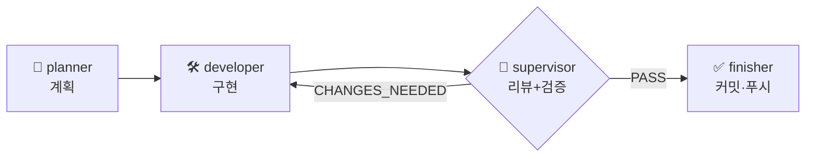

# 🚀 온보딩 — 처음 오는 에이전트·사람용

> 15분 안에 맥락을 잡기 위한 문서. 여기서 시작해서 아래 "읽는 순서" 를 따른다.

---

## 이 프로젝트가 뭔가 (3문장)

**Windows / macOS / Linux 어디서든 켜는 단일 생산성 대시보드**(Electron + React)와, 그 안에서 할일·일정·메일을 정리해 주는 **Claude 기반 AI 에이전트**(Python)를 만든다.
동시에 우숭대학교 "AI 컴퓨터 운영체제 실습" 강의(14주)의 실습 환경이자 최종 결과물이다.
시작 2026-09-02, 목표 완성 2026-11-30.

핵심 기능 4종: ① 오늘/내일 할 일 자동 브리핑 ② 프로젝트 진행도(Notion) ③ 이메일 통합 ④ 캘린더 일정.

---

## 읽는 순서

| # | 문서 | 여기서 얻을 것 |
|---|---|---|
| 1 | [product/VISION.md](product/VISION.md) | 무엇을 만드는가, "완료" 의 정의 |
| 2 | [product/AS_IS.md](product/AS_IS.md) | 지금 코드가 어디까지 됐나, 갭 G1~G8 |
| 3 | [product/ROADMAP.md](product/ROADMAP.md) + [product/DESIGN.md](product/DESIGN.md) §8 | 주차별 일정, Week ↔ Phase 대응 |
| 4 | [product/REQUIREMENTS_FUNCTIONAL.md](product/REQUIREMENTS_FUNCTIONAL.md) + [requirements/](product/requirements/) | 기능 요구사항(FR), P0 도메인 수용 기준 |
| 5 | [product/REQUIREMENTS_NONFUNCTIONAL.md](product/REQUIREMENTS_NONFUNCTIONAL.md) | 품질 기준(NFR) — 보안·신뢰성·테스트 |
| 6 | [product/DESIGN.md](product/DESIGN.md) + [product/adr/](product/adr/) | 아키텍처(다이어그램), 결정 이력, 데이터·API·흐름 |
| 7 | [setup/CONVENTIONS.md](setup/CONVENTIONS.md) + [setup/GIT_WORKFLOW.md](setup/GIT_WORKFLOW.md) | 코드·커밋·푸시 규칙 (반드시 준수) |
| 8 | 작업 시작 시 | [product/TRACEABILITY.md](product/TRACEABILITY.md) 에서 해당 FR 행, [product/TEST_PLAN.md](product/TEST_PLAN.md) 에서 관련 TC |

세부 참조(작업 중 필요할 때): [GLOSSARY](product/GLOSSARY.md) · [DATA_DICTIONARY](product/DATA_DICTIONARY.md) · [API_REFERENCE](product/API_REFERENCE.md) · [UI_SPEC](product/UI_SPEC.md) · [ENV_REFERENCE](setup/ENV_REFERENCE.md) · [DIAGRAMS](setup/DIAGRAMS.md)

---

## 지금 어디까지 됐나

> 스냅샷. 자동 갱신 아님 — 정확한 최신은 `git log` 와 [AS_IS.md](product/AS_IS.md) §2, [TRACEABILITY.md](product/TRACEABILITY.md) 를 본다.

| 영역 | 상태 |
|---|---|
| 개념 설계 · 요구사항 · 아키텍처 문서 | ✅ 완료 (product/) |
| 자동화 인프라 (에이전트 팀 · 작업로그 · CI · GIT_WORKFLOW) | ✅ 동작 |
| 백엔드 tasks/projects CRUD 라우트 | 🚧 코드 존재, 인메모리, 실행 미검증 |
| 프론트엔드 React | ❌ 미연결 (번들러 없음) — G1 |
| DB (SQLite) | ⏳ 예정 (Phase B2) |
| AI 에이전트 | 🚧 뼈대 + 스텁 |
| 자동화 테스트 | ❌ 0개 — 다음 작업 (Phase A3) |

**다음 착수 후보:** Phase A2(환경 설치·`verify.sh`) → A3(테스트 골격) → B1(React 연결).

---

## 작업하는 법

기능 하나 = `/feature <설명>` 한 번. 오케스트레이터가 네 에이전트에 순서대로 위임한다.



| 에이전트 | 한 일 | 권한 |
|---|---|---|
| planner | 요구사항 분해 + 코드 조사 → 구현 계획 | 코드 ✕ |
| developer | 계획대로만 구현 (범위 밖 금지) | 코드 ○, 커밋 ✕ |
| supervisor | diff 리뷰 + `verify.sh` + 수용 기준 확인 → PASS/CHANGES_NEEDED | 코드 ✕ |
| finisher | 검증 게이트 → PROGRESS·TRACEABILITY 갱신 → 커밋·푸시 | 문서만, 커밋 ○ |

자세히: [AUTOMATION.md](setup/AUTOMATION.md) · [feature 커맨드](../.claude/commands/feature.md)

---

## 절대 규칙 (요약)

| 영역 | 규칙 |
|---|---|
| 코드 | 한국어 주석, 최소 구현, 모든 외부 호출·IO 에 try/catch, 계층 분리 `routes→services→db` |
| 시크릿 | `.env` 하드코딩 금지. 렌더러에 API 키 노출 금지 |
| Claude | 모델 `claude-opus-5`, `thinking: adaptive`, 상수는 `agent/services/claude.py` 한 곳 |
| 커밋 | `<타입>: <내용>`, 꼬리말 `Co-Authored-By: Claude Sonnet 5 ...`. `main` 강제 푸시·`--force` 금지 |
| 브랜치 | 지금은 `main` 직접 커밋 OK. Week 3~ 는 `feature/<이름>` |
| 검증 | 실제로 실행돼 FAIL 난 검사가 있으면 커밋 금지. **실행 안 한 검사를 "통과" 로 보고 금지** |
| 범위 | 계획을 벗어나야 하면 임의 진행 금지 — 이유와 함께 보고하고 멈춘다 |

전문: [CONVENTIONS.md](setup/CONVENTIONS.md), [GIT_WORKFLOW.md](setup/GIT_WORKFLOW.md)

---

## 자주 쓰는 명령

```bash
bash setup.sh              # 의존성 설치 + .env 준비
bash verify.sh             # 환경 + 문법 점검
bash verify.sh --code-only # 문법만 (문서 커밋 시)
bash scripts/render-diagrams.sh   # docs/ 의 Mermaid → SVG

# 백엔드 (Node 설치 후)
cd backend && npm install && npm start     # http://localhost:3000
cd backend && npm test                     # 테스트 (Phase A3 이후)

# 프론트 (Node 설치 후, Vite 도입 이후)
cd frontend && npm install && npm run dev

# 에이전트
cd agent && source venv/bin/activate && python test_claude.py
```

> ⚠️ 현재 개발 머신에 `node`/`npm` 미설치. `verify.sh` 전체는 통과하지 않는다 ([GIT_WORKFLOW.md](setup/GIT_WORKFLOW.md) §1).

---

## 막히면

- 불확실하면 추측하지 말고 **"확인 필요"** 로 표시하고 멈춘다.
- 계획 범위를 벗어나야 하면 이유와 함께 보고하고 사용자 확인을 받는다.
- 미결정 설계 사항은 제안 상태 ADR([0009~0012](product/adr/))에 정리돼 있다 — 착수 전 결정.

---

**작성:** 2026-09-02
