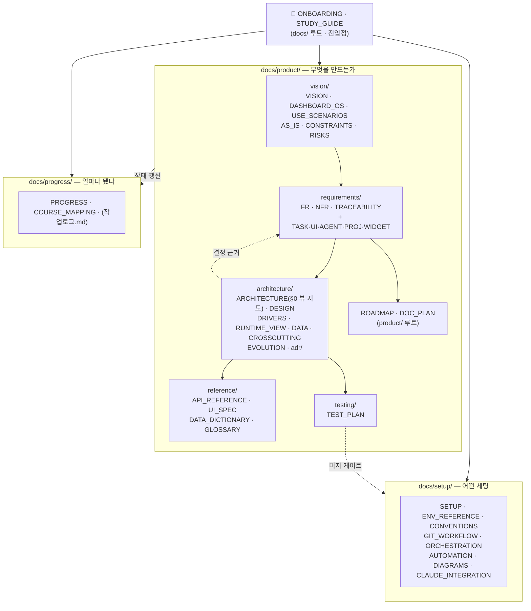
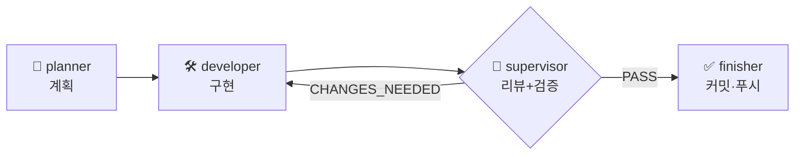

# 🚀 온보딩 — 처음 오는 에이전트·사람용

> 15분 안에 맥락을 잡기 위한 문서. 여기서 시작해서 아래 "읽는 순서" 를 따른다.

---

## 이 프로젝트가 뭔가 (3문장)

**Windows / macOS / Linux 어디서든 켜는 "대시보드 OS"**(Electron + React) — 할일·프로젝트·일정·메일·브리핑이 각각 **위젯처럼 움직이고 위젯마다 디자인을 꾸미는** 데스크톱 셸 — 과, 그 데이터를 정리해 주는 **Claude 기반 AI 에이전트**(Python)를 만든다.
동시에 우송대학교 2026-2학기 3개 강의(AI 컴퓨터 운영체제 실습 / AI시대소프트웨어공학 / AITool기반소프트웨어공학)의 공통 실습 환경이자 제출 산출물이다. 각 강의가 보는 층이 다르다 — 런타임·환경(A) / AI 활용 개발 프로세스(B) / SW공학 산출물(C). 상세: [COURSE_MAPPING.md](progress/COURSE_MAPPING.md). "대시보드 OS" 는 강의 A 의 창·프로세스 관리 주제와 정합한다.
시작 2026-09-02, 목표 완성 2026-11-30.

핵심 기능 4종: ① 오늘/내일 할 일 자동 브리핑 ② 프로젝트 진행도(Notion) ③ 이메일 통합 ④ 캘린더 일정. 이들이 위젯으로 셸에 올라간다 (위젯 셸 골격 = Phase C5 완료 2026-09-06, 위젯별 테마·표시 옵션 = Phase C6 완료 2026-09-06, [DASHBOARD_OS.md](product/vision/DASHBOARD_OS.md)).

---

## 문서 지도 (2026-09-03 카테고리화)

`docs/` 는 목적별 폴더로 나뉜다. **각 폴더에 `README.md` 가 있고**, 그 안의 문서를 `무엇 / 언제 참조 / ⚠️ 놓치기 쉬운 것` 표로 안내한다 — 훑고 바로 필요한 문서로 간다. 폴더 README 는 서로 링크된다 ([docs/README.md](README.md) 가 최상위 허브).
화살표 = 읽는 순서(위 → 아래로 갈수록 구체).



| 폴더 (README) | 질문 | 대표 문서 |
|---|---|---|
| [`docs/`](README.md) | 전체 진입점 (허브) | ONBOARDING, STUDY_GUIDE |
| [`product/`](product/README.md) | 무엇을 만드나 (5 카테고리 허브) | — |
| [`product/vision/`](product/vision/README.md) | 왜·누구를 위해 만드나 | VISION, DASHBOARD_OS(위젯 셸 방향), AS_IS, RISKS |
| [`product/requirements/`](product/requirements/README.md) | 무엇을 만족해야 하나 | FR, NFR, TRACEABILITY, WIDGET |
| [`product/architecture/`](product/architecture/README.md) | 어떻게 만드나 (구조·결정) | ARCHITECTURE §0 → 뷰별 문서, [adr/](product/architecture/adr/README.md) |
| [`product/reference/`](product/reference/README.md) | 정확한 계약 (필드·엔드포인트·용어) | API_REFERENCE, UI_SPEC, DATA_DICTIONARY, GLOSSARY |
| [`product/testing/`](product/testing/README.md) | 어떻게 검증하나 | TEST_PLAN |
| [`setup/`](setup/README.md) | 환경·도구·규칙 | SETUP, CONVENTIONS, GIT_WORKFLOW, ORCHESTRATION |
| [`progress/`](progress/README.md) | 지금 어디까지 | PROGRESS, COURSE_MAPPING(3강의 A·B·C) |

---

## 읽는 순서

| # | 문서 | 여기서 얻을 것 |
|---|---|---|
| 1 | [product/VISION.md](product/vision/VISION.md) (+ [DASHBOARD_OS.md](product/vision/DASHBOARD_OS.md)) + [product/USE_SCENARIOS.md](product/vision/USE_SCENARIOS.md) | 무엇을 만드는가, 대시보드 OS·위젯 셸 방향, "완료" 의 정의, 사용 여정 |
| 2 | [product/AS_IS.md](product/vision/AS_IS.md) | 지금 코드가 어디까지 됐나, 모듈 의존 그래프, 갭 G1~G9 |
| 3 | [product/CONSTRAINTS.md](product/vision/CONSTRAINTS.md) + [product/RISKS.md](product/vision/RISKS.md) | 전제 조건, 무엇이 틀어질 수 있나 |
| 4 | [product/ROADMAP.md](product/ROADMAP.md) + [product/DESIGN.md](product/architecture/DESIGN.md) §8 + [progress/COURSE_MAPPING.md](progress/COURSE_MAPPING.md) | 주차별 일정, Phase ↔ 3강의(A/B/C) 주차 대응 |
| 5 | [product/REQUIREMENTS_FUNCTIONAL.md](product/requirements/REQUIREMENTS_FUNCTIONAL.md) + [requirements/](product/requirements/) | 기능 요구사항(FR), P0 도메인 수용 기준 |
| 6 | [product/REQUIREMENTS_NONFUNCTIONAL.md](product/requirements/REQUIREMENTS_NONFUNCTIONAL.md) | 품질 기준(NFR) — 보안(위협 모델)·신뢰성·테스트 |
| 7 | [product/DESIGN.md](product/architecture/DESIGN.md) + [product/adr/](product/architecture/adr/) | 아키텍처(다이어그램), 결정 이력, 데이터·API·흐름 |
| 7b | [product/ARCHITECTURE.md](product/architecture/ARCHITECTURE.md) §0 뷰 지도 → [ARCHITECTURE_DRIVERS](product/architecture/ARCHITECTURE_DRIVERS.md) · [RUNTIME_VIEW](product/architecture/RUNTIME_VIEW.md) · [DATA_ARCHITECTURE](product/architecture/DATA_ARCHITECTURE.md) · [CROSSCUTTING](product/architecture/CROSSCUTTING.md) · [ARCHITECTURE_EVOLUTION](product/architecture/ARCHITECTURE_EVOLUTION.md) | 큰 틀 — 왜 이 구조인가, 프로세스·데이터·횡단 관심사, 클라우드 진화. 공부 목록은 [STUDY_GUIDE.md](STUDY_GUIDE.md) |
| 8 | [setup/CONVENTIONS.md](setup/CONVENTIONS.md) + [setup/GIT_WORKFLOW.md](setup/GIT_WORKFLOW.md) | 코드·커밋·푸시 규칙 (반드시 준수) |
| 9 | 작업 시작 시 | [product/TRACEABILITY.md](product/requirements/TRACEABILITY.md) 에서 해당 FR 행, [product/TEST_PLAN.md](product/testing/TEST_PLAN.md) 에서 관련 TC |

세부 참조(작업 중 필요할 때): [GLOSSARY](product/reference/GLOSSARY.md) · [DATA_DICTIONARY](product/reference/DATA_DICTIONARY.md) · [API_REFERENCE](product/reference/API_REFERENCE.md) · [UI_SPEC](product/reference/UI_SPEC.md) · [ENV_REFERENCE](setup/ENV_REFERENCE.md) · [DIAGRAMS](setup/DIAGRAMS.md)

---

## 지금 어디까지 됐나

> 스냅샷. 자동 갱신 아님 — 정확한 최신은 `git log` 와 [AS_IS.md](product/vision/AS_IS.md) §2, [TRACEABILITY.md](product/requirements/TRACEABILITY.md) 를 본다.

| 영역 | 상태 |
|---|---|
| 개념 설계 · 요구사항 · 아키텍처 문서 · 33개 ADR | ✅ 완료 (product/) |
| 자동화 인프라 (에이전트 팀 · `/feature` · `/build-next` · 작업로그 · CI) | ✅ 동작 |
| 로컬 환경 (node v26 · npm 11 · python 3.14 · venv) | ✅ Phase A2, `verify.sh` 49/0/0 |
| 백엔드 tasks/projects CRUD 라우트 | ✅ SQLite 영속화(B2) + 미들웨어 정식화(C1) + `errors.js` 오류 매핑·`tasks.project_id`(C2). 프론트 배선 완료(B3 할일 / C2 프로젝트) |
| 프론트엔드 React | ✅ B1(Vite 마운트) + B3(할일) + C2(프로젝트) + C3(캘린더) + C4(다이어그램) + C5(위젯 셸, `Dashboard.jsx` 제거) — 브라우저 E2E 로컬 수동 확인 대기 |
| 캘린더 / 다이어그램 API | ✅ C3 `/api/calendar/events`(더미, 실 Google 은 D2) · C4 `/api/diagrams`(services 계층) |
| 위젯 셸 (대시보드 OS) | ✅ C5 (레지스트리 · `useLayoutStore` · 배치·리사이즈·최소화 · localStorage 영속 · 위젯별 격리) / ⏳ C6 테마·표시 옵션 |
| Supabase | ✅ 클라이언트 부트스트랩만 (`backend/src/supabase.js` + `GET /api/sync/health`) — 동기화·인증·`user_id` 없음 (Week 10+, ADR-0008) |
| DB (SQLite) | ✅ B2 (better-sqlite3, WAL, DATABASE_PATH) |
| AI 에이전트 | ✅ D1 Daily Brief 실데이터 + D2-a 재시도/`sync_logs` + D2-b Google OAuth(Fernet 토큰) + Gmail/Calendar 실 수집(`agent/sync.py`). Notion 저장은 뼈대 |
| 자동화 테스트 | ✅ backend 142 / frontend 106 / agent 80 (Phase A3~개인OS P9), `verify.sh` 49/0/0 (`--code-only` 41/0/0) |

**다음 착수:** 백엔드 mail/calendar 조회 API 를 실 캐시로 배선, Notion 실 연동, B3~C6 브라우저 E2E 로컬 검증. Google 최초 로그인은 사용자가 `python agent/auth/google_oauth.py login` 로 1회 수행. (D2-b 는 2026-09-07 완료)
(제안 ADR 0009~0012 채택됨, D2 부터 `.env` API 키 필요).

---

## 작업하는 법

기능 하나 = `/feature <설명>` 한 번. 오케스트레이터가 네 에이전트에 순서대로 위임한다.



| 에이전트 | 한 일 | 권한 |
|---|---|---|
| planner | 요구사항 분해 + 코드 조사 → 구현 계획 | 코드 ✕ |
| developer | 계획대로만 구현 (범위 밖 금지) | 코드 ○, 커밋 ✕ |
| supervisor | diff 리뷰 + `verify.sh` + 수용 기준 확인 → PASS/CHANGES_NEEDED | 코드 ✕ |
| finisher | 검증 게이트 → PROGRESS·TRACEABILITY 갱신 → 커밋·푸시 | 문서만, 커밋 ○ |

`/build-next` 는 이 파이프라인을 로드맵 따라 자동 반복하고, 사람이 결정할 지점에서만 멈춘다.

자세히: [AUTOMATION.md](setup/AUTOMATION.md) · [ORCHESTRATION.md](setup/ORCHESTRATION.md) (상태 그래프) · [feature 커맨드](../.claude/commands/feature.md)

---

## 절대 규칙 (요약)

| 영역 | 규칙 |
|---|---|
| 코드 | 한국어 주석, 최소 구현, 모든 외부 호출·IO 에 try/catch, 계층 분리 `routes→services→db` |
| 시크릿 | `.env` 하드코딩 금지. 렌더러에 API 키 노출 금지 |
| Claude | 모델 `claude-sonnet-5`, `thinking: adaptive` + `effort: low` (비용 최적화), 상수는 `agent/services/claude.py` 한 곳 |
| 커밋 | `<타입>: <내용>`, 꼬리말 `Co-Authored-By: Claude Sonnet 5 ...`. `main` 강제 푸시·`--force` 금지 |
| 브랜치 | `feature/<짧은-이름>` 에서 작업 → 푸시 → **PR → `main`**. `main` 직접 커밋·`--force` 금지. `develop`·Git Flow 안 씀 ([ADR-0023](product/architecture/adr/ADR-0023-branch-model.md)) |
| 검증 | 실제로 실행돼 FAIL 난 검사가 있으면 커밋 금지. **실행 안 한 검사를 "통과" 로 보고 금지** |
| 범위 | 계획을 벗어나야 하면 임의 진행 금지 — 이유와 함께 보고하고 멈춘다 |

전문: [CONVENTIONS.md](setup/CONVENTIONS.md), [GIT_WORKFLOW.md](setup/GIT_WORKFLOW.md)

---

## 자주 쓰는 명령

환경은 이미 구축됨(Phase A2). 새 머신이면 `bash setup.sh` 부터.

```bash
bash verify.sh             # 환경 + 문법 점검 (현재 49/0/0)
bash verify.sh --code-only # 문법만 (문서 전용 커밋 시)
bash scripts/render-diagrams.sh   # docs/ 의 Mermaid → SVG

# 백엔드
cd backend && npm start     # http://localhost:3000
cd backend && npm test      # 테스트 (현재 142케이스)

# 프론트 (Vite 도입 = Phase B1)
cd frontend && npm run dev

# 에이전트 (Claude 실호출은 .env 의 ANTHROPIC_API_KEY 필요)
cd agent && source venv/bin/activate && python test_claude.py
```

---

## 막히면

- 불확실하면 추측하지 말고 **"확인 필요"** 로 표시하고 멈춘다.
- 계획 범위를 벗어나야 하면 이유와 함께 보고하고 사용자 확인을 받는다.
- 남은 미결정(제안): [ADR-0013](product/architecture/adr/ADR-0013-dashboard-agent-queue.md) **부분 채택** — P7 "지금 실행" 트리거(FR-AGENT-08)는 파일 플래그 + launchd WatchPaths 로 채택(2026-09-08), 전체 작업 큐(FR-AGENT-09)만 제안 상태,
  [ADR-0014](product/architecture/adr/ADR-0014-dashboard-diagram-viewer.md)(대시보드 다이어그램 뷰어, Phase C1 이후 착수). 0009~0012 는 채택 완료.

---

**작성:** 2026-09-02
