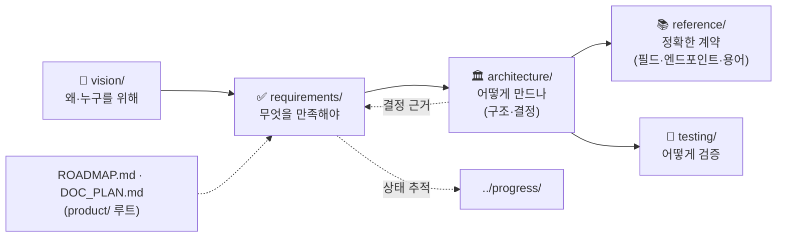

# 📦 docs/product/ — 무엇을 만드는가

> 제품의 비전·요구사항·구조·결정·계약·테스트. 5개 카테고리로 나뉜다.
> 상태·일정은 [progress/](../progress/README.md), 환경·규칙은 [setup/](../setup/README.md).

**📂 이동:** [⬆ docs/](../README.md) · [🚀 ONBOARDING](../ONBOARDING.md) · [STUDY_GUIDE](../STUDY_GUIDE.md)
**카테고리:** [🎯 vision](vision/README.md) → [✅ requirements](requirements/README.md) → [🏛 architecture](architecture/README.md) → [📚 reference](reference/README.md) · [🧪 testing](testing/README.md)

---

## 읽는 순서 (왜 → 무엇 → 어떻게 → 계약 → 검증)

---

## 카테고리별 진입

| # | 폴더 | 한 줄 | 무엇이 들어있나 | README |
|:-:|---|---|---|---|
| 1 | **vision/** | 왜 만드나, 완료의 정의 | 제품 정의(대시보드 OS), 위젯 셸 개념, 현행 분석(갭 G1~G9), 제약·가정, 리스크, 사용 여정 | [vision/README.md](vision/README.md) |
| 2 | **requirements/** | 무엇을 만족해야 하나 | 기능 요구사항(FR-*), 비기능(NFR-*), 추적 매트릭스, 도메인별 수용 기준(TASK/UI/AGENT/PROJ/WIDGET) | [requirements/README.md](requirements/README.md) |
| 3 | **architecture/** | 어떻게 만드나 | 뷰 지도, 목표 구조, 설계 원칙, 품질 드라이버, 런타임/데이터/횡단 관심사, 진화 경로, **결정 이력 ADR-0001~0023** | [architecture/README.md](architecture/README.md) |
| 4 | **reference/** | 정확한 계약 | REST 엔드포인트, 화면·컴포넌트 계약, DB 필드 사전, 용어집 | [reference/README.md](reference/README.md) |
| 5 | **testing/** | 어떻게 검증 | 테스트 레벨·케이스(TC-*)·머지 게이트·피라미드 | [testing/README.md](testing/README.md) |

### product/ 루트 (카테고리 밖)

| 문서 | 내용 | 언제 |
|---|---|---|
| [ROADMAP.md](ROADMAP.md) | Week 1~15 주차별 일정, Phase A~E, 마일스톤 | 다음에 뭘 할지, 강의 주차 대응 |
| [DOC_PLAN.md](DOC_PLAN.md) | 문서 세분화 계획·작성 프롬프트 (메타) | 새 문서를 만들 때 |

---

## 빠른 참조 (자주 찾는 것)

| 찾는 것 | 문서 |
|---|---|
| 지금 코드가 어디까지 됐나 | [vision/AS_IS.md](vision/AS_IS.md) · [../progress/PROGRESS.md](../progress/PROGRESS.md) · `git log` |
| 이 기능이 어느 요구사항/테스트/코드에 연결되나 | [requirements/TRACEABILITY.md](requirements/TRACEABILITY.md) |
| 왜 이렇게 설계했나 | [architecture/adr/README.md](architecture/adr/README.md) (ADR 목록) |
| API 요청/응답 형태 | [reference/API_REFERENCE.md](reference/API_REFERENCE.md) |
| DB 컬럼 의미 | [reference/DATA_DICTIONARY.md](reference/DATA_DICTIONARY.md) (원천: `backend/db/schema.sql`) |
| 용어가 헷갈릴 때 | [reference/GLOSSARY.md](reference/GLOSSARY.md) |
| 대시보드 OS·위젯 셸 방향 | [vision/DASHBOARD_OS.md](vision/DASHBOARD_OS.md) → [requirements/WIDGET.md](requirements/WIDGET.md) |

---

**작성:** 2026-09-04
