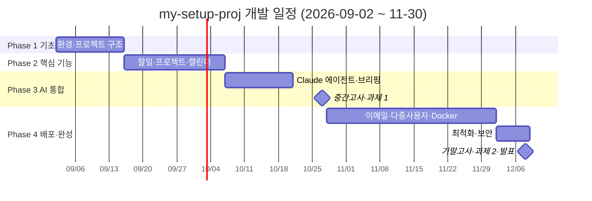
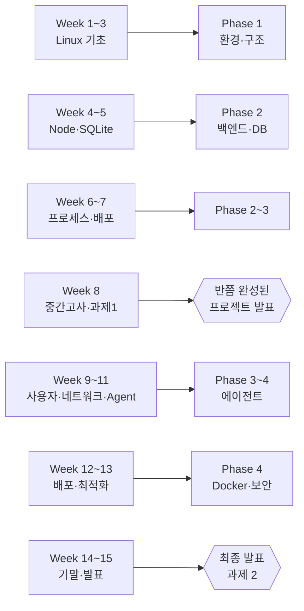

# 🗺️ 개발 로드맵

> 프로젝트 진행 계획 (2026-09-02 ~ 2026-11-30)

---

## 📅 전체 일정

> 설계 Phase(A~E) ↔ Week 대응은 [DESIGN.md](architecture/DESIGN.md) §8. 다이어그램 안내: [DIAGRAMS.md](../setup/DIAGRAMS.md).
>
> ⚠️ **이 문서는 계획이다.** 세부 작업의 `[ ]` 체크박스는 실시간 상태로 유지하지 않는다 (그래서 마일스톤이 ✅ 여도 하위 항목이 `[ ]` 로 남아 있을 수 있다). **실제 진행 상태의 단일 원천은 [PROGRESS.md](../progress/PROGRESS.md) · [TRACEABILITY.md](requirements/TRACEABILITY.md) · `git log`.** 날짜는 실제 달력 기준(2026-09-02 = 수요일).



**강의 ↔ 프로젝트 동기화**



---

## 🔄 Phase 1: 기초 구축 (Week 1-2)

**목표:** 개발 환경 완성 및 초기 프로젝트 구조

### Week 1: 환경 설정 (09-02 ~ 09-08)

#### 수요일 (09-02)
- [ ] **강의:** Linux 기초 (1주 강의)
- [ ] **개발:**
  - [ ] 프로젝트 저장소 생성 (GitHub)
  - [ ] 로컬 폴더 구조 정리
  - [ ] 이 문서들 (MD 파일) 저장소에 올리기
  
#### 목/금 (09-03~04)
- [ ] **강의:** Linux 기본 명령어 실습
  - [ ] `lsb_release`, `uname -r` 확인
  - [ ] 권한 설정 (`chmod`, `sudo`)
- [ ] **개발:**
  - [ ] Node.js + npm 설치
  - [ ] Python 3.11+ 설치
  - [ ] 프로젝트 구조 생성

#### 토/일 (09-05~06)
- [ ] **강의:** WSL2 우분투 심화
- [ ] **개발:**
  - [ ] Electron 프로젝트 초기화
    ```bash
    npm create electron-app my-app
    ```
  - [ ] React 추가
    ```bash
    npm install react react-dom
    ```
  - [ ] 첫 화면 띄우기

#### 월/화 (09-07~08)
- [ ] Claude API Key 발급
- [ ] Supabase 프로젝트 생성
- [ ] Google OAuth 설정
- [ ] .env 파일 준비

### Week 2: 기본 프로젝트 구축 (09-09 ~ 09-15)

#### 수/목 (09-09~10)
- [ ] **강의:** 디렉토리와 파일 사용법 (2주)
- [ ] **개발:**
  - [ ] SQLite 테이블 생성
    ```bash
    sqlite3 app.db < schema.sql
    ```
  - [ ] 기본 Express 서버 구축
  - [ ] localhost:3000에서 실행 확인

#### 금/토 (09-11~12)
- [ ] **개발:**
  - [ ] React 컴포넌트 기본 구조
    ```
    src/
    ├── components/
    │   ├── Dashboard.jsx
    │   ├── TaskList.jsx
    │   └── ProjectCard.jsx
    ├── pages/
    └── App.jsx
    ```
  - [ ] Electron 창 크기/위치 설정
  - [ ] 메뉴바 추가 (최소화, 최대화, 종료)

#### 일/월/화 (09-13~15)
- [ ] **개발:**
  - [ ] GitHub에 첫 커밋
  - [ ] CI/CD 파이프라인 설정 (GitHub Actions)
  - [ ] README 작성
  - [ ] 진행 상황 문서 업데이트

**Week 1-2 마일스톤:**
- ✅ GitHub 저장소 실행 중
- ✅ 로컬 개발 환경 완료
- ✅ Electron 앱 실행 확인
- ✅ 기본 UI 구조 완성

---

## 📊 Phase 2: 핵심 기능 (Week 3-5)

**목표:** 1순위 기능 구현 (할일, 프로젝트, 캘린더)

### Week 3: 할일 관리 기능 (09-16 ~ 09-22)

#### 목표
- [ ] 할일 추가/수정/삭제 UI
- [ ] SQLite 저장/로드
- [ ] Supabase 동기화 테스트

#### 세부 작업
- [ ] **Backend (Express)**
  ```javascript
  // routes/tasks.js
  router.get('/tasks', getTasks)
  router.post('/tasks', createTask)
  router.put('/tasks/:id', updateTask)
  router.delete('/tasks/:id', deleteTask)
  ```

- [ ] **Frontend (React)**
  ```jsx
  // components/TaskList.jsx
  - 할일 리스트 표시
  - 우선순위 색상 구분
  - 체크박스로 완료 표시
  ```

- [ ] **Database**
  - [ ] tasks 테이블 확인
  - [ ] 인덱스 생성 (due_date, status)

### Week 4: 프로젝트 추적 (09-23 ~ 09-29)

#### 목표
- [ ] Notion 연동 (읽기)
- [ ] 프로젝트 진행도 표시
- [ ] 우분투 강의: 파일 권한 관리

#### 세부 작업
- [ ] **Notion API 설정**
  ```python
  # agent/services/notion.py
  from notion_client import Client
  
  notion = Client(auth=os.environ["NOTION_API_KEY"])
  databases = notion.search()
  ```

- [x] **Frontend** (Phase C2, 2026-09-03)
  - [x] 프로젝트 카드 UI (`ProjectCard` + `ProjectForm`, `useProjectStore`)
  - [x] 진행도 바 (0-100%) + 슬라이더 편집
  - [x] 상태 표시 (진행 중/완료/보류 — `active`/`done`/`on_hold`)
  - [x] `tasks.project_id` API 배선 (ADR-0012)
  - 상태 SSOT: [PROGRESS.md](../progress/PROGRESS.md) · [TRACEABILITY.md](requirements/TRACEABILITY.md)

### Week 5: Google Calendar 연동 (09-30 ~ 10-06)

#### 목표
- [ ] Google Calendar API 연동
- [ ] 캘린더 이벤트 표시
- [ ] 오늘/내일 일정 강조

#### 세부 작업
- [ ] **Google API 설정**
  ```python
  # agent/services/calendar.py
  from google.auth.transport.requests import Request
  from google.oauth2.credentials import Credentials
  
  service = build('calendar', 'v3', credentials=creds)
  events = service.events().list(
      calendarId='primary',
      timeMin=datetime.now().isoformat() + 'Z'
  ).execute()
  ```

- [ ] **Frontend**
  - [ ] 미니 캘린더 위젯
  - [ ] 일정 리스트 표시
  - [ ] 시간 표시

#### 다이어그램 뷰어 (FR-UI-05 · Phase C4)

CORS 미들웨어(Phase C1)가 선행돼야 한다. 설계는 [ADR-0014](architecture/adr/ADR-0014-dashboard-diagram-viewer.md).

- [ ] **Backend** — `GET /api/diagrams` (`backend/src/services/diagrams.js` 가 `docs/**/*.md` 의 Mermaid 블록 파싱, 읽기 전용) + `routes/diagrams.js`
- [ ] **Frontend** — `DiagramPanel.jsx` (패널 진입 시 `mermaid` 동적 import, 다크 테마, 로딩/비어있음/정상/에러 4상태)
- [ ] **패키지** — `electron-builder` `extraResources` 에 `docs/` 동봉 여부 결정 (미동봉 시 prod 는 빈 배열)
- [ ] **테스트** — TC-DIAG-01~03 (`backend/test/diagrams.test.js`), TC-UI-09 (수동)

#### 대시보드 OS — 위젯 셸 (FR-WIDGET · Phase C5~C6)

🆕 방향 전환: 고정 패널 → 각 데이터가 위젯으로 움직이고 위젯마다 디자인. 개념 [vision/DASHBOARD_OS.md](vision/DASHBOARD_OS.md), 결정 [ADR-0020~0022](architecture/adr/) (전부 **제안** — 착수 전 DASHBOARD_OS §8 의 DO-1~6 확정).

- [ ] **C5 위젯 셸** — `widgets/registry.js` + `WidgetShell`/`WidgetHost`(react-grid-layout)/`WidgetFrame`, `useLayoutStore`, localStorage 영속. 기존 할일·프로젝트 뷰를 위젯으로 이관. 위젯별 `ErrorBoundary`. (FR-WIDGET-01~04·07·08)
- [ ] **C6 위젯 커스터마이즈** — 전역 인라인 style → CSS 변수, `WidgetSettings`(테마+표시 탭), `themePresets.js`, `themeToVars` 화이트리스트. (FR-WIDGET-05·06)
- [ ] **테스트** — TC-WIDGET-01~ (레이아웃 저장/복원, 손상 폴백, config 검증, 위젯 격리)
- **일정 주의:** 시험 기간(Week 8, R-1) 전 최소선 = 그리드 배치 + 레이아웃 저장 + 위젯별 색. 나머지는 이후로 이월 가능.

**Phase 2 마일스톤:**
- ✅ 할일 CRUD 완료
- ✅ Notion 연동 확인
- ✅ Google Calendar 동기화 작동
- [ ] 위젯 셸에서 위젯 이동·리사이즈·레이아웃 저장·위젯별 테마 (C5~C6)

---

## 🤖 Phase 3: AI 통합 (Week 6-8)

**목표:** Claude API 에이전트 구현

### Week 6: Claude API 기초 (10-07 ~ 10-13)

#### 목표
- [ ] Claude API로 텍스트 분석
- [ ] "할일 분류" 기능 구현
- [ ] 우분투 강의: 프로세스 관리

#### 세부 작업
- [ ] **Python 에이전트 테스트**
  ```python
  # agent/test_claude.py
  from anthropic import Anthropic
  
  client = Anthropic()
  
  # 할일 분류 테스트
  response = client.messages.create(
      model="claude-opus-5",
      max_tokens=1024,
      messages=[{
          "role": "user",
          "content": "이 할일들을 우선순위별로 정렬해줄래?"
      }]
  )
  ```

- [ ] **이메일 기초 연동**
  ```python
  # agent/services/gmail.py
  service = build('gmail', 'v1', credentials=creds)
  results = service.users().messages().list(
      userId='me',
      maxResults=5
  ).execute()
  ```

### Week 7: 자동 브리핑 (10-14 ~ 10-20)

#### 목표
- [ ] "오늘/내일 할 일" 자동 생성
- [ ] Email 미읽은 것 요약
- [ ] 우분투 강의: 소프트웨어 관리

#### 세부 작업
- [ ] **Daily Brief 에이전트**
  ```python
  # agent/daily_brief.py
  def generate_daily_brief():
      # 1. 데이터 수집
      tasks = get_today_tasks()
      emails = get_unread_emails()
      events = get_today_events()
      
      # 2. Claude 분석
      prompt = f"""
      오늘의 우선순위를 정리해줄래?
      
      📝 할일: {tasks}
      📧 이메일: {emails}
      📅 일정: {events}
      """
      
      response = claude_api_call(prompt)
      
      # 3. 결과 저장
      save_to_notion(response)
      return response
  ```

- [ ] **스케줄 설정 (Cron)**
  ```bash
  # 매일 아침 8시에 실행
  0 8 * * * python ~/agent/daily_brief.py
  ```

### Week 8: 중간고사 + 과제 발표 (10-21 ~ 10-27)

#### 목표
- [ ] 중간고사 준비
- [ ] 첫 번째 과제 발표 준비
- [ ] 현재까지 구현 내용 정리

#### 세부 작업
- [ ] **중간고사 준비**
  - [ ] Linux 명령어 복습
  - [ ] 권한 관리 이해
  - [ ] 파일 시스템 개념

- [ ] **과제 1 준비: "Ubuntu 웹 서비스 개발"**
  - [ ] PPT 작성
    - [ ] 프로젝트 개요
    - [ ] 기술 스택
    - [ ] 구현 결과 스크린샷
  - [ ] 앱 데모 준비
  - [ ] 배운 Linux 명령어 정리

**Phase 3 마일스톤:**
- ✅ Claude API 기본 작동
- ✅ Daily Brief 자동 생성
- ✅ 이메일 요약 기능

---

## 🚀 Phase 4: 배포 & 완성 (Week 9-14)

### Week 9: 이메일 통합 (10-28 ~ 11-03)

#### 목표
- [ ] 여러 이메일 계정 연동
- [ ] 이메일 보기/답장 기능
- [ ] 우분투 강의: 부팅과 종료

#### 세부 작업
- [ ] **이메일 UI**
  ```jsx
  // components/EmailView.jsx
  - 이메일 리스트
  - 상세 보기
  - 답장/삭제 기능
  ```

### Week 10: 사용자 관리 (11-04 ~ 11-10)

#### 목표
- [ ] 로그인/로그아웃
- [ ] 여러 사용자 지원
- [ ] 우분투 강의: 사용자 관리

#### 세부 작업
- [ ] **인증 구현**
  ```javascript
  // backend/routes/auth.js
  - OAuth 로그인
  - 토큰 관리
  - 로그아웃
  ```

### Week 11: Mini Agent 개발 (11-11 ~ 11-17)

#### 목표
- [ ] 고급 Claude API 기능
- [ ] 스케줄 제안 기능
- [ ] 우분투 강의: 네트워크 & Agent

#### 세부 작업
- [ ] **스케줄 제안 에이전트**
  ```python
  # agent/schedule_advisor.py
  def suggest_schedule():
      # 여유 시간 찾기
      busy_times = get_busy_times()
      
      prompt = """
      이 시간에 회의를 넣을 수 있을까?
      바쁜 시간: {busy_times}
      
      최적의 시간을 제안해줄래?
      """
      
      return claude_api_call(prompt)
  ```

### Week 12: Docker & 배포 준비 (11-18 ~ 11-24)

#### 목표
- [ ] Docker 컨테이너화
- [ ] 배포 테스트
- [ ] 우분투 강의: 원격 접속, DB 서버

#### 세부 작업
- [ ] **Dockerfile 작성**
  ```dockerfile
  FROM node:18-alpine
  WORKDIR /app
  COPY package*.json ./
  RUN npm install
  COPY . .
  EXPOSE 3000
  CMD ["npm", "start"]
  ```

- [ ] **Docker Compose**
  ```yaml
  version: '3.8'
  services:
    app:
      build: .
      ports:
        - "3000:3000"
    postgres:
      image: postgres:15
      environment:
        POSTGRES_PASSWORD: password
  ```

### Week 13: 최적화 & 폴리시 (11-25 ~ 12-01)

#### 목표
- [ ] 성능 최적화
- [ ] 보안 점검
- [ ] 우분투 강의: 보안, 가상화

#### 세부 작업
- [ ] **성능 체크**
  - [ ] 번들 크기 줄이기
  - [ ] 렌더링 성능
  - [ ] API 응답 시간

- [ ] **보안 점검**
  - [ ] API 인증
  - [ ] CORS 설정
  - [ ] 환경 변수 관리

### Week 14: 최종 발표 & 기말고사 (12-02 ~ 12-08)

#### 목표
- [ ] 최종 프로젝트 완성
- [ ] 기말고사 준비
- [ ] 최종 발표 준비

#### 세부 작업
- [ ] **과제 2 준비: "Ollama 기반 RAG/Agent"**
  - [ ] Claude API 통합 데모
  - [ ] 자동화 기능 시연
  - [ ] 학습한 내용 정리

- [ ] **최종 발표 자료**
  - [ ] 프로젝트 개요
  - [ ] 기술 스택 설명
  - [ ] 구현 결과 데모
  - [ ] 배운 점과 향후 계획

**Phase 4 마일스톤:**
- ✅ 완전한 기능 구현
- ✅ Docker 배포 완료
- ✅ 모든 API 통합 완료
- ✅ 최종 발표 완료

---

## 🎯 주간 체크리스트 템플릿

**주차: Week X (MM-DD ~ MM-DD)**

### 강의 진행
- [ ] 강의 주제: _______________
- [ ] 배우는 명령어: _______________
- [ ] 과제: _______________

### 개발 진행
- [ ] 기능 1: _______________
- [ ] 기능 2: _______________
- [ ] 버그 수정: _______________

### 학습 내용
- [ ] 배운 기술: _______________
- [ ] 문제 해결: _______________
- [ ] 다음주 목표: _______________

### 깃허브 커밋
```bash
git commit -m "Week X: [기능명] 구현/수정"
```

### 진행도
- 강의: ___% 완료
- 개발: ___% 완료
- 종합: ___% 완료

---

## ⚠️ 중요 마일스톤

| 날짜 | 이벤트 | 상태 |
|------|--------|------|
| 09-15 | Phase 1 완료 | ⏳ |
| 10-06 | Phase 2 완료 | ⏳ |
| 10-20 | Phase 3 완료 | ⏳ |
| 10-27 | 중간고사 | ⏳ |
| 11-17 | Phase 4 절반 | ⏳ |
| 12-08 | 기말고사 | ⏳ |
| 12-15 | 프로젝트 최종 완료 | ⏳ |

---

## 🔗 연관 문서

- [README.md](../../README.md) - 프로젝트 개요
- [ARCHITECTURE.md](architecture/ARCHITECTURE.md) - 기술 스택
- [PROGRESS.md](../progress/PROGRESS.md) - 실제 진행 상황 (매주 업데이트)
- [COURSE_MAPPING.md](../progress/COURSE_MAPPING.md) - 강의 연결

---

## 💡 팁

### 로드맵 수정하기
- 진도가 늦으면: Phase를 다음주로 이동
- 추가 기능: "추가 작업" 섹션에 작성
- 완료하면: 체크박스에 ✅ 표시

### Git 커밋 메시지
```bash
# 기능 추가
git commit -m "feat: 할일 관리 기능 추가"

# 버그 수정
git commit -m "fix: 캘린더 동기화 오류 수정"

# 문서
git commit -m "docs: 로드맵 업데이트"
```

---

**마지막 업데이트:** 2026-09-02  
**다음 검토:** 매주 월요일
