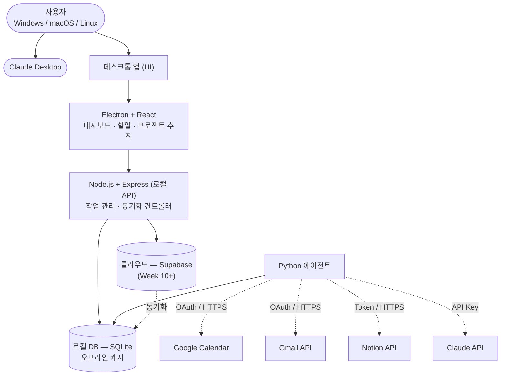
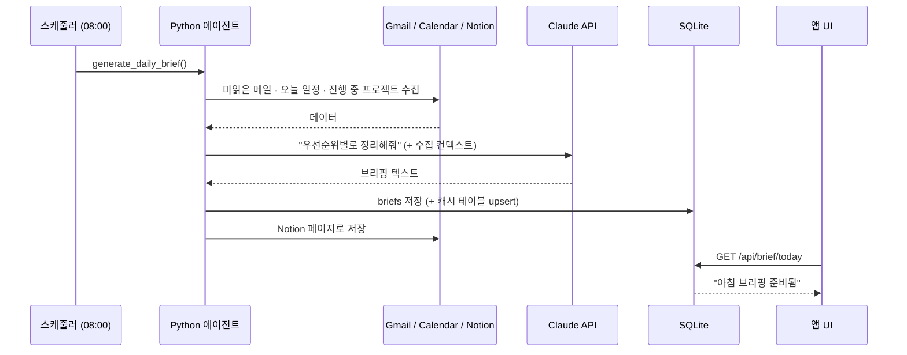
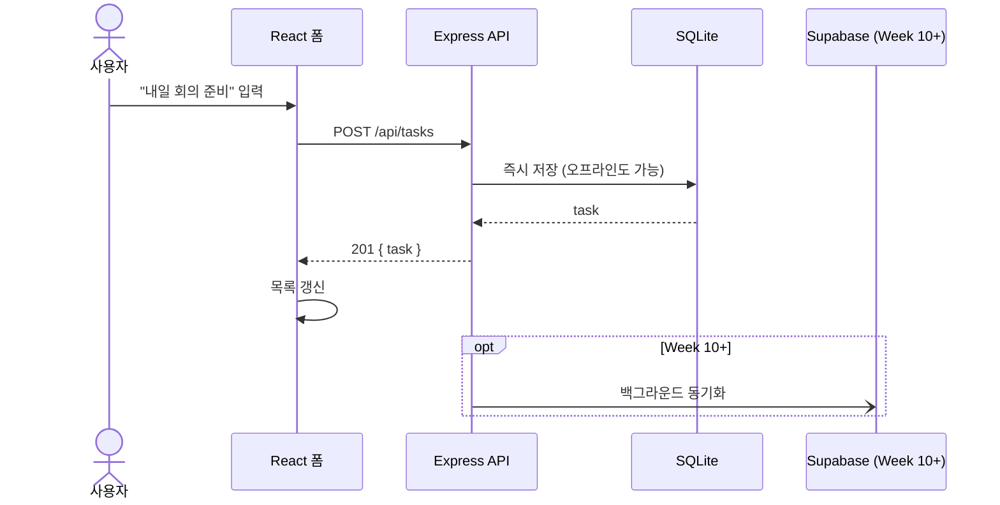
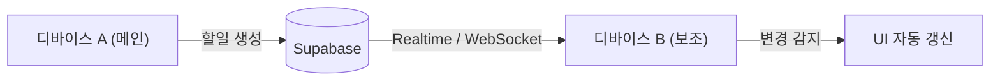
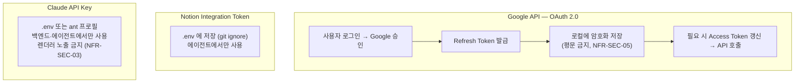
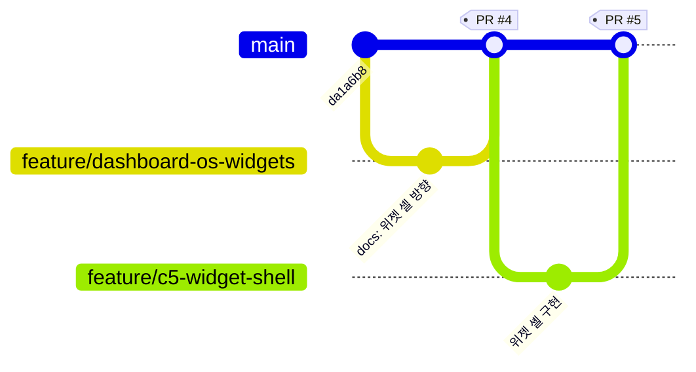

# 🏗️ 기술 아키텍처

> 개인 생산성 AI Agent의 시스템 아키텍처 및 기술 스택

---

## 0. 아키텍처 뷰 지도 (어디를 봐야 하나)

이 문서 한 장으로 아키텍처를 다 담지 않는다. 관점(뷰)별로 문서가 나뉜다 — C4/arc42 방식.

| 뷰 | 질문 | 문서 |
|---|---|---|
| **드라이버** | 왜 이 구조인가 (품질 속성 → 결정) | [ARCHITECTURE_DRIVERS.md](ARCHITECTURE_DRIVERS.md) |
| **컨텍스트/컨테이너** (정적) | 무엇이 있고 어떻게 연결되나 | 이 문서 §1, [DESIGN.md](DESIGN.md) §3 |
| **컴포넌트** (정적) | 각 컨테이너 내부 모듈 | [DESIGN.md](DESIGN.md) §6·§7, [UI_SPEC.md](../reference/UI_SPEC.md) |
| **런타임** | 실행 중 프로세스·시작·종료·장애 | [RUNTIME_VIEW.md](RUNTIME_VIEW.md) |
| **데이터** | 스키마 진화·캐시·충돌·분류 | [DATA_ARCHITECTURE.md](DATA_ARCHITECTURE.md) |
| **횡단 관심사** | 오류·로깅·설정·복원력 | [CROSSCUTTING.md](CROSSCUTTING.md) |
| **배포** | 어디서 어떻게 도나 | 이 문서 §배포, [ARCHITECTURE_EVOLUTION.md](ARCHITECTURE_EVOLUTION.md) |
| **진화** | 로컬 → 다중 사용자/클라우드 | [ARCHITECTURE_EVOLUTION.md](ARCHITECTURE_EVOLUTION.md) |
| **결정 이력** | 무엇을 언제 왜 정했나 | [adr/](adr/) |

학습 자료: [../STUDY_GUIDE.md](../../STUDY_GUIDE.md).

---

## 1. 시스템 구조

> 구현 관점의 정확한 아키텍처는 [DESIGN.md](DESIGN.md) §3 (컴포넌트·프로세스 단위). 아래는 개념 레벨.
> 다이어그램 열람·이미지 내보내기는 [DIAGRAMS.md](../../setup/DIAGRAMS.md).
>
> 🆕 **대시보드 OS 전환 (C5~C6)**: 프론트엔드가 "고정 패널" 에서 **위젯 셸**(react-grid-layout 기반, 위젯 인스턴스 배치·이동·위젯별 테마)로 확장된다. 개념 [../vision/DASHBOARD_OS.md](../vision/DASHBOARD_OS.md), 결정 [ADR-0020~0022](adr/), 컴포넌트 계층 [DESIGN.md](DESIGN.md) §6.



---

## 🛠️ 기술 스택 상세

### Frontend (프론트엔드)

#### 프레임워크
- **Electron** v27+ (데스크톱 크로스 플랫폼)
  - Windows, macOS, Linux 동시 지원
  - 단일 코드베이스로 3개 OS 관리
  
- **React** v18+
  - UI 컴포넌트 기반 개발
  - 상태 관리 (Redux 또는 Zustand)
  - Hot reload 개발 경험

#### 스타일링
- **Tailwind CSS** v3+
  - Utility-first CSS
  - 빠른 UI 개발
  
- **shadcn/ui** (선택사항)
  - 제어 가능한 컴포넌트

#### 상태 관리
- **Zustand** (가벼운 상태 관리)
  - 도메인 스토어: `useTaskStore` / `useProjectStore` … (server 상태)
  - `useLayoutStore`: 위젯 레이아웃·config (UI 상태, C5 — ADR-0021)
  - server 상태와 UI 상태를 스토어 단위로 분리

#### 위젯 셸 (대시보드 OS, C5~C6)
- **react-grid-layout** — 위젯 드래그·리사이즈·반응형 그리드·레이아웃 직렬화 (ADR-0020)
- 위젯 레지스트리(`widgets/registry.js`) — 새 위젯 = 항목 추가 (플러그인 유사)
- 위젯별 테마 = 스코프된 CSS 커스텀 프로퍼티(`--w-*`) + 화이트리스트 config (ADR-0022)

#### 개발 도구
- **Vite** (번들러) - 빠른 개발 속도
- **ESLint + Prettier** - 코드 품질
- **TypeScript** - 타입 안정성

---

### Backend (백엔드)

#### Node.js API
- **Express.js** v4+
  - RESTful API 구축
  - Middleware 기반 아키텍처
  
- **TypeScript**
  - 타입 안전성
  - 자동 완성 지원

#### 구조
```
backend/
├── src/
│   ├── controllers/     # 요청 처리 로직
│   ├── services/        # 비즈니스 로직
│   ├── routes/          # API 라우트
│   ├── middlewares/      # 인증, 로깅 등
│   ├── models/          # DB 스키마
│   └── utils/           # 유틸리티 함수
├── .env                 # 환경 변수
├── package.json
└── tsconfig.json
```

#### Python 에이전트
- **Claude API** (AI 로직)
- **FastAPI** (마이크로 서비스, 선택사항)
- **APScheduler** (스케줄 작업)

```
agent/
├── agent.py            # 메인 에이전트
├── services/
│   ├── gmail.py        # Gmail 통합
│   ├── calendar.py     # Calendar 통합
│   ├── notion.py       # Notion 통합
│   └── claude.py       # Claude API
├── models/
│   └── schemas.py      # 데이터 모델
└── requirements.txt
```

---

### Database (데이터베이스)

#### 로컬 저장소
- **SQLite** (로컬 캐시)
  - 가볍고 빠름
  - 앱과 함께 배포
  
> ⚠️ 아래 DDL 은 초기 설계 스케치다. **실제 스키마의 단일 원천은 [`backend/db/schema.sql`](../../../backend/db/schema.sql)**,
> 필드 설명은 [DATA_DICTIONARY.md](../reference/DATA_DICTIONARY.md) 를 본다. 둘이 다르면 `schema.sql` 이 맞다.

**테이블 목록** (6개 — 상세 DDL 은 [`backend/db/schema.sql`](../../../backend/db/schema.sql), 필드 설명은 [DATA_DICTIONARY.md](../reference/DATA_DICTIONARY.md)):

| 테이블 | 용도 | 비고 |
|---|---|---|
| `projects` | 프로젝트 | `progress` 0–100, `status ∈ {active,done,on_hold}` |
| `tasks` | 할일 | `priority ∈ {high,medium,low}`, `status ∈ {todo,in_progress,done}`, `project_id` FK → `projects(id)` `ON DELETE SET NULL` (ADR-0012, NULL=단독 할일) |
| `calendar_events` | Google Calendar 캐시 | `event_id` UNIQUE (upsert 키) |
| `emails` | Gmail 미읽은 메일 캐시 | `email_id` UNIQUE, 읽음 여부 컬럼명은 **`is_read`** (0/1) |
| `briefs` | 일일 브리핑 | `date` UNIQUE (하루 1건), `content` = Claude 생성 본문, `notion_url` NULL 허용 |
| `sync_logs` | 동기화 시도 로그 | `service ∈ {gmail,calendar,notion,supabase}`, `status ∈ {success,failed}` |

- 날짜/시간 컬럼은 모두 `TEXT` + ISO8601 (`schema.sql` 규칙). 위 스케치에 있던 `DATE`/`TIMESTAMP` 타입 표기는 폐기.
- Week 10+ Supabase 동기화 시 `user_id` / `is_synced` / `synced_at` 컬럼을 추가한다 (`schema.sql` 하단 주석).

#### 클라우드 저장소
- **Supabase** (PostgreSQL)
  - 백업용 클라우드 저장소
  - 여러 디바이스 동기화
  - 실시간 업데이트 (WebSocket)

**동일한 테이블 구조 + 추가 필드:**
```sql
-- 사용자 정보
ALTER TABLE tasks ADD COLUMN user_id UUID;
ALTER TABLE projects ADD COLUMN user_id UUID;

-- 동기화 상태
ALTER TABLE tasks ADD COLUMN synced_at TIMESTAMP;
ALTER TABLE tasks ADD COLUMN is_synced BOOLEAN;
```

---

### External APIs (외부 API)

| API | 용도 | 인증 | 사용 방식 |
|-----|------|------|---------|
| **Google Calendar** | 일정 조회/생성 | OAuth 2.0 | SDK (google-api-python-client) |
| **Gmail** | 이메일 조회 | OAuth 2.0 | SDK (google-api-python-client) |
| **Notion** | 프로젝트 관리 | Integration Token | SDK (notion-client) |
| **Claude API** | AI 에이전트 | API Key | anthropic SDK |
| **Supabase** | 클라우드 DB | API Key + JWT | REST API |

---

## 🔄 데이터 흐름

> 구현 단위의 정확한 시퀀스(에러 분기 포함)는 [DESIGN.md](DESIGN.md) §6·§7.

### 1️⃣ 아침 자동 브리핑 흐름



### 2️⃣ 사용자 할일 입력 흐름



### 3️⃣ 실시간 동기화 흐름 (Week 10+)



---

## 🔐 보안 아키텍처

### 인증 방식



키별 상세는 [ENV_REFERENCE.md](../../setup/ENV_REFERENCE.md), 위협 모델은 [REQUIREMENTS_NONFUNCTIONAL.md](../requirements/REQUIREMENTS_NONFUNCTIONAL.md) §3.

### 환경 변수 (.env)

> ⚠️ 아래는 **Week 10+ 클라우드 도입까지 포함한 예시**다. 현재 실제로 쓰는 변수의 단일 원천은
> [`.env.example`](../../../.env.example) + [ENV_REFERENCE.md](../../setup/ENV_REFERENCE.md).
> 특히 로컬 SQLite 경로는 **`DATABASE_PATH`** (ADR-0009) 이고, 아래의 `DATABASE_URL=sqlite:///...`
> 나 `SUPABASE_JWT_SECRET` 은 아직 도입 전 스케치다 (도입 시 이름 통일은 그때 ADR).

```bash
# Google APIs
GOOGLE_CLIENT_ID=xxx.apps.googleusercontent.com
GOOGLE_CLIENT_SECRET=xxx
GOOGLE_REDIRECT_URI=http://localhost:3000/auth/callback

# Notion
NOTION_API_KEY=secret_xxx

# Claude API
ANTHROPIC_API_KEY=sk-ant-xxx

# Supabase
SUPABASE_URL=https://xxx.supabase.co
SUPABASE_KEY=eyJxxx
SUPABASE_JWT_SECRET=xxx

# Database
DATABASE_URL=sqlite:///./app.db

# App Config
NODE_ENV=development
PORT=3000
```

---

## 🚀 배포 아키텍처

### 개발 환경
```
로컬 머신 (Ubuntu)
├─ Electron App (데스크톱)
├─ Express Server (localhost:3000)
├─ SQLite DB (로컬)
└─ Python Agent (스크립트)
```

### 프로덕션 환경
```
컨테이너 (Docker)
├─ Electron App 패키징
├─ Express Server (클라우드)
├─ Supabase (PaaS)
└─ Python Agent (서버리스 또는 VM)

배포 옵션:
1. GitHub Releases (Electron)
2. Vercel/Netlify (웹 버전, 선택사항)
3. Heroku/Railway (백엔드)
4. Google Cloud Run (Python Agent)
```

---

## 📦 의존성 관리

### Node.js 프로젝트 (package.json)

**필수:**
```json
{
  "dependencies": {
    "electron": "^27.0.0",
    "react": "^18.0.0",
    "react-dom": "^18.0.0",
    "express": "^4.18.0",
    "sqlite": "^5.0.0",
    "@supabase/supabase-js": "^2.0.0"
  }
}
```

**개발용:**
```json
{
  "devDependencies": {
    "typescript": "^5.0.0",
    "eslint": "^8.0.0",
    "prettier": "^3.0.0",
    "vite": "^5.0.0",
    "tailwindcss": "^3.0.0"
  }
}
```

### Python 프로젝트 (requirements.txt)

```txt
anthropic==0.25.0
google-auth-oauthlib==1.0.0
google-auth-httplib2==0.2.0
google-api-python-client==2.100.0
notion-client==2.2.0
python-dotenv==1.0.0
apscheduler==3.10.0
supabase==2.0.0
fastapi==0.104.0  # 선택사항
uvicorn==0.24.0   # 선택사항
```

---

## 🔗 통신 프로토콜

### UI ↔ Backend
- **HTTP/REST** (Express API)
  ```
  GET/POST http://localhost:3000/api/tasks
  GET/POST http://localhost:3000/api/projects
  POST http://localhost:3000/api/sync
  ```

- **WebSocket** (실시간 동기화)
  ```
  ws://localhost:3000/socket
  이벤트: task:created, task:updated, task:deleted
  ```

### Backend ↔ External APIs
- **HTTP/REST** (Google APIs, Notion, Claude)
- **OAuth 2.0** (Google 인증)

### Backend ↔ Database
- **SQL** (SQLite 로컬)
- **REST API** (Supabase)

---

## 📊 성능 최적화

### 캐싱 전략
- 로컬 SQLite: 오프라인 사용
- Supabase: 클라우드 백업
- 메모리 캐시: 자주 사용하는 데이터 (Redux/Zustand)

### 동기화 최적화
- 증분 동기화 (마지막 동기화 이후만)
- 백그라운드에서 진행
- 네트워크 실패시 재시도 로직

### UI 성능
- 가상화 (긴 리스트)
- 컴포넌트 메모이제이션
- 이미지 최적화

---

## 🧪 테스팅 전략

### 단위 테스트
```bash
# Jest (JavaScript)
npm test

# Pytest (Python)
pytest tests/
```

### 통합 테스트
- API 엔드포인트 테스트
- 데이터베이스 작업 테스트
- 외부 API 모킹

### E2E 테스트
```bash
# Playwright 또는 Cypress
npx playwright test
```

---

## 🔄 CI/CD 파이프라인

### GitHub Actions

```yaml
name: Test & Build
on: [push, pull_request]

jobs:
  test:
    runs-on: ubuntu-latest
    steps:
      - uses: actions/checkout@v3
      - uses: actions/setup-node@v3
      - run: npm install
      - run: npm test
      - run: npm run build
```

---

## 💾 버전 관리

### 브랜치 모델 (실제 — `feature/* → PR → main`)

> **`develop` 브랜치·Git Flow 는 쓰지 않는다** ([ADR-0023](adr/ADR-0023-branch-model.md)). 1인 프로젝트라 오버헤드 대비 이득이 없다.
> 규칙 전문은 [GIT_WORKFLOW.md](../../setup/GIT_WORKFLOW.md) §2, [CONVENTIONS.md](../../setup/CONVENTIONS.md) §6.

- 모든 변경(코드·문서)은 `feature/<짧은-이름>` 브랜치에서 → 푸시 → **PR → `main`**.
- `main` 직접 커밋 금지. `main` 강제 푸시·`--force` 금지.
- `main` 에는 CI(`Test & Build`) 통과 + 검증 게이트 통과분만 병합.
- 스택 작업이 필요하면 PR 을 쌓고(아래→위) 아래부터 병합하며 상위 PR base 를 `main` 으로 재지정 (PR #1~#3 선례).



### 태그 규칙
릴리스 시점에 `main` 에 붙인다. `v<major>.<minor>.<patch>` (+ `-alpha`/`-beta` 프리릴리스).
현재는 정식 릴리스 전이라 태그 없음 — 강의 과제 1 발표 시점에 `v0.x` 시작 예정.

---

## 🎯 다음 단계

이 아키텍처를 바탕으로:
1. ✅ [SETUP.md](../../setup/SETUP.md) 에서 개발 환경 설정
2. ✅ [ROADMAP.md](../ROADMAP.md) 에서 구현 순서 확인
3. ✅ 첫 번째 구현 시작

**마지막 업데이트:** 2026-09-02
