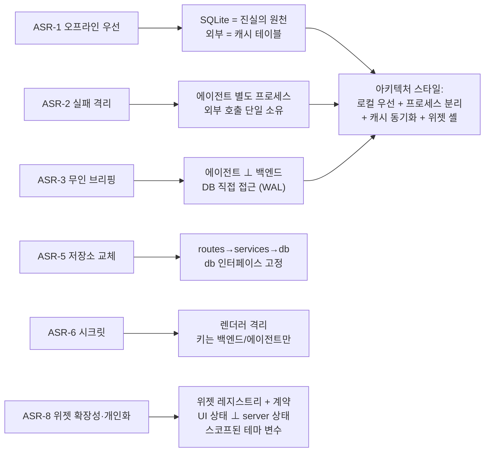

# 🎯 아키텍처 드라이버 (Architecture Drivers)

> 큰 틀의 구조는 **품질 속성**이 결정한다. 이 문서는 그 연결을 명시한다:
> 아키텍처상 중요한 요구사항(ASR) → 품질 속성 시나리오 → 구조적 결정 → 피트니스 함수.
>
> 기능 요구사항은 [REQUIREMENTS_FUNCTIONAL.md](../requirements/REQUIREMENTS_FUNCTIONAL.md),
> 품질 기준(측정치)은 [REQUIREMENTS_NONFUNCTIONAL.md](../requirements/REQUIREMENTS_NONFUNCTIONAL.md),
> 구현 설계는 [DESIGN.md](DESIGN.md). 이 문서는 "왜 이 구조인가" 만 다룬다.

---

## 1. 아키텍처상 중요한 요구사항 (ASR)

모든 요구사항이 구조를 바꾸지는 않는다. 아래 7개가 이 시스템의 형태를 결정한다.

| ASR | 내용 | 견인하는 구조 | 근거 ADR/NFR |
|---|---|---|---|
| **ASR-1 오프라인 우선** | 네트워크 없이도 할일·프로젝트 CRUD, 캐시 조회 가능 | 로컬 SQLite 가 진실의 원천, 클라우드/외부 API 는 그 위 캐시 | [ADR-0015](adr/ADR-0015-local-first-architecture.md), NFR-REL-04 |
| **ASR-2 외부 실패 격리** | Claude/Google/Notion 실패가 앱 크래시로 이어지지 않음 | 에이전트를 별도 프로세스로 분리, 외부 호출은 에이전트에만, UI 는 캐시만 읽음 | [ADR-0006](adr/ADR-0006-agent-owns-external-apis.md), NFR-REL-02 |
| **ASR-3 무인 브리핑** | 앱이 꺼져 있어도 매일 08:00 브리핑 생성 | 에이전트가 백엔드 프로세스에 의존하지 않고 SQLite 에 직접 접근 | [ADR-0007](adr/ADR-0007-schedule-launchd-cron.md), [ADR-0011](adr/ADR-0011-agent-backend-db-access.md) |
| **ASR-4 크로스 플랫폼 단일 코드** | Win/mac/Linux 동일 코드베이스 | Electron + React, OS 의존값은 설정 주입 | NFR-PORT-01/03, [ADR-0009](adr/ADR-0009-sqlite-file-location.md) |
| **ASR-5 저장소 교체 가능성** | SQLite → Supabase 로 바뀌어도 라우트·UI 영향 최소 | `db` 모듈 인터페이스 고정, `routes→services→db` 계층 | NFR-MAINT-02/03, [ADR-0008](adr/ADR-0008-supabase-deferred.md) |
| **ASR-6 개인 시크릿 보호** | API 키·OAuth 토큰이 유출·노출되지 않음 | 렌더러 격리(contextIsolation), 키는 백엔드/에이전트만, 토큰 암호화 저장 | NFR-SEC-01~05 |
| **ASR-7 에이전트로만 변경** | 한 기능 = `/feature` 1회, 파이프라인 통과 | 문서 주도(traceability) + CI 게이트 + 계층 규칙 | NFR-MAINT-05, [ORCHESTRATION.md](../../setup/ORCHESTRATION.md) |
| **ASR-8 위젯 확장성·개인화** | 각 데이터가 위젯으로 배치·디자인되고, 새 위젯이 셸 수정 없이 붙는다 | 위젯 레지스트리 + 위젯 계약 + UI 상태(`useLayoutStore`)와 server 상태 분리 + 스코프된 테마 변수 | [DASHBOARD_OS.md](../vision/DASHBOARD_OS.md), [ADR-0020~0022](adr/), FR-WIDGET |

---

## 2. 품질 속성 시나리오

형식: **자극원 · 자극 · 대상 · 환경 · 응답 · 응답 측정**. (Bass 외, *SA in Practice*)

### QAS-1 — 가용성 / 백엔드 다운

- **자극원·자극:** 사용자가 Electron 앱만 실행, 백엔드(:3000)가 안 떠 있음
- **환경:** 개발 모드 (통합 실행 `scripts/dev.sh`, 폴백 2터미널)
- **응답:** UI 는 `ErrorBanner`("백엔드에 연결할 수 없습니다") + 자동 재시도(지수 백오프). 각 패널은 독립적으로 로딩→에러 상태. 앱은 죽지 않음
- **측정:** 백엔드 복구 후 ≤ 10초 내 패널 자동 정상화, 크래시 0
- **설계 대응:** [RUNTIME_VIEW.md](RUNTIME_VIEW.md) §4 연결 상태 머신, [CROSSCUTTING.md](CROSSCUTTING.md) §4

### QAS-2 — 가용성 / 외부 API 실패

- **자극:** Daily Brief 실행 중 Gmail API 가 500 반환
- **환경:** launchd 무인 실행 08:00
- **응답:** `sync_logs('gmail','failed', 원인)` 기록, 해당 소스는 "없음" 으로 대체하고 나머지(일정·할일)로 브리핑 계속 생성
- **측정:** 브리핑 생성 성공(부분 데이터), 프로세스 exit 0, 재시도 3회 후 최종 상태 로깅
- **설계 대응:** [DESIGN.md](DESIGN.md) §7 시퀀스, NFR-REL-05, [CROSSCUTTING.md](CROSSCUTTING.md) §4

### QAS-3 — 성능 / 대시보드 초기 렌더

- **자극:** 사용자가 앱을 연다 (로컬 데이터 500건)
- **환경:** 정상, 백엔드 가동
- **응답:** 대시보드 첫 페인트, 캐시 데이터 표시
- **측정:** ≤ 1초 초기 렌더, 로컬 API p95 ≤ 100ms
- **설계 대응:** SQLite 로컬호스트, 필요 시 목록 가상 스크롤 (NFR-PERF-01~03)

### QAS-4 — 수정 용이성 / 저장소 교체

- **자극:** 개발자가 로컬 저장소를 SQLite 에서 다른 엔진으로 교체
- **환경:** 개발 시점
- **응답:** `db.js` 의 `getX/addX/updateX/deleteX` 시그니처 불변, 라우트·서비스·UI 무수정
- **측정:** 변경 파일이 `backend/db/**` + 설정에 한정, 기존 테스트 그대로 통과
- **설계 대응:** [ADR-0002](adr/ADR-0002-local-db-better-sqlite3.md), NFR-MAINT-03, 피트니스 함수 FF-2

### QAS-5 — 보안 / 시크릿 노출 시도

- **자극원:** 악의적/실수 코드가 렌더러에서 `ANTHROPIC_API_KEY` 접근 시도
- **환경:** 런타임
- **응답:** `preload.js` 화이트리스트에 키 없음 → `undefined`. 렌더러는 키에 도달할 경로가 구조적으로 없음
- **측정:** 렌더러 번들 grep 시 시크릿 0건, `contextIsolation:true`/`nodeIntegration:false` 고정
- **설계 대응:** NFR-SEC-03/04, 피트니스 함수 FF-4

### QAS-6 — 수정 용이성 / 다중 사용자 전환

- **자극:** Week 10, 단일 사용자 로컬 앱을 다중 사용자 클라우드로 확장
- **환경:** 개발 시점
- **응답:** `user_id` 컬럼 추가 + 동기화 계층 추가로 대응. 기존 로컬 흐름은 "user_id = 로컬 단일 사용자" 특수 케이스로 유지
- **측정:** 핵심 CRUD 라우트·스토어 로직 재작성 없이 확장, 오프라인 우선 원칙 유지
- **설계 대응:** [ARCHITECTURE_EVOLUTION.md](ARCHITECTURE_EVOLUTION.md)

### QAS-7 — 확장성 / 새 위젯 추가

- **자극:** 개발자가 "메모" 위젯을 추가
- **환경:** 개발 시점
- **응답:** `widgets/registry.js` 에 항목 1개(메타·뷰·설정 스키마·데이터 훅) 추가. `WidgetShell`/`WidgetHost` 무수정. 피커·영속화·격리·테마가 자동 적용
- **측정:** 변경 파일이 `widgets/` + 새 뷰 컴포넌트에 한정. 기존 위젯 회귀 0
- **설계 대응:** [ADR-0020](adr/ADR-0020-widget-shell-architecture.md), FF-8

### QAS-8 — 개인화 격리 / 한 위젯 커스터마이즈

- **자극:** 사용자가 할일 위젯 배경색을 바꾼다
- **환경:** 런타임
- **응답:** 그 위젯 wrapper 의 `--w-bg` 만 갱신. 다른 위젯·전역 토큰 무변. `config` 는 화이트리스트 검증 후 저장
- **측정:** 변경 영향이 `[data-widget-id=…]` 서브트리로 한정, 임의 CSS 주입 0
- **설계 대응:** [ADR-0022](adr/ADR-0022-per-widget-theming.md)

---

## 3. 구조적 결정 요약 (드라이버 → 형태)

전체 스타일 = **로컬 우선(local-first) 데스크톱 앱 + 프로세스 분리 에이전트 + 단방향 캐시 동기화.**
이 스타일 자체를 [ADR-0015](adr/ADR-0015-local-first-architecture.md) 로 명시한다.

---

## 4. 아키텍처 피트니스 함수

구조 규칙을 문장이 아니라 **자동 검사**로 강제한다 (Richards·Ford). 미구현 항목은 표에 시점 표시.

| # | 규칙 | 검사 방법 | 상태 |
|---|---|---|---|
| **FF-1** | 라우트는 `db` 를 직접 import 하지 않는다 (services 경유) | `backend/test/arch.test.js` — `routes/*.js` 소스에 `require('../db')` 금지 정규식 | ⏳ services 계층 도입 시(C2~) |
| **FF-2** | `db.js` 공개 함수 시그니처 불변 | 스냅샷 테스트 — export 이름·인자 수 고정 | ⏳ B2 후 추가 가능 |
| **FF-3** | 렌더러 번들에 시크릿 문자열 없음 | CI: `grep -E 'sk-ant-|secret_|GOCSPX' frontend/dist` → 0 | ⏳ 패키징(E3) |
| **FF-4** | `main.js` 에 `contextIsolation:false` / `nodeIntegration:true` 금지 | CI grep + `frontend/test` | ⏳ B 단계 후 |
| **FF-5** | 외부 API import 는 `agent/services/` 밖에서 금지 (백엔드에 `googleapis`·`notion` 없음) | CI: `backend/package.json` 의존성 화이트리스트 | ✅ 현재 만족 (수동) |
| **FF-6** | 모든 백엔드 요청이 1줄 로그를 남긴다 | `backend/test/middleware.test.js` (TC-MW) | ✅ C1 |
| **FF-7** | 하드코딩된 절대 경로(`/Users/`) 없음 (launchd plist 예외) | `verify.sh` 에 grep 단계 | ⏳ 추가 예정 (NFR-PORT-03) |
| **FF-8** | 위젯 뷰는 `useLayoutStore` 를 import 하지 않는다 (레이아웃/데이터 관심사 분리) | `frontend/test` — `widgets/*/view` 소스에 `useLayoutStore` 금지 | ⏳ C5 |
| **FF-9** | 위젯 테마는 `themeToVars` 화이트리스트만 통과 (임의 CSS 문자열 주입 0) | `frontend/test` — `config.theme` 임의 키·`url(`·`;` 거부 | ⏳ C6 |

> 피트니스 함수는 [ADR-0019](adr/ADR-0019-architecture-fitness-functions.md) 로 채택 여부·구현 시점을 결정한다.

---

## 5. 트레이드오프 레지스터

의도적으로 감수한 것들. "왜 더 잘 안 했나" 의 답.

| 결정 | 얻은 것 | 감수한 것 | 재검토 조건 |
|---|---|---|---|
| SQLite 파일 직접 공유 (에이전트+백엔드) | 프로세스 비결합, 무인 실행 | 동시 쓰기 창(작지만 존재), `-wal/-shm` 파일 | 에이전트가 `tasks` 파생 데이터 쓰기 시작 → [ADR-0011](adr/ADR-0011-agent-backend-db-access.md) |
| REST(폴링) — 실시간 push 없음 | 단순, 디버깅 쉬움 | UI 가 즉시 갱신 안 됨(수동/주기 새로고침) | 다중 기기 동시 편집 체감 → WebSocket/Realtime (Week 10) |
| `schema.sql` + `IF NOT EXISTS` | 초기 셋업 간단 | 컬럼 변경 경로 없음 | 첫 `ALTER` 필요 → [ADR-0018](adr/ADR-0018-schema-migration-strategy.md) |
| CORS 에서 `Origin: null` 허용 | prod Electron `file://` 동작 | 이론상 로컬 다른 앱의 호출 허용 | API 에 인증 도입 시 |
| services 계층 아직 없음 (라우트가 db 직접) | 지금 코드량 최소 | 도메인 로직 커지면 라우트 비대 | 진행도 계산·캘린더 병합 등장(C2~) |

---

**작성:** 2026-09-03
