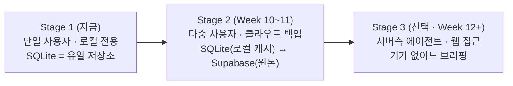
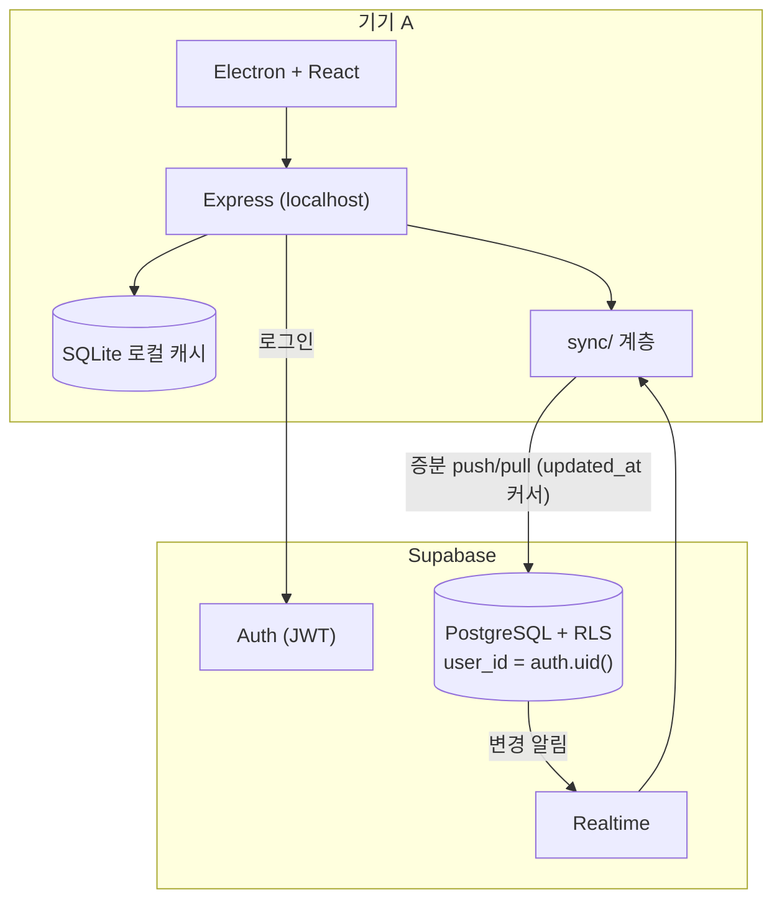

# 🌱 아키텍처 진화 (Architecture Evolution)

> 지금 구조(단일 사용자·로컬)에서 목표 구조(다중 사용자·클라우드 동기화)로 가는 경로.
> "그때 가서 한다" 를 "무슨 이음새(seam)를 지금 만들어 둬야 하나" 로 바꾸는 문서.
> 도입 시점은 [ADR-0008](adr/ADR-0008-supabase-deferred.md)(Week 10+), 일정은 [ROADMAP.md](../ROADMAP.md).

---

## 1. 세 단계

| 축 | Stage 1 | Stage 2 | Stage 3 |
|---|---|---|---|
| 사용자 | 1 (암묵) | N (인증) | N |
| 저장소 | 로컬 SQLite | 로컬 캐시 + Supabase | 동일 + 서버 캐시 |
| 인증 | 없음 | Supabase Auth (이메일/OAuth) | 동일 |
| 에이전트 | 로컬 배치 (launchd) | 로컬 배치 | 서버 워커 (cron/queue) |
| 백엔드 | localhost:3000 | localhost + Supabase SDK | 클라우드 배포 |
| 오프라인 | 백엔드 필요 | 로컬 캐시로 읽기 가능(목표) | 동일 |

---

## 2. 지금 만들어 둘 이음새 (Stage 1 에서 미리)

큰 재작성을 피하려면 아래는 지금 구조에 반영해 둔다.

| 이음새 | 지금 할 일 | 안 하면 나중에 |
|---|---|---|
| **`user_id` 자리** | 스키마에 넣진 않되([ADR-0008](adr/ADR-0008-supabase-deferred.md)), 라우트·스토어가 "현재 사용자" 개념을 상수 하나(`LOCAL_USER`)로 참조 | 모든 쿼리에 WHERE 절 추가 재작업 |
| **`updated_at` 일관성** | 모든 사용자 테이블에 `updated_at` 을 서버가 갱신 (이미 대부분) | 증분 동기화 커서 만들 근거 없음 |
| **db 인터페이스 고정** | `getX/addX/updateX/deleteX` 시그니처 유지 (NFR-MAINT-03) | Supabase 어댑터를 못 끼움 |
| **동기화 계층 자리** | `backend/src/sync/` 디렉터리는 비워 두되 아키텍처 다이어그램에 위치 표시 | 동기화 로직이 라우트에 스며듦 |
| **오류 코드 안정화** | [ADR-0017](adr/ADR-0017-rest-error-contract.md) 의 `type` 코드를 지금부터 사용 | 클라이언트가 문자열 매칭에 의존 |
| **마이그레이션 틀** | [ADR-0018](adr/ADR-0018-schema-migration-strategy.md) 채택, `migrations/` 도입 | `user_id` 추가에서 바로 막힘 |

---

## 3. 오프라인 우선의 현재 한계와 목표

**현재:** 렌더러는 SQLite 에 직접 접근하지 않는다. 백엔드(:3000)가 로컬 데이터의 게이트웨이다.
→ 백엔드 프로세스가 없으면 로컬 읽기도 불가. 이건 진짜 "로컬 우선" 이 아니라 "로컬 백엔드 우선".

**옵션 (Stage 2 전 결정):**

| 옵션 | 설명 | 트레이드오프 |
|---|---|---|
| A. 현행 유지 | 백엔드가 항상 뜬다고 가정([ADR-0016](adr/ADR-0016-desktop-process-topology.md) 로 자동 기동) | 단순. "오프라인" = 외부 API 없음만 의미 |
| B. 렌더러에 읽기 전용 SQLite | preload 로 제한된 읽기 쿼리 노출 | Electron 보안 표면 증가, 쓰기 경로 이원화 |
| C. 로컬 우선 동기화 엔진 | 렌더러 ↔ 로컬 저장소(IndexedDB/SQLite) ↔ 동기화 | 가장 견고, 가장 큼. local-first 문헌 참고 |

**권고:** Stage 2 까지 **옵션 A**. 옵션 C 는 Stage 3 이후 별도 프로젝트 규모로 평가.

---

## 4. 다중 사용자 (Stage 2) 설계 스케치

결정 필요 (Week 10 ADR):
- 인증: Supabase Auth vs 자체. → Supabase Auth 유력.
- 테넌시: RLS 정책 (`user_id = auth.uid()`), 모든 테이블에 `user_id NOT NULL`.
- 충돌 해결: 필드 단위 LWW + 의미 필드는 사용자 표시 ([DATA_ARCHITECTURE.md](DATA_ARCHITECTURE.md) §6).
- 삭제: 툼스톤(`deleted_at`).
- 초기 마이그레이션: 로컬 단일 사용자 데이터 → `user_id` 백필 후 첫 push.

---

## 5. 서버측 에이전트 (Stage 3, 선택)

기기가 꺼져 있어도 브리핑이 돌게 하려면 에이전트가 클라우드에 있어야 한다.

- 트리거: 클라우드 cron (예: Supabase Edge Function / 별도 워커 VM).
- 토큰: 사용자별 OAuth refresh token 을 서버에 암호화 저장 — 보안 표면이 크게 커진다. 위협 모델 재작성 필요.
- [ADR-0013](adr/ADR-0013-dashboard-agent-queue.md)(에이전트 작업 큐)이 여기서 실제 의미를 가짐.
- **이 단계는 강의 필수 아님.** 핵심 4기능 + Stage 2 완료 후에만 검토.

---

## 6. 되돌릴 수 없는 결정 vs 유연한 결정

| 되돌리기 쉬움 | 되돌리기 어려움 (지금 신중히) |
|---|---|
| 상태 라이브러리(zustand), CSS 방식, 로깅 포맷 | 오프라인 우선 스타일([ADR-0015](adr/ADR-0015-local-first-architecture.md)), 프로세스 분리, `db` 인터페이스 계약, 스키마 마이그레이션 방식 |

---

**작성:** 2026-09-03
