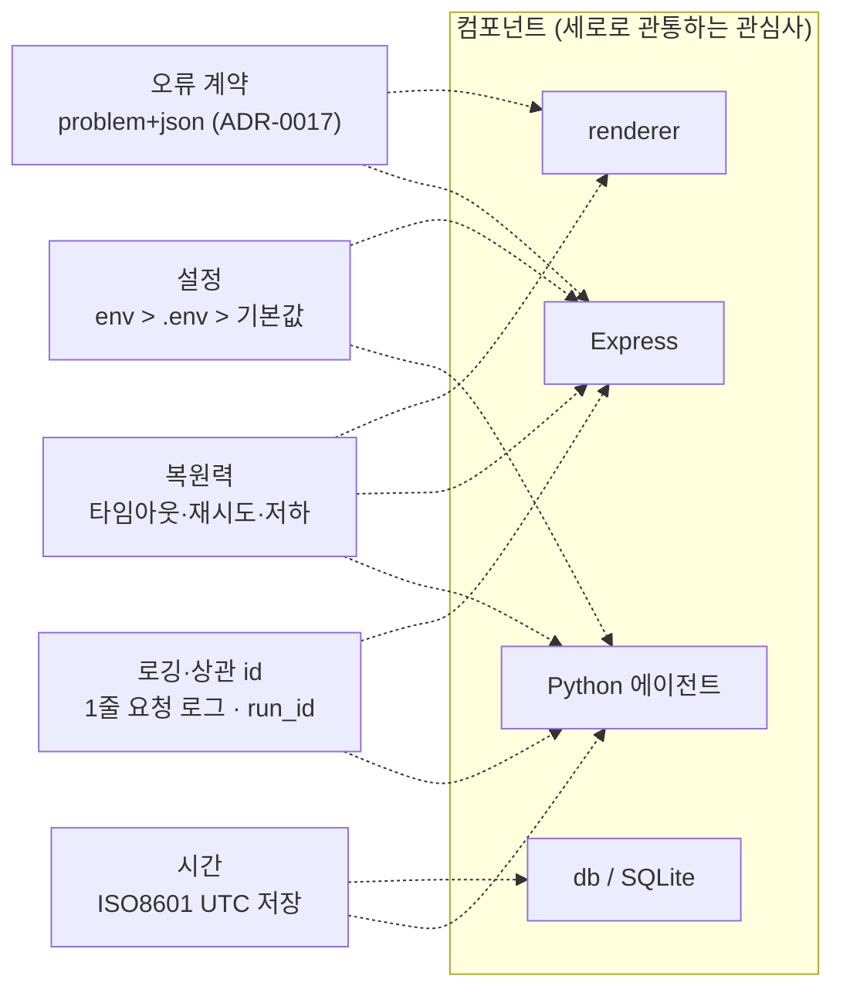

# 🧵 횡단 관심사 (Cross-Cutting Concepts)

> 여러 컴포넌트에 공통으로 적용되는 규칙을 한곳에. arc42 §8.
> 지금까지 ADR·DESIGN §5·NFR 에 흩어져 있던 내용을 "시스템 전체에서 X 를 이렇게 한다" 로 통합한다.



각 관심사의 "어디서 구현되나" 는 [§7 표](#7-이-문서와-다른-문서).

---

## 1. 설정 (Configuration)

**원칙 (12-factor III):** 코드에 값 하드코딩 금지. 환경별 차이는 환경변수로.

| 우선순위 (높→낮) | 소스 | 예 |
|---|---|---|
| 1 | 프로세스 환경변수 | CI, launchd `EnvironmentVariables` |
| 2 | `.env` (git ignore) | 로컬 개발 |
| 3 | 코드 내 기본값 | `PORT=3000`, `DATABASE_PATH=backend/data/app.db` |

- 단일 원천: [`.env.example`](../../../.env.example) + [ENV_REFERENCE.md](../../setup/ENV_REFERENCE.md).
- 백엔드는 현재 dotenv 미도입(env 3개 전부 기본값 有, 시크릿 0) — 재검토 D2 ([작업로그](../../../작업로그.md) 참조).
- SQLite 경로는 **`DATABASE_PATH`** 하나 ([ADR-0009](adr/ADR-0009-sqlite-file-location.md)). `DATABASE_URL`·`SUPABASE_JWT_SECRET` 은 Week 10 도입 시 별도 ADR 로 이름 확정 — 그 전까지 예시에서도 쓰지 않는다.
- 하드코딩 금지 검사: 피트니스 함수 FF-7 ([ARCHITECTURE_DRIVERS.md](ARCHITECTURE_DRIVERS.md) §4).

---

## 2. 오류 처리 계약 (Error Contract)

### 2.1 백엔드 → 클라이언트

- 현재: `{ "error": "메시지" }` + 상태코드. 검증 실패 400, 그 외 500.
- 계층: `backend/src/errors.js` (C2) — 일반 Error(`필수`/`0~100` 등) + SQLite 제약(`SQLITE_CONSTRAINT_*`) → `isValidationError` → 400, `toClientMessage` 로 한국어 치환. **SQLite 영문 원문 비노출.**
- **제안 (→ [ADR-0017](adr/ADR-0017-rest-error-contract.md)):** RFC 9457 스타일로 확장
  ```json
  { "type": "validation_error", "title": "입력이 올바르지 않습니다",
    "status": 400, "detail": "progress 는 0~100 이어야 합니다",
    "errors": [{ "field": "progress", "message": "0~100" }] }
  ```
  - `type` 은 안정적인 코드(클라이언트 분기용), `title`/`detail` 은 사람이 읽는 한국어.
  - 5xx 는 `detail` 에 내부 정보 노출 금지(로그에만). `type: "internal_error"` + 요청 id.

### 2.2 클라이언트 처리

- `api/client.js` 가 응답을 정규화 → 스토어 `error` 상태 문자열 하나로.
- 패널별 독립 (FR-UI-04): 한 요청 실패가 다른 패널 렌더를 막지 않음.
- `ErrorBoundary` 는 렌더 예외(코드 버그)용, `ErrorBanner` 는 데이터/네트워크 오류용 — 역할 분리.

### 2.3 프로세스 레벨

| 프로세스 | 미처리 예외 | 정책 |
|---|---|---|
| 백엔드 | `unhandledRejection` | 로깅 후 프로세스 유지 (NFR-REL-03) |
| 백엔드 | `uncaughtException` / `SIGTERM` · `SIGINT` | 로깅 후 graceful shutdown — HTTP close·WAL 체크포인트·`exit 1`(신호는 `exit 0`), 감독자가 재기동 (NFR-REL-03, ADR-0016) |
| 에이전트 | 최상위 try/except | `sync_logs` 기록 + 비정상 exit code, 크래시 로그. 앱 영향 0 |
| Electron main | `process.on('uncaughtException')` | 로깅, 창 유지 |

---

## 3. 로깅·관측성 (Observability)

### 3.1 백엔드 요청 로그 (NFR-OBS-01, C1)

- 형식: 한 줄. `<ISO8601> <METHOD> <path> <status> <ms>` + 요청 id.
- `requestLogger` 가 미들웨어 체인 최상단 → preflight·본문 파싱 실패(400/413)도 포함.

### 3.2 상관 id (correlation id)

- **제안:** 모든 요청에 `X-Request-Id`(없으면 백엔드 생성). 로그 줄·오류 응답 `type` 옆에 포함.
- 에이전트 실행은 `run_id`(timestamp 기반) 하나로 그 실행의 모든 로그·`sync_logs` 행을 묶음.

### 3.3 에이전트 로그 (NFR-OBS-02)

4단계 필수 로깅: `시작 → 수집 결과(소스별 건수/실패) → Claude 결과(토큰·소요) → 저장(briefs·notion)`.

### 3.4 민감값 마스킹

로그·오류 문자열에 토큰/키/메일 본문 금지. `sk-ant-…` `secret_…` `GOCSPX…` 패턴은 출력 전 `***` 치환 유틸 경유.

### 3.5 지표 (향후, Week 12+)

`sync_logs` 를 집계해 "서비스별 최근 성공률", API p95 는 요청 로그에서 추출. 별도 APM 도입은 범위 밖.

---

## 4. 복원력 (Resilience) — 타임아웃·재시도·저하

**출처: Nygard, *Release It!*** 모든 외부 호출은 아래 예산 안에서.

| 호출 | 타임아웃 | 재시도 | 저하(degraded) 동작 |
|---|---|---|---|
| 프론트 → 백엔드 | 5s | 재시도 3회 (지수 백오프 1·2·4s) | 연결 상태 머신 `disconnected` ([RUNTIME_VIEW.md](RUNTIME_VIEW.md) §4) |
| 에이전트 → Gmail/Calendar | 10s | 3회, 지수 | 해당 소스 "없음" 처리, 브리핑 계속 (QAS-2) |
| 에이전트 → Claude | 30s | 총 3회 시도 (재시도 2회, 지수 백오프 1·2s), 인증 오류(4xx)는 즉시 실패 | 실패 시 브리핑 생성 포기, 로그 + exit≠0, 앱 영향 0 |
| 에이전트 → Notion | 10s | 2회 | 로컬 `briefs` 저장은 유지, "Notion 저장만 실패" 보고 |

> **각주 (Claude ↔ NFR-PERF-04):** 브리핑 60초는 성공 경로 목표다. 재시도가 모두 실패하는 열화 경로는 최악 30s×3 + 백오프(1·2s) ≈ 93초까지 소요될 수 있으며, 이 경우 사용자에게 실패를 반환한다.

원칙:
- **모든 외부 호출·IO 는 try/catch** (NFR-REL-01).
- **재시도는 멱등 연산에만** — 캐시 upsert 는 멱등(UNIQUE 키), `tasks` 생성은 재시도 금지(중복 위험).
- **부분 실패 허용** — 한 소스 실패가 전체 실패가 아니다.
- 서킷 브레이커는 현재 규모(개인·저빈도)에선 과설계 → 재시도 상한으로 충분. 재검토: 외부 호출 빈도 증가 시.

### 4.1 멱등성 (Idempotency)

| 연산 | 멱등 키 | 방식 |
|---|---|---|
| 캘린더/메일 캐시 쓰기 | `event_id` / `email_id` | `INSERT ... ON CONFLICT DO UPDATE` |
| 일일 브리핑 | `briefs.date` | 같은 날 재실행 = 덮어쓰기 |
| 동기화 로그 | 없음 (append) | 매 시도 1행 |

---

## 5. 시간·스케줄

- 저장은 전부 **ISO8601 TEXT (UTC 권장)**. 표시 시점에 로컬 타임존 변환.
- 스케줄: launchd(mac)/cron(Linux) — [ADR-0007](adr/ADR-0007-schedule-launchd-cron.md). plist 는 절대 경로를 쓰므로 머신 이동 시 재설치 필요(하드코딩 예외, NFR-PORT-03).
- 브리핑 08:00, 작업로그 요약 23:50.

---

## 6. 국제화

지금은 한국어 단일. UI 문자열 하드코딩 허용(범위). 다국어는 범위 밖 — 도입 시 문자열 테이블 분리.

---

## 7. 이 문서와 다른 문서

| 관심사 | 측정 기준 | 결정 이력 | 구현 위치 |
|---|---|---|---|
| 설정 | — | ADR-0009 | `.env.example`, `backend/db/index.js` |
| 오류 | NFR-SEC-07 | ADR-0017(제안) | `backend/src/errors.js`, `frontend/src/api/client.js` |
| 로깅 | NFR-OBS-01~03 | — | `backend/src/middleware/requestLogger.js` |
| 복원력 | NFR-REL-01~05 | — | `api/client.js`, `agent/daily_brief.py` |

---

**작성:** 2026-09-03
