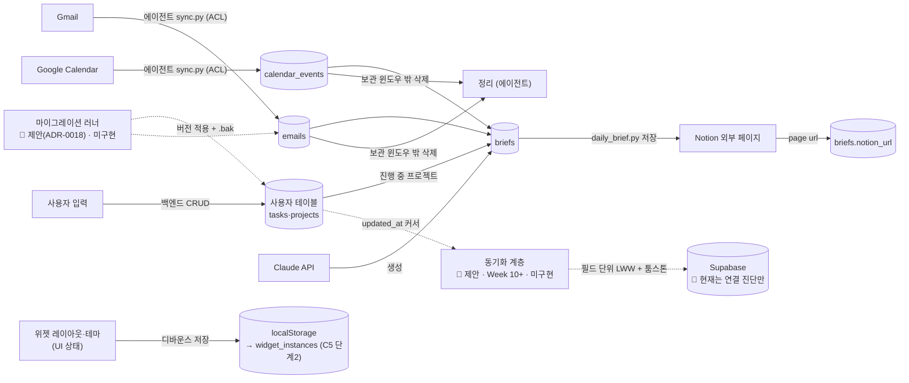

# 🗄️ 데이터 아키텍처 (Data Architecture)

> ER 스케치([DESIGN.md](DESIGN.md) §4)와 필드 사전([DATA_DICTIONARY.md](../reference/DATA_DICTIONARY.md)) 위 계층.
> **데이터의 수명주기**: 스키마 진화, 캐시 신선도·보관, 동기화 충돌, 데이터 분류, 백업.
> DDL 단일 원천은 여전히 [`backend/db/schema.sql`](../../../backend/db/schema.sql).

### 데이터 수명주기 (한 장)

> 범례: **실선 = 구현됨**, 점선 = 제안/미구현. Notion 은 브리핑의 **출력처**(캐시 입력원 아님) — 본문은 우리가 소유하고 `briefs.notion_url` 만 역참조한다(§5).

쓰기 주체는 테이블마다 하나(§2). 스키마 변경은 마이그레이션으로만(§3, [ADR-0018](adr/ADR-0018-schema-migration-strategy.md)).
위젯 레이아웃은 도메인 데이터와 분리된 UI 상태 계층 — 손상되면 기본값으로 폴백한다([ADR-0021](adr/ADR-0021-widget-layout-persistence.md)).

---

## 1. 데이터 분류

| 등급 | 대상 | 저장 위치 | 규칙 |
|---|---|---|---|
| **비밀 (secret)** | API 키, OAuth refresh token | `.env`(키), OS 키체인/암호화 파일(토큰) | DB·git·로그·렌더러 금지 (NFR-SEC-01/03/05) |
| **민감 (sensitive)** | 메일 제목·스니펫, 일정 제목, 브리핑 본문 | SQLite `emails`/`calendar_events`/`briefs` | 본문 전체 저장 금지(스니펫만), 디스크 암호화에 의존, 로그에 값 출력 금지 |
| **개인 일반 (personal)** | 할일 제목, 프로젝트 이름/진행도 | SQLite `tasks`/`projects` | 로컬 보관, Week 10+ 는 `user_id` 로 분리 |
| **UI 상태 (ui-state)** | 위젯 레이아웃·테마·표시 옵션 | localStorage `dashboard.layout.v1` → SQLite `widget_instances` (C5~) | 도메인 데이터 아님. 손상 시 기본값 폴백. [ADR-0021](adr/ADR-0021-widget-layout-persistence.md) |
| **운영 (operational)** | `sync_logs`, 요청 로그 | SQLite / 로그 파일 | 원인 문자열에 민감값·토큰 섞이지 않게 마스킹 |

---

## 2. 소유권 (쓰기 주체)

[ADR-0011](adr/ADR-0011-agent-backend-db-access.md) 을 테이블 단위로 확정.

| 테이블 | 쓰기 | 읽기 | 성격 |
|---|---|---|---|
| `tasks` | 백엔드만 | 백엔드, 에이전트(읽기 전용) | 사용자 데이터 (source of truth) |
| `projects` | 백엔드만 | 백엔드, 에이전트(읽기 전용) | 사용자 데이터 |
| `calendar_events` | 에이전트만 | 백엔드 | 외부 캐시 (Google) |
| `emails` | 에이전트만 | 백엔드 | 외부 캐시 (Gmail) |
| `briefs` | 에이전트만 | 백엔드 | 파생 데이터 (Claude 생성) |
| `sync_logs` | 에이전트만 (append) | 백엔드 | 감사 로그 (append-only) |
| `widget_instances` (C5, 단계 2) | 백엔드만 (프론트가 `/api/widgets` 로 요청) | 백엔드 → 프론트 | UI 상태. 1차는 SQLite 대신 localStorage([ADR-0021](adr/ADR-0021-widget-layout-persistence.md)) |

**불변식:** 한 테이블에 쓰는 프로세스는 하나. 위반 시 [ADR-0011](adr/ADR-0011-agent-backend-db-access.md) 재검토.

---

## 3. 스키마 진화 (마이그레이션)

**현재 문제:** `schema.sql` 은 `CREATE TABLE IF NOT EXISTS` 만 한다. 이미 존재하는 테이블에 **컬럼을 추가·변경할 경로가 없다.** Week 10 의 `user_id`/`synced_at` 추가에서 바로 막힌다.

**제안 (→ [ADR-0018](adr/ADR-0018-schema-migration-strategy.md)):**

- `backend/db/migrations/NNNN_설명.sql` — 순번 파일. 각 파일은 순방향(up)만. SQLite 라 down 은 생략(백업으로 롤백).
- `schema_migrations(version INTEGER PRIMARY KEY, applied_at TEXT)` 테이블로 적용 이력 추적.
- 부팅 시: 현재 `PRAGMA user_version` 또는 `schema_migrations` 확인 → 미적용 파일 순서대로 실행 → 버전 기록.
- `schema.sql` 은 **"0번 마이그레이션 = 초기 스키마"** 로 남기고, 이후 변경은 마이그레이션 파일로만.
- 에이전트는 마이그레이션을 **실행하지 않는다** (백엔드가 유일한 스키마 소유자). 에이전트는 버전이 자기가 아는 것보다 낮으면 경고 후 종료.

| 시나리오 | 대응 |
|---|---|
| 컬럼 추가 (`user_id`) | `ALTER TABLE ... ADD COLUMN` 마이그레이션 |
| CHECK 제약 변경 | SQLite 는 제약 수정 불가 → 12단계 테이블 재작성(new→copy→drop→rename) 마이그레이션 |
| 개발 중 스키마 깨짐 | `app.db` 삭제 후 재생성 (개발 데이터는 버려도 됨 — CONSTRAINTS) |

---

## 4. 캐시 신선도·보관

외부 캐시 테이블(`calendar_events`, `emails`)은 "언제 갱신됐고 언제 버리나" 규칙이 필요.

| 항목 | 규칙 (제안) | 근거 |
|---|---|---|
| **신선도 표시** | 각 행 `synced_at`(ISO8601). UI 는 "N분 전 동기화" 표시, 임계(예: 30분) 초과 시 흐리게 | NFR-PERF-05, 오프라인 우선 |
| **동기화 주기** | 캘린더: 에이전트 실행 시 + 사용자 수동 새로고침. 메일: 브리핑 시 + 수동 | FR-CAL-01, FR-MAIL-01 |
| **upsert 키** | `calendar_events.event_id` UNIQUE, `emails.email_id` UNIQUE | schema.sql |
| **보관 기간** | 캘린더: 과거 7일 ~ 미래 30일 밖 행 삭제. 메일: 읽음 처리 후 30일, 또는 최근 200건만 | 로컬 DB 비대 방지 |
| **삭제 전파** | 외부에서 삭제된 일정 → 동기화 시 목록에 없으면 로컬도 삭제(윈도우 내에서) | 일관성 |
| **`briefs`** | `date` UNIQUE, 무기한 보관(작음). 같은 날 재실행 시 덮어씀 | FR-AGENT-06 |
| **`sync_logs`** | append-only, 90일 후 또는 10000행 초과분 삭제 | 감사용으로 충분 |

> 보관 정책 실행 주체: 에이전트가 자기 캐시 테이블을 쓸 때 같이 정리(같은 프로세스가 소유하므로).

---

## 5. 안티커럽션 레이어 (외부 모델 → 내부 스키마)

Google/Notion/Gmail 의 응답 모델을 **그대로 저장하지 않는다.** `agent/services/*.py` 가 내부 스키마로 번역한다.

| 외부 | 외부 필드 예 | 내부 매핑 |
|---|---|---|
| Google Calendar event | `start.dateTime` / `start.date`(종일) | `calendar_events.start_at` (ISO8601 TEXT 로 정규화, 종일은 규약 정함) |
| Gmail message | `payload.headers[Subject]`, `snippet`, `labelIds` 에 `UNREAD` | `emails.subject`, `emails.snippet`, `emails.is_read`(0/1) |
| Notion page | 블록 트리 | `briefs.notion_url` (URL 만 역참조, 본문은 우리가 소유) |

번역 규칙이 깨지면 내부 스키마가 아니라 서비스 모듈만 고친다. → DDD 안티커럽션 레이어.

---

## 6. 동기화 충돌 (Week 10+, Supabase)

[ADR-0008](adr/ADR-0008-supabase-deferred.md) 이 예고한 결정을 여기서 형태를 잡아 둔다 (확정은 Week 10 ADR).

- **단위:** 레코드 단위 증분. `updated_at` 커서 + `is_synced` 플래그.
- **방향:** 양방향. 로컬 SQLite ↔ Supabase.
- **충돌 정의:** 같은 레코드가 로컬·서버 모두 마지막 동기화 이후 변경됨.
- **해결 (제안):** 필드 단위 LWW(last-write-wins, `updated_at` 기준). 단 `tasks.status` 처럼 의미 있는 필드는 충돌 시 사용자에게 표시(`*_conflicts` 임시 테이블).
- **삭제:** 툼스톤(`deleted_at`) — 하드 삭제 대신 표시 후 양쪽 전파, 30일 후 물리 삭제.
- **테넌시:** Supabase Row Level Security 로 `user_id = auth.uid()` 강제. → [ARCHITECTURE_EVOLUTION.md](ARCHITECTURE_EVOLUTION.md) §4.

---

## 7. 백업·복구

| 대상 | 방법 | 시점 |
|---|---|---|
| `app.db` | 마이그레이션 실행 직전 `app.db.bak-<ts>` 복사 | 매 마이그레이션 |
| `app.db` | `PRAGMA wal_checkpoint` 후 파일 복사 스크립트 (`scripts/`) | 수동 / 주간(선택) |
| Week 10+ | Supabase 가 원격 사본 역할 | 상시 |
| 복구 | 개발: DB 삭제 후 재생성. 운영(향후): 최신 `.bak` 복원 또는 Supabase 재동기화 | — |

---

**작성:** 2026-09-03
