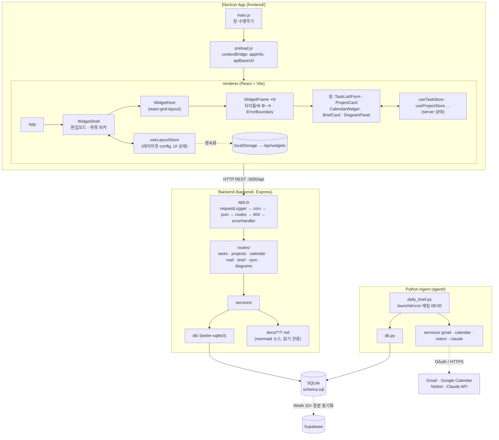
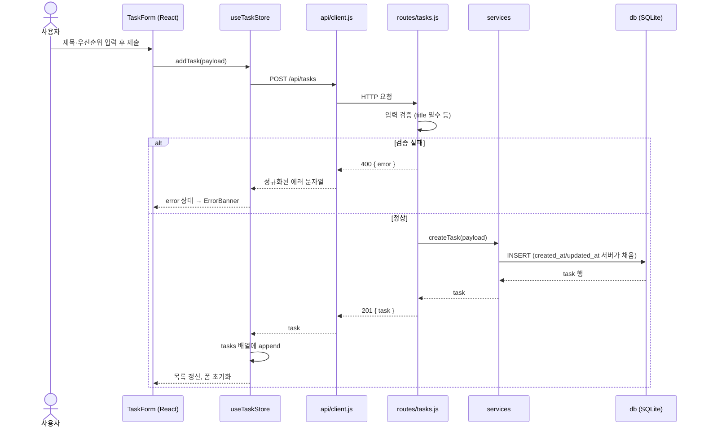
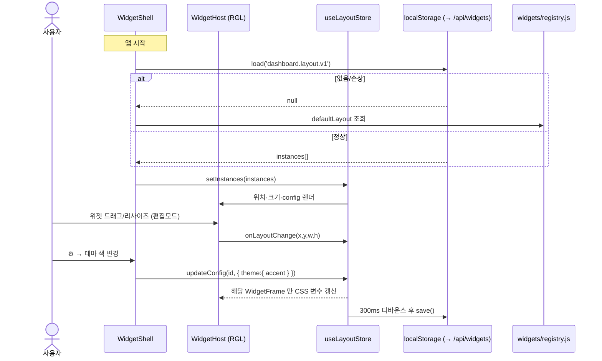
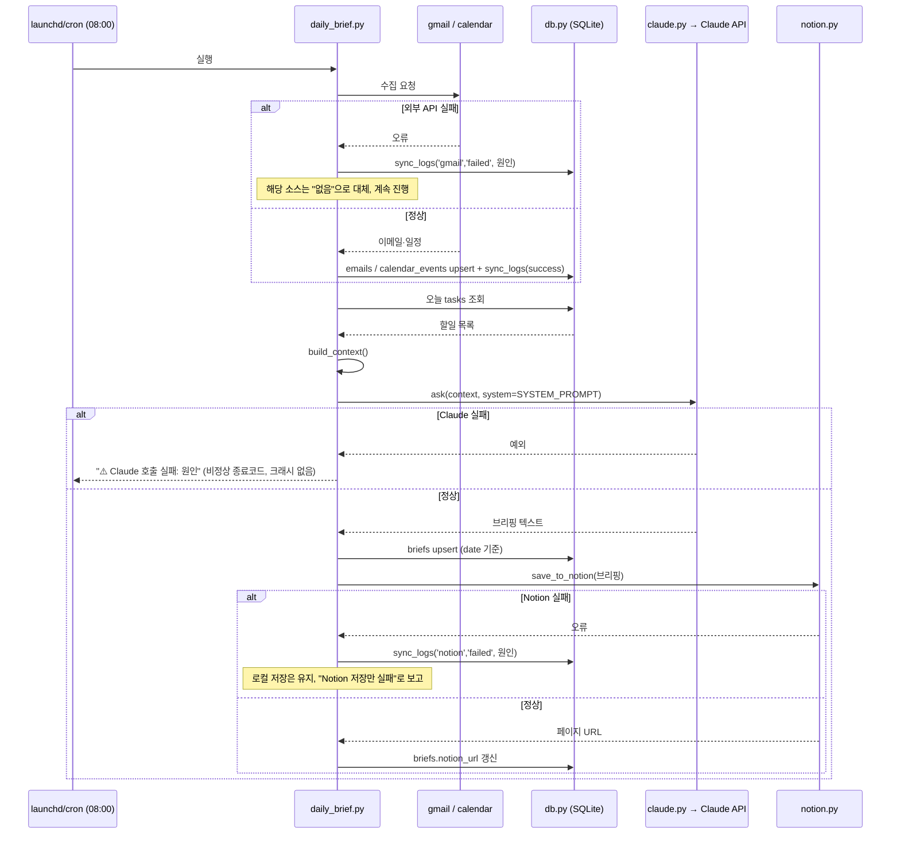

# 🏛️ 시스템 설계 (DESIGN)

> [AS_IS.md](../vision/AS_IS.md) 의 현행 분석과 [REQUIREMENTS_FUNCTIONAL.md](../requirements/REQUIREMENTS_FUNCTIONAL.md) ·
> [REQUIREMENTS_NONFUNCTIONAL.md](../requirements/REQUIREMENTS_NONFUNCTIONAL.md) 를 어떻게 구현할지.
> 큰 그림 기술스택은 [ARCHITECTURE.md](ARCHITECTURE.md), 일정은 [ROADMAP.md](../ROADMAP.md).

---

## 1. 설계 원칙

1. **계층 고정 (목표)** — `routes → services → db`. 라우트에 비즈니스 로직·SQL 금지 (NFR-MAINT-02).
   - **현재(AS-IS):** `services/` 계층은 C3 에서 도입됐다(`backend/src/services/calendar.js` — 더미 이벤트 생성). 할일·프로젝트 라우트는 아직 `db.js` 를 직접 호출한다. 도메인 로직이 커지는 시점에 점진적으로 이관한다. 미들웨어(`backend/src/middleware/`, C1)는 이 계층과 별개인 횡단 관심사.
2. **DB 인터페이스 불변** — `db.js` 의 `getX/addX/updateX/deleteX` 시그니처는 저장소가 바뀌어도 유지 (NFR-MAINT-03).
3. **오프라인 우선** — 로컬 SQLite 가 진실의 원천, 클라우드/외부 API 는 그 위에 얹는 캐시·동기화 (NFR-REL-04).
   - **보장 범위:** 네트워크가 없어도 (a) 할일·프로젝트는 완전한 CRUD, (b) 마지막으로 동기화된 일정·메일·브리핑은 **조회만** 가능. 캐시 최신성은 각 행의 `synced_at` 으로 표시.
   - **범위 밖:** 백엔드 프로세스(:3000)가 죽은 상태는 "오프라인"이 아니라 **연결 오류**로 다룬다 — 앱은 `ErrorBanner` + 재시도를 보여준다(FR-UI-04). 백엔드 자동 기동 여부는 README "앱 실행" 의 미정 항목.
4. **최소 구현** — 각 단계는 데모 가능한 최소 범위. 과설계 금지 (NFR-MAINT-01).
5. **한 기능 = `/feature` 1회** — 에이전트 파이프라인으로만 변경 (NFR-MAINT-05).

---

## 2. 아키텍처 결정 (ADR)

결정 하나 = 파일 하나. 전체·배경은 **[adr/](adr/)**.

| # | 결정 | 상태 |
|---|---|---|
| [0001](adr/ADR-0001-frontend-react-vite.md) | 프론트 렌더링을 React + Vite 로 통일 | 채택 |
| [0002](adr/ADR-0002-local-db-better-sqlite3.md) | 로컬 DB 는 better-sqlite3 (동기 API) | 채택 |
| [0003](adr/ADR-0003-schema-single-file.md) | 스키마는 `schema.sql` 1파일 + `IF NOT EXISTS` | 채택 |
| [0004](adr/ADR-0004-front-back-http-rest.md) | 프론트↔백엔드는 HTTP REST | 채택 |
| [0005](adr/ADR-0005-state-zustand.md) | 상태관리는 zustand | 채택 |
| [0006](adr/ADR-0006-agent-owns-external-apis.md) | 외부 API 는 Python 에이전트가 전담 | 채택 |
| [0007](adr/ADR-0007-schedule-launchd-cron.md) | 스케줄은 launchd/cron | 채택 |
| [0008](adr/ADR-0008-supabase-deferred.md) | Supabase 동기화는 Week 10 이후 | 채택 |
| [0009](adr/ADR-0009-sqlite-file-location.md) | SQLite 위치: `DATABASE_PATH` 주입 | 채택 |
| [0010](adr/ADR-0010-vite-dev-vs-build.md) | Vite: `NODE_ENV` 로 dev/빌드 분기 | 채택 |
| [0011](adr/ADR-0011-agent-backend-db-access.md) | 에이전트–백엔드 SQLite: WAL + 쓰기 주체 분리 | 채택 |
| [0012](adr/ADR-0012-task-project-link.md) | `tasks.project_id` FK (`ON DELETE SET NULL`) | 채택 |
| [0013](adr/ADR-0013-dashboard-agent-queue.md) | 대시보드 에이전트 작업 큐 (향후 확장) | **제안** |
| [0014](adr/ADR-0014-dashboard-diagram-viewer.md) | 대시보드 다이어그램 뷰어 (mermaid 클라이언트 렌더 + `/api/diagrams`) | **제안** |
| [0015](adr/ADR-0015-local-first-architecture.md) | 아키텍처 스타일 — 로컬 우선 + 프로세스 분리 | **제안** |
| [0016](adr/ADR-0016-desktop-process-topology.md) | 데스크톱 프로세스 토폴로지 (백엔드 실행 주체) | **제안** |
| [0017](adr/ADR-0017-rest-error-contract.md) | REST 오류 응답 계약 (RFC 9457) | **제안** |
| [0018](adr/ADR-0018-schema-migration-strategy.md) | 스키마 마이그레이션 전략 | **제안** |
| [0019](adr/ADR-0019-architecture-fitness-functions.md) | 아키텍처 피트니스 함수 | **제안** |
| [0020](adr/ADR-0020-widget-shell-architecture.md) | 위젯 셸 아키텍처 (react-grid-layout + 위젯 계약) | **제안** |
| [0021](adr/ADR-0021-widget-layout-persistence.md) | 위젯 레이아웃·설정 영속화 (localStorage → SQLite) | **제안** |
| [0022](adr/ADR-0022-per-widget-theming.md) | 위젯별 테마 (스코프된 CSS 변수) | **제안** |
| [0023](adr/ADR-0023-branch-model.md) | 브랜치 모델 — `feature/* → PR → main` (Git Flow 미채택) | 채택 |

> 🆕 **대시보드 OS 전환 (2026-09-03)** — 고정 패널 → 위젯 셸. 개념: [../vision/DASHBOARD_OS.md](../vision/DASHBOARD_OS.md),
> 요구사항: [../requirements/WIDGET.md](../requirements/WIDGET.md), 화면: [../reference/UI_SPEC.md](../reference/UI_SPEC.md) §3.8~.

> 🆕 **아키텍처 심화 문서 (2026-09-03 추가)** — 큰 틀 보강:
> [ARCHITECTURE_DRIVERS.md](ARCHITECTURE_DRIVERS.md)(ASR·품질 시나리오·피트니스 함수) ·
> [RUNTIME_VIEW.md](RUNTIME_VIEW.md)(프로세스·시작·종료·연결 상태) ·
> [DATA_ARCHITECTURE.md](DATA_ARCHITECTURE.md)(마이그레이션·캐시·충돌·분류) ·
> [CROSSCUTTING.md](CROSSCUTTING.md)(설정·오류·로깅·복원력) ·
> [ARCHITECTURE_EVOLUTION.md](ARCHITECTURE_EVOLUTION.md)(로컬→클라우드 경로).
> 학습 자료는 [../STUDY_GUIDE.md](../../STUDY_GUIDE.md).

---

## 3. 목표 아키텍처 (TO-BE)

> 다이어그램은 Mermaid. GitHub 에서 자동 렌더된다. 로컬/오프라인 이미지는 [DIAGRAMS.md](../../setup/DIAGRAMS.md) 참고.



핵심 변경점: **① renderer 를 React 로 교체, ② db 를 SQLite 로 교체, ③ 프론트–백엔드 fetch 연결, ④ agent 가 같은 SQLite 에 씀.**

---

## 4. 데이터 모델

**DDL 단일 원천: [`backend/db/schema.sql`](../../../backend/db/schema.sql).** 필드별 의미·규칙은 [DATA_DICTIONARY.md](../reference/DATA_DICTIONARY.md).
이 절은 관계와 설계 의도만 다룬다.

> **B2 완료 (2026-09-02):** better-sqlite3 로 `backend/src/db.js` 내부 교체 완료. `backend/db/index.js` 가 `schema.sql` 을 런타임에 멱등 적용(WAL). 라우트·검증 무수정.

테이블: `tasks`, `projects`, `calendar_events`(Google 캐시), `emails`(Gmail 캐시), `briefs`(날짜별 1건), `sync_logs`(append-only).

```
projects (1) ──< (N) tasks     tasks.project_id FK, ON DELETE SET NULL (ADR-0012)
calendar_events / emails        외부 API 캐시. event_id / email_id UNIQUE 로 upsert
briefs                          date UNIQUE. 같은 날 재실행 시 갱신
sync_logs                       매 동기화 시도 1행 추가
```

설계 의도:
- **오프라인 우선** — 외부 데이터는 전부 로컬 캐시 테이블에 먼저 저장, UI 는 캐시를 읽는다.
- **enum 은 DB CHECK 로 강제** — `priority`/`status` 문자열이 코드와 어긋나지 않도록.
- **날짜는 TEXT + ISO8601** — SQLite 에 네이티브 날짜 타입이 없으므로 규약으로 통일.
- (Week 10+) Supabase 동기화 시 `user_id` / `is_synced` / `synced_at` 컬럼 추가 (schema.sql 하단 주석).

---

## 5. API 명세 (백엔드)

> 엔드포인트별 요청/응답 예시·검증·부작용·curl 은 **[API_REFERENCE.md](../reference/API_REFERENCE.md)** 가 단일 원천이다.
> 이 절은 개요표와 설계 원칙만 둔다.

Base: `http://localhost:3000/api` · 응답은 JSON · 오류는 `{ "error": "메시지" }`

엔드포인트 범위: `/health`, `/tasks`(CRUD), `/projects`(CRUD), `/calendar/events`, `/mail/unread`, `/brief/today`, `/sync/logs`, `/diagrams`(읽기 전용, `docs/` 파싱 — C4).
요청·응답 예시, 검증 규칙, 상태코드, 현재 구현과의 차이는 [API_REFERENCE.md](../reference/API_REFERENCE.md).

설계 규칙:
- 검증(NFR-SEC-07): `title`/`name` 필수, `priority ∈ {high,medium,low}`, `status(task) ∈ {todo,in_progress,done}`, `status(project) ∈ {active,done,on_hold}`, `progress ∈ [0,100]`, `tasks.project_id` = 존재하는 프로젝트 id 또는 null. 위반 시 400.
- 오류 매핑 계층 (`backend/src/errors.js`, C2): 라우트가 던지는 일반 Error(메시지에 `필수`/`0~100`)와 better-sqlite3 제약 위반(`SQLITE_CONSTRAINT_CHECK`/`NOTNULL`/`FOREIGNKEY`)을 함께 400 으로 판정(`isValidationError`)하고, 한국어 메시지로 치환(`toClientMessage`)한다. SQLite 영문 원문은 클라이언트에 노출하지 않는다. `project_id` 는 라우트에서 존재 여부를 사전 검증(FK 위반 도달 전에 400).
- 미들웨어 순서 (C1, `backend/src/app.js`): `requestLogger` → `cors(로컬 오리진만)` → `express.json()` → 라우트 → `404` → `errorHandler`. `requestLogger` 를 맨 앞에 두어 preflight·본문 파싱 실패(400/413) 요청까지 NFR-OBS-01 "모든 요청 1줄" 을 충족한다.
- `calendar`/`mail`/`brief`/`sync` 는 읽기 전용 — 데이터는 에이전트가 SQLite 캐시 테이블에 씀 ([ADR-0006](adr/ADR-0006-agent-owns-external-apis.md)).
- `diagrams` 는 읽기 전용 — `services/diagrams.js` 가 `docs/**/*.md` 를 파싱만 함 (DB·에이전트 무관, [ADR-0014](adr/ADR-0014-dashboard-diagram-viewer.md)).

---

## 6. 프론트엔드 설계

```
frontend/src/
  main.js            Electron 메인 (변경 최소)
  preload.js         contextBridge: { appInfo, apiBaseUrl }
  index.html         <div id="root">
  renderer.jsx       ReactDOM.createRoot(#root).render(<App/>)   ← renderer.js 대체
  App.jsx            레이아웃(단일 화면) → WidgetShell 마운트
  store/
    useTaskStore.js     zustand: tasks, fetchTasks, addTask, toggleTask, removeTask
    useProjectStore.js  zustand: projects, fetchProjects, addProject, updateProject, removeProject (C2)
    useCalendarStore.js zustand: events, fetchEvents, 날짜 배지 파생 (C3 — 더미 API)
    useAppStore.js      brief (C4~ — 도메인별 스토어로 분리하는 방향)
    useLayoutStore.js   zustand: 위젯 인스턴스 배열(위치·크기·z·minimized·config), 편집모드 — UI 상태 (C5, ADR-0021)
  api/
    client.js        fetch 래퍼 (base URL, 에러 정규화, 재시도)
  widgets/           (C5, 대시보드 OS — ADR-0020)
    registry.js        위젯 타입 등록: { type, name, icon, defaultSize, min/maxSize, view, configSchema, useData }
    defaultLayout.js   첫 실행 기본 레이아웃 상수
    themePresets.js    위젯 테마 프리셋 (다크·미니멀·강조 — ADR-0022)
  components/
    WidgetShell.jsx  신규(C5): 편집모드 토글 · 위젯 피커 · useLayoutStore 연결
    WidgetHost.jsx   신규(C5): react-grid-layout 래퍼, onLayoutChange → store
    WidgetFrame.jsx  신규(C5): 타이틀바(⚙️─✕) · 위젯별 ErrorBoundary · 테마 변수 주입
    WidgetSettings.jsx 신규(C5): ⚙️ 설정 패널 (테마 탭 + 표시 탭)
    TaskList.jsx     (기존) 위젯 뷰로 재사용. props 인터페이스 유지
    TaskForm.jsx     할일 추가 폼
    ProjectCard.jsx  props 확장 (onDelete/onProgressChange/onStatusChange, C2)
    ProjectForm.jsx  프로젝트 추가 폼 (C2)
    CalendarWidget.jsx  (C3) 위젯 뷰
    BriefCard.jsx       (D3) 위젯 뷰
    DiagramPanel.jsx    (FR-UI-05, C4 — mermaid 동적 import) 위젯화 여부는 DO-6
    ErrorBanner.jsx     (FR-UI-04, NFR-REL-02)
    ErrorBoundary.jsx   렌더 예외 격리 — 셸 전역 + 위젯별
```

> **대시보드 OS 계층** (C5, [DASHBOARD_OS.md](../vision/DASHBOARD_OS.md)): `App → WidgetShell → WidgetHost → WidgetFrame → <레지스트리 뷰>`.
> 레이아웃·테마 = `useLayoutStore`(UI 상태, localStorage 영속). 위젯 데이터 = 기존 도메인 스토어(server 상태). 두 관심사를 섞지 않는다.
> `Dashboard.jsx`(고정 패널)는 C5 에서 `WidgetShell` 로 대체된다 — 기존 뷰 컴포넌트는 그대로 위젯 뷰로 이관.

Vite 설정: `frontend/vite.config.js`, `base: './'` (Electron file:// 로드), 빌드 산출물 `dist/` → `main.js` 가 `dist/index.html` 로드. 개발 시 `vite` dev 서버 + `loadURL`.

컴포넌트 계약(props/state/이벤트)·렌더 상태·와이어프레임은 [UI_SPEC.md](../reference/UI_SPEC.md) 가 단일 원천.

> ✅ B1 해소: prod `index.html` CSP 는 `script-src 'self'; connect-src 'self' http://localhost:3000`. dev 는 `vite.config.js` 의 `devCspPlugin` 이 `unsafe-inline` + `ws://localhost:5173` 까지 완화(React Refresh 프리앰블용).

### 흐름: 할일 생성 (FR-TASK-01)



### 흐름: 위젯 이동·테마 변경·복원 (FR-WIDGET-01/04/05, C5~C6)



---

## 7. 에이전트 설계

```
agent/
  daily_brief.py       엔트리 (launchd/cron)
  db.py                신규: 백엔드와 같은 SQLite 파일에 읽기/쓰기
  services/
    gmail.py     get_unread_emails()  → 실 Gmail API (Week 6)
    calendar.py  get_today_events()   → 실 Calendar API (Week 5~6)
    notion.py    save_to_notion()     → 실 Notion API (Week 7)
    claude.py    ask()  (완료)
  auth/
    google_oauth.py    토큰 획득·갱신·암호화 저장 (Week 6, NFR-SEC-05)
```

흐름 (FR-AGENT-01~06):
1. `gmail/calendar` 에서 수집 → `emails`/`calendar_events` 테이블 upsert + `sync_logs` 기록
2. `db.py` 로 오늘 할일 + 위 데이터 조회 → `build_context()`
3. `claude.ask(context, system=SYSTEM_PROMPT)` — 실패 시 로그+종료(앱 영향 없음)
4. 결과를 `briefs` 테이블 저장 + `notion.save_to_notion()` → `notion_url` 갱신

### 흐름: Daily Brief 생성 (FR-AGENT-01~06)



---

## 8. 단계별 구현 계획 (`/feature` 단위)

각 행 = `/feature` 1회. "커버 요구사항" 은 완료 시 상태를 갱신할 ID.

### Week ↔ Phase 대응

세 가지 넘버링을 맞춘다: 강의 "Week"([ROADMAP.md](../ROADMAP.md)) · 요구사항 "목표 주차"([REQUIREMENTS_FUNCTIONAL.md](../requirements/REQUIREMENTS_FUNCTIONAL.md)) · 설계 "Phase".

| Phase | 강의 Week | 주제 | 상태 |
|---|---|---|---|
| A | Week 1~2 | 기반 정리 (환경·테스트·커밋 체계) | A1~A3 ✅ |
| B | Week 2~3 | 프론트 React 연결 + SQLite + 할일 CRUD | B1·B2 ✅ / B3 ⏳ |
| C | Week 4~5 | 백엔드 미들웨어 · 프로젝트 · 캘린더 · 다이어그램 뷰어 | ⏳ |
| D | Week 6~7 | 에이전트 (수집·Claude·Notion·스케줄) | ⏳ |
| — | Week 8 | 중간고사 · 과제 1 발표 | ⏳ |
| E | Week 9~13 | 다중 사용자 · Supabase · Docker · 최적화 | ⏳ |
| — | Week 14~15 | 기말고사 · 과제 2 · 최종 발표 | ⏳ |

### Phase A — 기반 정리 (Week 1 잔여)

| 단계 | `/feature` 설명 | 커버 | 상태 |
|---|---|---|---|
| A1 | 경로 이관 변경분 커밋 | G5 | ✅ `fc4404c` |
| A2 | node/npm/python 설치 + `setup.sh`·`verify.sh` 통과 + 백엔드 실행 검증 | G4, NFR-TEST-04 | ✅ `45f0a15` (12/0/0) |
| A3 | backend supertest 스모크(TC-TASK/PROJ P0, 15케이스) + agent pytest(TC-AGENT-01~03), CI 에 `npm test`·`pytest -m "not network"` 연결, `app.js` 분리 | NFR-TEST-01~03, G6 | ✅ A3 |

### Phase B — 프론트 연결 + DB (Week 2~3)

| 단계 | `/feature` 설명 | 커버 | 산출물 |
|---|---|---|---|
| B1 | ✅ Vite 도입, `renderer.js`→`renderer.jsx` 로 React 마운트, `App` 렌더 확인 (`main.js` dev/prod 분기 + `fallback.html`, `preload.apiBaseUrl`, prod CSP) | AD-01, FR-UI-02, G1 | 빌드 파이프라인 |
| B2 | ✅ `schema.sql` + better-sqlite3 로 `db.js` 내부 교체 (라우트 무수정, `db/index.js` 커넥션 싱글턴 + WAL + `DATABASE_PATH`) | AD-02/03, FR-TASK-05, G2 | `backend/db/index.js`, `backend/test/db.test.js` |
| B3 | `api/client.js` + zustand store, Dashboard→TaskList/TaskForm 배선 (할일 CRUD E2E) | FR-TASK-01~04, FR-UI-01, G3 | 동작하는 할일 기능 |

### Phase C — 강의 동기화 (Week 4~5)

| 단계 | `/feature` 설명 | 커버 |
|---|---|---|
| C1 | 백엔드 미들웨어 정식화 (cors·requestLogger·errorHandler 분리) | NFR-SEC-06, NFR-OBS-01 |
| C2 | ✅ 프로젝트 CRUD 프론트 배선 (`useProjectStore`, `ProjectForm`, `ProjectCard` 상태·진행도·삭제) + `tasks.project_id` 라우트/검증(ADR-0012) + `errors.js`(SQLite CHECK/FK→400 한국어) + `'hold'`→`'on_hold'` 통일 | FR-PROJ-01/02, ADR-0012, G3(프로젝트) |
| C3 | ✅ 캘린더 위젯 + `/api/calendar/events` (더미 데이터, `services/calendar.js`; 실 Google API 는 D2). `useCalendarStore` + `CalendarWidget` + Dashboard 3패널, TC-CAL-01~07 | FR-CAL-01/02 |
| C4 | 다이어그램 뷰어 — `GET /api/diagrams`(`services/diagrams.js` 가 `docs/**/*.md` 파싱) + `DiagramPanel.jsx`(mermaid 동적 import, 다크 테마, 4상태). **C1(CORS) 선행.** [ADR-0014](adr/ADR-0014-dashboard-diagram-viewer.md) | FR-UI-05, G9 |
| **C5** | **위젯 셸 — 대시보드 OS.** `widgets/registry.js` + `WidgetShell`/`WidgetHost`(react-grid-layout)/`WidgetFrame`, `useLayoutStore`, localStorage 영속. 기존 뷰(할일·프로젝트)를 위젯으로 이관. 위젯별 격리. [ADR-0020](adr/ADR-0020-widget-shell-architecture.md) 채택 선행 · [DASHBOARD_OS.md](../vision/DASHBOARD_OS.md) DO-1~6 결정. | FR-WIDGET-01~04·07·08 |
| **C6** | **위젯 커스터마이즈.** 전역 인라인 style → CSS 변수, `WidgetSettings`(테마+표시 탭), `themePresets.js`, `themeToVars` 화이트리스트. [ADR-0022](adr/ADR-0022-per-widget-theming.md). C5 선행. | FR-WIDGET-05·06 |

### Phase D — 에이전트 (Week 6~7)

| 단계 | `/feature` 설명 | 커버 |
|---|---|---|
| D1 | `agent/db.py` + `briefs` 테이블, `daily_brief` 가 로컬 할일로 실 Claude 호출 | FR-AGENT-01/02/06 |
| D2 | Google OAuth + Gmail/Calendar 실 수집 → SQLite upsert + sync_logs | FR-AUTH-01, FR-MAIL-01, FR-CAL-01, FR-SYNC-03 |
| D3 | Notion 저장 + launchd/cron 자동 실행 + BriefCard 표시 | FR-AGENT-03/04/05 |

### Phase E — 배포/동기화 (Week 9~12, 계획대로)

| 단계 | 내용 | 커버 |
|---|---|---|
| E1 | 다중 사용자 + 데이터 분리 | FR-AUTH-02/03 |
| E2 | Supabase 증분 동기화 | FR-SYNC-01/02 |
| E3 | Dockerfile + electron-builder | NFR-DEPLOY-01/02 |
| E4 | graceful shutdown, 보안 점검, 성능 최적화 | NFR-REL-06, NFR-SEC-*, NFR-PERF-* |

---

## 9. 결정 완료 / 남은 열린 질문

Phase A~D 를 막던 제안 ADR 4건은 **2026-09-02 채택**:

| ADR | 결정 |
|---|---|
| [0009](adr/ADR-0009-sqlite-file-location.md) | `DATABASE_PATH` 환경변수 주입, 기본 `backend/data/app.db`, 패키지는 `userData` |
| [0010](adr/ADR-0010-vite-dev-vs-build.md) | `NODE_ENV` 분기 — dev=Vite 서버(5173)+HMR, prod=`dist` 빌드 |
| [0011](adr/ADR-0011-agent-backend-db-access.md) | WAL 모드 + `busy_timeout=5000`, 쓰기 주체 분리(agent=캐시, backend=tasks/projects) |
| [0012](adr/ADR-0012-task-project-link.md) | `tasks.project_id` FK `ON DELETE SET NULL`. ✅ C2 (2026-09-03) — POST/PUT `/api/tasks` 배선·검증, API 응답 노출. `?project_id=` 필터·TaskForm 드롭다운은 이월 |

남은 열린 질문: [ADR-0013](adr/ADR-0013-dashboard-agent-queue.md)(대시보드 에이전트 작업 큐) — 핵심 4기능 완성 후.

---

**작성:** 2026-09-02
