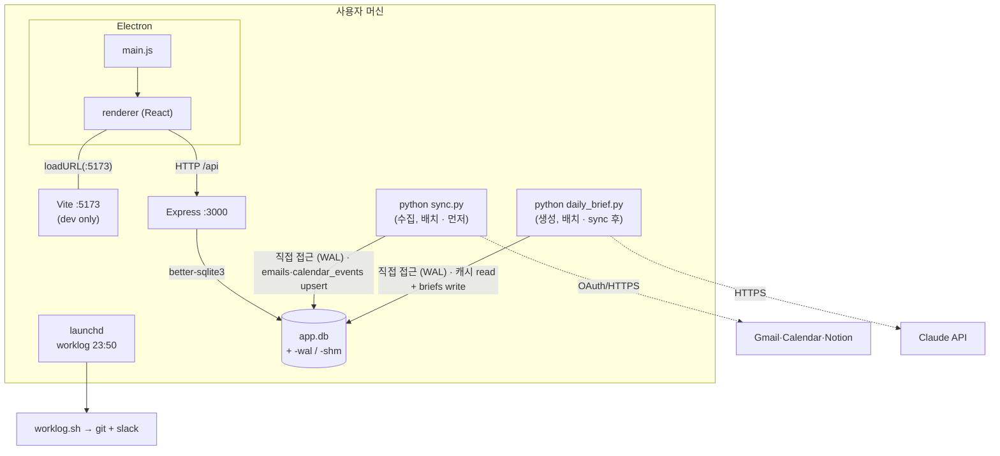
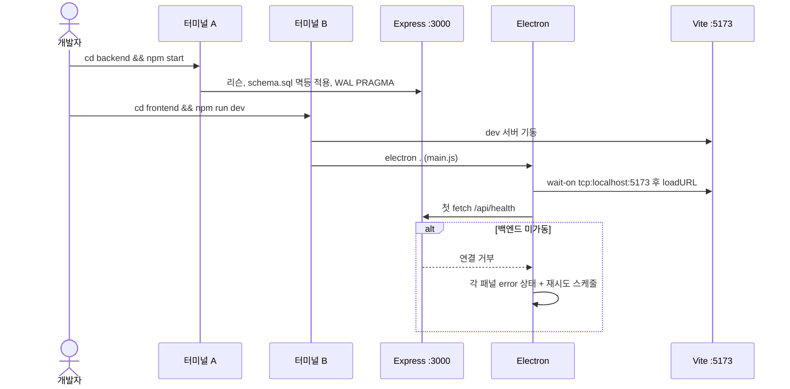
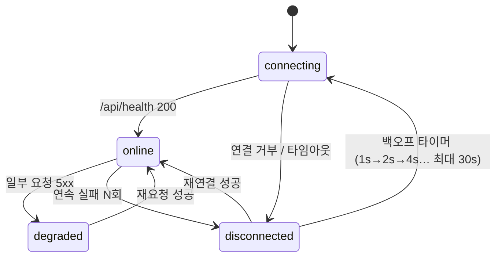

# ⚙️ 런타임 뷰 (Runtime View)

> 정적 구조([ARCHITECTURE.md](ARCHITECTURE.md))가 아니라 **실행 중 무엇이 프로세스로 살아 있고, 누가 누구를 띄우며, 죽으면 어떻게 되는가**.
> arc42 §6 에 해당. 이 뷰가 지금까지 문서에서 가장 크게 비어 있던 부분이다.

---

## 1. 프로세스 목록

| 프로세스 | 언어/런타임 | 수명 | 포트 | 시작 주체 (현재) | 시작 주체 (목표) |
|---|---|---|---|---|---|
| **Electron main** | Node (Electron) | 앱 실행 중 | — | 사용자 (`npm run dev` / 앱 아이콘) | 동일 |
| **Electron renderer** | Chromium | main 이 창 생성 시 | — | main | 동일 |
| **Vite dev 서버** | Node | 개발 중만 | 5173 | `npm run dev` (concurrently) | dev 만, prod 없음 |
| **Express 백엔드** | Node | 상시 | 3000 | **사용자가 별도 터미널** (`cd backend && npm start`) | **미결 — [§5](#5-미결-결정)** |
| **Python 에이전트 — `sync.py`** (수집) | Python | 실행 후 종료 (배치) | — | `scripts/daily-brief-run.sh` (launchd/cron) 또는 수동 | 07:30 브리핑 실행 시 brief 보다 먼저 |
| **Python 에이전트 — `daily_brief.py`** (생성) | Python | 실행 후 종료 (배치) | — | `scripts/daily-brief-run.sh` (launchd/cron 07:30, D3 구현 완료) 또는 수동 | sync 완료 후 |
| **launchd job** (`com.aicomputeros.worklog` · `com.aicomputeros.dailybrief`) | — | OS 상주 | — | OS | worklog 23:50 / dailybrief 07:30 |

핵심: **백엔드와 에이전트는 Electron 의 자식이 아니다.** 셋은 독립 프로세스이고 SQLite 파일과 HTTP 로만 연결된다.

에이전트는 두 배치로 나뉜다: `sync.py` 가 Gmail·Calendar·Notion 을 `emails`·`calendar_events` 캐시로 수집(ACL)하고, 그 다음 `daily_brief.py` 가 캐시만 읽어 Claude 로 브리핑을 만들어 `briefs` 에 쓴다. **실행 순서는 sync → brief** (스케줄 주체는 launchd/cron 07:30 — `scripts/daily-brief-run.sh` 래퍼가 순서·로그·`.env` 로딩 담당, D3 구현 완료. 설치는 `scripts/install-dailybrief-launchd.sh`). 브리핑 성공 시 `save_to_notion` 으로 Notion 페이지도 만든다(미설정 시 스킵).

---

## 2. 시작 순서 (개발 모드, 현재)

> 통합 실행 시 `bash scripts/dev.sh` 가 아래 터미널 A/B 두 역할을 대신한다 ([ADR-0016](adr/ADR-0016-desktop-process-topology.md) 1항).

**문제점:** 순서 의존(백엔드 먼저)이 암묵적이다. 백엔드를 잊으면 앱은 뜨지만 전부 에러 상태.
→ [§5](#5-미결-결정) 에서 통합 실행 스크립트 / main 이 백엔드 spawn 여부를 결정.

---

## 3. 종료 (graceful shutdown)

| 프로세스 | 신호 | 해야 할 일 | 현재 | 목표 (NFR-REL-06) |
|---|---|---|---|---|
| Express | SIGTERM/SIGINT | 진행 중 요청 완료 → SQLite 체크포인트(`PRAGMA wal_checkpoint(TRUNCATE)`) → 커넥션 close → exit 0 | SIGTERM/SIGINT 핸들러 + WAL 체크포인트 (`fix/ai-results-cleanup`, `src/lifecycle.js`); `uncaughtException` 은 같은 절차 + exit 1 | Electron 자식 정리 연동은 E4 |
| Electron main | `window-all-closed` / `before-quit` | 자식 프로세스(있다면) 종료, 렌더러 정리 | 기본 | spawn 도입 시 자식 kill |
| 에이전트 | 배치라 해당 없음 | 트랜잭션 커밋 후 자연 종료 | ✅ | 유지 |

---

## 4. 연결 상태 머신 (프론트엔드)

"백엔드 다운 ≠ 오프라인" 을 구조로 만든다. `api/client.js` + 스토어가 이 상태를 관리한다.

| 상태 | UI | 사용자 액션 |
|---|---|---|
| `connecting` | 패널별 스켈레톤 | 대기 |
| `online` | 정상 | 전체 CRUD |
| `degraded` | 실패한 패널만 `ErrorBanner`, 나머지 정상 | 해당 패널 "다시 시도" |
| `disconnected` | 상단 전역 배너 "백엔드에 연결할 수 없습니다" + 자동 재시도 카운트다운 | 로컬에서 읽기는 불가(백엔드 경유라서) — 재시도만 |

> 오프라인(네트워크 없음)과 disconnected(백엔드 프로세스 없음)는 **사용자에게 다른 문구**로 보여야 한다.
> 진짜 오프라인 우선(백엔드 없이 로컬 읽기)은 렌더러가 SQLite 에 직접 접근하지 않는 한 불가 — 현재 구조에서는 "백엔드 = 로컬 데이터 게이트웨이" 다. 이 한계를 [ARCHITECTURE_EVOLUTION.md](ARCHITECTURE_EVOLUTION.md) §3 에서 다룬다.

---

## 5. 미결 결정

README "앱 실행" 의 미정 항목을 런타임 관점에서 정리. → [ADR-0016](adr/ADR-0016-desktop-process-topology.md) 에서 채택.

| # | 질문 | 선택지 | 결정 시점 |
|---|---|---|---|
| RT-1 | dev 에서 백엔드를 `frontend` 명령이 같이 띄우나? | (a) `concurrently` 로 3개 동시 (b) 계속 분리 | ✅ 결정 (2026-09-09) — (a) concurrently, `scripts/dev.sh` |
| RT-2 | 패키징된 앱에서 백엔드 실행 주체 | (a) main 이 `child_process.fork` (b) Electron 에 Express 를 인프로세스로 임베드 (c) 별도 서비스 | Week 5, 패키징 전 |
| RT-3 | 백엔드 비정상 종료 시 | (a) main 이 자식이면 재기동(최대 N회) (b) 배너 + 수동 재시도만 | RT-2 와 함께 |
| RT-4 | 포트 충돌(3000/5173 사용 중) | (a) 고정 실패 (b) 다음 빈 포트 + preload 로 전달 | Week 5 |
| RT-5 | 에이전트 실행 중 앱이 같은 행을 편집 | WAL + busy_timeout 로 충분한지, 아니면 짧은 락 | D 단계에서 부하 확인 |

**RT-1 확정 (2026-09-09):** (a) `concurrently` — 루트 `bash scripts/dev.sh` 가 backend + Vite + Electron 을 `concurrently -k` 로 동시 기동 ([ADR-0016](adr/ADR-0016-desktop-process-topology.md) 1항). 터미널 2개는 폴백.
**잠정 권고 (RT-2~4, 미결):** RT-2 = (a) main 이 fork + 헬스체크 후 창 표시, RT-3 = (a) 재기동 3회 후 배너. Week 5 에 ADR 로 확정.

---

## 6. 리소스·한계

| 항목 | 값 | 근거 |
|---|---|---|
| SQLite 커넥션 | 백엔드 1 (싱글턴), 에이전트 1 (배치당) | [ADR-0011](adr/ADR-0011-agent-backend-db-access.md) |
| `busy_timeout` | 5000ms | 동시 접근 대기 |
| 재연결 백오프 | 1s → 30s 상한, 지수 | NFR-REL-05 |
| 외부 API 타임아웃 예산 | [CROSSCUTTING.md](CROSSCUTTING.md) §4 | — |
| Daily Brief 총 예산 | 60초 (Claude 포함) | NFR-PERF-04 |

---

**작성:** 2026-09-03
