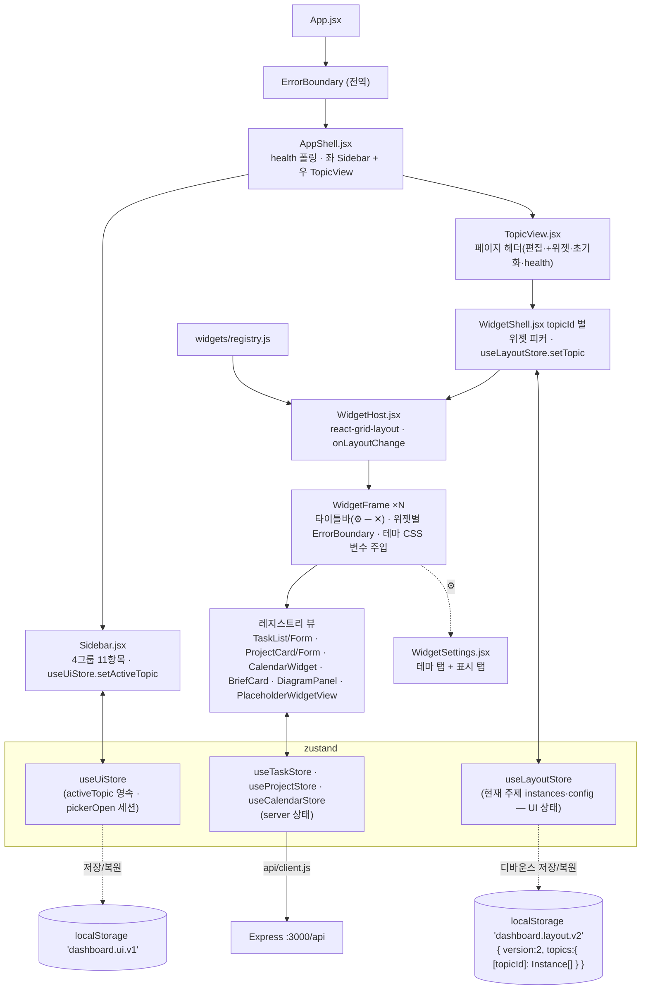
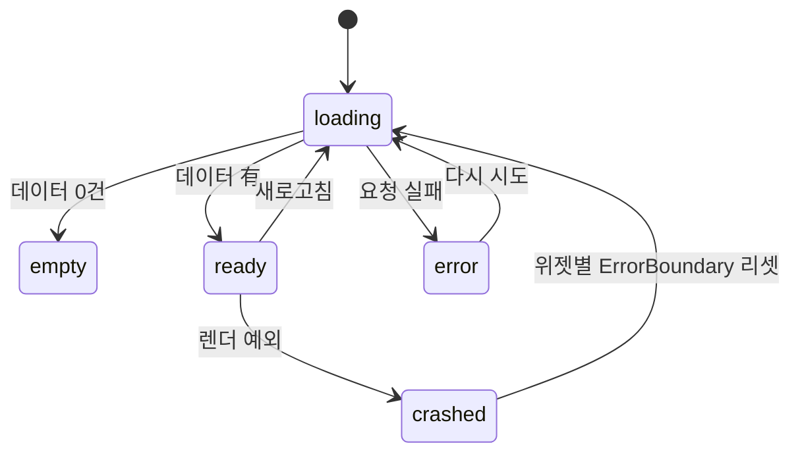

# 🖥️ 화면 명세 (UI Spec)

> Electron 데스크톱 앱의 화면·컴포넌트·상태 계약. 요구사항은 [requirements/UI.md](../requirements/UI.md) · [requirements/WIDGET.md](../requirements/WIDGET.md), 설계는 [DESIGN.md](../architecture/DESIGN.md) §6, API 는 [API_REFERENCE.md](API_REFERENCE.md).
> 이 문서와 코드가 다르면 **코드가 맞고 이 문서를 고친다** — 단 "예정" 표시 요소는 아직 코드가 없다.
>
> 🆕 **대시보드 OS 전환**: C5(2026-09-06)에서 고정 패널(`Dashboard.jsx`, 삭제됨) → **위젯 셸**(`WidgetShell`) 완료. C6(2026-09-06)에서 §3.10 위젯 설정 패널·테마 커스터마이즈 완료 ([DASHBOARD_OS.md](../vision/DASHBOARD_OS.md), [ADR-0020~0022](../architecture/adr/)).

---

## 0. 컴포넌트 트리와 렌더 상태

### 위젯 셸 구조 (C5 구현 완료 · WidgetSettings/BriefCard 는 C6·D3 목표)



> 🆕 **P4.5 사이드바 셸** (2026-09-08, [ADR-0032](../architecture/adr/ADR-0032-sidebar-shell-per-topic-layouts.md)): `App.jsx` 가 `ErrorBoundary > AppShell` 을 렌더. `AppShell` 이 좌측 고정 `Sidebar`(4그룹 11항목) + 우측 `TopicView`(페이지 헤더 + 주제별 `WidgetShell`) 를 배치한다. 주제 전환 = 본문 그리드 교체(라우팅·새로고침 없음). 레이아웃은 **주제별로** `dashboard.layout.v2` 에 저장. 기존 v1 은 최초 로드 시 `overview` 주제로 1회 마이그레이션 후 v1 키 삭제.

**모든 위젯의 4상태** (FR-UI-01·04 → FR-WIDGET-07): 각 위젯은 독립적으로 렌더하며 한 위젯 실패가 셸·다른 위젯을 막지 않는다.



전역 연결 상태(백엔드 다운 등)는 [RUNTIME_VIEW.md](../architecture/RUNTIME_VIEW.md) §4.

---

## 1. 개요

| 항목 | 값 (전환 후) |
|---|---|
| 화면 수 | **1개 (사이드바 셸 데스크톱).** 라우팅 없음 — 사이드바 주제 전환 = 본문 그리드 교체 |
| 화면 구성 | 좌측 고정 `Sidebar`(4그룹 11항목) + `TopicView`(페이지 헤더 + 주제별 `WidgetShell` 위에 위젯 인스턴스 N개, 그리드 배치·이동·리사이즈·최소화) |
| 창 크기 | 기본 800×600, 최소 800×600 (`main.js`) — 셸은 반응형 그리드(lg/md/sm) |
| 렌더 방식 | ✅ React + Vite (FR-UI-02 / B1). `renderer.jsx` → `createRoot(#root).render(<App/>)` |
| 마운트 지점 | `index.html` 의 `<div id="root">` |
| 브리지 | `preload.js` → `window.appInfo` (아래 §5) |
| 위젯 배치 엔진 | `react-grid-layout` ([ADR-0020](../architecture/adr/ADR-0020-widget-shell-architecture.md)) |
| 레이아웃 영속 | localStorage 주제별 `dashboard.layout.v2` ([ADR-0021](../architecture/adr/ADR-0021-widget-layout-persistence.md) · [ADR-0032](../architecture/adr/ADR-0032-sidebar-shell-per-topic-layouts.md)) |

> 🎨 **시각 방향:** 화면 골격·컴포넌트 패턴·톤의 목표 틀은 [UI_STYLE.md](UI_STYLE.md) (노션 위젯 라이트 스타일 참조 — [PERSONAL_OS.md](../vision/PERSONAL_OS.md) §4). 이 문서는 계약, `UI_STYLE.md` 는 방향.

### 디자인 토큰 v2 ([ADR-0027](../architecture/adr/ADR-0027-light-theme-default.md) — `frontend/src/styles.css`)

**라이트가 기본.** 다크 토큰은 `:root[data-theme='dark']` 로 **정의만** 돼 있다 (대칭 재정의). 전역 라이트/다크 전환 UI 는 후속 스텝 — 지금은 라이트 고정.

| CSS 변수 | 라이트(`:root`) | 다크(`[data-theme=dark]`) | 용도 |
|---|---|---|---|
| `--bg` | `#f7f7f5` | `#0f172a` | 앱 배경(오프화이트) |
| `--panel` | `#ffffff` | `#1e293b` | 카드·위젯 본문 |
| `--panel-2` | `#f2f2ef` | `#172033` | 중첩 카드·셸 바·헤더 |
| `--border` | `#ececec` | `#334155` | 테두리·구분선 |
| `--text` | `#1a1a1a` | `#e2e8f0` | 본문 텍스트 |
| `--muted` | `#8a8a8a` | `#94a3b8` | 보조 텍스트·섹션 제목 |
| `--accent` | `#2f6feb` | `#60a5fa` | 강조 숫자·활성·포커스·[실행] (US-1 종결: 파랑) |
| `--accent-soft` | `rgba(47,111,235,.12)` | `rgba(96,165,250,.16)` | 강조 배경(칩 활성·배지) |
| `--ok` / `--warn` / `--bad` | `#2e7d5b` / `#c2691f` / `#c23b3b` | `#4ade80` / `#fbbf24` / `#f87171` | 달성 90%+/40~90%/<40%, 상태 |
| `--priority-high` / `--priority-medium` / `--priority-low` | `#ef4444` / `#f59e0b` / `#64748b` | `#ef4444` / `#f59e0b` / `#94a3b8` | 우선순위 배지 (강조색과 독립) |
| `--radius` / `--card-radius` / `--chip-radius` | `8px` / `16px` / `999px` | (동일) | 모서리 (`--card-radius` 10→16 은 P4) |
| `--shadow-card` | `0 1px 2px rgba(0,0,0,.04)` | `0 1px 2px rgba(0,0,0,.32)` | 카드·위젯 프레임 그림자 (P4 추가, `WidgetFrame` wrapper) |
| `--pad` | `10px` | (동일) | 위젯 본문 패딩 |

> ✅ **P3 완료** (2026-09-07, ADR-0027): `:root` 를 라이트 v2 로 재정의 + `[data-theme=dark]` 블록(정의만). `App.jsx`·`WidgetShell`·`WidgetPicker`·`TaskForm`·`ProjectForm`·`CalendarWidget`·`DiagramPanel`(mermaid `theme:'default'` + `PALETTE`)·`WidgetSettings`(GLOBAL_DEFAULTS)·`WidgetFrame`·`ErrorBoundary`·`index.html` 의 하드코딩 hex → 토큰. 대부분 1:1 치환, 라이트 대비 조정 몇 곳(`--priority-low` `#94a3b8`→`#64748b`, 캘린더 '내일' 배지 → `--muted`, 위젯 피커 항목 중립화). `styles.css` 는 `renderer.jsx` 상단에서 import.
> 위젯 프레임이 인스턴스 `config.theme` 를 화이트리스트 CSS 변수(`--w-bg`/`--w-accent`/`--w-text`/`--w-radius`/`--w-pad`)로 자기 wrapper 에 주입하고,
> 위젯 내부 CSS 는 `var(--w-bg, var(--bg))`·`var(--w-text, var(--text))`·`var(--w-accent, var(--accent))` 폴백 체인을 쓴다 ([ADR-0022](../architecture/adr/ADR-0022-per-widget-theming.md)). titlebar solid/ghost/hidden 은 `WidgetFrame` 이 인라인 style 로 처리(D-3: 편집 모드면 hidden 무시).

---

## 2. 레이아웃 (와이어프레임)

### 2.1 과거 (고정 패널 — B3~C4, C5 에서 제거됨)

```
┌─────────────────────────────────────────────────────────────┐
│  AI Computer OS                                    v0.1.0    │  ← 헤더
├───────────────────────────┬─────────────────────────────────┤
│  할 일                     │  프로젝트                        │
│  ☐ 회의 자료 준비  [high]   │  AI OS 실습        [진행 중]      │
│  [+ 할일 추가]              │  ▓▓▓▓▓░░░░░ 40%                  │
├─────────────────────────────────────────────────────────────┤
│  ⚠️ 백엔드에 연결할 수 없습니다  [재시도]   ← ErrorBanner (조건부) │
└─────────────────────────────────────────────────────────────┘
```

과거(C4 까지): `Dashboard.jsx` 가 할일·프로젝트·일정을 `flex` 로 고정 배치, 그 아래 전체 폭 다이어그램 패널. C5(2026-09-06)에서 삭제되고 위젯 셸로 대체됨.

### 2.2 현재 (위젯 셸 — C5 구현 완료, 테마 커스터마이즈는 C6)

```
┌──────────────────────────────────────────────────────────────────┐
│  AI Computer OS            [편집 ✎]  [+ 위젯]        v0.1.0        │ ← 셸 바
├──────────────────────────────────────────────────────────────────┤
│  ┌── 🗒️ 할 일 ───── ⚙ ─ ✕┐   ┌── 📅 캘린더 ──── ⚙ ─ ✕┐          │
│  │ ☐ 회의 자료 준비  [high] │   │ 09:00 팀 미팅          │          │
│  │ ☑ 슬라이드 검토       🗑 │   │ 14:00 강의             │          │
│  │ [+ 할일 추가]           │   └───────────────────┘◢ (리사이즈)  │
│  └────────────────────┘◢  ┌── 🤖 Daily Brief ─ ⚙ ─ ✕┐          │
│  ┌── 📊 프로젝트 ── ⚙ ─ ✕┐  │ ## 오늘의 우선순위 TOP 3  │          │
│  │ AI OS 실습   [진행 중]  │  │ 1. …                     │          │
│  │ ▓▓▓▓▓░░░░ 40% [슬라이더]│  └──────────────────┘          │
│  └────────────────────┘   (드래그로 이동 · 그리드 스냅)              │
└──────────────────────────────────────────────────────────────────┘
    각 위젯: 색·모서리·밀도·타이틀바를 ⚙ 에서 따로 지정 → 레이아웃 저장
```

- **셸 바:** `AI Computer OS` + `✎ 편집` 토글 + `+ 위젯` 피커 + `초기화`.
- **위젯 프레임:** 타이틀바(아이콘·이름·⚙ 설정(C6, WidgetSettings 열기)·─ 최소화·✕ 제거) + 본문(레지스트리 뷰) + 리사이즈 핸들(편집 모드).
- **격리:** 위젯마다 `ErrorBanner`/`ErrorBoundary` (FR-WIDGET-07). 전역 연결 오류(백엔드 다운)는 **App 헤더**의 헬스 표시(셸에서 중복 안 함).
- **기본 레이아웃 (첫 실행):** 할일·오늘 브리핑·프로젝트·캘린더 4개. 다이어그램은 피커로만 추가.
- 레지스트리 등록 위젯(D3): tasks/projects/calendar/diagrams/brief. 메타는 `widgets/widgetMeta.js`(순수), view 배선은 `widgets/registry.js`.
- 기존 사용자는 레이아웃 마이그레이션이 없으므로(SCHEMA_VERSION 불변) brief 위젯이 자동으로 나타나지 않는다 — 피커로 추가하거나 "초기화" 한다.

### 2.3 현재 (사이드바 셸 — P4.5, 2026-09-08, ADR-0032)

```
┌───────────────┬──────────────────────────────────────────────────┐
│ ▣ AI Computer  │  ▤ 할 일        데모 · ● 연결됨  [✎ 편집][+ 위젯][초기화] │ ← 페이지 헤더
│   OS           │     우선순위와 마감                                 │
│ [ 검색   ⌘K ]  ├──────────────────────────────────────────────────┤
│               │  ┌── 🗒️ 할 일 ──── ⚙ ─ ✕┐                          │
│ COMMAND       │  │ ☐ 회의 자료 준비  [high] │                        │
│  ▤ 개요        │  │ [+ 할일 추가]           │                        │
│  ▤ 할 일  ◀활성 │  └────────────────────┘◢                        │
│  ▤ 브리핑       │                                                  │
│  ▤ 프로젝트     │       (주제 항목 클릭 → 본문 그리드가 그 주제로 교체)     │
│  ▤ 일정        │                                                  │
│ PLAN          │                                                  │
│  ▤ OKR         │                                                  │
│  ▤ 주간 플래너  │                                                  │
│ AGENT         │                                                  │
│  ▤ 활동 / 진행 현황 / 다이어그램                                       │
│ SYSTEM        │                                                  │
│  ▤ 설정        │                                                  │
│ ───────────   │                                                  │
│ (로) 로컬 사용자 │                                                  │
└───────────────┴──────────────────────────────────────────────────┘
```

- **사이드바(§3.11):** 브랜드 블록 + 검색(자리표시) + 4그룹 11항목 네비 + 하단 사용자 블록. 항목 클릭 → `useUiStore.setActiveTopic` → 본문만 교체.
- **페이지 헤더(§3.12):** 주제 아이콘·제목·부제(좌) / 데모·버전 · health(`● {message}`) · `✎ 편집` · `+ 위젯` · `초기화`(우). 셸 바는 폐지되고 여기로 통합.
- **주제별 레이아웃:** 각 주제가 자기 위젯 세트를 가진다. 주제 A 편집이 B 에 영향 없음. 전용 위젯이 없는 주제(OKR·주간·활동·진행·설정)는 "준비 중" 플레이스홀더 1개.

---

## 3. 영역별 명세

### 3.1 헤더

| 항목 | 내용 |
|---|---|
| 목적 | 앱 정체성·버전 표시 |
| 요소 | 제목 `"AI Computer OS"`, 버전 `window.appInfo.version` |
| 데이터 출처 | `preload.js` (`appInfo`) |
| 상태 | 단일 (로딩/에러 없음) |
| 관련 FR | FR-UI-01 |

### 3.2 할일 패널

| 항목 | 내용 |
|---|---|
| 목적 | 할일 목록 조회·완료 토글·삭제·추가 |
| 요소 | 상단 `[리스트][보드]` 세그먼티드 컨트롤(`role="group"`, `aria-pressed`) + `TaskList` **또는** `TaskBoard`, 하단 공통 `TaskForm`("+ 할일 추가"). 위젯 타이틀바가 제목을 대신하므로 `<h2>` 없음. 뷰: `frontend/src/widgets/views/TasksWidgetView.jsx` (스토어 구독·effect 를 뷰가 소유) — ✅ C5 / 뷰 전환 ✅ P5 |
| 데이터 출처 | `GET /api/tasks` → `useTaskStore.tasks`(파생 미러, 정본은 `byId`/`order`) (`frontend/src/store/useTaskStore.js`, `api/client.js` 경유) |
| 보드 뷰 (§FR-TASK-09) | `config.display.view='board'` 이면 우선순위 3열(높음/보통/낮음) 칸반. 열 데이터는 `groupByPriority(visible)` (`frontend/src/widgets/taskBoard.js`), 각 열은 `TaskBoard` → `TaskCard`. `priority` 누락/미지값은 보통 열. 리스트와 **같은 `visible`**(hideCompleted/sortBy/maxItems 적용 결과)을 공유. `view` 저장은 `config.display.view`, 읽기는 `resolveDisplay(configSchema, config.display).view` (enum `['list','board']`, default `'list'`, 손상값은 `'list'` 폴백). `overview`·`tasks` 주제의 위젯이 각각 독립 view (ADR-0032). |
| 태그 (§FR-TASK-08) | 카드는 2행 레이아웃(1행: 체크박스+제목+기한+우선순위 배지+삭제 / 2행: `TaskTags`). `TaskTags` props: `{tags, activeTag, onSelect, onAdd, onRemove}` — 각 태그는 `Chip`(활성이면 `variant="active"`) + 옆에 작은 `×`(삭제), 끝에 `＋` 버튼 → 인라인 `<input>`(Enter 확정, Esc/blur 닫기, `window.prompt` 금지). 태그 0개면 `＋` 만. 보기 전환 버튼 아래 **태그 필터 바**: `collectTags(tasks)`(필터 전 전체) 칩, 활성 칩 재클릭 해제, 태그 0건이면 바 숨김. 필터 상태는 `TasksWidgetView` 로컬 `useState`(비영속 — `config.display` 는 enum/bool/number 만). 필터 결과 0건 → "이 태그의 할 일이 없습니다" + [필터 해제]. `visible` 파이프라인: `hideCompleted` → `filterByTag` → 정렬 → `slice(0, maxItems)`. 순수 로직: `frontend/src/store/taskTags.js`. |
| 관련 FR | FR-TASK-01/02/03/04/08/09, FR-UI-01 |
| 상태 | ✅ 코드 배선 완료. 정상(200) 경로 브라우저 검증은 CORS/C1 이후 로컬 대기 |

**렌더 상태 4종:**

| 상태 | 조건 | 표시 |
|---|---|---|
| 로딩 | 첫 fetch 진행 중 (`loading && tasks.length === 0`) | "불러오는 중…" ✅ |
| 비어있음 | `!loading && tasks.length === 0` | "할 일이 없습니다" (`TaskList`) ✅ |
| 정상 | `tasks.length > 0` | 각 항목: 체크박스 + 제목 + priority 배지 + 삭제 버튼 ✅ |
| 에러 | `error` 있음 | `ErrorBanner` (한국어 메시지) + [재시도]=`fetchTasks`. 에러가 있어도 기존 `tasks` 는 계속 렌더 ✅ |

**인터랙션:**

| 동작 | 결과 |
|---|---|
| 체크박스 클릭 | `onToggle(id)` → `PUT /api/tasks/:id {status: done↔todo}` → 성공 시 해당 항목만 갱신 (낙관적 업데이트 허용, 실패 시 롤백) |
| 삭제 버튼 클릭 | `onDelete(id)` → `DELETE /api/tasks/:id` → 목록에서 제거. 실패 시 복원 + `ErrorBanner` |
| 추가 폼 제출 (`TaskForm`) | `POST /api/tasks` → 201 시 목록에 append, 폼 초기화. `title` 빈값이면 제출 차단 + 인라인 안내. payload snake_case (`due_date`) |

> (과거 주의는 해소됨 — B3 에서 store+API 배선 완료, C5 에서 뷰가 `TasksWidgetView` 로 이관.)

### 3.3 프로젝트 패널

| 항목 | 내용 |
|---|---|
| 목적 | 프로젝트 진행도·상태 표시 |
| 요소 | `ProjectCard` 목록, `ProjectForm`(하단). 뷰: `widgets/views/ProjectsWidgetView.jsx` (C5, `<h2>` 없음) |
| 데이터 출처 | `GET /api/projects` → `useProjectStore.projects` (C2, 2026-09-03). 구독·effect 는 위젯 뷰가 소유 |
| 관련 FR | FR-PROJ-01/02, FR-UI-01 |

**렌더 상태:** 로딩("불러오는 중…") / 비어있음("프로젝트가 없습니다" — ✅ 구현됨) / 정상 / 에러(`ErrorBanner` + 재시도, 할일 패널 렌더는 막지 않음).

**`ProjectCard` 표시 요소:** 이름, 상태 `select`(진행 중/완료/보류 — `onStatusChange` 콜백 주입 시), 삭제 버튼(`onDelete` 주입 시), 진행도 바(`width: progress%`, accent 색), `{progress}%` 텍스트, 진행도 슬라이더(`type=range`, step 5 — `onProgressChange` 주입 시, 확정 시점 onMouseUp/onBlur 에만 커밋). 콜백 미주입 시 읽기 전용(상태 배지만).

**`ProjectForm` (신설, C2):** 이름 입력(필수 — 빈값이면 "이름을 입력하세요" 힌트), 진행도 입력(선택, `type=number` 0–100), "+ 프로젝트 추가" 버튼. 제출 payload snake_case `{ name, progress? }`. 비낙관적 — `addProject` 가 `true` 반환 시에만 폼 초기화.

**상태값:** `active`/`done`/`on_hold` (schema·GLOSSARY 일치). `'hold'` 불일치는 C2 에서 `on_hold` 로 통일해 해소됨.

### 3.4 오늘 일정 위젯 ✅ C3 (2026-09-06, 더미 데이터)

| 항목 | 내용 |
|---|---|
| 목적 | 오늘·다가오는 일정 표시, 오늘/내일 강조 |
| 요소 | `CalendarWidget` — 시각(HH:MM) + 제목 + location + 날짜 배지(오늘/내일/`M/D`/시간 미정), 오늘·내일 좌측 accent 보더. props-only(`{ events }`) |
| 데이터 출처 | `GET /api/calendar/events?from=..&to=..` → `useCalendarStore.events` (C3: `backend/src/services/calendar.js` 더미, D2 이후: `calendar_events` 캐시) |
| 관련 FR | FR-CAL-01/02 |
| 상태 | 4상태 모두 `widgets/views/CalendarWidgetView.jsx` 가 소유(C5): 로딩 / "일정이 없습니다"(빈) / 정상(`CalendarWidget`) / 에러(위젯 내부만 `ErrorBanner`+재시도, 빈 문구·목록 미표시, 다른 위젯 렌더 유지). `CalendarWidget` 은 목록 렌더만 담당(빈 상태 분기 없음). |

### 3.5 오늘 브리핑 위젯 ✅ D3 (Week 7)

| 항목 | 내용 |
|---|---|
| 목적 | 에이전트가 생성한 "오늘의 우선순위" 표시 |
| 뷰 | `widgets/views/BriefWidgetView` — 스토어 구독·effect·4상태 소유 |
| 프레젠테이션 | `components/BriefCard` (순수, props `{ brief, showMeta }`) — 본문은 **plain text pre-wrap**(마크다운 파서·`dangerouslySetInnerHTML` 없음 — NFR-SEC-04) |
| 메타 | `showMeta` 이면 생성 시각(로컬 HH:MM) + `notion_url` 있으면 **"🔗 Notion 링크 복사"** 버튼(`navigator.clipboard`, `<a>` 아님 — Electron 외부 내비 차단) |
| config | `showMeta`(bool, 기본 true) 하나만 |
| 데이터 출처 | `GET /api/brief/today` → `store/useBriefStore` (`brief`, `loading`, `loaded`, `error`) |
| 관련 FR | FR-AGENT-04, [ADR-0025](../architecture/adr/ADR-0025-brief-empty-response.md) |
| 상태 | 에러 → `ErrorBanner(onRetry)` / 로딩(`loading && !loaded`) → "불러오는 중…" / 빈(`loaded && !brief`, 서버 200+`{brief:null}`) → "오늘 브리핑이 아직 없습니다" / 정상 → `BriefCard` |

### 3.6 ErrorBanner / ErrorBoundary ✅ B3 (FR-UI-04, 2026-09-03)

| 항목 | 내용 |
|---|---|
| 목적 | API/네트워크 오류를 사용자 친화적으로 표시 |
| 요소 | 아이콘 + 한국어 메시지 + [재시도] 버튼. `message` 없으면 렌더 안 함, `onRetry` 있을 때만 버튼 |
| 규칙 | 스택 트레이스·상태코드 원문 노출 금지 (`api/client.js` 가 정규화). 재시도는 해당 API 만 재호출. 성공 시 `error=null` → 배너 제거 |
| 배치 | 영역별 개별 표시 (한 영역 실패가 다른 영역을 가리지 않음 — FR-UI-01 AC-2). 에러가 있어도 이미 받은 데이터는 계속 렌더 |
| 최상위 | `ErrorBoundary` (class, `getDerivedStateFromError`+`componentDidCatch`→`console.error`) 가 렌더 예외를 잡아 앱 전체 크래시 방지 (FR-UI-04 AC-5). `App.jsx` 가 `<WidgetShell>` 을 감쌈 |
| props (C5) | `fallback` 지정 시 그 노드로 대체(위젯 단위 격리 — `WidgetFrame` 이 위젯별 `ErrorBanner` 전달), 미지정 시 기존 전면 폴백(하위호환). `onReset` 은 선택 |
| 코드 | `frontend/src/components/{ErrorBanner,ErrorBoundary}.jsx` |
| 미검증 | 실제 실패 트리거(백엔드 중단 등) 화면 확인은 로컬 대기 (CORS/C1 이후) |

### 3.7 다이어그램 패널 ✅ C4 (FR-UI-05, 2026-09-06)

| 항목 | 내용 |
|---|---|
| 목적 | `docs/**/*.md` 의 Mermaid 다이어그램을 앱에서 열람 — 프로젝트 구조·진행을 그림으로 |
| 위치 | C5: `diagrams` 위젯 (`widgets/views/DiagramsWidgetView.jsx` 가 `DiagramPanel` 을 그대로 래핑). 폭이 커서 기본 레이아웃 제외 — 피커로만 추가 |
| 요소 | `DiagramPanel` — 문서 선택 바(문서 basename 버튼, 활성 `var(--accent)`) + 선택 문서의 블록별 제목 + SVG. mermaid `PALETTE` 상수는 라이트 값(P3). |
| 데이터 출처 | `apiGet('/diagrams')` → 로컬 컴포넌트 state (스토어 없음 — 읽기 전용·정적) |
| 렌더 | `import('mermaid')` 동적 로딩(별도 청크, 최초 1회 `initialize`), `mermaid.initialize({ startOnLoad:false, theme:'dark', securityLevel:'strict' })` 후 선택 문서 블록만 순차 `render()` |
| 관련 FR | FR-UI-05 · [ADR-0014](../architecture/adr/ADR-0014-dashboard-diagram-viewer.md) |
| 상태 | 로딩 / "다이어그램이 없습니다"(빈 배열) / 정상 / 에러(API·렌더러 로드 실패 → `ErrorBanner`, 재시도=목록 재조회) |
| 폴백 | 개별 블록 렌더 실패 시 그 항목만 "⚠️ 이 다이어그램을 그릴 수 없습니다" + 원문 코드 (`<pre>`); 미완료는 "그리는 중…" |
| 범위 밖 | 줌·패닝·복사 (후속) |

### 3.8 위젯 셸 (`WidgetShell`) ✅ C5 (2026-09-06) · P4.5 개편 (2026-09-08)

> 🆕 **P4.5:** 셸 바(브랜드·편집·+위젯·초기화)는 §3.12 페이지 헤더로 이동. `WidgetShell` 은 `topicId` prop 을 받아 그 주제의 그리드만 렌더한다. 피커 열림은 `useUiStore.pickerOpen`. 영속 키 `dashboard.layout.v2`(주제별). 아래 표의 "셸 바"·"v1" 서술은 P4.5 이전 기준.


| 항목 | 내용 |
|---|---|
| 목적 | 위젯 인스턴스를 배치·이동·리사이즈·추가·제거하는 데스크톱 셸 |
| 요소 | 셸 바(`AI Computer OS` · `✎ 편집` 토글 · `+ 위젯` 피커 · `초기화`) + `WidgetHost`(react-grid-layout). 전역 연결 오류 표시는 **App 헤더의 헬스 표시**가 담당(셸에서 중복 구현 안 함) |
| 데이터 출처 | `useLayoutStore`(instances·editMode·focusedId) + `widgets/registry.js`(타입 메타) |
| 상태 | 편집모드 on/off. off 면 드래그/리사이즈 잠금(본문 상호작용만). 편집 중 셸 바에 안내 한 줄 |
| 인터랙션 | `+ 위젯` → 피커(레지스트리 목록, 이미 추가된 타입 비활성) → 선택 시 기본 크기로 최하단에 추가 · `✎ 편집` → 핸들 표시 · 드래그 이동(그리드 스냅, 충돌 시 밀림) · 위젯 클릭 → z 최상단 + 포커스 |
| 영속화 | 레이아웃/config 변경 → 300ms 디바운스 → `localStorage['dashboard.layout.v1']` (`{version:1, instances:[]}`). 단일 브레이크포인트 `lg` 만 저장 |
| 복원 실패 | 파싱 실패·`version` 불일치·손상 → `sanitizeInstances` 실패 → 기본 레이아웃(할일·프로젝트·캘린더) + `console.warn`, 크래시 없음 |
| 초기화 | `초기화` 버튼 → `resetLayout()` → 기본값 |

### 3.9 위젯 프레임 (`WidgetFrame`) ✅ C5 (2026-09-06)

| 항목 | 내용 |
|---|---|
| 목적 | 개별 위젯의 크롬(타이틀바)·격리·테마 주입 지점 |
| 요소 | 타이틀바(`.widget-titlebar` — RGL draggableHandle): 아이콘 + 위젯 이름 + `⚙`(설정 모달, title="위젯 설정") + `─`(최소화) + `✕`(제거). 버튼은 `.widget-titlebar-btn`(draggableCancel). 본문: 레지스트리 뷰 |
| 테마 주입 | wrapper `<div className="widget" style={{ background:'var(--w-bg, var(--bg))', borderRadius:'var(--w-radius, var(--card-radius))', color:'var(--w-text, var(--text))', outline:'1px solid var(--w-accent, var(--accent))', zIndex, ...themeToVars(config?.theme) }}>` — ✅ C6 (`themeToVars` 화이트리스트 매핑) ([ADR-0022](../architecture/adr/ADR-0022-per-widget-theming.md)). 본문 padding 은 `var(--w-pad, var(--pad))`. `configSchema` 는 `WidgetFrame` 이 뷰에 prop 으로 전달(뷰→registry 순환 import 회피) |
| ⚙ 설정 | ✅ C6 — `onClick` 이 `WidgetSettings` 모달을 연다(stopPropagation 으로 드래그·bringToFront 차단). 타이틀바 표시(solid/ghost/hidden)는 `WidgetFrame` 인라인 style 로 처리 (D-3: `titlebar:'hidden'` 은 비편집일 때만 숨김, 편집 모드에선 hidden 무시하고 항상 렌더) |
| 격리 | 위젯별 `ErrorBoundary fallback={<ErrorBanner .../>}`(뷰 렌더 예외 → 위젯 내부 폴백, 셸 무영향) + 뷰의 4상태 |
| 미등록 타입 | `getWidgetMeta(type)===null` → 본문 대신 "알 수 없는 위젯입니다 (type)" + `✕` (FR-WIDGET-08 AC-2) |
| 최소화 | `minimized` — 타이틀바만 렌더, 높이 1행. 복원 시 `prevH` 로 이전 높이 |
| `-webkit-app-region` | 타이틀바에 넣지 않음 (Electron 창 드래그 충돌 방지) |

### 3.10 위젯 설정 패널 (`WidgetSettings`) ✅ C6 (2026-09-06, FR-WIDGET-05·06)

| 항목 | 내용 |
|---|---|
| 진입 | 위젯 타이틀바 `⚙` → `createPortal(document.body)` 중앙 모달 + 백드롭(`zIndex:2000`). Esc·백드롭 클릭으로 닫기. `role="dialog" aria-modal="true"` |
| 테마 탭 | 배경색·강조색·글자색(`<input type="color">`) · 모서리(range 0–24) · 밀도(comfortable/compact) · 타이틀바(solid/ghost/hidden) · 프리셋 3개(다크/미니멀/강조, 색 점 미리보기) · "테마 초기화"(`onChange({theme:{}})`) |
| 표시 탭 | `configSchema` 순회 — enum→select / bool→checkbox / number→range. 비었으면 "표시 옵션 없음". 할일: 정렬(마감/우선순위/생성)·완료 숨김·최대 개수 / 프로젝트: 상태 필터·완료 숨김 / 캘린더: 범위(오늘/이번주). 메일·브리핑 위젯은 미구현이라 스키마 없음 |
| 저장 | 변경 즉시 해당 위젯에만 반영 → `onChange(patch)` → `useLayoutStore.updateConfig(id, patch)` → 디바운스 영속화. 테마 부분 수정은 `WidgetSettings` 가 `instance.config.theme` 와 병합한 완성 객체를 patch 로 보낸다(`updateConfig` 는 1단 얕은 병합) |
| 검증 | 자유 텍스트/CSS 입력 없음(AC-6). 색은 `themeToVars` 의 `isSafeColor` 게이트, 나머지는 enum/범위 (`resolveDisplay`) (NFR-SEC-04). 스타일은 인라인 + 전역 var 만(`--w-*` 안 씀) |

### 3.11 사이드바 (`Sidebar`) ✅ P4.5 (2026-09-08, ADR-0032, FR-UI-01)

| 항목 | 내용 |
|---|---|
| 목적 | 주제(화면) 탐색 — 왼쪽 고정, `position:sticky; top:0; height:100vh`. 폭 `--sidebar-w`(240px) |
| 요소 | ① 브랜드 블록(라운드 로고 박스 + "AI Computer OS" + "개인 생산성 OS") ② 검색 인풋(`readOnly`, placeholder "검색", 우측 `⌘K` 힌트 칩, `title="후속 지원 예정"` — 동작 없음) ③ 그룹 네비(COMMAND/PLAN/AGENT/SYSTEM 대문자 11px `letter-spacing:.06em` `--muted`) ④ 하단 사용자 블록(원형 이니셜 아바타 + "로컬 사용자" + 데모/버전 캡션) |
| 항목 | `<button>` (a 태그·라우팅 금지). `<TopicIcon name={t.icon}/>` + 라벨. 클릭 → `useUiStore.setActiveTopic(id)`. 활성: `aria-current="page"` + `--nav-active-bg` 알약 + 좌측 3px `--accent` 바(inset box-shadow). 강한 색 채움 금지 |
| 데이터 출처 | `widgets/topics.js`(`TOPIC_GROUPS`·`TOPICS`·`getTopicsByGroup`) + `useUiStore.activeTopic` |
| 스크롤 | 네비 영역만 `overflow-y:auto`. 브랜드·검색·사용자 블록은 고정 |
| 주제 목록 | overview(개요)·tasks(할 일)·brief(브리핑)·projects(프로젝트)·calendar(일정) [COMMAND] / okr(OKR)·weekly(주간 플래너) [PLAN] / activity(활동)·progress(진행 현황)·diagrams(다이어그램) [AGENT] / settings(설정) [SYSTEM] |

### 3.12 페이지 헤더 (`TopicView` 헤더) ✅ P4.5 (2026-09-08, ADR-0032)

| 항목 | 내용 |
|---|---|
| 목적 | 현재 주제 식별 + 레이아웃 편집 액션 + 백엔드 연결 상태 (기존 셸 바 대체) |
| 좌측 | `<TopicIcon>` + `<h1>`(18px) 주제 label + 그 아래 subtitle(`--muted` 12px) |
| 우측 | 데모 배지 또는 버전 캡션 · `● {health.message}`(색 = ok→`--ok` / error→`--bad` / loading→`--muted`) · `✎ 편집` 토글(`useLayoutStore.toggleEditMode`) · `+ 위젯`(`useUiStore.togglePicker`) · `초기화`(`window.confirm` 후 `useLayoutStore.resetLayout` — 현재 주제 기본값) |
| health | `AppShell` 이 `/health` 를 1회 폴링해 `TopicView` 에 내려줌 (기존 `App.jsx` 로직 이동 — FR-UI-02 AC-5 회귀 방지) |
| 본문 | `<WidgetShell topicId={topic.id}/>`, 헤더-그리드 사이 `--section-gap`(16px) |

---

## 4. 컴포넌트 계약

| 컴포넌트 | props | 내부 state | 방출 이벤트 | 상태 |
|---|---|---|---|:---:|
| `App` | — | — | — | ✅ `<ErrorBoundary><AppShell/></ErrorBoundary>` (P4.5 — health 로직은 `AppShell` 로 이동) |
| `AppShell` | — | `health` (loading/ok/error) · `useUiStore.activeTopic` 구독 | — | ✅ P4.5 (좌 `Sidebar` + 우 `TopicView`, `/health` 폴링 소유, `getTopic(activeTopic) ?? getTopic(DEFAULT_TOPIC_ID)`) |
| `Sidebar` | `demo`, `version` | `useUiStore`(activeTopic, setActiveTopic) 구독 | (스토어 액션 직접 호출) | ✅ P4.5 (4그룹 11항목 `<button>` 네비) |
| `TopicView` | `topic`, `demo`, `info`, `health`, `statusColor` | `useLayoutStore`(editMode)·`useUiStore` 구독 | (스토어 액션 직접 호출) | ✅ P4.5 (페이지 헤더 + `<WidgetShell topicId>`) |
| `TopicIcon` | `name`, `size?` (기본 16) | — | — | ✅ P4.5 (`components/TopicIcons.jsx` 인라인 SVG, 미등록 키 폴백) |
| `Dashboard` (삭제됨) | — | — | — | ❌ C5 에서 삭제 — 섹션 로직은 `widgets/views/*WidgetView.jsx` 로 이관 |
| `WidgetShell` | `topicId` | `useLayoutStore`(instances, editMode, topicId) 구독 · `useUiStore.pickerOpen` · `hydrated` 로컬 state | (스토어 액션 직접 호출) | ✅ C5 · P4.5 (`topicId` 변화 시 `setTopic` + 하이드레이션, 셸 바 제거) |
| `WidgetHost` | `instances`, `editMode`, `onLayoutChange(layout)` | — | `onLayoutChange` | ✅ C5 (`react-grid-layout/legacy` `WidthProvider(Responsive)` 모듈 스코프) |
| `WidgetFrame` | `instance` | — (스토어 액션 구독: bringToFront/toggleMinimize/removeWidget/focusedId) | — | ✅ C5~C6 (C6: `updateConfig`/`editMode` 구독, `WidgetSettings` 오픈, titlebar 인라인 · per-widget `ErrorBoundary fallback` + `themeToVars` 호출 지점) |
| `WidgetPicker` | `activeTypes`, `onAdd(type)`, `onClose()` | — | `onAdd`, `onClose` | ✅ C5 (이미 추가된 타입 비활성) |
| `*WidgetView` (tasks/projects/calendar/diagrams/brief) | `instanceId`, `config`, `configSchema` | 도메인 스토어 필드별 구독 + `useEffect(fetch)` | — | ✅ C5 · C6 · D3(brief) (`config.display` 클라이언트 필터, `configSchema` prop) |
| `TasksWidgetView` | `instanceId`, `config`, `configSchema` | `useTaskStore` 필드별 구독 + `useLayoutStore.updateConfig` + `useEffect(fetchTasks)` | — | ✅ P5 (`config.display.view` 리스트/보드 전환 — `updateConfig(instanceId, { display: {...d, view} })`, 두 뷰가 같은 `visible` 공유) |
| `TaskBoard` | `columns: {high:Task[],medium:Task[],low:Task[]}`, `onToggle(id)`, `onDelete(id)`, `activeTag?`, `onTagSelect?`, `onTagAdd?`, `onTagRemove?` | — | 콜백 pass-through | ✅ P5 · 태그 pass-through P6 (props-only, 3열 flex, `BOARD_COLUMNS` 순서, 빈 열 안내) |
| `TaskCard` | `task: Task`, `onToggle(id)`, `onDelete(id)`, `activeTag?`, `onTagSelect(tag)?`, `onTagAdd(id,tag)?`, `onTagRemove(id,tag)?` | — | `onToggle`, `onDelete`, 태그 콜백 | ✅ P5 · P6 (2행 flex column: 1행 체크박스+제목(완료 취소선)+기한+우선순위 배지+삭제 / 2행 `TaskTags`. 태그 콜백 미전달 시 2행 비표시. `priorityColor` export) |
| `TaskTags` | `tags: string[]`, `activeTag`, `onSelect(tag)`, `onAdd(tag)`, `onRemove(tag)` | `adding`, `draft` (인라인 입력) | `onSelect`, `onAdd`, `onRemove` | ✅ P6 (props-only, `Chip` 재사용, `×`/`＋` 인라인 input, `window.prompt` 금지) |
| `PlaceholderWidgetView` | — | `useUiStore.activeTopic` 구독 | — | ✅ P4.5 ("준비 중" 안내 — 전용 위젯 없는 주제 기본 인스턴스, fetch 없음·항상 ready) |
| `WidgetSettings` | `instance`, `configSchema`, `onChange(patch)`, `onClose()` | `tab` (theme/display) | `onChange`, `onClose` | ✅ C6 (portal 중앙 모달, 테마 탭 + 표시 탭, 화이트리스트 입력만) |
| `TaskList` | `tasks: Task[]`, `onToggle(id)`, `onDelete(id)`, `activeTag?`, `onTagSelect?`, `onTagAdd?`, `onTagRemove?` | — | `onToggle`, `onDelete`, 태그 콜백 | ✅ · P6: `<li>` 안에 `TaskCard` 로 렌더 통일(`<ul>/<li>` 시맨틱 유지) |
| `TaskForm` | `onSubmit(payload)`, `disabled` | `title, priority, dueDate` | `onSubmit` | ✅ B3 |
| `ErrorBanner` | `message: string`, `onRetry()` | — | `onRetry` | ✅ B3 |
| `ErrorBoundary` | `children`, `fallback?`, `onReset?` | `hasError` | — | ✅ B3 + C5 (`fallback` prop — 없으면 기존 전면 폴백) |
| `ProjectCard` | `project: Project`, `onDelete(id)?`, `onProgressChange(id, next)?`, `onStatusChange(id, value)?` | `draft` (슬라이더 로컬값) | `onDelete`, `onProgressChange`, `onStatusChange` | ✅ C2 · P4 (진행바 → `DotProgress`, 슬라이더·commit·clamp 유지, `on_hold` 통일) |
| `ProjectForm` | `onSubmit(payload): Promise<boolean>`, `disabled` | `name, progress, hint` | `onSubmit` | ✅ C2 (payload `{name, progress?}`) |
| `CalendarWidget` | `events: Event[]` | — | — | ✅ C3 |
| `BriefCard` | `brief: Brief \| null`, `showMeta: bool` | `copied` (복사 피드백) | — | ✅ D3 (순수 프레젠테이션, plain text pre-wrap, Notion 링크 복사 버튼) |
| `BriefWidgetView` | `config`, `configSchema` | `useBriefStore` 구독 + `useEffect(fetchBrief)` | — | ✅ D3 (4상태 소유) |
| `DiagramPanel` | — (props 없음) | `diagrams`, `activeDoc`, `loading`, `error`, `rendered` | — | ✅ C4 (자체 fetch·4상태 소유, 스토어 없음) |

### 4.1 공통 프레젠테이션 컴포넌트 ✅ P4 (2026-09-07, `frontend/src/components/`, design-p2/Components.dc.html 기준)

순수·무상태. 데이터는 상위에서 주입. OKR·에이전트·프로젝트 위젯 공용.

| 컴포넌트 | props | 토큰·규격 | 비고 |
|---|---|---|---|
| `StatTile` | `label`, `value`, `tone?` (`default`\|`accent`\|`ok`\|`warn`\|`bad`) | bg `--panel` · border `1px --border` · radius `14px` · padding `18px` · 숫자 `font-weight:700`/`40px`/`line-height:1` · 라벨 `12px --muted` · 숫자색 tone→`--text`/`--accent`/`--ok`/`--warn`/`--bad` | 큰 숫자 1개 + 라벨 (달성률 색코딩) |
| `DotProgress` | `label`, `pct`, `total?` (기본 20), `showPercent?` (기본 true) | 점 `8×8` radius `2px` gap `4px` flex-wrap · 채움 `var(--w-accent, var(--accent))` / 빈칸 `--border` · `role="progressbar"` + `aria-valuenow/min/max` (+ `aria-label` = label) · `%` 텍스트 `13px`, `--muted`, `font-weight:700` | 순수 로직은 `dotFill.js` (`dotFill`/`normalizeTotal`/`clampPct`). `total`·채움에 같은 정규화 적용 |
| `Chip` | `variant?` (`active`\|`neutral`\|`ok`\|`warn`\|`bad`), `onClick?`, `title?`, `children` | radius `var(--chip-radius)` · padding `3px 11px` · `12px`/`font-weight:600` · `active`→`--accent-soft`/`--accent`, 그 외 `--panel-2` + 상태색 | `onClick` 있으면 `<button>`, 없으면 `<span>` |

> `dotFill.js` 규칙: `normalizeTotal` — 0 이하·비정수·NaN → 20. `clampPct` — 숫자 변환 실패 시 0, 0~100 clamp, 정수 반올림. `dotFill(pct, total=20)` = `round(clampPct(pct)/100 * normalizeTotal(total))`. 테스트 `frontend/test/dotFill.test.mjs` TC-P4-01~05.

**타입 형태**는 [DATA_DICTIONARY.md](DATA_DICTIONARY.md) 및 [API_REFERENCE.md](API_REFERENCE.md) 의 리소스 객체와 동일 (필드명 snake_case 유지).

---

## 5. `window.appInfo` (preload 브리지)

현재 노출 (`preload.js`):
```js
{ name: 'AI Computer OS', version: '0.1.0',
  electron: process.versions.electron, node: process.versions.node,
  apiBaseUrl: 'http://localhost:3000/api' }  // ✅ B1 추가 (3000 고정, CSP connect-src 와 정합)
```
- 시크릿·Node API 는 절대 노출하지 않는다 (NFR-SEC-03/04).

---

## 6. zustand 스토어 계약

### `useTaskStore` ✅ B3 (2026-09-03) · 정본 `byId`/`order` 로 전환 ✅ P5 (ADR-0028, `frontend/src/store/useTaskStore.js`)
```
상태:   byId: Record<id,Task>   order: id[]   tasks: Task[]        loading: boolean    error: string | null
        └ 정본은 byId+order. tasks 는 listFrom(cache) 파생 미러 — commit() 이 세 필드를 항상 함께 set.
액션:   fetchTasks()                     → GET /api/tasks     (실패해도 기존 tasks 보존)
        addTask(payload)                 → POST /api/tasks    (비낙관적, boolean 반환)
        toggleTask(id)                   → PUT /api/tasks/:id  (낙관적 + 실패 롤백)
        updateTask(id, patch)            → PUT /api/tasks/:id  (낙관적, 성공 시 서버 task 로 치환)
        removeTask(id)                   → DELETE /api/tasks/:id (낙관적, 실패 시 order 스냅샷 복원)
        addTag(id, tag)                  → POST /api/tasks/:id/tags        (낙관적, 성공 시 서버 task 로 치환, throw 안 함)
        removeTag(id, tag)               → DELETE /api/tasks/:id/tags/:tag (낙관적, 실패 시 스냅샷 복원)
        clearError()
```
- 캐시 헬퍼는 `frontend/src/store/taskCache.js` (순수: `toCache`/`listFrom`/`upsert`/`patchOne`/`removeOne`, 전부 불변·대상 없으면 원본 참조).
- 태그 순수 로직은 `frontend/src/store/taskTags.js` (`normalizeTags`/`addTagTo`/`removeTagFrom`/`collectTags`/`filterByTag` — React·zustand 무의존, FR-TASK-08).
- 공개 셀렉터·액션 시그니처·에러 정규화·`error=null` 규약·boolean 반환은 B3 그대로 (기존 뷰 무수정).
- 액션은 throw 하지 않고 `error` 에 문자열 저장. 성공하는 액션은 `error=null` (FR-UI-04 AC-4).
- 위젯 뷰·`WidgetShell` 은 객체 리터럴 셀렉터 금지 — 필드별 개별 셀렉터로 구독 (zustand v4 리렌더 함정).

### `useProjectStore` ✅ C2 (2026-09-03, `frontend/src/store/useProjectStore.js`)
```
상태:   projects: Project[]   loading: boolean   error: string | null
액션:   fetchProjects()            → GET /api/projects    (실패해도 기존 projects 보존)
        addProject(payload)       → POST /api/projects   (비낙관적, boolean 반환)
        updateProject(id, patch)  → PUT /api/projects/:id (낙관적, 성공 시 서버 project 로 치환, 실패 롤백)
        removeProject(id)         → DELETE /api/projects/:id (낙관적, 실패 시 원래 인덱스 복원)
        clearError()
```
- `useTaskStore` 패턴 복제. 필드명 snake_case 유지(`project_id`, `notion_id`).

### `useCalendarStore` ✅ C3 (2026-09-06, `frontend/src/store/useCalendarStore.js`)
```
상태:   events: Event[]   loading: boolean   error: string | null
액션:   fetchEvents(range?)  → GET /api/calendar/events?from=..&to=..
                               (인자 없으면 로컬 오늘 00:00 ~ +7일 23:59:59, URLSearchParams 로 조립)
                               (실패해도 기존 events 보존, error 는 정규화 문자열)
        clearError()
```
- `useProjectStore` 패턴 복제. 읽기 전용(쓰기 액션 없음). 필드명 snake_case 유지(`start_time`, `event_id`, `synced_at`).
- C3 는 더미 데이터. D2 에서 백엔드가 `calendar_events` 캐시로 교체해도 스토어·계약 불변.

- 위 **도메인 스토어**(`useTaskStore`/`useProjectStore`/`useCalendarStore`)의 모든 액션은 `api/client.js`(fetch 래퍼) 경유. 에러는 문자열로 정규화해 `error` 에 저장 (NFR-REL-02).

> 방향: `useAppStore` 단일 스토어 대신 도메인별 스토어(`useTaskStore`/`useProjectStore`/`useCalendarStore`/…)로 분리한다. 브리핑용 스토어는 D3 에서 별도 신설.

### `useLayoutStore` ✅ C5 · P4.5 (`frontend/src/store/useLayoutStore.js`) — 위젯 셸 UI 상태
```
상태:   instances: WidgetInstance[]   // 항상 "현재 주제" 배열. { id, type, x,y,w,h, z, minimized, prevH?, config }
        editMode: boolean            // 전역 세션 상태(영속 X, 주제 전환 시 유지)
        focusedId: string | null     // 세션 전용(영속 X)
        topicId: string | null       // 현재 주제 id (P4.5)
액션:   setTopic(topicId)                  // (P4.5) 주제 전환: 이전 주제 pending 저장 즉시 flush →
                                          //   loadTopicLayout(topicId) ?? defaultInstancesFor(topicId) 로 교체 →
                                          //   저장값 없어 기본값 쓴 경우만 persist. focusedId=null
        addWidget(type)                    // 레지스트리 defaultSize, 최하단 배치, z=max+1, 현재 주제 내 중복 타입 무시(DO-2 주제 스코프)
        removeWidget(id)
        toggleMinimize(id)                // 최소화 시 prevH 보관·h=1, 복원 시 prevH
        setLayout(rglLayout)              // RGL onLayoutChange → {i,x,y,w,h} 병합(최소화 항목 h 무시)
        bringToFront(id)                  // z=max+1, focusedId=id
        updateConfig(id, patch)          // config 1단 얕은 병합. C6: WidgetSettings 가 호출
        toggleEditMode() / resetLayout()  // resetLayout → 현재 주제(topicId) 기본값
영속:   instances 변경 → 300ms 디바운스(모듈 스코프 timer, 예약 시점 topicId 캡처)
        → localStorage['dashboard.layout.v2'] = { version:2, topics:{ [topicId]: Instance[] } }
        editMode/focusedId 는 저장 안 함
        부팅: v2 없음/손상 → v1(dashboard.layout.v1) 을 overview 주제로 1회 마이그레이션(성공 시 v1 키 삭제) →
              그래도 없으면 widgets/defaultLayout.js 의 DEFAULT_LAYOUTS[topicId] 폴백 + console.warn
        미등록 topicId 키는 파기하지 않고 보존한다(FR-WIDGET-08 정신)
```
> **UI 상태 전용.** 위젯이 보여주는 데이터(tasks 등)는 절대 여기 두지 않는다 — 도메인 스토어 담당 ([ADR-0021](../architecture/adr/ADR-0021-widget-layout-persistence.md) · [ADR-0032](../architecture/adr/ADR-0032-sidebar-shell-per-topic-layouts.md)).
> `useLayoutStore` 는 네트워크를 타지 않는다(`api/client.js` 무관) — `localStorage` 만 접근한다.
> 공개 셀렉터(`s.instances`·`s.editMode`·`s.focusedId`)·액션 시그니처는 P4.5 에서도 불변 — `WidgetFrame`·위젯 뷰 무수정.

### `useUiStore` ✅ P4.5 (`frontend/src/store/useUiStore.js`) — 셸 UI 상태
```
상태:   activeTopic: string   // 현재 사이드바 주제. localStorage 'dashboard.ui.v1' = { version:1, activeTopic } 로 영속
        pickerOpen: boolean   // 위젯 피커 열림. 세션 전용(영속 X)
액션:   setActiveTopic(id)    // isValidTopicId 검사 통과 시에만 set + 영속(try/catch, 실패 warn)
        togglePicker(v?) / setPickerOpen(v)
초기값: 모듈 로드 시 readActiveTopic() — 저장값 유효하면 복원, 없음/손상/미등록이면 DEFAULT_TOPIC_ID('overview').
        window 부재(node --test) 방어
```
> 라우터를 쓰지 않는다. 주제 전환 = 본문 그리드 교체(URL·새로고침 없음).

---

## 7. React 렌더링 전환 (FR-UI-02 요약)

| 파일 | 현재 | 목표 |
|---|---|---|
| `index.html` | ✅ B1 완료 — `<script type="module" src="renderer.jsx">`, prod CSP `script-src 'self'` + `connect-src 'self' http://localhost:3000`. dev 는 `devCspPlugin` 이 완화 |
| `renderer.jsx` | ✅ B1 완료 — `createRoot(#root).render(<App/>)` (`renderer.js` 삭제) |
| `main.js` | ✅ B1 완료 — `NODE_ENV` 분기: dev `loadURL(:5173)` / prod `loadFile(dist/index.html)`, 실패 시 `fallback.html` |
| `package.json` | ✅ B1 완료 — `vite`, `@vitejs/plugin-react`, `concurrently`/`wait-on`/`cross-env`, `dev`/`build`/`start`/`package` 스크립트 |

> ⚠️ **CSP 주의:** 현재 `index.html` 의 CSP 에 `connect-src` 가 없어 `'self'` 로 제한된다 → `fetch('http://localhost:3000')` 이 **차단된다.** React 연결 시 CSP 에 `connect-src 'self' http://localhost:3000` (+ dev 는 ws) 를 반드시 추가한다.

---

## 8. 현재 구현과의 차이

| # | 명세 | 현재 | 해소 |
|---|---|---|---|
| U1 | React 트리 렌더 | ✅ B1 — `renderer.jsx` → `createRoot().render(<App/>)` (`renderer.js` 삭제) |
| U2 | `Dashboard` 가 store+API 사용 | ✅ B3(할일)·C2(프로젝트) — `useTaskStore`+`useProjectStore` |
| U3 | `apiBaseUrl` 브리지 | ✅ B1 — `preload.js` `apiBaseUrl: 'http://localhost:3000/api'` (3000 고정) |
| U4 ✅ | `ProjectCard` status `on_hold` | ✅ 해소 — C2 (2026-09-03), `'hold'`→`'on_hold'` 통일 |
| U5 | 일정·브리핑·에러 영역 | 없음 | Week 5·7, FR-UI-04 |
| U6 | CSP `connect-src` 허용 | ✅ B1 — prod `connect-src 'self' http://localhost:3000`, dev 는 `devCspPlugin` 완화 |
| U7 | 로딩/에러 상태 렌더 | `App.jsx` 는 `/api/health` 3상태 렌더. Dashboard 영역 로딩/에러는 B3 | B3, FR-UI-04 |

---

**작성:** 2026-09-02
