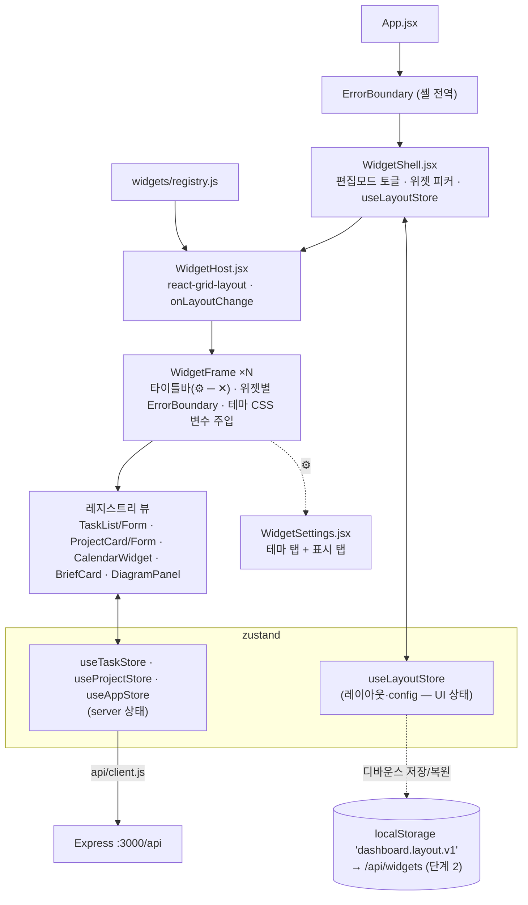
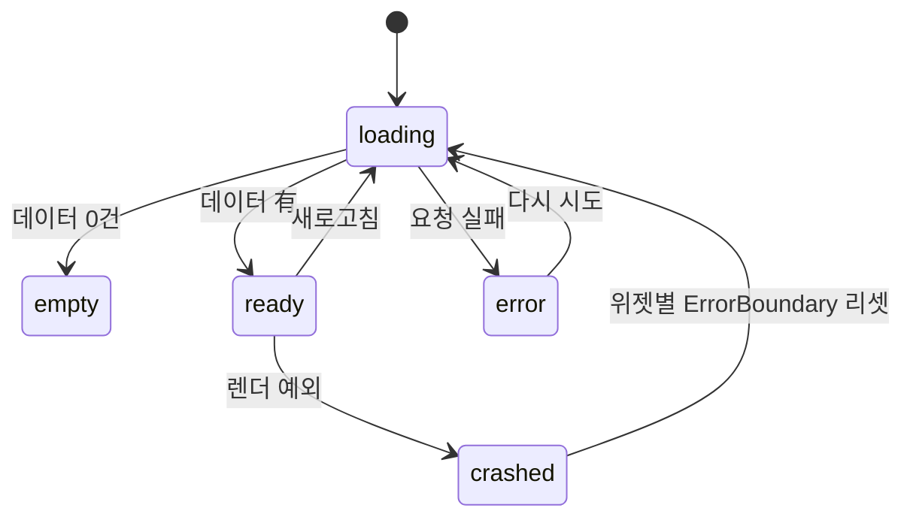

# 🖥️ 화면 명세 (UI Spec)

> Electron 데스크톱 앱의 화면·컴포넌트·상태 계약. 요구사항은 [requirements/UI.md](../requirements/UI.md) · [requirements/WIDGET.md](../requirements/WIDGET.md), 설계는 [DESIGN.md](../architecture/DESIGN.md) §6, API 는 [API_REFERENCE.md](API_REFERENCE.md).
> 이 문서와 코드가 다르면 **코드가 맞고 이 문서를 고친다** — 단 "예정" 표시 요소는 아직 코드가 없다.
>
> 🆕 **대시보드 OS 전환 (C5~C6, 2026-09-03)**: 고정 패널(`Dashboard.jsx`) → **위젯 셸**. §0·§2 의 다이어그램·와이어프레임과 §3.8~3.10 이 전환 후 목표. 현재 코드는 아직 고정 패널이다 ([DASHBOARD_OS.md](../vision/DASHBOARD_OS.md), [ADR-0020~0022](../architecture/adr/)).

---

## 0. 컴포넌트 트리와 렌더 상태

### 전환 후 (C5~C6 목표)



**모든 위젯의 4상태** (FR-UI-01·04 → FR-WIDGET-07): 각 위젯은 독립적으로 렌더하며 한 위젯 실패가 셸·다른 위젯을 막지 않는다.



전역 연결 상태(백엔드 다운 등)는 [RUNTIME_VIEW.md](../architecture/RUNTIME_VIEW.md) §4.

---

## 1. 개요

| 항목 | 값 (전환 후) |
|---|---|
| 화면 수 | **1개 (위젯 셸 데스크톱).** 라우팅 없음 |
| 화면 구성 | `WidgetShell` 위에 위젯 인스턴스 N개 (그리드 배치, 이동·리사이즈·최소화) |
| 창 크기 | 기본 800×600, 최소 800×600 (`main.js`) — 셸은 반응형 그리드(lg/md/sm) |
| 렌더 방식 | ✅ React + Vite (FR-UI-02 / B1). `renderer.jsx` → `createRoot(#root).render(<App/>)` |
| 마운트 지점 | `index.html` 의 `<div id="root">` |
| 브리지 | `preload.js` → `window.appInfo` (아래 §5) |
| 위젯 배치 엔진 | `react-grid-layout` ([ADR-0020](../architecture/adr/ADR-0020-widget-shell-architecture.md)) |
| 레이아웃 영속 | localStorage → SQLite ([ADR-0021](../architecture/adr/ADR-0021-widget-layout-persistence.md)) |

> 🎨 **시각 방향:** 화면 골격·컴포넌트 패턴·톤의 목표 틀은 [UI_STYLE.md](UI_STYLE.md) (릴스 "Claude 워크스페이스 대시보드" 참조). 이 문서는 계약, `UI_STYLE.md` 는 방향.

### 디자인 토큰 (현재 코드 기준)

| 이름 | 값 | 용도 |
|---|---|---|
| `--bg` | `#0f172a` | 화면 배경 |
| `--panel` | `#1e293b` | 카드·리스트 아이템 배경 |
| `--text` | `#e2e8f0` | 본문 텍스트 |
| `--muted` | `#94a3b8` | 보조 텍스트·섹션 제목 |
| `--accent` | `#f59e0b` | 진행도 바, priority medium |
| priority high | `#ef4444` | 할일 우선순위 배지 |
| priority low | `#64748b` | 할일 우선순위 배지 |
| радиус | 카드 `10px`, 배지 `999px` | |

> 🔷 **C6 에서 전역 인라인 style → CSS 커스텀 프로퍼티로 승격**한다 (`:root` 에 `--bg`/`--panel`/`--accent`…).
> 위젯 프레임이 인스턴스 `config.theme` 를 화이트리스트 CSS 변수(`--w-bg`/`--w-accent`/`--w-radius`/`--w-pad`)로 자기 wrapper 에 주입하고,
> 위젯 내부 CSS 는 `var(--w-bg, var(--panel))` 폴백 체인을 쓴다 ([ADR-0022](../architecture/adr/ADR-0022-per-widget-theming.md)).

---

## 2. 레이아웃 (와이어프레임)

### 2.1 현재 (고정 패널 — B3/C2)

```
┌─────────────────────────────────────────────────────────────┐
│  AI Computer OS                                    v0.1.0    │  ← 헤더
├───────────────────────────┬─────────────────────────────────┤
│  할 일                     │  프로젝트                        │
│  ☐ 회의 자료 준비  [high]   │  AI OS 실습        [진행 중]      │
│  [+ 할일 추가]              │  ▓▓▓▓▓░░░░░ 40%                  │
├─────────────────────────────────────────────────────────────┤
│  ⚠️ 백엔드에 연결할 수 없습니다  [재시도]   ← ErrorBanner (조건부) │
└─────────────────────────────────────────────────────────────┘
```

`Dashboard.jsx` 가 할일·프로젝트를 `flex` 로 고정 배치. 일정·브리핑·다이어그램은 예정.

### 2.2 전환 후 (위젯 셸 — C5~C6 목표)

```
┌──────────────────────────────────────────────────────────────────┐
│  AI Computer OS            [편집 ✎]  [+ 위젯]        v0.1.0        │ ← 셸 바
├──────────────────────────────────────────────────────────────────┤
│  ┌── 🗒️ 할 일 ───── ⚙ ─ ✕┐   ┌── 📅 캘린더 ──── ⚙ ─ ✕┐          │
│  │ ☐ 회의 자료 준비  [high] │   │ 09:00 팀 미팅          │          │
│  │ ☑ 슬라이드 검토       🗑 │   │ 14:00 강의             │          │
│  │ [+ 할일 추가]           │   └───────────────────┘◢ (리사이즈)  │
│  └────────────────────┘◢  ┌── 🤖 Daily Brief ─ ⚙ ─ ✕┐          │
│  ┌── 📊 프로젝트 ── ⚙ ─ ✕┐  │ ## 오늘의 우선순위 TOP 3  │          │
│  │ AI OS 실습   [진행 중]  │  │ 1. …                     │          │
│  │ ▓▓▓▓▓░░░░ 40% [슬라이더]│  └──────────────────┘          │
│  └────────────────────┘   (드래그로 이동 · 그리드 스냅)              │
└──────────────────────────────────────────────────────────────────┘
    각 위젯: 색·모서리·밀도·타이틀바를 ⚙ 에서 따로 지정 → 레이아웃 저장
```

- **셸 바:** 앱 이름·버전 + `[편집]` 토글 + `[+ 위젯]` 피커.
- **위젯 프레임:** 타이틀바(아이콘·이름·⚙ 설정·─ 최소화·✕ 제거) + 본문(레지스트리 뷰) + 리사이즈 핸들(편집 모드).
- **격리:** 위젯마다 `ErrorBanner`/`ErrorBoundary` (FR-WIDGET-07). 전역 연결 오류(백엔드 다운)는 셸 바 아래 배너.
- **기본 레이아웃 (첫 실행):** 할일·프로젝트·브리핑 3개.

---

## 3. 영역별 명세

### 3.1 헤더

| 항목 | 내용 |
|---|---|
| 목적 | 앱 정체성·버전 표시 |
| 요소 | 제목 `"AI Computer OS"`, 버전 `window.appInfo.version` |
| 데이터 출처 | `preload.js` (`appInfo`) |
| 상태 | 단일 (로딩/에러 없음) |
| 관련 FR | FR-UI-01 |

### 3.2 할일 패널

| 항목 | 내용 |
|---|---|
| 목적 | 할일 목록 조회·완료 토글·삭제·추가 |
| 요소 | 섹션 제목 "할 일", `TaskList`, `TaskForm`("+ 할일 추가") — 모두 ✅ B3 (2026-09-03) |
| 데이터 출처 | `GET /api/tasks` → `useTaskStore.tasks` (`frontend/src/store/useTaskStore.js`, `api/client.js` 경유) |
| 관련 FR | FR-TASK-01/02/03/04, FR-UI-01 |
| 상태 | ✅ 코드 배선 완료. 정상(200) 경로 브라우저 검증은 CORS/C1 이후 로컬 대기 |

**렌더 상태 4종:**

| 상태 | 조건 | 표시 |
|---|---|---|
| 로딩 | 첫 fetch 진행 중 (`loading && tasks.length === 0`) | "불러오는 중…" ✅ |
| 비어있음 | `!loading && tasks.length === 0` | "할 일이 없습니다" (`TaskList`) ✅ |
| 정상 | `tasks.length > 0` | 각 항목: 체크박스 + 제목 + priority 배지 + 삭제 버튼 ✅ |
| 에러 | `error` 있음 | `ErrorBanner` (한국어 메시지) + [재시도]=`fetchTasks`. 에러가 있어도 기존 `tasks` 는 계속 렌더 ✅ |

**인터랙션:**

| 동작 | 결과 |
|---|---|
| 체크박스 클릭 | `onToggle(id)` → `PUT /api/tasks/:id {status: done↔todo}` → 성공 시 해당 항목만 갱신 (낙관적 업데이트 허용, 실패 시 롤백) |
| 삭제 버튼 클릭 | `onDelete(id)` → `DELETE /api/tasks/:id` → 목록에서 제거. 실패 시 복원 + `ErrorBanner` |
| 추가 폼 제출 (`TaskForm`) | `POST /api/tasks` → 201 시 목록에 append, 폼 초기화. `title` 빈값이면 제출 차단 + 인라인 안내. payload snake_case (`due_date`) |

> ⚠️ 현재 `Dashboard.jsx` 의 `handleToggle`/`handleDelete` 는 **로컬 state 만** 변경한다. Week 3(B3)에 store + API 호출로 교체.

### 3.3 프로젝트 패널

| 항목 | 내용 |
|---|---|
| 목적 | 프로젝트 진행도·상태 표시 |
| 요소 | 섹션 제목 "프로젝트", `ProjectCard` 목록, `ProjectForm`(하단) |
| 데이터 출처 | `GET /api/projects` → `useProjectStore.projects` (C2, 2026-09-03) |
| 관련 FR | FR-PROJ-01/02, FR-UI-01 |

**렌더 상태:** 로딩("불러오는 중…") / 비어있음("프로젝트가 없습니다" — ✅ 구현됨) / 정상 / 에러(`ErrorBanner` + 재시도, 할일 패널 렌더는 막지 않음).

**`ProjectCard` 표시 요소:** 이름, 상태 `select`(진행 중/완료/보류 — `onStatusChange` 콜백 주입 시), 삭제 버튼(`onDelete` 주입 시), 진행도 바(`width: progress%`, accent 색), `{progress}%` 텍스트, 진행도 슬라이더(`type=range`, step 5 — `onProgressChange` 주입 시, 확정 시점 onMouseUp/onBlur 에만 커밋). 콜백 미주입 시 읽기 전용(상태 배지만).

**`ProjectForm` (신설, C2):** 이름 입력(필수 — 빈값이면 "이름을 입력하세요" 힌트), 진행도 입력(선택, `type=number` 0–100), "+ 프로젝트 추가" 버튼. 제출 payload snake_case `{ name, progress? }`. 비낙관적 — `addProject` 가 `true` 반환 시에만 폼 초기화.

**상태값:** `active`/`done`/`on_hold` (schema·GLOSSARY 일치). `'hold'` 불일치는 C2 에서 `on_hold` 로 통일해 해소됨.

### 3.4 오늘 일정 위젯 🔷 예정 (Week 5)

| 항목 | 내용 |
|---|---|
| 목적 | 오늘·다가오는 일정 표시, 오늘/내일 강조 |
| 요소 | `CalendarWidget` — 시간 + 제목 리스트 |
| 데이터 출처 | `GET /api/calendar/events?from=..&to=..` → `useAppStore.events` |
| 관련 FR | FR-CAL-01/02 |
| 상태 | 로딩 / "일정 없음" / 정상 / 에러 |

### 3.5 오늘 브리핑 카드 🔷 예정 (Week 7)

| 항목 | 내용 |
|---|---|
| 목적 | 에이전트가 생성한 "오늘의 우선순위" 표시 |
| 요소 | `BriefCard` — 마크다운 렌더, 생성 시각, (있으면) Notion 링크 |
| 데이터 출처 | `GET /api/brief/today` → `useAppStore.brief` |
| 관련 FR | FR-AGENT-04 |
| 상태 | 로딩 / "오늘 브리핑이 아직 없습니다"(404) / 정상 / 에러 |

### 3.6 ErrorBanner / ErrorBoundary ✅ B3 (FR-UI-04, 2026-09-03)

| 항목 | 내용 |
|---|---|
| 목적 | API/네트워크 오류를 사용자 친화적으로 표시 |
| 요소 | 아이콘 + 한국어 메시지 + [재시도] 버튼. `message` 없으면 렌더 안 함, `onRetry` 있을 때만 버튼 |
| 규칙 | 스택 트레이스·상태코드 원문 노출 금지 (`api/client.js` 가 정규화). 재시도는 해당 API 만 재호출. 성공 시 `error=null` → 배너 제거 |
| 배치 | 영역별 개별 표시 (한 영역 실패가 다른 영역을 가리지 않음 — FR-UI-01 AC-2). 에러가 있어도 이미 받은 데이터는 계속 렌더 |
| 최상위 | `ErrorBoundary` (class, `getDerivedStateFromError`+`componentDidCatch`→`console.error`) 가 렌더 예외를 잡아 앱 전체 크래시 방지 (FR-UI-04 AC-5). `App.jsx` 가 `<Dashboard>` 를 감쌈. fallback 은 `ErrorBanner` 재사용 |
| 코드 | `frontend/src/components/{ErrorBanner,ErrorBoundary}.jsx` |
| 미검증 | 실제 실패 트리거(백엔드 중단 등) 화면 확인은 로컬 대기 (CORS/C1 이후) |

### 3.7 다이어그램 패널 🔷 예정 (Phase C4, FR-UI-05)

| 항목 | 내용 |
|---|---|
| 목적 | `docs/**/*.md` 의 Mermaid 다이어그램을 앱에서 열람 — 프로젝트 구조·진행을 그림으로 |
| 요소 | `DiagramPanel` — 그룹 탭(아키텍처 / 로드맵 gantt / 오케스트레이션 / 모듈 의존) + 선택 SVG |
| 데이터 출처 | `GET /api/diagrams` → 로컬 컴포넌트 state (스토어 불필요 — 읽기 전용·정적) |
| 렌더 | `import('mermaid')` 동적 로딩(별도 청크), `mermaid.initialize({ startOnLoad:false, theme:'dark', securityLevel:'strict' })` 후 블록별 `render()` |
| 관련 FR | FR-UI-05 · [ADR-0014](../architecture/adr/ADR-0014-dashboard-diagram-viewer.md) |
| 상태 | 로딩 / "다이어그램 없음"(빈 배열) / 정상 / 에러(API 실패 → `ErrorBanner`) |
| 폴백 | 개별 블록 렌더 실패 시 그 항목만 "이 다이어그램을 그릴 수 없습니다" + 원문 코드 (`<pre>`) |
| 미결 | 탭 고정 목록 vs `docs` 전체 자동 나열 — C4 착수 시 확정 |

### 3.8 위젯 셸 (`WidgetShell`) 🔷 예정 (Phase C5, FR-WIDGET-01~04·07·08)

| 항목 | 내용 |
|---|---|
| 목적 | 위젯 인스턴스를 배치·이동·리사이즈·추가·제거하는 데스크톱 셸 |
| 요소 | 셸 바(앱명·버전·`[편집]` 토글·`[+ 위젯]` 피커) + `WidgetHost`(react-grid-layout) + 전역 `ErrorBanner`(연결 오류) |
| 데이터 출처 | `useLayoutStore`(인스턴스 배열·편집모드) + `widgets/registry.js`(타입 메타) |
| 상태 | 편집모드 on/off. off 면 드래그/리사이즈 잠금(본문 상호작용만) |
| 인터랙션 | `[+ 위젯]` → 피커(레지스트리 목록) → 선택 시 기본 크기로 빈 자리에 추가 · `[편집]` → 핸들 표시 · 드래그 이동(그리드 스냅, 충돌 시 밀림) · 위젯 클릭 → z 최상단 |
| 영속화 | 레이아웃/ config 변경 → 300ms 디바운스 → `localStorage['dashboard.layout.v1']` (단계 2: `PUT /api/widgets`) |
| 복원 실패 | 파싱 실패·`version` 불일치 → 기본 레이아웃(할일·프로젝트·브리핑) + `console.warn`, 크래시 없음 |
| 초기화 | "레이아웃 초기화" 액션 → 기본값 |

### 3.9 위젯 프레임 (`WidgetFrame`) 🔷 예정 (Phase C5)

| 항목 | 내용 |
|---|---|
| 목적 | 개별 위젯의 크롬(타이틀바)·격리·테마 주입 |
| 요소 | 타이틀바: 아이콘 + 위젯 이름 + `⚙`(설정) + `─`(최소화) + `✕`(제거). 본문: 레지스트리 뷰. 편집모드 시 리사이즈 핸들(◢) |
| 테마 주입 | wrapper `<div className="widget" data-widget-id={id} style={themeToVars(config.theme)}>` — 화이트리스트 키만 `--w-*` 변수로 ([ADR-0022](../architecture/adr/ADR-0022-per-widget-theming.md)) |
| 격리 | 위젯별 `ErrorBoundary`(뷰 렌더 예외 → 폴백, 셸 무영향) + 뷰의 4상태(로딩/빈/정상/에러) |
| 최소화 | `config`/레이아웃의 `minimized` — 타이틀바만 렌더, 높이 1행 |

### 3.10 위젯 설정 패널 (`WidgetSettings`) 🔷 예정 (Phase C6, FR-WIDGET-05·06)

| 항목 | 내용 |
|---|---|
| 진입 | 위젯 타이틀바 `⚙` → 팝오버/사이드 패널 |
| 테마 탭 | 배경색·강조색·텍스트색(컬러 피커) · 모서리(슬라이더 0–24) · 밀도(comfortable/compact) · 타이틀바(solid/ghost/hidden) · 프리셋(다크/미니멀/강조) · "테마 초기화" |
| 표시 탭 | 위젯 타입별 옵션 — 할일: 정렬(마감/우선순위/생성)·완료 숨김·최대 개수 / 프로젝트: 상태 필터·완료 숨김 / 캘린더: 범위(오늘/이번주)·종일 포함 / 메일: 계정·최대 개수 / 브리핑: 없음 |
| 저장 | 변경 즉시 해당 위젯에만 반영 → `useLayoutStore.updateConfig(id, patch)` → 디바운스 영속화 |
| 검증 | 자유 텍스트/CSS 입력 없음. 색은 파서 통과값만, 나머지는 enum/범위 (FR-WIDGET-05 AC-6, NFR-SEC-04) |

---

## 4. 컴포넌트 계약

| 컴포넌트 | props | 내부 state | 방출 이벤트 | 상태 |
|---|---|---|---|:---:|
| `App` | — | `health` (loading/ok/error) | — | ✅ B3. C5 에서 본문이 `<ErrorBoundary><WidgetShell/></ErrorBoundary>` 로 교체 |
| `Dashboard` | — | `useTaskStore` 필드별 개별 셀렉터 구독 | — | ✅ B3 (4상태 배선). **C5 에서 `WidgetShell` 로 대체** — 뷰 컴포넌트는 위젯 뷰로 이관 |
| `WidgetShell` | — | `useLayoutStore`(instances, editMode) | `onLayoutChange`, `onAddWidget(type)`, `onRemove(id)` | 🔷 C5 (FR-WIDGET-01~04) |
| `WidgetHost` | `instances`, `editMode`, `onLayoutChange(layout)` | — | `onLayoutChange` | 🔷 C5 (react-grid-layout 래퍼) |
| `WidgetFrame` | `instance: WidgetInstance`, `meta`(레지스트리), `editMode` | `settingsOpen` | `onConfigChange(id, patch)`, `onRemove(id)`, `onMinimize(id)` | 🔷 C5 (per-widget ErrorBoundary + 테마 변수 주입) |
| `WidgetSettings` | `instance`, `configSchema`, `onChange(patch)` | 폼 로컬값 | `onChange` | 🔷 C6 (테마 탭 + 표시 탭, 화이트리스트 입력만) |
| `TaskList` | `tasks: Task[]`, `onToggle(id)`, `onDelete(id)` | — | `onToggle`, `onDelete` | ✅ |
| `TaskForm` | `onSubmit(payload)`, `disabled` | `title, priority, dueDate` | `onSubmit` | ✅ B3 |
| `ErrorBanner` | `message: string`, `onRetry()` | — | `onRetry` | ✅ B3 |
| `ErrorBoundary` | `children` | `hasError` | — | ✅ B3 (class, FR-UI-04 AC-5) |
| `ProjectCard` | `project: Project`, `onDelete(id)?`, `onProgressChange(id, next)?`, `onStatusChange(id, value)?` | `draft` (슬라이더 로컬값) | `onDelete`, `onProgressChange`, `onStatusChange` | ✅ C2 (순수 프레젠테이션, 콜백 없으면 읽기 전용, `on_hold` 통일) |
| `ProjectForm` | `onSubmit(payload): Promise<boolean>`, `disabled` | `name, progress, hint` | `onSubmit` | ✅ C2 (payload `{name, progress?}`) |
| `CalendarWidget` | `events: Event[]` | — | — | 🔷 C3 |
| `BriefCard` | `brief: Brief \| null` | — | — | 🔷 D3 |
| `DiagramPanel` | — | `diagrams`, `activeGroup`, `loading`, `error` | — | 🔷 C4 |

**타입 형태**는 [DATA_DICTIONARY.md](DATA_DICTIONARY.md) 및 [API_REFERENCE.md](API_REFERENCE.md) 의 리소스 객체와 동일 (필드명 snake_case 유지).

---

## 5. `window.appInfo` (preload 브리지)

현재 노출 (`preload.js`):
```js
{ name: 'AI Computer OS', version: '0.1.0',
  electron: process.versions.electron, node: process.versions.node,
  apiBaseUrl: 'http://localhost:3000/api' }  // ✅ B1 추가 (3000 고정, CSP connect-src 와 정합)
```
- 시크릿·Node API 는 절대 노출하지 않는다 (NFR-SEC-03/04).

---

## 6. zustand 스토어 계약

### `useTaskStore` ✅ B3 (2026-09-03, `frontend/src/store/useTaskStore.js`)
```
상태:   tasks: Task[]        loading: boolean    error: string | null
액션:   fetchTasks()                     → GET /api/tasks     (실패해도 기존 tasks 보존)
        addTask(payload)                 → POST /api/tasks    (비낙관적, boolean 반환)
        toggleTask(id)                   → PUT /api/tasks/:id  (낙관적 + 실패 롤백)
        updateTask(id, patch)            → PUT /api/tasks/:id  (낙관적, 성공 시 서버 task 로 치환)
        removeTask(id)                   → DELETE /api/tasks/:id (낙관적, 실패 시 원래 인덱스 복원)
        clearError()
```
- 액션은 throw 하지 않고 `error` 에 문자열 저장. 성공하는 액션은 `error=null` (FR-UI-04 AC-4).
- `Dashboard` 는 객체 리터럴 셀렉터 금지 — 필드별 개별 셀렉터로 구독 (zustand v4 리렌더 함정).

### `useProjectStore` ✅ C2 (2026-09-03, `frontend/src/store/useProjectStore.js`)
```
상태:   projects: Project[]   loading: boolean   error: string | null
액션:   fetchProjects()            → GET /api/projects    (실패해도 기존 projects 보존)
        addProject(payload)       → POST /api/projects   (비낙관적, boolean 반환)
        updateProject(id, patch)  → PUT /api/projects/:id (낙관적, 성공 시 서버 project 로 치환, 실패 롤백)
        removeProject(id)         → DELETE /api/projects/:id (낙관적, 실패 시 원래 인덱스 복원)
        clearError()
```
- `useTaskStore` 패턴 복제. 필드명 snake_case 유지(`project_id`, `notion_id`).

### `useAppStore` 🔷 예정 (C3~D3) — 캘린더/브리핑용
```
상태:   events, brief, 각 영역별 loading/error
액션:   fetchEvents() fetchBrief()
```
> 방향: `useAppStore` 단일 스토어 대신 도메인별 스토어(`useTaskStore`/`useProjectStore`/…)로 분리 중.

### `useLayoutStore` 🔷 예정 (C5, `frontend/src/store/useLayoutStore.js`) — 위젯 셸 UI 상태
```
상태:   instances: WidgetInstance[]   // { id, type, x,y,w,h, z, minimized, config:{theme,display} }
        editMode: boolean
액션:   setInstances(list)                 // 부팅 시 복원
        addWidget(type)                    // 레지스트리 defaultSize 로 빈 자리에 추가
        removeWidget(id) / toggleMinimize(id)
        setLayout(rglLayout)               // react-grid-layout onLayoutChange → x,y,w,h 반영
        bringToFront(id)                   // z 갱신
        updateConfig(id, patch)            // 테마/표시 옵션 병합
        toggleEditMode() / resetLayout()
영속:   모든 변경 → 300ms 디바운스 → localStorage['dashboard.layout.v1']  (단계 2: PUT /api/widgets)
        부팅: 없음/파싱실패/version 불일치 → widgets/defaultLayout.js 폴백 + console.warn
```
> **UI 상태 전용.** 위젯이 보여주는 데이터(tasks 등)는 절대 여기 두지 않는다 — 도메인 스토어 담당 ([ADR-0021](../architecture/adr/ADR-0021-widget-layout-persistence.md)).

- 모든 액션은 `api/client.js`(fetch 래퍼) 경유. 에러는 문자열로 정규화해 `error` 에 저장 (NFR-REL-02).

---

## 7. React 렌더링 전환 (FR-UI-02 요약)

| 파일 | 현재 | 목표 |
|---|---|---|
| `index.html` | ✅ B1 완료 — `<script type="module" src="renderer.jsx">`, prod CSP `script-src 'self'` + `connect-src 'self' http://localhost:3000`. dev 는 `devCspPlugin` 이 완화 |
| `renderer.jsx` | ✅ B1 완료 — `createRoot(#root).render(<App/>)` (`renderer.js` 삭제) |
| `main.js` | ✅ B1 완료 — `NODE_ENV` 분기: dev `loadURL(:5173)` / prod `loadFile(dist/index.html)`, 실패 시 `fallback.html` |
| `package.json` | ✅ B1 완료 — `vite`, `@vitejs/plugin-react`, `concurrently`/`wait-on`/`cross-env`, `dev`/`build`/`start`/`package` 스크립트 |

> ⚠️ **CSP 주의:** 현재 `index.html` 의 CSP 에 `connect-src` 가 없어 `'self'` 로 제한된다 → `fetch('http://localhost:3000')` 이 **차단된다.** React 연결 시 CSP 에 `connect-src 'self' http://localhost:3000` (+ dev 는 ws) 를 반드시 추가한다.

---

## 8. 현재 구현과의 차이

| # | 명세 | 현재 | 해소 |
|---|---|---|---|
| U1 | React 트리 렌더 | ✅ B1 — `renderer.jsx` → `createRoot().render(<App/>)` (`renderer.js` 삭제) |
| U2 | `Dashboard` 가 store+API 사용 | ✅ B3(할일)·C2(프로젝트) — `useTaskStore`+`useProjectStore` |
| U3 | `apiBaseUrl` 브리지 | ✅ B1 — `preload.js` `apiBaseUrl: 'http://localhost:3000/api'` (3000 고정) |
| ~~U4~~ | `ProjectCard` status `on_hold` | ✅ 해소 — C2 (2026-09-03), `'hold'`→`'on_hold'` 통일 |
| U5 | 일정·브리핑·에러 영역 | 없음 | Week 5·7, FR-UI-04 |
| U6 | CSP `connect-src` 허용 | ✅ B1 — prod `connect-src 'self' http://localhost:3000`, dev 는 `devCspPlugin` 완화 |
| U7 | 로딩/에러 상태 렌더 | `App.jsx` 는 `/api/health` 3상태 렌더. Dashboard 영역 로딩/에러는 B3 | B3, FR-UI-04 |

---

**작성:** 2026-09-02
