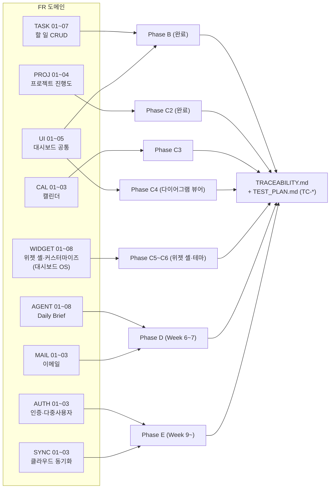

# ✅ 기능 요구사항 (Functional Requirements)

> 시스템이 **무엇을 해야 하는가**. 현행 분석은 [AS_IS.md](../vision/AS_IS.md), 비기능 요구사항은
> [REQUIREMENTS_NONFUNCTIONAL.md](REQUIREMENTS_NONFUNCTIONAL.md), 설계는 [DESIGN.md](../architecture/DESIGN.md).

## 도메인 지도 (FR 도메인 → Phase → 검증)

> 🆕 **대시보드 OS 전환** (2026-09-03) — 고정 패널 대시보드를 **위젯이 움직이고 위젯마다 디자인하는 데스크톱 OS** 형태로 확장. 개념 [../vision/DASHBOARD_OS.md](../vision/DASHBOARD_OS.md), 상세 [WIDGET.md](WIDGET.md), 결정 [ADR-0020~0022](../architecture/adr/).

각 FR 의 갭·설계·테스트·코드 연결은 [TRACEABILITY.md](TRACEABILITY.md), 단계 일정은 [ROADMAP.md](../ROADMAP.md) / [DESIGN.md](../architecture/DESIGN.md) §8.

## 표기 규칙

- ID: `FR-<도메인>-<번호>` (예: `FR-TASK-01`)
- 우선순위: **P0**(핵심 완료 기준) · **P1**(있어야 함) · **P2**(선택)
- 상태: ⏳ 예정 · 🚧 진행 · ✅ 완료
- "목표 주차"는 [ROADMAP.md](../ROADMAP.md) 기준

## 상세 명세

이 문서는 **요약 표**다. 사용자 스토리·수용 기준(Given/When/Then)·입력 규칙·오류 시나리오는
도메인별 상세 문서에 있다:

| 도메인 | 상세 문서 | 상세화 수준 |
|---|---|---|
| TASK | [requirements/TASK.md](TASK.md) | P0 완료, P1 초안 |
| UI | [requirements/UI.md](UI.md) | P0 완료 |
| AGENT | [requirements/AGENT.md](AGENT.md) | P0 완료, P1 초안 |
| PROJ | [requirements/PROJ.md](PROJ.md) | P0 완료 (C2, 2026-09-03) |
| CAL | [requirements/CAL.md](CAL.md) | FR-CAL-01/02 완료 (C3 — 더미, 2026-09-06), FR-CAL-03 D2 이월 |
| WIDGET | [requirements/WIDGET.md](WIDGET.md) | 초안 (제안 — 착수 전 DASHBOARD_OS §8 결정) |
| MAIL / SYNC / AUTH | (예정) | 아래 표만 — 해당 주차 착수 전 상세화 |

---

## 1. 할일 관리 (TASK)

| ID | 요구사항 | 우선순위 | 목표 주차 | 상태 |
|---|---|:---:|:---:|:---:|
| FR-TASK-01 | 사용자는 할일을 제목·설명·마감일·우선순위(high/medium/low)로 생성할 수 있다 | P0 | W3 | 🚧 (API만) |
| FR-TASK-02 | 사용자는 할일 목록을 우선순위 배지와 함께 조회할 수 있다 | P0 | W3 | 🚧 |
| FR-TASK-03 | 사용자는 할일의 완료 상태(todo/in_progress/done)를 토글할 수 있다 | P0 | W3 | 🚧 |
| FR-TASK-04 | 사용자는 할일을 수정·삭제할 수 있다 | P0 | W3 | 🚧 (API만) |
| FR-TASK-05 | 할일은 로컬 DB에 영속 저장되어 앱 재시작 후에도 유지된다 | P0 | W5 | ⏳ |
| FR-TASK-06 | 할일 목록을 마감일·우선순위·상태로 정렬/필터할 수 있다 | P1 | W4 | ⏳ |
| FR-TASK-07 | "오늘/내일 할 일"을 별도로 볼 수 있다 | P1 | W5 | ⏳ |

## 2. 프로젝트 추적 (PROJ)

| ID | 요구사항 | 우선순위 | 목표 주차 | 상태 |
|---|---|:---:|:---:|:---:|
| FR-PROJ-01 | 사용자는 프로젝트를 이름·진행도(0–100)·상태로 생성/수정/삭제할 수 있다 | P1 | W4 | ✅ (C2 — 이름 인라인 수정 UI 는 이월) |
| FR-PROJ-02 | 프로젝트 카드에 진행도 바와 상태(진행중/완료/보류)를 표시한다 | P1 | W4 | ✅ (C2) |
| FR-PROJ-03 | Notion 데이터베이스의 프로젝트를 읽어와 표시한다 (읽기 전용) | P1 | W4 | ⏳ |
| FR-PROJ-04 | Notion `notion_id` 로 로컬 프로젝트와 매핑한다 | P2 | W4 | ⏳ |

## 3. 캘린더 (CAL)

| ID | 요구사항 | 우선순위 | 목표 주차 | 상태 |
|---|---|:---:|:---:|:---:|
| FR-CAL-01 | Google Calendar 의 오늘·이번주 일정을 조회해 표시한다 | P1 | W5 | 🚧 (C3 — 더미, 실 API D2) |
| FR-CAL-02 | 오늘/내일 일정을 강조 표시한다 | P1 | W5 | ✅ (C3) |
| FR-CAL-03 | 일정을 로컬 DB에 캐시해 오프라인에서도 최근 일정을 본다 | P2 | W5 | ⏳ (D2) |

## 4. 이메일 (MAIL)

| ID | 요구사항 | 우선순위 | 목표 주차 | 상태 |
|---|---|:---:|:---:|:---:|
| FR-MAIL-01 | Gmail 의 미읽은 메일 목록(보낸사람·제목·스니펫)을 조회한다 | P1 | W6 | ⏳ |
| FR-MAIL-02 | 여러 Gmail 계정을 한 화면에서 통합 조회한다 | P2 | W9 | ⏳ |
| FR-MAIL-03 | 메일 상세 보기·답장·삭제를 할 수 있다 | P2 | W9 | ⏳ |

## 5. AI 에이전트 — Daily Brief (AGENT)

| ID | 요구사항 | 우선순위 | 목표 주차 | 상태 |
|---|---|:---:|:---:|:---:|
| FR-AGENT-01 | 에이전트는 할일·일정·미읽은 메일을 수집해 컨텍스트를 구성한다 | P0 | W7 | 🚧 (뼈대) |
| FR-AGENT-02 | Claude API 로 "오늘의 우선순위 TOP 3 + 주의점"을 생성한다 | P0 | W7 | 🚧 |
| FR-AGENT-03 | 생성된 브리핑을 Notion 페이지로 저장한다 | P1 | W7 | ⏳ |
| FR-AGENT-04 | 브리핑을 로컬 DB에 캐시하고 UI에서 조회할 수 있다 | P1 | W7 | ⏳ |
| FR-AGENT-05 | 매일 아침 정해진 시각에 브리핑이 자동 생성된다 (cron/launchd) | P0 | W7 | ⏳ |
| FR-AGENT-06 | Claude 호출 실패 시 사용자에게 원인을 알리고 앱은 계속 동작한다 | P0 | W7 | 🚧 |
| FR-AGENT-07 | 스케줄 제안: 바쁜 시간대를 분석해 회의 가능 시간을 제안한다 | P2 | W11 | ⏳ |

## 6. 동기화 (SYNC)

| ID | 요구사항 | 우선순위 | 목표 주차 | 상태 |
|---|---|:---:|:---:|:---:|
| FR-SYNC-01 | 로컬(SQLite) 데이터를 클라우드(Supabase)에 백업한다 | P2 | W10 | ⏳ |
| FR-SYNC-02 | 여러 기기에서 같은 데이터 상태를 본다 (증분 동기화) | P2 | W10 | ⏳ |
| FR-SYNC-03 | 외부 API 동기화 결과를 `sync_logs` 에 기록한다 (성공/실패/오류메시지) | P1 | W6 | ⏳ |

## 7. 사용자 / 인증 (AUTH)

| ID | 요구사항 | 우선순위 | 목표 주차 | 상태 |
|---|---|:---:|:---:|:---:|
| FR-AUTH-01 | Google OAuth 2.0 으로 로그인하고 refresh token 을 로컬에 암호화 저장한다 | P1 | W6 | ⏳ |
| FR-AUTH-02 | 여러 사용자를 지원하고 데이터를 사용자별로 분리한다 | P2 | W10 | ⏳ |
| FR-AUTH-03 | 로그아웃 시 저장된 토큰을 폐기한다 | P1 | W10 | ⏳ |

## 8. 대시보드 / 화면 (UI)

| ID | 요구사항 | 우선순위 | 목표 주차 | 상태 |
|---|---|:---:|:---:|:---:|
| FR-UI-01 | 단일 대시보드에서 할일·프로젝트·일정·브리핑을 한눈에 본다 | P0 | W3 | 🚧 (컴포넌트만) |
| FR-UI-02 | React 컴포넌트가 실제로 렌더링되고 백엔드 데이터를 표시한다 | P0 | W2~3 | ❌ |
| FR-UI-03 | 앱 창은 최소화/최대화/종료가 가능하다 | P1 | W2 | ✅ |
| FR-UI-04 | 네트워크/백엔드 오류 시 화면에 사용자 친화적 메시지를 표시한다 | P1 | W3 | ⏳ |
| FR-UI-05 | 대시보드에서 프로젝트 다이어그램(아키텍처·로드맵·진행)을 열람한다 | P2 | W4~5 | 🚧 C4 구현 (2026-09-06), E2E 대기 |

## 9. 위젯 셸 — 대시보드 OS (WIDGET)

> 상세 수용 기준은 [requirements/WIDGET.md](WIDGET.md). 전부 **제안** — 착수 전 [DASHBOARD_OS.md](../vision/DASHBOARD_OS.md) §8(DO-1~6) 결정.

| ID | 요구사항 | 우선순위 | 목표 주차 | 상태 |
|---|---|:---:|:---:|:---:|
| FR-WIDGET-01 | 위젯을 그리드 위에서 이동·리사이즈할 수 있다 (편집 모드) | P1 | W4~5 (C5) | ⏳ |
| FR-WIDGET-02 | 위젯을 피커로 추가하고 ✕/최소화로 제거·접을 수 있다 | P1 | W4~5 (C5) | ⏳ |
| FR-WIDGET-03 | 위젯 클릭 시 최상단으로 오고 포커스 표시된다 (z-order) | P2 | W5 (C5) | ⏳ |
| FR-WIDGET-04 | 레이아웃(위치·크기·z·최소화·config)이 저장·복원된다 | P1 | W4~5 (C5) | ⏳ |
| FR-WIDGET-05 | 위젯마다 테마(색·강조·모서리·밀도·타이틀바)를 따로 지정한다 | P1 | W5~6 (C6) | ⏳ |
| FR-WIDGET-06 | 위젯마다 표시 옵션(정렬·필터·최대 개수)을 지정한다 | P2 | W6 (C6) | ⏳ |
| FR-WIDGET-07 | 한 위젯의 에러/렌더 예외가 셸·다른 위젯에 전파되지 않는다 | P0 | W4~5 (C5) | ⏳ |
| FR-WIDGET-08 | 위젯 레지스트리에 항목을 추가하면 셸 수정 없이 새 위젯이 붙는다 | P2 | W5 (C5) | ⏳ |

---

## 완료 기준(Definition of Done) — 프로젝트 전체

[VISION.md](../vision/VISION.md) 의 완료 기준을 요구사항 ID로 환산:

- **핵심 기능 4종이 실제 데이터로 동작** → FR-TASK-01~05, FR-PROJ-01~03, FR-CAL-01~02, FR-MAIL-01, FR-AGENT-01~04
- **Daily Brief 가 cron 자동 실행** → FR-AGENT-05
- **Docker 배포 가능** → [REQUIREMENTS_NONFUNCTIONAL.md](REQUIREMENTS_NONFUNCTIONAL.md) NFR-DEPLOY-01
- **과제 1·2 발표 및 기말 제출** → 위 P0 전부 ✅

---

**작성:** 2026-09-02
