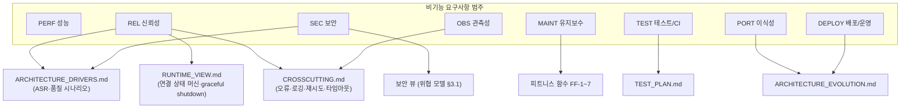

# 🧩 비기능 요구사항 (Non-Functional Requirements)

> 시스템이 **어떤 품질로** 동작해야 하는가. 기능 요구사항은 [REQUIREMENTS_FUNCTIONAL.md](REQUIREMENTS_FUNCTIONAL.md),
> 현행 분석은 [AS_IS.md](../vision/AS_IS.md), 설계는 [DESIGN.md](../architecture/DESIGN.md).

## 범주 지도 (NFR 8범주 → 아키텍처 대응)

우선순위(지금 강제 vs 나중)는 이 문서 맨 아래 매트릭스.

## 표기 규칙

- ID: `NFR-<범주>-<번호>`
- 각 항목은 **측정 가능한 기준**과 **검증 방법**을 명시한다.
- 이 프로젝트는 강의 실습 겸 개인용이므로 목표치는 "학습·데모에 충분한 수준"으로 잡는다.

---

## 1. 성능 (PERF)

| ID | 요구사항 | 기준 | 검증 방법 |
|---|---|---|---|
| NFR-PERF-01 | 대시보드 초기 렌더 | 로컬 데이터 기준 1초 이내 | 개발자도구 Performance 탭 |
| NFR-PERF-02 | 로컬 API 응답 (CRUD) | p95 100ms 이내 (SQLite, 로컬호스트) | supertest + 타이밍 로그 |
| NFR-PERF-03 | 할일 목록 렌더 | 500건까지 끊김 없음 (필요 시 가상 스크롤) | 더미 500건 수동 확인 |
| NFR-PERF-04 | Daily Brief 생성 | 60초 이내 완료 (Claude 호출 포함) | `daily_brief.py` 실행 시간 로그 |
| NFR-PERF-05 | 외부 API 동기화 | 증분 동기화(마지막 동기화 이후만), 백그라운드 실행 | `sync_logs.last_sync` 확인 |

## 2. 신뢰성 / 가용성 (REL)

| ID | 요구사항 | 기준 | 검증 방법 |
|---|---|---|---|
| NFR-REL-01 | 모든 외부 호출·IO 는 예외 처리로 감싼다 | try/catch 누락 0 | 코드리뷰 (supervisor) |
| NFR-REL-02 | 외부 API(Claude/Google/Notion) 실패가 앱 크래시로 이어지지 않는다 | 실패 시 사용자 메시지 + 앱 정상 유지 | 네트워크 차단 후 수동 테스트 |
| NFR-REL-03 | 백엔드는 `unhandledRejection` / `uncaughtException` 을 로깅하고 죽지 않는다 | 프로세스 유지 | 강제 예외 주입 테스트 |
| NFR-REL-04 | 오프라인에서도 로컬 캐시 데이터 조회가 가능하다 | 네트워크 없이 할일·최근 일정 조회 | 비행기모드 수동 테스트 |
| NFR-REL-05 | 네트워크 실패 시 재시도 로직 (지수 백오프, 최대 3회) | 재시도 후 `sync_logs` 에 최종 상태 기록 | 단위 테스트 (모킹) |
| NFR-REL-06 | 앱 종료 시 graceful shutdown (진행 중 쓰기 완료 후 종료) | SIGTERM 수신 후 정상 종료 | `kill -TERM` 테스트 (강의 Week 9) |

## 3. 보안 (SEC)

| ID | 요구사항 | 기준 | 검증 방법 |
|---|---|---|---|
| NFR-SEC-01 | 모든 시크릿은 `.env` 에만 두고 git 에 커밋하지 않는다 | `.gitignore` 에 `.env` 포함, 코드 하드코딩 0 | `git log -p` grep, `security-review` |
| NFR-SEC-02 | 모든 외부 API 통신은 HTTPS | http:// 외부 호출 0 | 코드리뷰 |
| NFR-SEC-03 | Claude API Key 는 백엔드/에이전트에서만 사용, 렌더러에 노출 안 됨 | `preload.js` 화이트리스트에 키 없음 | 코드리뷰 |
| NFR-SEC-04 | Electron: `contextIsolation: true`, `nodeIntegration: false` 유지 | 설정 고정 | `main.js` 리뷰 |
| NFR-SEC-05 | OAuth refresh token 은 로컬에 암호화 저장 (평문 금지) | OS 키체인 또는 암호화 파일 | 저장 포맷 확인 |
| NFR-SEC-06 | 백엔드 CORS 는 로컬 오리진만 허용 | `origin` 화이트리스트 | 설정 리뷰 |
| NFR-SEC-07 | 입력 검증: 필수값·타입·범위(progress 0–100 등)를 API 경계에서 검증 | 400 응답 반환 | supertest |

### 3.1 경량 위협 모델

"무엇으로부터 지키는가". 개인용·로컬 앱이므로 범위는 제한적이다.

| 자산 | 위협 | 대응 (NFR) |
|---|---|---|
| Claude / Google / Notion 시크릿·토큰 | git 커밋으로 유출, 렌더러 노출, 평문 저장 | NFR-SEC-01(`.gitignore`), SEC-03(렌더러 격리), SEC-05(암호화), [RISKS.md](../vision/RISKS.md) R-13·R-14 |
| 로컬 백엔드 `:3000` | 같은 머신의 다른 프로세스·웹페이지가 API 호출(CSRF 유사) | NFR-SEC-06(CORS 로컬 오리진), [UI_SPEC.md](../reference/UI_SPEC.md) §7(CSP `connect-src`), R-15 |
| 로컬 DB (`app.db`) | 메일·일정 내용이 평문. 기기 분실·공유 시 노출 | 기기 수준 디스크 암호화에 의존(문서화), 민감 본문은 저장 안 함(스니펫만) — [CONSTRAINTS.md](../vision/CONSTRAINTS.md) §3 |
| 외부 API 응답 | 신뢰할 수 없는 데이터(메일 제목 등)를 UI 렌더 → XSS | React 기본 이스케이프, 마크다운 렌더 시 sanitize |
| Electron 렌더러 | 원격 콘텐츠 로드로 RCE | NFR-SEC-04(`nodeIntegration:false`), 로컬 콘텐츠만 로드, CSP |
| 에이전트 프로세스 | 무인 실행 중 예외로 조용히 죽음 | NFR-OBS-02(단계 로깅), `sync_logs`, FR-AGENT-06(실패 격리) |

> 트레이드오프: prod Electron 은 `file://` 에서 렌더러를 로드해 `Origin: null` 로 요청하므로 CORS 에서 `null` 을 허용한다. 로컬·무인증 API 라 `null` 차단이 실효 방어가 아니라는 점을 감안한 결정이다.

범위 밖(지금): 네트워크 공격자, 다중 사용자 권한 분리(Week 10+), 공급망 감사.

## 4. 유지보수성 / 코드 품질 (MAINT)

| ID | 요구사항 | 기준 | 검증 방법 |
|---|---|---|---|
| NFR-MAINT-01 | 코드 주석은 한국어, 최소 실행 가능 수준, 과설계 금지 | developer 규칙 준수 | 코드리뷰 |
| NFR-MAINT-02 | 계층 분리: routes → services → db (라우트에 비즈니스 로직 금지) | 구조 준수 | 코드리뷰 |
| NFR-MAINT-03 | DB 교체가 라우트에 영향 없음 (db 모듈 인터페이스 고정) | 함수 시그니처 불변 | `db.js` diff |
| NFR-MAINT-04 | Claude 모델은 최신(`claude-opus-5`), `thinking: {type: "adaptive"}` 사용 | 상수 1곳 관리 | grep |
| NFR-MAINT-05 | 한 기능 = `/feature` 1회 (planner→developer→supervisor→finisher) | 파이프라인 준수 | 커밋 히스토리 |
| NFR-MAINT-06 | 문서 최신화: 기능 완료 시 PROGRESS.md·요구사항 상태 갱신 | finisher 단계에서 갱신 | PR diff |

## 5. 테스트 / CI (TEST)

> 테스트 레벨·케이스(TC-xx)·머지 게이트는 [TEST_PLAN.md](../testing/TEST_PLAN.md).

| ID | 요구사항 | 기준 | 검증 방법 |
|---|---|---|---|
| NFR-TEST-01 | 백엔드 API 는 supertest 통합 테스트를 가진다 (도메인별 최소 1개) | tasks·projects 스모크 테스트 | `npm test` |
| NFR-TEST-02 | 에이전트는 pytest 단위 테스트를 가진다 (외부 API 모킹) | `build_context` 등 순수 로직 커버 | `pytest` |
| NFR-TEST-03 | CI 는 모든 브랜치 push/PR 에서 문법 검사 + 테스트 실행 | GitHub Actions 초록 | Actions 탭 |
| NFR-TEST-04 | `verify.sh` 가 로컬에서 exit 0 으로 통과한다 | node/npm/python + 의존성 + 문법 | `bash verify.sh` |

## 6. 이식성 / 호환성 (PORT)

| ID | 요구사항 | 기준 | 검증 방법 |
|---|---|---|---|
| NFR-PORT-01 | Windows / macOS / Linux 에서 동일 코드베이스로 실행 | Electron 크로스플랫폼 | 최소 macOS + Linux(WSL) 확인 |
| NFR-PORT-02 | CI: Node 22 · Python 3.12 고정 (로컬은 상위 허용) | CI 워크플로에 버전 고정 | CI 매트릭스 |
| NFR-PORT-03 | 경로·환경 의존값은 설정으로 분리 (하드코딩 금지) | launchd plist 외 하드코딩 0 | grep `/Users/` |

## 7. 배포 / 운영 (DEPLOY)

| ID | 요구사항 | 기준 | 검증 방법 |
|---|---|---|---|
| NFR-DEPLOY-01 | 백엔드+에이전트를 Docker 이미지로 빌드·실행 가능 | `docker build` → `docker run` 정상 | 로컬 빌드 (강의 Week 12) |
| NFR-DEPLOY-02 | Electron 앱을 `electron-builder` 로 패키징 가능 | 3-OS 바이너리 산출 | `npm run build` |
| NFR-DEPLOY-03 | Daily Brief 는 launchd/cron 예약 작업으로 무인 실행 | 지정 시각 자동 실행 로그 | 로그 파일 확인 |
| NFR-DEPLOY-04 | 로그는 파일로 남고 EOD 에 슬랙 요약 전송 | `scripts/*.log` + 슬랙 메시지 | 수동 확인 |

## 8. 관측성 (OBS)

| ID | 요구사항 | 기준 | 검증 방법 |
|---|---|---|---|
| NFR-OBS-01 | 백엔드 요청 로깅 미들웨어 (메서드·경로·상태·소요시간) | 모든 요청 1줄 로그 | 서버 콘솔 |
| NFR-OBS-02 | 에이전트 실행은 시작·수집결과·Claude결과·저장 4단계를 로깅 | 단계별 로그 | `daily_brief` 실행 로그 |
| NFR-OBS-03 | 외부 동기화 이력은 `sync_logs` 테이블에 영속 | 서비스별 마지막 동기화·오류 조회 가능 | SQL |

---

## 우선순위 매트릭스 (지금 강제할 것)

| 지금(Week 1~3) 반드시 | 나중(Week 4~) 도입 |
|---|---|
| NFR-SEC-01~04, NFR-REL-01~03, NFR-MAINT-01~05, NFR-TEST-01~04, NFR-OBS-01 | NFR-PERF-*, NFR-REL-04~06, NFR-SEC-05~06, NFR-DEPLOY-*, NFR-SYNC 관련 |

---

**작성:** 2026-09-02
