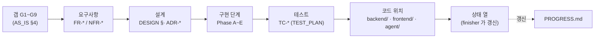

# 🔗 추적 매트릭스 (Traceability)

> 요구사항 → 갭 → 설계 → 구현 단계 → 테스트 → 코드 를 한 줄로 잇는다.
> 기능 완료 시 `finisher` 가 이 문서의 **상태** 열과 코드 위치를 갱신한다 ([GIT_WORKFLOW.md](../../setup/GIT_WORKFLOW.md)).
> 요구사항 [requirements/](./) · 갭 [AS_IS.md](../vision/AS_IS.md) §4 · 설계 [DESIGN.md](../architecture/DESIGN.md)/[adr/](../architecture/adr/) · 테스트 [TEST_PLAN.md](../testing/TEST_PLAN.md).

상태: ⏳ 예정 · 🚧 진행(일부) · ✅ 완료

### 추적 사슬 (이 문서가 잇는 것)

각 링크의 방향: 왼쪽(왜)→오른쪽(무엇·어디). 역방향 추적(코드→요구사항)도 같은 표에서 읽는다.

---

## 1. 갭(G) → 요구사항 → 단계

[AS_IS.md](../vision/AS_IS.md) §4 의 갭이 어느 요구사항·Phase 로 닫히는가.

| 갭 | 내용 | 닫는 요구사항 | Phase | 상태 |
|---|---|---|---|:---:|
| G1 | React 미연결 (번들러 없음) | FR-UI-02 | B1 | ✅ (Vite + `renderer.jsx` 마운트, 2026-09-02) |
| G2 | DB 영속성 없음 (인메모리) | FR-TASK-05 | B2 | ✅ (better-sqlite3, WAL, DATABASE_PATH, 2026-09-02) |
| G3 | 프론트↔백엔드 연결 코드 0 | FR-TASK-01~04, FR-UI-01, FR-PROJ-01/02 | B3, C2 | 🚧 할일·프로젝트 배선 완료 (B3 2026-09-03 / C2 2026-09-03), 브라우저 E2E 로컬 수동 확인 대기 |
| G4 | 로컬 환경 미검증 | NFR-TEST-04 | A2 | ✅ (`verify.sh` 12/0/0, 2026-09-02) |
| G5 | 경로 이관 변경분 미커밋 | — | A1 | ✅ (`fc4404c`) |
| G6 | 자동화 테스트 없음 | NFR-TEST-01~03 | A3 | ✅ (backend 15 + agent 3, CI 연결, 2026-09-02) |
| G7 | 외부 API 스텁 | FR-CAL, FR-MAIL, FR-PROJ-03 | C3, D2 | 🚧 캘린더 더미 API ✅ C3 (2026-09-06), 나머지 D2 |
| G8 | 다중 사용자·Supabase·Docker 미착수 | FR-AUTH-02, FR-SYNC, NFR-DEPLOY | E1~E3 | ⏳ |
| G9 | 앱에서 프로젝트 다이어그램 열람 불가 | FR-UI-05 | C4 | ✅ `GET /api/diagrams` + `DiagramPanel` 구현·채택 (2026-09-06). 브라우저 수동 확인(TC-UI-09 계열) 로컬 대기 |

## 2. Week ↔ Phase

[DESIGN.md](../architecture/DESIGN.md) §8 대응표 참조. 요약: A=W1~2, B=W2~3, C=W4~5, D=W6~7, E=W9~13.

C 세부: C1 미들웨어(CORS·로깅·에러) ✅(2026-09-03) → C2 프로젝트 CRUD + `tasks.project_id` + `errors.js` ✅(2026-09-03) → C3 캘린더 위젯 → C4 다이어그램 뷰어(FR-UI-05) ✅ 구현·ADR-0014 채택(2026-09-06), 브라우저 수동 확인 로컬 대기. B 세부: B1 Vite·React ✅ / B2 SQLite ✅ / B3 할일 CRUD 프론트 배선 🚧(코드 ✅, 브라우저 E2E 는 C1 이후).

---

## 3. 기능 요구사항 (FR)

| FR | 갭 | 설계 / ADR | Phase·단계 | 테스트 | 코드 위치 | 상태 |
|---|---|---|---|---|---|:---:|
| FR-TASK-01 | G3 | API_REFERENCE `POST /tasks`, [ADR-0004](../architecture/adr/ADR-0004-front-back-http-rest.md) | B3 | TC-TASK-01~03, TC-UI-13 | `backend/src/routes/tasks.js`, `backend/src/db.js` (SQLite), `frontend/src/api/client.js`, `frontend/src/store/useTaskStore.js`, `frontend/src/components/TaskForm.jsx` | 🚧 프론트 배선 ✅ / 정상경로 검증 C1 대기 |
| FR-TASK-02 | G3 | UI_SPEC §3.2 | B3 | TC-TASK-04,05, TC-UI-10 | `routes/tasks.js`, `backend/src/db.js` (SQLite), `frontend/src/api/client.js`, `frontend/src/store/useTaskStore.js`, `components/TaskList.jsx`, `frontend/src/widgets/views/TasksWidgetView.jsx` | 🚧 프론트 배선 ✅ / 정상경로 검증 C1 대기 |
| FR-TASK-03 | G3 | API_REFERENCE `PUT /tasks/:id` | B3 | TC-TASK-06, TC-UI-11 | `routes/tasks.js`, `backend/src/db.js` (SQLite), `frontend/src/api/client.js`, `frontend/src/store/useTaskStore.js`, `frontend/src/widgets/views/TasksWidgetView.jsx` | 🚧 프론트 배선 ✅ / 정상경로 검증 C1 대기 |
| FR-TASK-04 | G3 | API_REFERENCE | B3 | TC-TASK-07~11, TC-UI-12 | `routes/tasks.js`, `backend/src/db.js` (SQLite), `frontend/src/api/client.js`, `frontend/src/store/useTaskStore.js` | 🚧 프론트 배선 ✅ / 정상경로 검증 C1 대기 |
| FR-TASK-05 | G2 | [ADR-0002](../architecture/adr/ADR-0002-local-db-better-sqlite3.md), [ADR-0003](../architecture/adr/ADR-0003-schema-single-file.md), [ADR-0009](../architecture/adr/ADR-0009-sqlite-file-location.md) | B2 | TC-DB-01~03 | `backend/db/index.js`, `backend/src/db.js` | ✅ (2026-09-02) |
| FR-TASK-06 | — | API_REFERENCE 쿼리 파라미터 | D-마무리 | TC-TASK-12,12b,12c | `routes/tasks.js`, `services/tasks.js`, `db.js` (`getTasks({projectId})`) | ✅ (2026-09-07) — `?project_id=<int\|none>` 필터. status·priority·sort 필터는 이월 |
| FR-TASK-07 | — | requirements/TASK.md | C (W5) | — | `routes/tasks.js` | ⏳ |
| FR-TASK-08 | — | [ADR-0018](../architecture/adr/ADR-0018-schema-migration-strategy.md), [ADR-0029](../architecture/adr/ADR-0029-task-auto-category.md), DATA_DICTIONARY `task_tags`, API_REFERENCE `POST/DELETE /tasks/:id/tags`, UI_SPEC §3.2, requirements/TASK.md §FR-TASK-08 | 개인 OS P6 | TC-TAG-01~08, TC-DB-03/05, TC-SYNC-11, TC-P6-01~08, TC-AGENT-31~40 | `backend/db/schema.sql`, `backend/db/index.js` (마이그레이션), `backend/src/db.js`, `backend/src/services/tasks.js`, `backend/src/routes/tasks.js`, `agent/classify.py`, `agent/db.py`, `agent/daily_brief.py`, `frontend/src/store/taskTags.js`, `frontend/src/store/useTaskStore.js`, `frontend/src/components/TaskTags.jsx`, `frontend/src/components/TaskCard.jsx`, `frontend/src/widgets/views/TasksWidgetView.jsx` | ✅ (2026-09-08) — 수동 태그 + 에이전트 배치 자동 분류 |
| FR-TASK-09 | — | [ADR-0028](../architecture/adr/ADR-0028-single-client-cache.md), UI_SPEC §3.2/§4/§6, requirements/TASK.md | 개인 OS P5 | TC-P5-01~13, TC-P5-M1~M4 | `frontend/src/store/taskCache.js`, `frontend/src/store/useTaskStore.js`, `frontend/src/widgets/taskBoard.js`, `frontend/src/widgets/widgetMeta.js`, `frontend/src/widgets/views/TasksWidgetView.jsx`, `frontend/src/components/TaskBoard.jsx`, `frontend/src/components/TaskCard.jsx` | ✅ (2026-09-08) — 리스트/보드 토글, `config.display.view` 영속. 태그는 P6 이월 |
| FR-PROJ-01 | G3 | [requirements/PROJ.md](PROJ.md), API_REFERENCE `/projects` | C2 | TC-PROJ-01~03,06,07,10,11, TC-DB-04b, TC-UI-14 | `backend/src/routes/projects.js`, `backend/src/errors.js`, `frontend/src/store/useProjectStore.js`, `frontend/src/components/ProjectForm.jsx`, `frontend/src/widgets/views/ProjectsWidgetView.jsx` | ✅ C2 (2026-09-03) — 이름 인라인 수정 UI 는 이월. 브라우저 E2E(TC-UI-14) 로컬 대기 |
| FR-PROJ-02 | G3 | [requirements/PROJ.md](PROJ.md), UI_SPEC §3.3, [ADR-0012](../architecture/adr/ADR-0012-task-project-link.md) | C2 | TC-PROJ-04,05,08,09,09b~d, TC-UI-15,16 | `routes/projects.js`, `frontend/src/store/useProjectStore.js`, `components/ProjectCard.jsx`, `frontend/src/widgets/views/ProjectsWidgetView.jsx` | ✅ C2 (2026-09-03) — 브라우저 E2E(TC-UI-15/16) 로컬 대기 |
| FR-PROJ-03 | G7 | [ADR-0006](../architecture/adr/ADR-0006-agent-owns-external-apis.md) | D2 | — | `agent/services/notion.py` | ⏳ |
| FR-PROJ-04 | G7 | DATA_DICTIONARY `projects.notion_id` | D2 | — | `agent/services/notion.py` | ⏳ |
| FR-CAL-01 | G7 | [requirements/CAL.md](CAL.md), API_REFERENCE `/calendar/events`, [ADR-0006](../architecture/adr/ADR-0006-agent-owns-external-apis.md), [ADR-0011](../architecture/adr/ADR-0011-agent-backend-db-access.md) | C3, D-마무리 | TC-CAL-01,01b,02~07, TC-UI-17,19 | `backend/src/routes/calendar.js`, `backend/src/services/calendar.js` (`db.getCalendarEvents`), `frontend/src/store/useCalendarStore.js`, `components/CalendarWidget.jsx`, `frontend/src/widgets/views/CalendarWidgetView.jsx` | ✅ (2026-09-07) — 백엔드가 `calendar_events` 캐시에서 조회(더미 제거). agent 수집은 D2-b. 브라우저 E2E(TC-UI-17/19) 로컬 대기 |
| FR-CAL-02 | — | [requirements/CAL.md](CAL.md), UI_SPEC §3.4 | C3 | TC-UI-18 | `components/CalendarWidget.jsx`, `frontend/src/widgets/views/CalendarWidgetView.jsx` | ✅ C3 |
| FR-CAL-03 | G7 | [requirements/CAL.md](CAL.md), DATA_DICTIONARY `calendar_events`, [ADR-0011](../architecture/adr/ADR-0011-agent-backend-db-access.md), [ADR-0024](../architecture/adr/ADR-0024-oauth-token-storage.md) | D2-b | TC-CAL-08~13 | `agent/services/calendar.py`, `agent/sync.py`, `agent/db.py` (`replace_calendar_events`,`get_today_events`,`get_week_events`) | ✅ D2-b (2026-09-07) — agent 수집·캐시. 백엔드 API 는 더미(FR-CAL-01 🚧) |
| FR-MAIL-01 | G7 | [requirements/MAIL.md](MAIL.md), API_REFERENCE `/mail/unread`, [ADR-0006](../architecture/adr/ADR-0006-agent-owns-external-apis.md), [ADR-0011](../architecture/adr/ADR-0011-agent-backend-db-access.md) | D2-b, D-마무리 | TC-MAIL-01~09, TC-MAIL-B-01~05 | `agent/services/gmail.py`, `agent/sync.py`, `agent/db.py`, `backend/src/routes/mail.js`, `backend/src/services/mail.js`, `backend/src/db.js` (`getUnreadEmails`) | ✅ (2026-09-07) — agent 수집·캐시(D2-b) + 백엔드 `GET /api/mail/unread` 조회 API(D-마무리). 메일 UI(EmailView)는 FR-MAIL-03 |
| FR-MAIL-02 | G8 | — | E (W9) | — | `agent/services/gmail.py` | ⏳ |
| FR-MAIL-03 | G8 | — | E (W9) | — | `components/EmailView.jsx`(신규) | ⏳ |
| FR-AGENT-01 | G7 | DESIGN §7 (시퀀스), [ADR-0011](../architecture/adr/ADR-0011-agent-backend-db-access.md) | D1 | TC-AGENT-01,02,10~13 | `agent/daily_brief.py`, `agent/db.py` | ✅ |
| FR-AGENT-02 | — | DESIGN §7, CONVENTIONS §4 | D1 | TC-AGENT-06 | `agent/services/claude.py`, `agent/daily_brief.py` | ✅ |
| FR-AGENT-03 | G7 | requirements/AGENT.md | D3 | TC-AGENT-04·22~30 | `agent/services/notion.py`, `daily_brief.py` | ✅ |
| FR-AGENT-04 | — | API_REFERENCE `/brief/today`, [ADR-0025](../architecture/adr/ADR-0025-brief-empty-response.md) | D3 | TC-BRIEF-01~08 | `routes/brief.js`, `services/brief.js`, `db.js:getBriefByDate`, `components/BriefCard.jsx`, `widgets/views/BriefWidgetView.jsx`, `store/useBriefStore.js` | ✅ |
| FR-AGENT-05 | — | [ADR-0007](../architecture/adr/ADR-0007-schedule-launchd-cron.md) | D3 | TC-SCHED-01~06 | `scripts/daily-brief-run.sh`, `scripts/install-dailybrief-launchd.sh`, `scripts/com.aicomputeros.dailybrief.plist` | ✅ |
| FR-AGENT-06 | — | DESIGN §7, NFR-REL-02 | D1, D2-a | TC-AGENT-03,14,16,17,18 | `agent/daily_brief.py`, `agent/services/retry.py`, `agent/services/claude.py` | 🚧 (AC-1/2/4 완료, AC-3 재시도·지수 백오프 D2-a 완료 / **AC-5 는 D3 `/api/brief/today` 대기**) |
| FR-AGENT-07 | — | requirements/AGENT.md | E (W11) | — | `agent/schedule_advisor.py`(신규) | ⏳ |
| FR-AGENT-08 | — | API_REFERENCE `/agent/*`, [ADR-0011](../architecture/adr/ADR-0011-agent-backend-db-access.md), [ADR-0013](../architecture/adr/ADR-0013-dashboard-agent-queue.md), UI_SPEC (에이전트 활동 위젯) | P7 | TC-ACT-01~08, TC-AGENT-41~44, TC-P7-01~06 | `backend/src/routes/agent.js`, `backend/src/services/agent.js`, `agent/trigger.py`, `scripts/agent-run-now.sh`, `scripts/install-runnow-launchd.sh`, `frontend/src/widgets/views/AgentActivityWidgetView.jsx`, `frontend/src/store/useAgentStore.js` | ✅ (P7, 2026-09-08) |
| FR-AGENT-09 | — | requirements/AGENT.md, [ADR-0013](../architecture/adr/ADR-0013-dashboard-agent-queue.md) | E (W11+) | — | `agent/runner.py`(신규), `agent_jobs` 테이블(신규) | ⏳ |
| FR-SYNC-01 | G8 | [ADR-0008](../architecture/adr/ADR-0008-supabase-deferred.md) | E2 | — | 신규 동기화 모듈 (선행: `backend/src/supabase.js`) | ⏳ |
| FR-SYNC-02 | G8 | [ADR-0008](../architecture/adr/ADR-0008-supabase-deferred.md) | E2 | — | 동상 (선행: `backend/src/supabase.js`) | ⏳ |
| FR-SYNC-03 | G7 | API_REFERENCE `/sync/logs`, DATA_DICTIONARY `sync_logs` | D2-a·D2-b | TC-SYNC-06~10, TC-MAIL-03,06, TC-CAL-10,12 | `agent/db.py`, `agent/services/gmail.py`, `agent/services/calendar.py`, `backend/src/routes/sync.js`, `backend/src/db.js` | ✅ (D2-a: `log_sync` + `GET /sync/logs` / D2-b: Gmail·Calendar 수집 경로 배선) |
| FR-AUTH-01 | G7 | [requirements/AUTH.md](AUTH.md), NFR-SEC-05, [ADR-0024](../architecture/adr/ADR-0024-oauth-token-storage.md) | D2-b | TC-AUTH-01~08 | `agent/auth/google_oauth.py` | ✅ D2-b (2026-09-07) |
| FR-AUTH-02 | G8 | [ADR-0008](../architecture/adr/ADR-0008-supabase-deferred.md) | E1 | — | 신규 | ⏳ |
| FR-AUTH-03 | — | requirements(예정) | E1 | — | 신규 | ⏳ |
| FR-UI-01 | G3 | UI_SPEC §2·§3.11·§3.12, DESIGN §3 (flowchart), [ADR-0032](../architecture/adr/ADR-0032-sidebar-shell-per-topic-layouts.md) | B3, C, D3, P4.5 | TC-UI-02, TC-UI-10, TC-SHELL-06·09 | `components/{AppShell,Sidebar,TopicView,TopicIcons,WidgetShell,WidgetHost}.jsx`, `frontend/src/widgets/{topics,views}/*`, `frontend/src/store/{useUiStore,useTaskStore}.js` | 🚧 배선·4상태·사이드바 셸 ✅ (P4.5 2026-09-08), E2E C1 대기 |
| FR-UI-02 | G1 | [ADR-0001](../architecture/adr/ADR-0001-frontend-react-vite.md), [ADR-0010](../architecture/adr/ADR-0010-vite-dev-vs-build.md), UI_SPEC §7 | B1 | TC-UI-01,05,07,08 | `frontend/src/{renderer.jsx,vite.config.js,main.js,App.jsx}` | ✅ (AC-5 는 에러표시 수준, 실제 200 은 CORS C1 대기) |
| FR-UI-03 | — | requirements/UI.md | W2 (완료) | TC-UI-04 | `frontend/src/main.js` | ✅ |
| FR-UI-04 | — | UI_SPEC §3.6 | B3 | TC-UI-02, TC-UI-11,12 | `frontend/src/components/ErrorBanner.jsx`, `frontend/src/components/ErrorBoundary.jsx`, `frontend/src/api/client.js`, `frontend/src/store/useTaskStore.js` | ✅ AC-1~5 (ErrorBanner + ErrorBoundary), 단 실제 실패 트리거 확인은 로컬 대기 |
| FR-UI-05 | G9 | [ADR-0014](../architecture/adr/ADR-0014-dashboard-diagram-viewer.md), API_REFERENCE `GET /diagrams`, requirements/UI.md | C4 | TC-DIAG-01~05, TC-UI-09 | `backend/src/services/diagrams.js`, `backend/src/routes/diagrams.js`, `backend/test/diagrams.test.js`, `frontend/src/components/DiagramPanel.jsx`, `frontend/src/widgets/views/DiagramsWidgetView.jsx` | ✅ C4 (2026-09-06) — 구현·백엔드 테스트(TC-DIAG-01~05)·ADR-0014 채택. 브라우저 수동(TC-UI-09 계열) 로컬 대기 |
| FR-WIDGET-01~04 | — | [DASHBOARD_OS.md](../vision/DASHBOARD_OS.md), [ADR-0020](../architecture/adr/ADR-0020-widget-shell-architecture.md)/[0021](../architecture/adr/ADR-0021-widget-layout-persistence.md)/[0032](../architecture/adr/ADR-0032-sidebar-shell-per-topic-layouts.md), UI_SPEC §3.8·§6 | C5, P4.5 | TC-WIDGET-01~06 (수동, TEST_PLAN §3.7) · TC-SHELL-01~05·07·08·10 (자동, `frontend/test/{layoutStorage,topics}.test.mjs`) | `frontend/src/widgets/{registry,defaultLayout,layoutStorage,topics,widgetMeta}.js`, `frontend/src/widgets/views/PlaceholderWidgetView.jsx`, `components/Widget{Shell,Host,Frame,Picker}.jsx`, `store/{useLayoutStore,useUiStore}.js` | ✅ C5 (2026-09-06) + ✅ P4.5 주제별 레이아웃 (2026-09-08) — 브라우저 수동 로컬 대기 |
| FR-WIDGET-05~06 | — | [ADR-0022](../architecture/adr/ADR-0022-per-widget-theming.md), [ADR-0027](../architecture/adr/ADR-0027-light-theme-default.md), UI_SPEC §3.10, §1(디자인 토큰 v2) | C6, 개인 OS P3 | TC-WIDGET-09~13 (자동, `frontend/test/*.test.mjs`) · TC-WIDGET-14~19 (수동, TEST_PLAN §3.7) | `frontend/src/styles.css`, `components/WidgetSettings.jsx`, `widgets/{themePresets,displayConfig,themeVars}.js`, `widgets/registry.js`, `components/WidgetFrame.jsx` | ✅ C6 (per-widget 테마) + ✅ P3 (2026-09-07 — 라이트 테마 기본, 토큰 v2, ADR-0027). 브라우저 수동 로컬 대기 |
| FR-WIDGET-07~08 | — | [ADR-0020](../architecture/adr/ADR-0020-widget-shell-architecture.md), WIDGET.md | C5 | TC-WIDGET-07~08 (수동, TEST_PLAN §3.7) | 위젯별 `ErrorBoundary`(fallback prop), `WidgetFrame.jsx`, `widgets/registry.js` | ✅ C5 (2026-09-06) |

---

## 4. 비기능 요구사항 (NFR) — 주요

| NFR | 설계 / 수단 | Phase | 검증 | 상태 |
|---|---|---|---|:---:|
| NFR-SEC-01 | `.gitignore` `.env`, [ENV_REFERENCE.md](../../setup/ENV_REFERENCE.md) | 상시 | `security-review`, grep | ✅ |
| NFR-SEC-03 | Claude 키 백엔드/에이전트 전용, `preload.js` 화이트리스트 | B1 | 코드리뷰 | 🚧 |
| NFR-SEC-04 | Electron `contextIsolation:true`/`nodeIntegration:false` | 상시 | TC-UI-05 | ✅ |
| NFR-SEC-05 | OAuth 토큰 암호화 저장 (Fernet 암호화 JSON 파일 — [ADR-0024](../architecture/adr/ADR-0024-oauth-token-storage.md)) | D2-b | TC-AUTH-03 | ✅ D2-b |
| NFR-SEC-06 | CORS 로컬 오리진 화이트리스트 (`backend/src/middleware/cors.js`) | C1 | TC-MW-01~04, TC-MW-09 | ✅ (2026-09-03) |
| NFR-SEC-07 | API 경계 입력 검증 | C1, B2, C2 | TC-TASK-02,03 / TC-PROJ-02,03,09,09c,09d / TC-DB-04a~d / TC-MW-05,06 | 🚧 (C2: `backend/src/errors.js` 가 SQLite CHECK/NOTNULL/FK → 400 한국어 매핑, `project_id` 사전 검증. `due_date` 형식 검증·빈 title 덮어쓰기 금지는 이월) |
| NFR-REL-01 | 모든 외부 호출·IO try/catch | 상시 | supervisor 리뷰 | 🚧 |
| NFR-REL-02 | 외부 API 실패가 앱 크래시로 안 이어짐 | D1 | TC-AGENT-03, TC-UI-02 | 🚧 |
| NFR-REL-03 | 백엔드 `uncaughtException` 로깅 후 안전 종료 / `unhandledRejection` 로깅·생존 | 상시 | TC-REL-01~06 | ✅ (`src/server.js` + `src/lifecycle.js`, `test/lifecycle.test.js`, 2026-09-07) |
| NFR-REL-04 | 오프라인 로컬 캐시 조회 | C3, D2 | 수동 (비행기모드) | ⏳ |
| NFR-REL-05 | 네트워크 재시도 (지수 백오프 ×3) | D2-a·D2-b | 단위(모킹) TC-AGENT-16,17,18, TC-MAIL-07,08, TC-CAL-* | ✅ (Claude + Gmail·Calendar 가 `call_with_retry`/`execute_with_retry` 3회 백오프, 401/403 즉시 실패. Notion 은 미적용) |
| NFR-REL-06 | graceful shutdown (SIGTERM) | E4 (W9) | `kill -TERM` | 🚧 (Express 측 완료 — `src/lifecycle.js`, TC-REL-05; Electron 자식 종료 연동은 E4) |
| NFR-MAINT-02 | 계층 분리 routes→services→db | C1 | 코드리뷰 · TC-MAINT-01~05 | ✅ (`backend/src/services/{tasks,projects,calendar,diagrams}.js`, 2026-09-07; `routes/sync.js` 는 읽기 전용 직접 조회 예외) |
| NFR-MAINT-03 | `db.js` 인터페이스 불변 | B2 | TC-DB-02 | ✅ (공개 함수 10개 시그니처·반환·오류 불변, 2026-09-02) |
| NFR-MAINT-04 | 모델 상수 1곳 (`claude.py DEFAULT_MODEL`) | 상시 | grep | ✅ |
| NFR-MAINT-05 | 한 기능 = `/feature` 1회 | 상시 | 커밋 히스토리 | 🚧 |
| NFR-OBS-01 | 백엔드 요청 로깅 미들웨어 (`backend/src/middleware/requestLogger.js`) | C1 | TC-MW-08 | ✅ (2026-09-03) |
| NFR-OBS-02 | 에이전트 4단계 로깅 | D1 | 실행 로그 | ⏳ |
| NFR-OBS-03 | `sync_logs` 영속 | D2-a·D2-b | SQL, TC-SYNC-06,08, TC-MAIL-03,06, TC-CAL-10,12 | ✅ (Gmail·Calendar 동기화 성공·실패가 `sync_logs` 에 기록) |
| NFR-TEST-01 | backend supertest | A3 | `npm test` | ✅ (15 pass, 2026-09-02) |
| NFR-TEST-02 | agent pytest | A3 | `pytest` | ✅ (3 pass, 2026-09-02) |
| NFR-TEST-03 | CI 문법 + 테스트 | A3 | Actions | ✅ (`npm test` + `pytest -m "not network"` 연결) |
| NFR-TEST-04 | `verify.sh` exit 0 | A2 | `bash verify.sh` | ✅ (12/0/0, 2026-09-02) |
| NFR-PORT-02 | CI Node 22 / Python 3.12 고정 (로컬 상위 허용) | 상시 | CI | ✅ |
| NFR-PORT-03 | 경로·환경값 설정 분리 | B2, [ADR-0009](../architecture/adr/ADR-0009-sqlite-file-location.md) | grep `/Users/` | ✅ (`DATABASE_PATH` 주입, 기본 `backend/data/app.db`, 2026-09-02) |
| NFR-DEPLOY-01 | Docker 빌드 | E3 (W12) | `docker build` | ⏳ |
| NFR-DEPLOY-02 | electron-builder 패키징 | E3 | `npm run build` | ⏳ |
| NFR-DEPLOY-03 | Daily Brief 무인 실행 | D3 | 로그 | ⏳ |

*(전체 NFR 은 [REQUIREMENTS_NONFUNCTIONAL.md](REQUIREMENTS_NONFUNCTIONAL.md). 여기엔 추적이 의미 있는 항목만.)*

---

## 5. ADR 결정 상태

Phase A~D 를 막던 제안 ADR 4건은 **2026-09-02 채택** → `/build-next` 가 A3~C2 를 막힘 없이 진행 가능.

| ADR | 관련 FR | 상태 |
|---|---|---|
| [ADR-0009](../architecture/adr/ADR-0009-sqlite-file-location.md) SQLite 위치 | FR-TASK-05 | ✅ 채택 |
| [ADR-0010](../architecture/adr/ADR-0010-vite-dev-vs-build.md) Vite 로드 방식 | FR-UI-02 | ✅ 채택 |
| [ADR-0011](../architecture/adr/ADR-0011-agent-backend-db-access.md) DB 동시 접근 | FR-AGENT-01 | ✅ 채택 |
| [ADR-0012](../architecture/adr/ADR-0012-task-project-link.md) `tasks.project_id` | FR-PROJ-01/02 | ✅ 채택 + ✅ C2 구현 (2026-09-03) — POST/PUT `/api/tasks` 검증·API 응답 노출. `?project_id=` 필터·TaskForm 드롭다운은 이월 |
| [ADR-0013](../architecture/adr/ADR-0013-dashboard-agent-queue.md) 에이전트 작업 큐 | FR-AGENT-08(활동 위젯·트리거) / FR-AGENT-09(전체 큐) | 부분 채택 — P7 "지금 실행" 파일 플래그 채택(2026-09-08) / 전체 큐는 제안 |
| [ADR-0018](../architecture/adr/ADR-0018-schema-migration-strategy.md) 스키마 마이그레이션 전략 | FR-TASK-08 | 채택 (2026-09-08, 개인 OS P6) — 최소안: `PRAGMA user_version` + `db/index.js` 인라인, forward-only, 실행 전 `.bak-<ts>` |
| [ADR-0014](../architecture/adr/ADR-0014-dashboard-diagram-viewer.md) 다이어그램 뷰어 | FR-UI-05 | ✅ 채택 (2026-09-06) + C4 구현 — `GET /api/diagrams`(`services/diagrams.js` 가 `docs/` 를 의존성 없이 재귀 파싱) + `DiagramPanel.jsx`(`mermaid@11.17.2` 동적 import, 별도 청크). prod `docs/` 동봉(electron-builder `extraResources`)은 Phase E3 로 이월 — 미동봉 시 빈 배열 200 |
| [ADR-0020](../architecture/adr/ADR-0020-widget-shell-architecture.md) 위젯 셸 아키텍처 (react-grid-layout) | FR-WIDGET | ✅ 채택 (2026-09-06) + C5 골격 구현 — RGL 2.2.4 `/legacy`(WidthProvider), 단일 lg 브레이크포인트, `widgets/registry.js` 계약 |
| [ADR-0021](../architecture/adr/ADR-0021-widget-layout-persistence.md) 위젯 레이아웃 영속화 (localStorage→SQLite) | FR-WIDGET-04~06 | ✅ 채택 (2026-09-06) + C5 구현 — 단계 1 `localStorage` `dashboard.layout.v1`, 300ms 디바운스, 손상 시 기본값 폴백. SQLite(단계 2) 이월 |
| [ADR-0022](../architecture/adr/ADR-0022-per-widget-theming.md) 위젯별 테마 (스코프 CSS 변수) | FR-WIDGET-05 | ✅ 채택 — C6 구현 완료 (2026-09-06) |
| [ADR-0027](../architecture/adr/ADR-0027-light-theme-default.md) 라이트 테마 기본 + 토큰 v2 | FR-WIDGET-05/06 | ✅ 채택 — 개인 OS P3 구현 (2026-09-07). PO-1/2 결정. US-1 종결 |
| [ADR-0028](../architecture/adr/ADR-0028-single-client-cache.md) 단일 클라이언트 캐시 | FR-TASK-02/03/09 | 채택 (2026-09-08, 개인 OS P5, PO-7) |
| [ADR-0029](../architecture/adr/ADR-0029-task-auto-category.md) 할 일 자동 분류 | FR-TASK-08 | 채택 (2026-09-08, 개인 OS P6) — 자유 태그·다중(`task_tags`), 에이전트 배치 분류 |
| [ADR-0030](../architecture/adr/ADR-0030-okr-data-model.md) OKR 데이터 모델 | FR-OKR-* | 제안 — 개인 OS P1 (PO-5/6) |
| [ADR-0031](../architecture/adr/ADR-0031-safe-markdown-render.md) 안전 마크다운 렌더 | FR-UI-06 | 제안 — 개인 OS P1 (PO-11) |
| [ADR-0032](../architecture/adr/ADR-0032-sidebar-shell-per-topic-layouts.md) 사이드바 셸 + 주제별 위젯 레이아웃 | FR-UI-01, FR-WIDGET-04 | ✅ 채택 (2026-09-08) — 개인 OS P4.5 구현. PO-13/14 결정. `dashboard.layout.v2` 주제 맵, v1→overview 마이그레이션 |

### 착수 전 결정할 사항 (ADR 아님)

| 항목 | 언제 | 주체 | 메모 |
|---|---|---|---|
| **B3 전 CORS(C1) 순서** — C1을 B3에 포함할지 / 로드맵 순서 유지 | B3 착수 전 | 사용자 | 해소 — 로드맵 순서 유지, C1 별도 수행 (feature/c1-middleware, 2026-09-03) |
| backend `.env` 자동 로딩(dotenv) | C1 즈음 | planner | 결정: 미도입 (C1, 2026-09-03) — 백엔드 env 3개(`DATABASE_PATH`·`PORT`·`NODE_ENV`) 전부 기본값 존재, 시크릿 0. 재검토 D2 |
| TC-DB-04 (CHECK 위반 → 400 매핑) | C2 | planner | 해소 (C2, 2026-09-03) — `backend/src/errors.js` 로 판정·메시지 분리, SQLite CHECK/NOTNULL/FK → 400 한국어. TC-DB-04a~d 작성 |
| `ProjectCard` 상태값 `'hold'` → `'on_hold'` | C2 | developer | 해소 (C2, 2026-09-03) — `statusLabel` 및 상태 `select` 를 `active`/`done`/`on_hold` 로 통일, schema·GLOSSARY 일치 |
| `ARCHITECTURE.md` `SUPABASE_JWT_SECRET`/`DATABASE_URL` vs `.env.example` | Week 10 | planner | 어느 쪽 기준인지. 2026-09-06 부트스트랩은 `SUPABASE_URL`·`SUPABASE_KEY`(anon)·`SUPABASE_TIMEOUT_MS` 만 도입 — JWT_SECRET·DATABASE_URL 은 Week 10 인증/RLS ADR 로 유지 |
| Supabase 부트스트랩 범위 | 2026-09-06 | planner | 해소 — 배선 + `/api/sync/health` 만. FR-SYNC-01/02 는 E2 그대로 ⏳, `user_id`·충돌·인증은 Week 10 ADR |
| **ADR-0014** 패키지 빌드에 `docs/` 동봉 여부 (`electron-builder extraResources`) vs 다이어그램 뷰어를 dev 전용으로 | C4 착수 전 | planner | 해소 (C4, 2026-09-06) — 동봉 방향 확정, 서비스는 `process.resourcesPath/docs` 조회(undefined 가드). electron-builder 실제 설정은 Phase E3 로 이월. 못 찾으면 빈 배열 200 |
| **ADR-0014** 뷰어 탭을 고정 목록으로 둘지 / `docs` 전체 자동 나열할지 | C4 (UI_SPEC) | developer | 해소 (C4, 2026-09-06) — `docs/**/*.md` 자동 나열, 문서 basename 별 선택 바. UI_SPEC §3.7 참조 |
| **DASHBOARD_OS DO-1** 위젯 배치: 그리드 스냅(RGL) / 자유 배치 / 타일링 | C5 착수 전 | 사용자 | 해소 (C5, 2026-09-06) — RGL 그리드 스냅 채택 |
| **DASHBOARD_OS DO-2** 같은 타입 위젯 다중 인스턴스 허용 여부 | WIDGET 상세화 | planner | 해소 (C5, 2026-09-06) — 타입당 1개(인스턴스 id = 타입 id) |
| **DASHBOARD_OS DO-3** 레이아웃 1차 저장: localStorage / SQLite 즉시 | C5 (ADR-0021) | 사용자 | 해소 (C5, 2026-09-06) — `localStorage` `dashboard.layout.v1` |
| **DASHBOARD_OS DO-4/5** 검증 위치·편집 토글 | C5 | developer | 해소 (C5, 2026-09-06) — DO-4 프론트만 검증, DO-5 편집 토글(평소 잠금) |
| **DASHBOARD_OS DO-6** 다이어그램 뷰어(FR-UI-05)를 위젯으로 통합할지 | C4/C5 | planner | 해소 (C5, 2026-09-06) — `diagrams` 위젯으로 통합. 폭이 커서 기본 레이아웃 제외, 피커로만 추가 |

**남은 정지 요인:** `.env` API 키 (D2 부터 — Google OAuth / Notion / Anthropic), 대화형 준비(OAuth 앱 등록).

---

## 6. 강의 렌즈

- 강의 태그 형식: `<강의>-W<주차>` (A=AI 컴퓨터 운영체제 실습 / B=AI시대소프트웨어공학 / C=AITool기반소프트웨어공학). 예: `A-W11`.
- 이 저장소는 3개 강의의 **공통 산출물** 이며, 같은 FR/ADR 이 강의마다 다른 층으로 읽힌다.
- 강의-주차 ↔ FR 도메인/ADR 그룹 매핑의 단일 원천(SSOT) = [COURSE_MAPPING.md §4](../../progress/COURSE_MAPPING.md#4-강의-렌즈--fr-도메인adr-그룹--강의-주차). 이 문서의 §3·§4 표에는 강의 열을 두지 않는다.

---

**작성:** 2026-09-02
