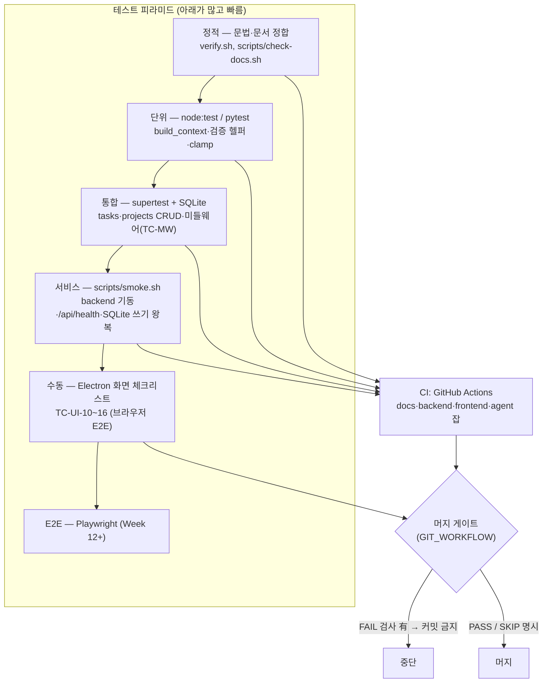

# 🧪 테스트 계획 (Test Plan)

> 무엇을·어떻게 검증하는가. 요구사항은 [requirements/](../requirements/), 추적은 [TRACEABILITY.md](../requirements/TRACEABILITY.md),
> 커밋 게이트는 [GIT_WORKFLOW.md](../../setup/GIT_WORKFLOW.md), 비기능 기준은 [REQUIREMENTS_NONFUNCTIONAL.md](../requirements/REQUIREMENTS_NONFUNCTIONAL.md) §5(TEST).

---

## 0. 테스트 피라미드와 게이트



**세 층** (ai_결과값.md #6):
1. **정적** — `verify.sh` (환경·문법·문서 정합). 앱을 실행하지 않는다.
2. **서비스** — `bash scripts/smoke.sh`: 임시 포트+임시 DB 로 backend 기동 → `/api/health` → task 생성/조회/삭제 왕복 → 정리. `verify.sh` 의 "▶ 서비스 확인" + CI `backend` 잡에 포함.
3. **사용자 흐름** — 로컬에서 backend+frontend 실행 후 TC-UI-10~16, GUI 체크(§5). 자동화 불가(디스플레이 필요).

`verify.sh` 전체 실행 시 정적+서비스가 한 번에 돈다 (현재 21/0/0).

## 1. 테스트 레벨과 범위

| 레벨 | 대상 | 도구 | 실행 위치 |
|---|---|---|---|
| **단위 (unit)** | 순수 로직 — `build_context()`, 검증 헬퍼, `clamp` 등 | `node --test` (backend), `pytest` (agent) | 로컬 + CI |
| **통합 (integration)** | Express 라우트 + DB (인메모리 → SQLite) 왕복 | `supertest` + `node --test` | 로컬 + CI |
| **서비스 (service)** | backend 프로세스가 실제로 뜨고 응답하고 SQLite 에 쓰는가 | `scripts/smoke.sh` (임시 포트·임시 DB) | 로컬(`verify.sh`) + CI(`backend` 잡) |
| **회귀 (regression)** | 저장소 교체(인메모리→SQLite) 후 기존 API 동작 동일 | 위 통합 테스트 재실행 | 로컬 + CI |
| **수동 (manual)** | Electron 화면, 실제 외부 API(OAuth) | 체크리스트 (§5) | 로컬 |
| **E2E** | 앱↔백엔드↔DB 전체 (Playwright) | 🔷 Week 12+ | 로컬 |

**원칙**
- 외부 API(Claude/Google/Notion)는 테스트에서 **모킹**한다. 실제 호출은 수동 스모크(`agent/tests/test_claude.py`)로만.
- SQLite 는 테스트마다 `:memory:` 또는 임시 파일 → 테스트 간 격리.
- 테스트는 결정적이어야 한다. 시각 의존 로직은 시각을 주입한다.

---

## 2. 디렉터리

```
backend/
  test/                     # *.test.js — node --test 가 수집
    helpers/
      testApp.js            # app.js + :memory: DB 를 supertest 로 감싸는 헬퍼
    tasks.test.js
    projects.test.js
    db.test.js               # ✅ Phase B2 (SQLite 회귀, TC-DB-01~03)
agent/
  tests/                    # test_*.py — pytest 가 수집
    test_daily_brief.py
    test_claude.py          # (이동됨) 실호출 스모크 — 키 없으면 skip
  pytest.ini                # testpaths=tests, network 마커 정의
tests/                      # 크로스 프로젝트 통합 (Week 12+, 지금은 README)
```

CI(`.github/workflows/test.yml`)에 `npm test`(backend), `pytest -m "not network"`(agent) 단계가 연결됨 (Phase A3 — NFR-TEST-03).

---

## 3. 테스트 케이스 목록

우선순위: **P0** = Phase A3 에서 바로 작성 · **P1** = 해당 기능 구현과 함께.

### 3.1 할일 API — `backend/test/tasks.test.js`

| ID | 대상 | 전제 | 입력 | 기대 결과 | 우선 |
|---|---|---|---|---|:---:|
| TC-TASK-01 | FR-TASK-01 | 빈 DB | `POST /api/tasks {title:"a"}` | 201, `task.id` 존재, `priority="medium"`, `status="todo"` | P0 |
| TC-TASK-02 | FR-TASK-01 | — | `POST /api/tasks {}` | 400 `{error:"title 은 필수입니다."}`, DB 변화 없음 | P0 |
| TC-TASK-03 | FR-TASK-01 | — | `POST` `{title:"a", priority:"urgent"}` | 400 (enum 검증 도입 후) | P1 |
| TC-TASK-04 | FR-TASK-02 | 할일 2건 | `GET /api/tasks` | 200, `tasks.length===2` | P0 |
| TC-TASK-05 | FR-TASK-02 | 빈 DB | `GET /api/tasks` | 200 `{tasks:[]}` (404 아님) | P0 |
| TC-TASK-06 | FR-TASK-03 | `status:"todo"` 할일 | `PUT /api/tasks/:id {status:"done"}` | 200, `status="done"`, `updated_at` 변경 | P0 |
| TC-TASK-07 | FR-TASK-04 | 할일 1건 | `PUT /api/tasks/:id {title:"b"}` | 200, `title="b"`, 다른 필드 유지 | P0 |
| TC-TASK-08 | FR-TASK-04 | — | `PUT /api/tasks/99999 {...}` | 404 | P0 |
| TC-TASK-09 | FR-TASK-04 | 할일 1건 | `DELETE /api/tasks/:id` → `GET` | 200 `{ok:true}`, 목록에서 사라짐 | P0 |
| TC-TASK-10 | FR-TASK-04 | — | `DELETE /api/tasks/99999` | 404 | P0 |
| TC-TASK-11 | FR-TASK-04 AC-3 | 할일 1건 | `PUT /api/tasks/:id {title:""}` | 400 (빈 제목 덮어쓰기 금지 — 구현 후) | P1 |
| TC-TASK-12 | FR-TASK-06 | 혼합 상태 할일 | `GET /api/tasks?status=todo` | `todo` 만 반환 | P1 |

### 3.2 프로젝트 API — `backend/test/projects.test.js`

| ID | 대상 | 입력 | 기대 결과 | 우선 |
|---|---|---|---|:---:|
| TC-PROJ-01 | FR-PROJ-01 | `POST /api/projects {name:"p"}` | 201, `progress=0`, `status="active"` | P0 |
| TC-PROJ-02 | FR-PROJ-01 | `POST {name:"p", progress:150}` | 400 `"progress 는 0~100..."` | P0 |
| TC-PROJ-03 | FR-PROJ-01 | `POST {}` | 400 `"name 은 필수입니다."` | P0 |
| TC-PROJ-04 | FR-PROJ-02 | `PUT /api/projects/99999 {progress:200}` | 404 (없는 id 가 progress 검증보다 우선) | P0 |
| TC-PROJ-05 | FR-PROJ-02 | `PUT /api/projects/:id {progress:50}` | 200, `progress=50` | P0 |
| TC-PROJ-06 | FR-PROJ-01 | `DELETE /api/projects/:id` | 200 `{ok:true}`, 이후 단건 404 | ✅ P0 |
| TC-PROJ-07 | FR-PROJ-02 | `GET /api/projects` (빈 상태) | 200 `{projects:[]}` | ✅ P0(C2) |
| TC-PROJ-08 | ADR-0012 | `POST /api/tasks {title, project_id:<존재>}` | 201, 응답에 `project_id` | ✅ P0(C2, `tasks.test.js`) |
| TC-PROJ-09 | ADR-0012 | `POST /api/tasks {project_id:9999}` | 400 `"연결할 프로젝트를 찾을 수 없습니다."`, 목록 불변 | ✅ P0(C2, `tasks.test.js`) |
| TC-PROJ-09b | ADR-0012 | `PUT /api/tasks/:id {project_id:null}` | 200, 연결 해제 | ✅ P0(C2, `tasks.test.js`) |
| TC-PROJ-09c | ADR-0012 | `PUT /api/tasks/:id {project_id:9999}` | 400 (없는 프로젝트) | ✅ P0(C2, `tasks.test.js`) |
| TC-PROJ-09d | ADR-0012 | `PUT /api/tasks/:id {project_id:"1"}` | 400 (문자열, 타입 오류) | ✅ P0(C2, `tasks.test.js`) |
| TC-PROJ-10 | FR-PROJ-01 AC-6 | 하위 할일 있는 프로젝트 `DELETE` | 할일 유지, `project_id`=null (ON DELETE SET NULL) | ✅ P0(C2) |
| TC-PROJ-11 | FR-PROJ-01 AC-8 | `PUT /api/projects/:id {status:"done"}` | 200, `status="done"` | ✅ P0(C2) |

### 3.3 저장소 회귀 — `backend/test/db.test.js`

| ID | 대상 | 전제 | 기대 결과 | 우선 |
|---|---|---|---|:---:|
| TC-DB-01 | FR-TASK-05 | SQLite 백엔드, 할일 2건 생성 | 프로세스/커넥션 재시작 후 `GET /api/tasks` 에 2건 유지 | ✅ P0(B2) |
| TC-DB-02 | NFR-MAINT-03 | `db.js` 시그니처 | `getTasks/getTask/addTask/updateTask/deleteTask` 반환 형태가 인메모리 때와 동일 | ✅ P0(B2) |
| TC-DB-03 | ADR-0003 | 빈 DB 파일 | 부팅 시 `schema.sql` 적용, 재부팅 시 데이터 보존 (`IF NOT EXISTS`) + WAL | ✅ P0(B2) |
| TC-DB-04a | schema CHECK | `POST /api/tasks {priority:"x"}` | 500 아니라 400 (라우트가 CHECK 위반 매핑, `errors.js`) | ✅ P0(C2, `tasks.test.js`) |
| TC-DB-04b | schema CHECK | `PUT /api/projects/:id {status:"hold"}` | 400 (허용값 밖) | ✅ P0(C2, `projects.test.js`) |
| TC-DB-04c | schema CHECK | `db.addTask` 직접 호출, 잘못된 값 | `SqliteError(code=SQLITE_CONSTRAINT_CHECK)` 던짐 | ✅ P1(C2, `db.test.js`) |
| TC-DB-04d | schema FK | `db.addTask({project_id:<없음>})` 직접 호출 | FK 위반으로 던짐 | ✅ P1(C2, `db.test.js`) |

### 3.4 에이전트 — `agent/tests/test_daily_brief.py`

| ID | 대상 | 전제 (모킹) | 기대 결과 | 우선 |
|---|---|---|---|:---:|
| TC-AGENT-01 | FR-AGENT-01 | gmail/calendar 가 각각 데이터 반환 | `build_context()` 에 이메일·일정·기준시각 텍스트 포함 | P0 |
| TC-AGENT-02 | FR-AGENT-01 AC-2 | 모든 소스가 빈 리스트 | 각 블록이 `"없음"`, 예외 없음 | P0 |
| TC-AGENT-03 | FR-AGENT-06 AC-1 | `claude.ask` 가 예외 발생 | `generate_daily_brief()` 가 `"⚠️ Claude 호출 실패: ..."` 문자열 반환, 크래시 없음 | P0 |
| TC-AGENT-04 | FR-AGENT-03 AC-2 | `save_to_notion` 예외 | 브리핑은 로컬(`briefs`)에 저장됨, `sync_logs('notion','failed')` 1행 | P1 |
| TC-AGENT-05 | FR-AGENT-04 AC-1 | 같은 날 2회 실행 | `briefs` 에 해당 날짜 1행만 (upsert) | P1 |
| TC-AGENT-06 | FR-AGENT-02 | `claude.ask` 모킹 응답 | `briefs.content` 에 저장됨 | P1 |

`agent/tests/test_claude.py` (이동 완료): `ANTHROPIC_API_KEY` 없으면 `skip`, 있으면 1회 실호출 성공 확인.

### 3.5 다이어그램 API — `backend/test/diagrams.test.js` (Phase C4)

| ID | 대상 | 전제 | 입력 | 기대 결과 | 우선 |
|---|---|---|---|---|:---:|
| TC-DIAG-01 | FR-UI-05 AC-5 | mermaid 블록 2개 든 픽스처 md | `GET /api/diagrams` | 200, `diagrams.length===2`, 각 항목에 `doc/path/index/title/code` | P1 |
| TC-DIAG-02 | FR-UI-05 AC-3 | `docs/` 경로 없음(주입) | `GET /api/diagrams` | 200 `{diagrams:[]}` (500 아님) | P1 |
| TC-DIAG-03 | FR-UI-05 | `?doc=DESIGN` | `GET /api/diagrams?doc=DESIGN` | 해당 문서 블록만 반환 | P1 |

> 픽스처: 임시 디렉터리에 mermaid 블록 md 를 만들고 `services/diagrams.js` 의 docs 루트를 주입.
> 파싱 로직(펜스 추출·heading 매칭)은 순수 함수로 분리해 단위 테스트 가능하게 한다.

### 3.5b 미들웨어 — `backend/test/middleware.test.js` (Phase C1)

| ID | 대상 | 절차 | 기대 결과 |
|---|---|---|---|
| TC-MW-01 | NFR-SEC-06 | 허용 오리진으로 `GET /api/tasks` | 200 + `Access-Control-Allow-Origin` 에코 + `Vary: Origin` |
| TC-MW-02 | NFR-SEC-06 | 비허용 오리진으로 요청 | 응답에 CORS 헤더 없음 |
| TC-MW-03 | NFR-SEC-06 | `OPTIONS` preflight (PUT, custom content-type) | 204 + `Access-Control-Allow-Methods`/`-Headers`/`-Max-Age` |
| TC-MW-04 | NFR-SEC-06 | `Origin: null` (prod Electron `file://`) | 200 + `Access-Control-Allow-Origin: null` |
| TC-MW-05 | NFR-SEC-07 | 정의되지 않은 경로 | 404 `{error:'요청한 경로를 찾을 수 없습니다.'}` (여분 키 없음) |
| TC-MW-06 | NFR-SEC-07 | 깨진 JSON 본문 | 400 `{error:'요청 본문(JSON) 형식이 올바르지 않습니다.'}` |
| TC-MW-07 | NFR-REL / OBS | `errorHandler` 직접 호출 (console.error mock) | 500 표준 봉투 |
| TC-MW-08 | NFR-OBS-01 | 개발 환경 요청 1건 | `requestLogger` 가 `METHOD path status ms` 1줄 출력 |
| TC-MW-09 | NFR-SEC-06 | 200KB 본문 POST | 413 `{error:'요청 본문이 너무 큽니다.'}` (영어 메시지 미매치) |

### 3.6 수동 체크리스트 (Electron / OAuth)

| ID | 대상 | 절차 | 통과 조건 |
|---|---|---|---|
| TC-UI-01 | FR-UI-02 | `npm run dev` | React `App` 이 렌더되고 콘솔 에러 없음 |
| TC-UI-02 | FR-UI-01 AC-2 | 백엔드 끈 채 앱 실행 | 각 패널이 개별 `ErrorBanner` 표시, 앱 정상 |
| TC-UI-03 | FR-TASK-03 | 체크박스 클릭 | `PUT` 호출 + 해당 항목만 갱신 (네트워크 탭 확인) |
| TC-UI-04 | FR-UI-03 AC-2 | macOS 모든 창 닫기 → 독 클릭 | 앱 유지, 창 재생성 |
| TC-UI-05 | NFR-SEC-04 | DevTools 콘솔에서 `window.require` | `undefined` (nodeIntegration off) |
| TC-UI-06 | FR-AUTH-01 | Google OAuth 로그인 (Week 6) | refresh token 이 암호화 저장됨 (평문 아님) |
| TC-UI-07 | FR-UI-02 AC-4 | `npm run build && npm start` | prod 번들(`dist/`)이 `file://` + `script-src 'self'` 로 로드, 콘솔 CSP 위반 0 |
| TC-UI-08 | FR-UI-02 오류 시나리오 | Vite dev 서버 끄고 `NODE_ENV=development npm start` | 흰 화면 대신 `fallback.html` "개발 서버(:5173)에 연결할 수 없습니다" 안내 |
| TC-UI-09 | FR-UI-05 AC-1~4 | 백엔드 켠 채 앱 실행 → 다이어그램 패널 열기 | 4개 그룹 선택 가능, SVG 렌더(다크), 백엔드 끄면 패널만 `ErrorBanner`, 문법 깨진 블록은 원문 폴백 |
| TC-UI-10 | FR-UI-01 AC-2/4, FR-TASK-02 | CORS 적용 후 앱 실행 → 할일 패널 관찰 | 로딩 → 정상 전이, 목록 렌더. 0건이면 "할 일이 없습니다" 표시. 상태: C1 완료, 로컬 수동 확인 대기 |
| TC-UI-11 | FR-TASK-03 AC-4 | 체크박스 클릭 후 백엔드 중단 | 즉시 UI 반영 후 요청 실패 시 원상복구 + `ErrorBanner`. 상태: C1 완료, 로컬 수동 확인 대기 |
| TC-UI-12 | FR-TASK-04 AC-6 | 삭제 클릭 중 백엔드 중단 | 항목이 원위치로 복원됨 + `ErrorBanner`. 상태: C1 완료, 로컬 수동 확인 대기 |
| TC-UI-13 | FR-TASK-01 | 폼에 제목만 입력 후 제출 | `POST` 201, 목록 맨 아래 append, 폼 초기화. 상태: C1 완료, 로컬 수동 확인 대기 |
| TC-UI-14 | FR-PROJ-01 AC-7 | 프로젝트 폼에 이름만 입력 후 제출 | `POST /api/projects` 201, 카드 목록에 즉시 추가, 폼 초기화. 상태: C2 완료, 로컬 수동 확인 대기 |
| TC-UI-15 | FR-PROJ-02 AC-5 | 카드 진행도 슬라이더 드래그 후 놓음, 백엔드 중단 | 해당 카드만 낙관적 갱신, 요청 실패 시 롤백 + `ErrorBanner`. 상태: C2 완료, 로컬 수동 확인 대기 |
| TC-UI-16 | FR-PROJ-01 AC-8 / FR-UI-01 AC-2 | 카드 상태 드롭다운 변경 / 프로젝트 API 실패 | `PUT {status}` 200 반영 / 프로젝트 패널 에러가 할일 패널 렌더를 막지 않음. 상태: C2 완료, 로컬 수동 확인 대기 |

---

## 4. 픽스처 정책

| 항목 | 규칙 |
|---|---|
| DB | 각 테스트 파일 `beforeEach` 에서 새 `:memory:` DB + `schema.sql` 적용. 테스트 간 공유 금지 |
| 시각 | `created_at` 등 검증 시 고정 시각 주입 또는 "존재 + ISO8601 형식" 만 확인 |
| 외부 API | `agent` 는 `services/*` 를 monkeypatch, `backend` 는 해당 없음 |
| 랜덤 | 사용 금지. id 는 시퀀스 |
| 네트워크 | 테스트는 외부 네트워크에 접근하지 않는다 (CI 에서도) |

---

## 5. 머지 게이트 — "테스트 없이 머지 불가"

| 변경 유형 | 필수 테스트 |
|---|---|
| 라우트 추가·수정 | 해당 도메인 통합 테스트 (정상 + 검증실패 + 404) |
| `db.js` / 저장소 교체 | TC-DB-01~03 회귀 전부 통과 |
| `build_context` / 에이전트 로직 | 해당 단위 테스트 + 실패 격리(TC-AGENT-03 류) |
| 프론트 컴포넌트 | 최소 수동 체크리스트 해당 항목 수행 후 보고 |
| 문서·설정만 | 테스트 불필요 ([GIT_WORKFLOW.md](../../setup/GIT_WORKFLOW.md) §1) |

supervisor 는 리뷰 시 "이 변경에 대응하는 테스트가 있는가"를 점검한다.

---

## 6. `verify.sh` / CI 와의 관계

| 수단 | 검사 |
|---|---|
| `verify.sh` | 환경 + **문법**(`node -c`, `compileall`). 테스트는 돌리지 않음 |
| `verify.sh --code-only` | 문법만. 커밋 게이트용 |
| `npm test` / `pytest -m "not network"` | **이 문서의 테스트 케이스**. Phase A3 에서 CI 에 연결됨 |
| GitHub Actions | push/PR 마다 문법 + 테스트(`npm test`, `pytest -m "not network"`). 초록이어야 머지 |

---

## 7. 현재 상태 (2026-09-03, Phase C2 완료)

- 백엔드 자동화 테스트: **39케이스 작성됨** — `backend/test/tasks.test.js` (TC-TASK-01,02,04~10 + TC-PROJ-08/09/09b/09c/09d + TC-DB-04a), `backend/test/projects.test.js` (TC-PROJ-01~07,10,11 + TC-DB-04b), `backend/test/db.test.js` (TC-DB-01~03 + TC-DB-04c/d), `backend/test/middleware.test.js` (TC-MW-01~09). `supertest` + `node --test`, `:memory:` DB. (TC-DB-04b 는 project status 검증이라 `projects.test.js` 에 위치.)
- 에이전트 자동화 테스트: **3케이스 작성됨** — `agent/tests/test_daily_brief.py` (TC-AGENT-01~03). `test_claude.py` 는 `agent/tests/` 로 이동(연결 확인용, 키 없으면 skip).
- CI: 문법 검사 + `npm test`(backend) + `pytest -m "not network"`(agent) 연결됨. `node -c src/app.js`, `src/db.js`, `db/index.js` 추가.
- `verify.sh`: + `backend/src/errors.js` 문법 체크 추가 (19/0/0, SKIP 없음).
- 미작성(후속): TC-TASK-03/11/12, TC-AGENT-04~06.
- Phase C2(2026-09-03): 프로젝트 CRUD 프론트 배선(`useProjectStore`, `ProjectForm`, `ProjectCard` 상태·진행도·삭제) + `tasks.project_id` 라우트 검증(ADR-0012) + `backend/src/errors.js`(SQLite CHECK/NOTNULL/FK → 400 한국어) + `'hold'`→`'on_hold'` 통일. `npm test` 39/39, `verify.sh` 19/0/0, frontend `npm run build` 성공. 브라우저 수동 체크(TC-UI-14~16)는 로컬 수행 대기(샌드박스 창 기동 불가).
- Phase C1(2026-09-03): `backend/src/middleware/{cors,requestLogger,errorHandler}.js` 분리, `backend/src/app.js` 미들웨어 체인 정식화(`requestLogger` 최상단), `backend/test/middleware.test.js` 신규(TC-MW-01~09). `npm test` 27/27, `verify.sh` 18/0/0. 브라우저 E2E(TC-UI-10~13)는 로컬 수동 확인 대기.
- Phase B2(2026-09-02): `backend/src/db.js` 를 better-sqlite3 로 재작성, `backend/db/index.js` 신규(커넥션 싱글턴 + WAL + `DATABASE_PATH`), `backend/test/db.test.js` 추가. `npm test` 18/18 (node 26·22), `verify.sh` 15/0/0, frontend `npm run build` 회귀 없음, agent pytest 3 pass.
- Phase B1(2026-09-02): `frontend/vite.config.js` + `renderer.jsx` 마운트. `npm run build` 성공(`dist/index.html` + `dist/assets/*.js`), prod CSP 지시어 확인, `verify.sh` 13/0/0. 프론트 수동 체크리스트(TC-UI-01, TC-UI-07 prod 스모크)는 **로컬 수행 대기** — 샌드박스에서 electron 바이너리 postinstall 차단으로 창 기동 불가. `main.js` dev/prod 분기·`fallback.html` 폴백은 코드 리뷰로 판정.

---

**작성:** 2026-09-02
