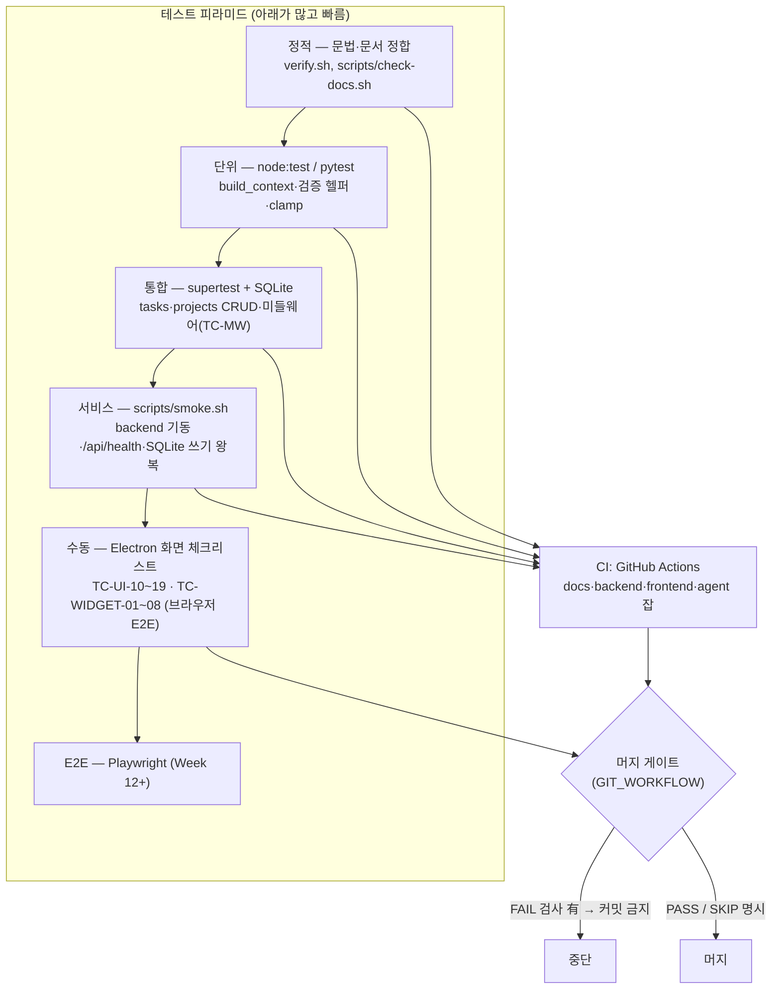

# 🧪 테스트 계획 (Test Plan)

> 무엇을·어떻게 검증하는가. 요구사항은 [requirements/](../requirements/), 추적은 [TRACEABILITY.md](../requirements/TRACEABILITY.md),
> 커밋 게이트는 [GIT_WORKFLOW.md](../../setup/GIT_WORKFLOW.md), 비기능 기준은 [REQUIREMENTS_NONFUNCTIONAL.md](../requirements/REQUIREMENTS_NONFUNCTIONAL.md) §5(TEST).

---

## 0. 테스트 피라미드와 게이트



**세 층** (ai_결과값.md #6):
1. **정적** — `verify.sh` (환경·문법·문서 정합). 앱을 실행하지 않는다.
2. **서비스** — `bash scripts/smoke.sh`: 임시 포트+임시 DB 로 backend 기동 → `/api/health` → task 생성/조회/삭제 왕복 → 정리. `verify.sh` 의 "▶ 서비스 확인" + CI `backend` 잡에 포함.
3. **사용자 흐름** — 로컬에서 backend+frontend 실행 후 TC-UI-10~16, GUI 체크(§5). 자동화 불가(디스플레이 필요).

`verify.sh` 전체 실행 시 정적+서비스가 한 번에 돈다 (현재 21/0/0).

## 1. 테스트 레벨과 범위

| 레벨 | 대상 | 도구 | 실행 위치 |
|---|---|---|---|
| **단위 (unit)** | 순수 로직 — `build_context()`, 검증 헬퍼, `clamp` 등 | `node --test` (backend), `pytest` (agent) | 로컬 + CI |
| **통합 (integration)** | Express 라우트 + DB (인메모리 → SQLite) 왕복 | `supertest` + `node --test` | 로컬 + CI |
| **서비스 (service)** | backend 프로세스가 실제로 뜨고 응답하고 SQLite 에 쓰는가 | `scripts/smoke.sh` (임시 포트·임시 DB) | 로컬(`verify.sh`) + CI(`backend` 잡) |
| **회귀 (regression)** | 저장소 교체(인메모리→SQLite) 후 기존 API 동작 동일 | 위 통합 테스트 재실행 | 로컬 + CI |
| **수동 (manual)** | Electron 화면, 실제 외부 API(OAuth) | 체크리스트 (§5) | 로컬 |
| **E2E** | 앱↔백엔드↔DB 전체 (Playwright) | 🔷 Week 12+ | 로컬 |

**원칙**
- 외부 API(Claude/Google/Notion)는 테스트에서 **모킹**한다. 실제 호출은 수동 스모크(`agent/tests/test_claude.py`)로만.
- SQLite 는 테스트마다 `:memory:` 또는 임시 파일 → 테스트 간 격리.
- 테스트는 결정적이어야 한다. 시각 의존 로직은 시각을 주입한다.

---

## 2. 디렉터리

```
backend/
  test/                     # *.test.js — node --test 가 수집
    helpers/
      testApp.js            # app.js + :memory: DB 를 supertest 로 감싸는 헬퍼 (loadService 포함)
      crashFixture.js        # ✅ fix/ai-results-cleanup (TC-REL-06 자식 프로세스 픽스처)
    tasks.test.js
    projects.test.js
    services.test.js         # ✅ fix/ai-results-cleanup (서비스 계층, TC-MAINT-01~05)
    lifecycle.test.js        # ✅ fix/ai-results-cleanup (프로세스 수명주기, TC-REL-01~06)
    calendar.test.js         # ✅ Phase C3 (캘린더 더미 API, TC-CAL-01~07)
    db.test.js               # ✅ Phase B2 (SQLite 회귀, TC-DB-01~03)
agent/
  tests/                    # test_*.py — pytest 가 수집
    test_daily_brief.py
    test_db.py
    test_retry.py            # ✅ Phase D2-a (call_with_retry)
    test_google_oauth.py     # ✅ Phase D2-b (OAuth + Fernet 토큰, TC-AUTH-01~08)
    test_gmail.py            # ✅ Phase D2-b (Gmail 수집, TC-MAIL-01~09)
    test_calendar.py         # ✅ Phase D2-b (Calendar 수집, TC-CAL-08~14)
    test_claude.py          # (이동됨) 실호출 스모크 — 키 없으면 skip
  pytest.ini                # testpaths=tests, network 마커 정의
tests/                      # 크로스 프로젝트 통합 (Week 12+, 지금은 README)
```

CI(`.github/workflows/test.yml`)에 `npm test`(backend), `pytest -m "not network"`(agent) 단계가 연결됨 (Phase A3 — NFR-TEST-03).

프론트엔드(`frontend/`)에는 아직 테스트 러너가 없다. UI 계층 검증은 `npm run build`(타입/번들 성공) + §3.6~3.7 수동 체크리스트로 커버한다. 위젯 셸 관련 코드(C5): `frontend/src/widgets/{registry,defaultLayout,layoutStorage,themeVars}.js` + `widgets/views/*` + `components/Widget{Shell,Host,Frame,Picker}.jsx` + `store/useLayoutStore.js`.

---

## 3. 테스트 케이스 목록

우선순위: **P0** = Phase A3 에서 바로 작성 · **P1** = 해당 기능 구현과 함께.

### 3.1 할일 API — `backend/test/tasks.test.js`

| ID | 대상 | 전제 | 입력 | 기대 결과 | 우선 |
|---|---|---|---|---|:---:|
| TC-TASK-01 | FR-TASK-01 | 빈 DB | `POST /api/tasks {title:"a"}` | 201, `task.id` 존재, `priority="medium"`, `status="todo"` | P0 |
| TC-TASK-02 | FR-TASK-01 | — | `POST /api/tasks {}` | 400 `{error:"title 은 필수입니다."}`, DB 변화 없음 | P0 |
| TC-TASK-03 | FR-TASK-01 | — | `POST` `{title:"a", priority:"urgent"}` | 400 (enum 검증 도입 후) | P1 |
| TC-TASK-04 | FR-TASK-02 | 할일 2건 | `GET /api/tasks` | 200, `tasks.length===2` | P0 |
| TC-TASK-05 | FR-TASK-02 | 빈 DB | `GET /api/tasks` | 200 `{tasks:[]}` (404 아님) | P0 |
| TC-TASK-06 | FR-TASK-03 | `status:"todo"` 할일 | `PUT /api/tasks/:id {status:"done"}` | 200, `status="done"`, `updated_at` 변경 | P0 |
| TC-TASK-07 | FR-TASK-04 | 할일 1건 | `PUT /api/tasks/:id {title:"b"}` | 200, `title="b"`, 다른 필드 유지 | P0 |
| TC-TASK-08 | FR-TASK-04 | — | `PUT /api/tasks/99999 {...}` | 404 | P0 |
| TC-TASK-09 | FR-TASK-04 | 할일 1건 | `DELETE /api/tasks/:id` → `GET` | 200 `{ok:true}`, 목록에서 사라짐 | P0 |
| TC-TASK-10 | FR-TASK-04 | — | `DELETE /api/tasks/99999` | 404 | P0 |
| TC-TASK-11 | FR-TASK-04 AC-3 | 할일 1건 | `PUT /api/tasks/:id {title:""}` | 400 (빈 제목 덮어쓰기 금지 — 구현 후) | P1 |
| TC-TASK-12 | FR-TASK-06 | 프로젝트 2개 + 각 할일 | `GET /api/tasks?project_id=<p1>` | p1 의 할일만 (생성 순) | P1 · ✅ |
| TC-TASK-12b | FR-TASK-06 | 연결/단독 혼재 | `GET /api/tasks?project_id=none` | `project_id` NULL 인 할일만 | P1 · ✅ |
| TC-TASK-12c | FR-TASK-06 | — | `?project_id=99999` / `?project_id=abc\|0\|-3\|1.5` | 전자 200 + `[]`, 후자 400 | P1 · ✅ |
| TC-TAG-01 | FR-TASK-08 AC-2 | 할일 1건 | `POST /api/tasks/:id/tags {tag:"공부"}` | 201, `task.tags==["공부"]`, `source` 미노출 | P1 · ✅ |
| TC-TAG-02 | FR-TASK-08 AC-2 | 태그 2건 추가 | `GET /api/tasks` · `GET /api/tasks/:id` | 두 응답 모두 `tags` 오름차순 | P1 · ✅ |
| TC-TAG-03 | FR-TASK-08 AC-10 | 같은 태그 재추가 | `POST .../tags` ×2 | 201, 중복 없음(멱등) | P1 · ✅ |
| TC-TAG-04 | FR-TASK-08 AC-9 | — | `tag` = `""`/공백/21자/콤마/개행 | 400 `태그는 1~20자여야 합니다.` | P1 · ✅ |
| TC-TAG-05 | FR-TASK-08 AC-10 | — | `POST /api/tasks/99999/tags` | 404 `할일을 찾을 수 없습니다.` | P1 · ✅ |
| TC-TAG-06 | FR-TASK-08 AC-2 | 태그 2건 | `DELETE /api/tasks/:id/tags/<enc>` | 200, 해당 태그만 제거 | P1 · ✅ |
| TC-TAG-07 | FR-TASK-08 AC-10 | 태그 없음 | `DELETE .../tags/없음` | 200 (멱등) | P1 · ✅ |
| TC-TAG-08 | FR-TASK-08 AC-11 | 태그 있는 할일 | `DELETE /api/tasks/:id` | `task_tags` CASCADE 삭제 | P1 · ✅ |

### 3.2 프로젝트 API — `backend/test/projects.test.js`

| ID | 대상 | 입력 | 기대 결과 | 우선 |
|---|---|---|---|:---:|
| TC-PROJ-01 | FR-PROJ-01 | `POST /api/projects {name:"p"}` | 201, `progress=0`, `status="active"` | P0 |
| TC-PROJ-02 | FR-PROJ-01 | `POST {name:"p", progress:150}` | 400 `"progress 는 0~100..."` | P0 |
| TC-PROJ-03 | FR-PROJ-01 | `POST {}` | 400 `"name 은 필수입니다."` | P0 |
| TC-PROJ-04 | FR-PROJ-02 | `PUT /api/projects/99999 {progress:200}` | 404 (없는 id 가 progress 검증보다 우선) | P0 |
| TC-PROJ-05 | FR-PROJ-02 | `PUT /api/projects/:id {progress:50}` | 200, `progress=50` | P0 |
| TC-PROJ-06 | FR-PROJ-01 | `DELETE /api/projects/:id` | 200 `{ok:true}`, 이후 단건 404 | ✅ P0 |
| TC-PROJ-07 | FR-PROJ-02 | `GET /api/projects` (빈 상태) | 200 `{projects:[]}` | ✅ P0(C2) |
| TC-PROJ-08 | ADR-0012 | `POST /api/tasks {title, project_id:<존재>}` | 201, 응답에 `project_id` | ✅ P0(C2, `tasks.test.js`) |
| TC-PROJ-09 | ADR-0012 | `POST /api/tasks {project_id:9999}` | 400 `"연결할 프로젝트를 찾을 수 없습니다."`, 목록 불변 | ✅ P0(C2, `tasks.test.js`) |
| TC-PROJ-09b | ADR-0012 | `PUT /api/tasks/:id {project_id:null}` | 200, 연결 해제 | ✅ P0(C2, `tasks.test.js`) |
| TC-PROJ-09c | ADR-0012 | `PUT /api/tasks/:id {project_id:9999}` | 400 (없는 프로젝트) | ✅ P0(C2, `tasks.test.js`) |
| TC-PROJ-09d | ADR-0012 | `PUT /api/tasks/:id {project_id:"1"}` | 400 (문자열, 타입 오류) | ✅ P0(C2, `tasks.test.js`) |
| TC-PROJ-10 | FR-PROJ-01 AC-6 | 하위 할일 있는 프로젝트 `DELETE` | 할일 유지, `project_id`=null (ON DELETE SET NULL) | ✅ P0(C2) |
| TC-PROJ-11 | FR-PROJ-01 AC-8 | `PUT /api/projects/:id {status:"done"}` | 200, `status="done"` | ✅ P0(C2) |

### 3.3 저장소 회귀 — `backend/test/db.test.js`

| ID | 대상 | 전제 | 기대 결과 | 우선 |
|---|---|---|---|:---:|
| TC-DB-01 | FR-TASK-05 | SQLite 백엔드, 할일 2건 생성 | 프로세스/커넥션 재시작 후 `GET /api/tasks` 에 2건 유지 | ✅ P0(B2) |
| TC-DB-02 | NFR-MAINT-03 | `db.js` 시그니처 | `getTasks/getTask/addTask/updateTask/deleteTask` 반환 형태가 인메모리 때와 동일 | ✅ P0(B2) |
| TC-DB-03 | ADR-0003 | 빈 DB 파일 | 부팅 시 `schema.sql` 적용, 재부팅 시 데이터 보존 (`IF NOT EXISTS`) + WAL. **P6 수정:** 테이블 목록에 `task_tags` 포함 | ✅ P0(B2) |
| TC-DB-05 | ADR-0018 / FR-TASK-08 | 옛 `sync_logs` CHECK(`classify` 없음) + `user_version=0` 인 **파일 DB** | 재오픈 시 `applyMigrations` 가 테이블 재작성으로 CHECK 확장, `user_version=1`, 기존 행 보존, `classify` INSERT 가능 | ✅ P1(P6, `db.test.js`) |
| TC-DB-04a | schema CHECK | `POST /api/tasks {priority:"x"}` | 500 아니라 400 (라우트가 CHECK 위반 매핑, `errors.js`) | ✅ P0(C2, `tasks.test.js`) |
| TC-DB-04b | schema CHECK | `PUT /api/projects/:id {status:"hold"}` | 400 (허용값 밖) | ✅ P0(C2, `projects.test.js`) |
| TC-DB-04c | schema CHECK | `db.addTask` 직접 호출, 잘못된 값 | `SqliteError(code=SQLITE_CONSTRAINT_CHECK)` 던짐 | ✅ P1(C2, `db.test.js`) |
| TC-DB-04d | schema FK | `db.addTask({project_id:<없음>})` 직접 호출 | FK 위반으로 던짐 | ✅ P1(C2, `db.test.js`) |

### 3.4 에이전트 — `agent/tests/test_daily_brief.py`

| ID | 대상 | 전제 (모킹) | 기대 결과 | 우선 |
|---|---|---|---|:---:|
| TC-AGENT-01 | FR-AGENT-01 | 할일/gmail/calendar 가 각각 데이터 반환 | `build_context()` 에 할일·이메일·일정·기준시각 텍스트 포함 | P0 · ✅ 작성됨 |
| TC-AGENT-02 | FR-AGENT-01 AC-2 | 모든 소스가 빈 리스트 | 각 블록이 `"없음"` (3회), 예외 없음 | P0 · ✅ 작성됨 |
| TC-AGENT-03 | FR-AGENT-06 AC-1 | `claude.ask` 가 예외 발생 | `_run()` 이 `(False, "⚠️ Claude 호출 실패: ...")`, `upsert_brief`·`save_to_notion` 미호출, 크래시 없음 | P0 · ✅ 작성됨 |
| TC-AGENT-04 | FR-AGENT-03 AC-2 | `save_to_notion` 예외 | 브리핑은 로컬(`briefs`)에 저장됨, `sync_logs('notion','failed')` 1행, `notion_url` NULL, 사유 마스킹 | P1 · ✅ 작성됨 |
| TC-AGENT-05 | FR-AGENT-04 AC-1 | 같은 날 2회 `upsert_brief` | `briefs` 에 해당 날짜 1행만, content 최신값 | P1 · ✅ 작성됨 (`test_db.py`) |
| TC-AGENT-06 | FR-AGENT-02 | `claude.ask` 모킹 응답 | `briefs.content` 에 저장됨 | P1 · ✅ 작성됨 |
| TC-AGENT-09 | FR-AGENT-01 | `DATABASE_PATH` env 설정/공백/미설정 | `resolve_db_path()` env 우선, 아니면 `backend/data/app.db` | P1 · ✅ 작성됨 (`test_db.py`) |
| TC-AGENT-10 | FR-AGENT-01 | 빈 파일 DB 에서 `ensure_schema` 2회 | `tasks`/`briefs` 생성, 멱등 | P1 · ✅ 작성됨 (`test_db.py`) |
| TC-AGENT-11 | FR-AGENT-01 | `connect()` 직후 PRAGMA 조회 | `journal_mode=wal`, `busy_timeout=5000` | P2 · ✅ 작성됨 (`test_db.py`) |
| TC-AGENT-12 | FR-AGENT-01 | tasks 에 오늘/다른날짜/done 혼재 | `get_today_tasks()` 오늘·미완료만, priority 정렬 | P1 · ✅ 작성됨 (`test_db.py`) |
| TC-AGENT-13 | FR-AGENT-01 AC-3 | `get_today_tasks` 예외 | 컨텍스트에 `"(할일을 불러오지 못함)"`, 나머지 블록 정상 | P1 · ✅ 작성됨 |
| TC-AGENT-14 | FR-AGENT-06 AC-2 | `save_to_notion` 예외 + 실 `briefs` | `briefs` 행 유지, 결과에 `"Notion 저장만 실패"` | P1 · ✅ 작성됨 |
| TC-AGENT-15 | FR-AGENT-02 | 실 Claude 1회 호출 (`network` 마커) | 비어있지 않은 브리핑 + `briefs` 저장, 키 없으면 skip | P2 · ✅ 작성됨 |
| TC-AGENT-16 | FR-AGENT-06 AC-3 / NFR-REL-05 | `retry.call_with_retry` — 2회 실패 후 3회째 성공 (`sleep` 모킹) | 3회째 반환값 정상, `sleep` 이 1s·2s 로 2회 호출 | P1 · ✅ 작성됨 (`test_retry.py`) |
| TC-AGENT-17 | FR-AGENT-06 AC-3 / NFR-REL-05 | 3회 전부 실패 | 마지막 예외 전파, `sleep` 2회 호출(1s·2s) | P1 · ✅ 작성됨 (`test_retry.py`) |
| TC-AGENT-18 | FR-AGENT-06 AC-3 / NFR-REL-05 | 인증/4xx 예외 발생 | 재시도 0회 즉시 전파, `sleep` 미호출 | P1 · ✅ 작성됨 (`test_retry.py`) |
| TC-AGENT-19 | FR-AGENT-01 (스키마 부트스트랩) | 빈 파일 DB 에서 `daily_brief._run()` | `ensure_schema` 호출 → `tasks`/`briefs` 생성 후 정상 진행, 크래시 없음 | P1 · ✅ 작성됨 (`test_daily_brief.py`) |

`agent/tests/test_retry.py` (Phase D2-a 신규): `call_with_retry` 의 성공·재시도·즉시 실패 경로 (`time.sleep` monkeypatch, 네트워크 무접촉).

| TC-AGENT-20 | FR-AGENT-01 AC-3 | `get_unread_emails` 예외 (캐시 조회 실패) | 컨텍스트에 `"(이메일을 불러오지 못함)"`, 할일 블록 정상 | P1 · ✅ 작성됨 (`test_daily_brief.py`) |
| TC-AGENT-21 | AGENT.md (네트워크 격리) | `daily_brief` 소스 검사 | `services.gmail`·`services.calendar` 를 import 하지 않음 | P1 · ✅ 작성됨 (`test_daily_brief.py`) |

#### 3.4d 할 일 자동 분류 — `agent/tests/test_classify.py` (P6, FR-TASK-08)

Claude(`classify.ask`)는 전부 monkeypatch — `network` 마커 없음. DB 는 `temp_db` fixture(파일 SQLite).

| ID | 대상 | 전제 | 기대 결과 | 상태 |
|---|---|---|---|:---:|
| TC-AGENT-31 | `parse_tags` | 정상 JSON | `{id:[tags]}` (id 정수화) | ✅ |
| TC-AGENT-32 | `parse_tags` | ```` ```json ```` 코드펜스 래핑 | 펜스 제거 후 파싱 | ✅ |
| TC-AGENT-33 | `parse_tags` | 중복·4개 초과·21자 태그 | 중복 제거, 최대 3개, 1~20자 밖 제외 | ✅ |
| TC-AGENT-34 | `parse_tags` | `"not json"`/`{}`/`{"tags":[]}`/비정수 id | `ValueError` | ✅ |
| TC-AGENT-35 | `build_prompt` | 할일 목록 | 각 `id=<n>` + 제목 포함 | ✅ |
| TC-AGENT-36 | `classify_untagged` | 대상 0건 | `ask` 호출 0회, 반환 0 | ✅ |
| TC-AGENT-37 | `classify_untagged` | 태그 없는 할일 1건 + mock 응답 | `task_tags` 에 `source='agent'` 저장, `sync_logs('classify','success')` | ✅ |
| TC-AGENT-38 | `classify_untagged` | `ask` 예외 | 반환 0(전파 없음), `sync_logs('classify','failed')` | ✅ |
| TC-AGENT-39 | `db.add_agent_tags` | 이미 `source='user'` 태그 있는 할일 | 저장 0건 (건드리지 않음) | ✅ |
| TC-AGENT-40 | `db.get_untagged_tasks` | done·태그 있는 할일 혼재 | 미완료·태그 0개만 반환 | ✅ |

`test_daily_brief.py`: `_run()` 이 `build_context` 전에 `classify_untagged()` 를 호출하고 그 예외를 삼킨다(순서 검증).

#### 3.4e Notion 저장 — `agent/tests/test_notion.py` (Phase D3)

`requests.post` monkeypatch + `retry.sleep` 무력화. `network` 마커 없음(모두 모킹).

| ID | 대상 | 전제 (모킹) | 기대 결과 | 우선 |
|---|---|---|---|:---:|
| TC-AGENT-22 | FR-AGENT-03 AC-1 | 200 `{"url","id"}` | `save_to_notion` URL 반환, body 에 `parent.page_id`·title·children, 헤더 `Notion-Version` | P1 · ✅ |
| TC-AGENT-23 | FR-AGENT-03 AC-3 | `NOTION_API_KEY` 삭제 | `NotionNotConfigured`, `requests.post` 미호출 | P1 · ✅ |
| TC-AGENT-24 | FR-AGENT-03 AC-3 | `NOTION_PARENT_PAGE_ID` 만 없음 | `NotionNotConfigured` + 메시지에 `.env`·`Connections` 안내 | P1 · ✅ |
| TC-AGENT-25 | FR-AGENT-03 AC-4 | 429 두 번 → 200 | 3회째 성공, `sleep` 1s·2s | P1 · ✅ |
| TC-AGENT-26 | FR-AGENT-03 AC-4 | 401 | 재시도 0, `sleep` 미호출, 즉시 `RuntimeError` | P1 · ✅ |
| TC-AGENT-27 | FR-AGENT-03 AC-1 | 5000자 content | `children` 3블록, 각 ≤2000자 | P2 · ✅ |
| TC-AGENT-28 | NFR-SEC-04 | 토큰 포함 에러 문자열 | `sanitize_error` 로 `***` 마스킹 | P1 · ✅ |
| TC-AGENT-29 | FR-AGENT-03 AC-2 | `save_to_notion` → URL | `briefs.notion_url` 채움, `sync_logs('notion','success')`, `created_at` 불변 | P1 · ✅ (`test_daily_brief.py`) |
| TC-AGENT-30 | FR-AGENT-03 AC-3 | `save_to_notion` → `NotionNotConfigured` | `_run()` `(True, ...)`, 결과에 ℹ️, `sync_logs` 0행, 브리핑은 저장 | P1 · ✅ (`test_daily_brief.py`) |

#### 3.4f 브리핑 API — `backend/test/brief.test.js` (Phase D3)

| ID | 대상 | 전제 | 기대 결과 | 우선 |
|---|---|---|---|:---:|
| TC-BRIEF-01 | FR-AGENT-04 AC-2 | 오늘 `briefs` 1행 | 200 `{ brief: {5키} }` | P1 · ✅ |
| TC-BRIEF-02 | ADR-0025 | `briefs` 비어있음 | 200 `{ brief: null }` (404 아님) | P1 · ✅ |
| TC-BRIEF-03 | ADR-0025 | 어제 행만 | 200 `{ brief: null }` | P1 · ✅ |
| TC-BRIEF-04 | FR-AGENT-04 | `notion_url` NULL 행 | 200, `brief.notion_url === null` | P2 · ✅ |
| TC-BRIEF-05 | R3 (로컬 날짜) | `todayString()` 에 고정 Date 주입 | 로컬 자정 기준 `YYYY-MM-DD` | P1 · ✅ |
| TC-BRIEF-06 | API_REFERENCE | `POST/PUT/DELETE /api/brief/today` | 404 | P2 · ✅ |
| TC-BRIEF-07 | FR-WIDGET-08 | `widgetMeta` + `defaultLayout` | brief 등록, 모든 defaultLayout type 이 메타에, `w≤12` 및 `w≥minSize.w` | P2 · ✅ (`frontend/test/registry.test.mjs`) |
| TC-BRIEF-08 | FR-WIDGET-06 | `resolveDisplay` + brief 스키마 | `showMeta` 잘못된 값 → default(true) | P2 · ✅ (`displayConfig.test.mjs`) |

#### 3.4h 공통 컴포넌트 dotFill 로직 — `frontend/test/dotFill.test.mjs` (Phase P4)

`dotFill.js` 는 순수 JS(JSX 아님)라 `node --test` 로 직접 import. `cd frontend && node --test test/`.

| ID | 대상 | 전제 | 기대 결과 | 상태 |
|---|---|---|---|:---:|
| TC-P4-01 | `dotFill` 기본 | `dotFill(50, 20)` | `10` | ✅ |
| TC-P4-02 | 경계값 | `dotFill(0)` / `dotFill(100)` | `0` / `20` | ✅ |
| TC-P4-03 | 비정상·범위 밖 pct | `NaN`·`'abc'`·`-5`·`150` | `0`·`0`·`0`·`20` | ✅ |
| TC-P4-04 | 비정상 total | `dotFill(50, 0)` / `dotFill(50, 3.5)` | 둘 다 `10` (total→20) | ✅ |
| TC-P4-05 | `normalizeTotal`·`clampPct` 규칙 | 정상값 그대로 / 0 이하·비정수·NaN→20 · clampPct NaN→0·clamp·정수반올림 | 전부 일치 | ✅ |

#### 3.4i 사이드바 셸 + 주제별 레이아웃 — `frontend/test/{layoutStorage,topics,uiStore}.test.mjs` (Phase P4.5, ADR-0032)

순수 모듈(JSX 아님)만 import. `window.localStorage` 는 인메모리 스텁 주입(`test/_fakeStorage.mjs`). `cd frontend && npm test`.

| ID | 대상 | 전제 | 기대 결과 | 상태 |
|---|---|---|---|:---:|
| TC-SHELL-01 | `layoutStorage.loadAllTopics` (v1 마이그레이션) | `dashboard.layout.v1` 존재 | 첫 로드 후 `overview` 에 동일 인스턴스, `dashboard.layout.v2` 생성, **v1 키 삭제** | ✅ |
| TC-SHELL-02 | v1 손상 방어 | v1 이 깨진 JSON / `version:0` / 빈 배열 | 마이그레이션 안 함, `{}` 반환, 예외 없음, v1 원본 보존 | ✅ |
| TC-SHELL-03 | v2 우선 | v2 와 v1 이 모두 존재 | v2 내용만 사용, v1 은 무시·보존 | ✅ |
| TC-SHELL-04 | 주제 격리 | `saveTopicLayout('tasks', …)` 후 | `loadTopicLayout('overview')` 불변 | ✅ |
| TC-SHELL-05 | v2 손상 방어 | `dashboard.layout.v2` 가 깨진 JSON | `{}` + `console.warn`, 크래시 없음, 손상값 임의 삭제 안 함 | ✅ |
| TC-SHELL-06 | `topics.TOPICS` | — | 11개, id 유일, group 유효, label·subtitle 비어있지 않음 | ✅ |
| TC-SHELL-07 | 기본 레이아웃 정합 | 모든 주제 | `DEFAULT_LAYOUTS` 항목 보유, 각 인스턴스 type 이 `WIDGET_META` 에 등록 | ✅ |
| TC-SHELL-08 | 기본 인스턴스 규격 | 모든 주제 | 각 인스턴스 `minSize` 이상, `x+w≤12`, 주제 내 type 중복 없음; 미정의 주제 → placeholder 1개 | ✅ |
| TC-SHELL-09 | `useUiStore.activeTopic` | 저장값 유효/없음/미등록/손상 | 유효 시 복원, 그 외 `overview`; `setActiveTopic` 은 유효 id 만 반영·영속 | ✅ |
| TC-SHELL-10 | `placeholder` 메타 | — | `hidden:true`, 피커 목록(`!hidden` 필터)에서 제외, 다른 메타엔 `hidden` 없음 | ✅ |
| TC-SHELL-11 | 미등록 topicId 키 보존 | v2 에 낯선 주제 키 존재 | `sanitizeTopicMap` 이 파기하지 않고 보존 | ✅ |

#### 3.4j 할 일 캐시 + 보드 뷰 — `frontend/test/{taskCache,taskBoard,taskStore}.test.mjs` (Phase P5, ADR-0028 / FR-TASK-09)

순수 모듈 + zustand 스토어. 스토어 테스트는 `globalThis.window={appInfo:{apiBaseUrl}}` + `globalThis.fetch` 스텁 + `?t=n` 모듈 캐시 우회. `cd frontend && npm test`.

| ID | 대상 | 전제 | 기대 결과 | 상태 |
|---|---|---|---|:---:|
| TC-P5-01 | `toCache`/`listFrom` 왕복 | 태스크 3건 | `order=[1,2,3]`, `listFrom` 이 원 목록 순서대로 복원 | ✅ |
| TC-P5-02 | `toCache` 비배열 방어 | `null`/`undefined`/객체/문자열/`[]` | 전부 `{byId:{},order:[]}` | ✅ |
| TC-P5-03 | `upsert` | 신규 / 기존 id | 신규는 order 끝 append, 기존은 byId 만 교체(순서 유지) | ✅ |
| TC-P5-04 | `patchOne` | 존재 / 부재 | 존재 시 병합, 부재 시 원본 참조 그대로 | ✅ |
| TC-P5-05 | `removeOne` + 롤백 | id 제거 / 없는 id / 스냅샷 복원 | order 에서 제거, 없는 id 는 동일 참조, 스냅샷 커밋 시 order 원상복구 | ✅ |
| TC-P5-06 | `groupByPriority` | 혼합 우선순위 | high/medium/low 3열 배분, 열 내부 입력 순서 보존 | ✅ |
| TC-P5-07 | 미지/누락 priority | `undefined`/`'weird'`/`null` | 전부 medium 열, 누락 0건 | ✅ |
| TC-P5-08 | `BOARD_COLUMNS` 계약 | — | key 순서 `['high','medium','low']`, label 비어있지 않음, 빈 입력 → 빈 3열 | ✅ |
| TC-P5-09 | 스토어 정본 불변식 | fetch 후 | `tasks === order.map(id=>byId[id])`, `tasks` 는 배열 | ✅ |
| TC-P5-10 | 낙관적 토글 | PUT 매달아 둠 | 동기 낙관 반영, 무관 항목 객체 참조 유지 | ✅ |
| TC-P5-11 | 실패 롤백 | `removeTask` 중 500 | `byId`/`order` 참조 복원 + `tasks` 파생 복원 + `error` 문자열, throw 없음 | ✅ |
| TC-P5-12 | `resolveDisplay` view 폴백 | `'kanban'`/`null`/숫자/`undefined` | 전부 `'list'`, `'board'` 은 그대로 | ✅ |
| TC-P5-13 | tasks 메타 규격 | — | `configSchema.view` enum `['list','board']`+default `'list'`, `minSize.w ≤` overview tasks w(4) | ✅ |
| TC-P5-14 | AC-7 참조 안정성 | fetch 후 no-op 액션(`toggleTask`/`removeTask` 없는 id, `clearError` 무에러) | `tasks` 배열이 **같은 참조**로 유지(`set` 미호출) | ✅ |

수동(로컬 GUI): §3.9 TC-P5-M1~M4.

#### 3.4h 할 일 태그·자동 분류 (P6, FR-TASK-08)

프론트 순수 로직 — `frontend/test/taskTags.test.mjs` · `frontend/test/taskStore.test.mjs` · `frontend/test/demoClient.test.mjs`

| ID | 대상 | 전제 | 기대 결과 | 상태 |
|---|---|---|---|:---:|
| TC-P6-01 | `normalizeTags` | 비배열/null/문자열/중복/공백 | `[]` 또는 트림·중복 제거·정렬된 배열 | ✅ |
| TC-P6-02 | `addTagTo` | 기존 태그 배열 + 새 태그 | 멱등, 정렬 유지, 공백은 무시 | ✅ |
| TC-P6-03 | `removeTagFrom` | 태그 배열 | 대상 제거, 없던 태그·`tags` 없음도 무해 | ✅ |
| TC-P6-04 | `collectTags` | 여러 할일 | 유니크·정렬, 빈 입력 → `[]` | ✅ |
| TC-P6-05 | `filterByTag` | 태그 지정 | 그 태그를 가진 할일만 | ✅ |
| TC-P6-06 | `filterByTag` | `tag` = `null`/`""` | 원본 배열 **참조 그대로** 반환 | ✅ |
| TC-P6-07 | `useTaskStore.addTag` | fetch 후 | 낙관적 반영 → 서버 `task` 로 치환, throw 없음 | ✅ |
| TC-P6-08 | `useTaskStore.removeTag` | DELETE 500 | 스냅샷 복원 + `error` 문자열, 경로 `.../tags/%EA%B0%80` (인코딩) | ✅ |

데모(`demoClient`): TC-DEMO-08(8건 중 5건 태그), TC-DEMO-09(태그 분기가 PUT 보다 먼저 매칭·멱등), TC-DEMO-10(검증 400/404).

수동(로컬 GUI): §3.9 TC-P6-M1~M4.

수동(로컬 GUI): TC-SHELL-M1 사이드바 4그룹 11항목·마지막 주제 복원, TC-SHELL-M2 항목 클릭 시 본문만 교체(새로고침 없음), TC-SHELL-M3 주제 A 편집이 B 에 무영향, TC-SHELL-M4 v1 사용자가 overview 에서 기존 배치 유지, TC-SHELL-M5 미구현 주제에 "준비 중" 위젯 1개, TC-SHELL-M6 페이지 헤더 우측 health 표시 존치. ⏳ 로컬 대기.

> `DotProgress`·`StatTile`·`Chip` 자체 렌더는 프론트 러너 없음 → §3.9 수동 체크.

#### 3.4g 스케줄 자동 실행 — 수동 검증 (Phase D3, 자동화 안 함)

launchd/cron 은 CI 에서 재현하기 어렵다. 아래는 설치 후 수동으로 확인한다.

| ID | 대상 | 절차 | 기대 결과 |
|---|---|---|---|
| TC-SCHED-01 | FR-AGENT-05 AC-4 | `.env` 에 표식 변수 넣고 `bash scripts/daily-brief-run.sh` | 래퍼가 `.env` 를 로딩해 하위 프로세스에서 보임 |
| TC-SCHED-02 | FR-AGENT-05 AC-1 | `bash scripts/install-dailybrief-launchd.sh` | `~/Library/LaunchAgents/com.aicomputeros.dailybrief.plist` 생성, 경로 자동 치환, Hour/Minute 07:30 |
| TC-SCHED-03 | FR-AGENT-05 AC-1 | `bash scripts/install-dailybrief-launchd.sh 8 15` | plist 시각 08:15 |
| TC-SCHED-04 | FR-AGENT-05 AC-3 | 실행 2회 후 `scripts/daily-brief.log` | sync/brief 단계별 시작·종료·exit code append, 1MB 초과 시 `.log.1` 회전 |
| TC-SCHED-05 | FR-AGENT-05 AC-2 | AUTOMATION.md 의 cron 예시 | `30 7 * * * .../scripts/daily-brief-run.sh` 문서화 확인 |
| TC-SCHED-06 | FR-AGENT-05 AC-5 | `daily_brief.py` 비정상 종료 시뮬레이션 | 래퍼 exit code 는 brief 단계 값, plist `KeepAlive` 없어 재시도 안 함 |
| TC-SCHED-07 | FR-AGENT-05 | `bash scripts/install-dailybrief-launchd.sh --uninstall` | plist 언로드·삭제 |

#### 3.4a Google OAuth — `agent/tests/test_google_oauth.py` (Phase D2-b)

`Credentials`·`Fernet` 은 실 라이브러리, `InstalledAppFlow` 만 monkeypatch. 네트워크 0회.

| ID | 대상 | 입력 | 기대 결과 | 우선 |
|---|---|---|---|:---:|
| TC-AUTH-01 | FR-AUTH-01 AC-1 | `TOKEN_ENCRYPTION_KEY` 삭제 → `_get_fernet()` | `TokenEncryptionKeyMissing`, 메시지에 키 생성 명령 포함 | P1 |
| TC-AUTH-02 | FR-AUTH-01 AC-1 | 잘못된 키 `"not-a-key"` | 동일 예외 (`ValueError` 누출 금지) | P1 |
| TC-AUTH-03 | FR-AUTH-01 AC-3·AC-6 / NFR-SEC-05 | 유효 키 + 더미 creds → `save_credentials` | 파일 바이트에 refresh token 평문 없음 + 권한 0600 | P1 |
| TC-AUTH-04 | FR-AUTH-01 AC-4 | `save`→`load` 왕복 | refresh token 복원 | P1 |
| TC-AUTH-05 | FR-AUTH-01 AC-4 | 토큰 파일 없음 → `load_credentials` | `GoogleNotAuthorized`, 로그인 명령 안내 | P1 |
| TC-AUTH-06 | FR-AUTH-01 AC-2 | `GOOGLE_CLIENT_ID` 미설정 → `login()` | `GoogleClientConfigMissing`, 브라우저 흐름 미기동 | P1 |
| TC-AUTH-07 | FR-AUTH-01 AC-5 | `SCOPES` 검사 | 정확히 2개, 둘 다 `.readonly` | P1 |
| TC-AUTH-08 | FR-AUTH-03 | `logout()` ×2 | 파일 삭제, 재호출 예외 없음 | P2 |

#### 3.4b Gmail 수집 — `agent/tests/test_gmail.py` (Phase D2-b)

fake service 주입, 네트워크 0회. 재시도 테스트는 `services.retry.sleep` 모킹.

| ID | 대상 | 입력 | 기대 결과 | 우선 |
|---|---|---|---|:---:|
| TC-MAIL-01 | FR-MAIL-01 | 미읽음 2건 | `fetch_unread` 가 5키(`email_id/from_address/subject/snippet/received_at`) 정규화, `received_at` ISO8601 | P1 |
| TC-MAIL-02 | FR-MAIL-01 | 개별 `get` 1건 예외 | 나머지 1건 반환 (건너뜀) | P1 |
| TC-MAIL-03 | FR-MAIL-01 / NFR-OBS-03 | `sync_gmail()` 성공 | `emails` 2행 + `sync_logs` gmail/success | P1 |
| TC-MAIL-04 | FR-MAIL-01 (UNIQUE) | 2회 실행 | `emails` 2행 유지 | P1 |
| TC-MAIL-05 | FR-MAIL-01 AC-3 | 3건 → 1건 | 빠진 2건 `is_read=1`, `get_unread_emails` 1건 | P1 |
| TC-MAIL-06 | FR-MAIL-01 AC-4 | `fetch_unread` 예외 (토큰 문자열 포함) | `sync_gmail` False + gmail/failed + `error_message` 존재·토큰 마스킹, 예외 미전파 | P1 |
| TC-MAIL-07 | NFR-REL-05 | `list` 가 503 2회 후 성공 | 3회째 성공, `sleep` 1s·2s | P1 |
| TC-MAIL-08 | NFR-REL-05 | `list` 가 401 | 재시도 0, `sleep` 미호출, 즉시 실패 | P1 |
| TC-MAIL-09 | FR-MAIL-01 | 실 Gmail (`network` 마커) | 토큰 없으면 skip | P2 |

#### 3.4c Calendar 수집 — `agent/tests/test_calendar.py` (Phase D2-b)

| ID | 대상 | 입력 | 기대 결과 | 우선 |
|---|---|---|---|:---:|
| TC-CAL-08 | FR-CAL-03 AC-3 | `dateTime` + 종일(`date`) 혼재 | 둘 다 ISO 정규화, 종일은 `T00:00:00` | P1 |
| TC-CAL-09 | FR-CAL-03 AC-4 | `status=='cancelled'` 포함 | 취소 일정 제외 | P1 |
| TC-CAL-10 | FR-CAL-03 / NFR-OBS-03 | `sync_calendar()` 성공 | `calendar_events` + `sync_logs` calendar/success | P1 |
| TC-CAL-11 | FR-CAL-03 AC-2 | 3건 → 같은 창 2건 | 사라진 1건 캐시 제거, 총 2행 | P1 |
| TC-CAL-12 | FR-CAL-03 AC-4 | `fetch_events` 예외(토큰 포함 메시지) | False + calendar/failed + 기존 캐시 보존 + 토큰 마스킹 | P1 |
| TC-CAL-13 | FR-CAL-03 | 실 Calendar (`network` 마커) | 토큰 없으면 skip | P2 |
| TC-CAL-14 | FR-CAL-03 AC-2 | 종일 일정 2건 → 같은 창 0건 | 창 안 종일 일정 캐시에서 제거 (경계 타임존 통일 회귀) | P1 |

#### 3.4d 캐시 DB 함수 — `agent/tests/test_db.py` 추가 (Phase D2-b)

| ID | 대상 | 입력 | 기대 결과 | 우선 |
|---|---|---|---|:---:|
| TC-SYNC-11 | `upsert_emails` | 같은 `email_id` 재삽입 | 1행 유지 + 필드 갱신 + `is_read` 리셋 | P1 |
| TC-SYNC-12 | `replace_calendar_events` | 다른 창 2회 | 창 밖 일정 안 건드림 | P1 |
| TC-SYNC-13 | `get_unread_emails` | 읽음/미읽음 혼재 | `is_read=0` 만, `received_at` DESC | P1 |
| TC-SYNC-14 | `get_today_events` | 오늘/내일 혼재 | 오늘 구간만 시간순(ASC) | P1 |

`agent/tests/test_claude.py` (이동 완료): `ANTHROPIC_API_KEY` 없으면 `skip`, 있으면 1회 실호출 성공 확인.

### 3.5 다이어그램 API — `backend/test/diagrams.test.js` (Phase C4)

| ID | 대상 | 전제 | 입력 | 기대 결과 | 우선 |
|---|---|---|---|---|:---:|
| TC-DIAG-01 | FR-UI-05 AC-5 | mermaid 블록 2개 든 픽스처 md | `GET /api/diagrams` | 200, `diagrams.length===2`, 각 항목에 `doc/path/index/title/code` | P1 |
| TC-DIAG-02 | FR-UI-05 AC-3 | `docs/` 경로 없음(주입) | `GET /api/diagrams` | 200 `{diagrams:[]}` (500 아님) | P1 |
| TC-DIAG-03 | FR-UI-05 | `?doc=DESIGN` | `GET /api/diagrams?doc=DESIGN` | 해당 문서 블록만 반환 (대소문자 무시) | P1 |
| TC-DIAG-04 | FR-UI-05 | heading·bash 주석 섞인 픽스처 | `GET /api/diagrams` | `title`=직전 최근접 heading; 없으면 `"<doc> #<index>"`; bash `#` 주석은 heading 아님 | P2 |
| TC-DIAG-05 | FR-UI-05 | — | `parseMermaidBlocks()` 순수 함수 | 4중 백틱 펜스 안 예시·미닫힘 펜스·비 mermaid 펜스 무시, info string 대소문자/공백 허용 | P2 |

> 픽스처: 임시 디렉터리에 mermaid 블록 md 를 만들고 `services/diagrams.js` 의 docs 루트를 주입.
> 파싱 로직(펜스 추출·heading 매칭)은 순수 함수로 분리해 단위 테스트 가능하게 한다.

### 3.5c Supabase 부트스트랩 — `backend/test/supabase.test.js` (Phase E 선행, 2026-09-06)

| ID | 대상 | 전제 | 입력 | 기대 결과 | 우선 |
|---|---|---|---|---|:---:|
| TC-SYNC-01 | ADR-0008 후속 | `SUPABASE_*` 미설정 | `GET /api/tasks` | 200 (회귀 — 부트스트랩이 기존 기능 무영향) | P1 |
| TC-SYNC-02 | `backend/src/supabase.js` | 미설정 | `getSupabaseClient()` | `null` 반환, 예외 없음; `isConfigured()===false` | P1 |
| TC-SYNC-03 | `/api/sync/health` | 미설정 | `GET /api/sync/health` | 200 `{supabase:'unconfigured'}`, 네트워크 미접촉 | P1 |
| TC-SYNC-04 | 지연 생성 싱글턴 | 더미 `SUPABASE_URL`/`KEY` | `getSupabaseClient()` ×2 | 클라이언트 객체, `typeof client.from==='function'`, 2회 동일 인스턴스 | P1 |
| TC-SYNC-05 | 비밀값 미노출 | 더미 키 + `SUPABASE_TIMEOUT_MS=100` (라우팅 불가 IP) | `GET /api/sync/health` | 200, 응답 문자열에 키 값 미포함 (status 무관) | P2 |

> **원칙:** 실제 Supabase 네트워크 호출 테스트는 작성하지 않는다 (CI 네트워크 의존 금지).
> `beforeEach` 에서 `SUPABASE_URL`/`SUPABASE_KEY`/`SUPABASE_TIMEOUT_MS` 를 `delete` (개발자 셸 export 방어), `after` 에서 원복.

### 3.5d 동기화 로그 — `agent/tests/test_db.py` + `backend/test/sync.test.js` (Phase D2-a)

| ID | 대상 | 전제 | 입력 | 기대 결과 | 우선 |
|---|---|---|---|---|:---:|
| TC-SYNC-06 | FR-SYNC-03 / NFR-OBS-03 | 빈 DB | `db.log_sync('gmail','success')` + `db.log_sync('calendar','failed','401 Unauthorized')` | `sync_logs` 에 각 1행(gmail/success, calendar/failed + `error_message`), `last_sync` 가 ISO8601 | P1 |
| TC-SYNC-07 | FR-SYNC-03 / NFR-OBS-03 | 빈 DB | `log_sync` 에 CHECK 위반 등 잘못된 값 | 0행 기록 + 예외를 밖으로 던지지 않음 (호출부 무영향) | P1 |
| TC-SYNC-08 | FR-SYNC-03 | `sync_logs` 몇 행 | `GET /api/sync/logs` | 200, `logs` 배열, 각 항목 필드 5개(`id/service/status/last_sync/error_message`) | P1 |
| TC-SYNC-09 | FR-SYNC-03 | 여러 서비스 로그 | `?service=gmail` / `?service=bogus` | `gmail` 만 반환 / `?service=bogus` → 400 한국어 메시지 | P1 |
| TC-SYNC-10 | FR-SYNC-03 | 로그 여러 행 | `?limit=1` / `?limit=abc`·`?limit=0` / 미지정 | 1건 준수 / 400 / 기본 50건 | P1 |
| TC-SYNC-11 | FR-SYNC-03 / ADR-0029 | `classify` 로그 2행 + 다른 서비스 1행 | `?service=classify` | `classify` 만 2건 반환 (`SYNC_SERVICES` 에 포함, 400 아님) | P1 · ✅ |

> TC-SYNC-06/07 은 `agent/tests/test_db.py`(pytest), TC-SYNC-08~11 은 `backend/test/sync.test.js`(`supertest` + `node --test`, `:memory:` DB). `/api/sync/logs` 는 읽기 전용 조회 — 쓰기 주체는 에이전트(`db.log_sync`).

### 3.5g 에이전트 활동 위젯 — `backend/test/agent.test.js` · `agent/tests/test_trigger.py` · `frontend/test/*` (P7, FR-AGENT-08)

**백엔드 (`backend/test/agent.test.js`, `supertest` + `node --test`, 임시 `AGENT_PATH`)**

| ID | 대상 | 전제 | 입력 | 기대 결과 | 우선 |
|---|---|---|---|---|:---:|
| TC-ACT-01 | FR-AGENT-08 AC-1/7 | `sync_logs` 몇 행 | `GET /api/agent/activity` | 200, `logs`(5필드)·`health`·`nextRun{at,hour,minute,source}`·`runNow{pending,requestedAt,available}`·`checkedAt` | P1 |
| TC-ACT-02 | FR-AGENT-08 | 60행 | `?limit=abc`·`?limit=0` / `?limit=999` | 400 한국어 / 50건으로 잘림 | P1 |
| TC-ACT-03 | FR-AGENT-08 AC-7 | — | `computeNextRun(now, h, m)` (순수) | 시각 지났으면 다음날, 안 지났으면 당일 | P1 |
| TC-ACT-04 | FR-AGENT-08 AC-7 | `.env` 주입 | `getScheduleTime()` | 유효값 반영, 범위 밖·비정수면 07:30 | P1 |
| TC-ACT-05 | FR-AGENT-08 AC-2 | 임시 agent 루트 | `POST /api/agent/run-now` | 200 `{ok,pending:true,alreadyPending:false,requestedAt,note}` + 플래그 파일 생성, activity 에 `pending:true` | P1 |
| TC-ACT-06 | FR-AGENT-08 AC-3 | 플래그 이미 존재 | `POST /api/agent/run-now` ×2 | 2번째 `alreadyPending:true` + 같은 `requestedAt` | P1 |
| TC-ACT-07 | FR-AGENT-08 AC-4 / ADR-0011 | — | `routes/agent.js`·`services/agent.js` 소스 스캔 | `child_process`/`spawn(`/`exec(` 문자열 없음 | P1 |
| TC-ACT-08 | FR-AGENT-08 AC-6 | `AGENT_PATH` 가 없는 경로 | `POST /run-now` / `GET /activity` | run-now 503 한국어, activity 200 `runNow.available:false` | P1 |
| TC-ACT-09 | FR-AGENT-08 AC-5 | `supabase.checkConnection` 이 throw | `GET /api/agent/activity` | 200 + `health.supabase:'error'` + `logs` 정상 반환 | P1 |

**에이전트 (`agent/tests/test_trigger.py`, 파일 IO 만 — network 마커 불필요)**

| ID | 대상 | 입력 | 기대 결과 | 우선 |
|---|---|---|---|:---:|
| TC-AGENT-41 | `trigger.consume` | 플래그 없음 | `False` | P1 |
| TC-AGENT-42 | `trigger.consume` | 플래그 존재 | `True` + 파일 삭제 | P1 |
| TC-AGENT-43 | `trigger.main` | 플래그 없음 | `sync.sync_all` 미호출, 반환 0 | P1 |
| TC-AGENT-44 | `trigger.main` | 플래그 존재 | `sync_all` **호출 시점에 플래그 이미 없음**(삭제가 먼저), 전부 성공 0 / 하나라도 실패 1 | P1 |
| TC-AGENT-45 | `trigger.main` | 플래그 존재 + `sync_all` 예외 | 예외 전파/반환값 무관하게 플래그는 삭제돼 남지 않음 (재실행 루프 방지) | P1 |

**프론트 (`frontend/test/agentStore.test.mjs`, `frontend/test/demoClient.test.mjs`)**

| ID | 대상 | 기대 결과 | 우선 |
|---|---|---|:---:|
| TC-P7-01 | `useAgentStore.fetchActivity` 성공 | `activity`·`loaded` 설정, `error=null` | P1 |
| TC-P7-02 | `fetchActivity` 실패 | `error` 문자열, 기존 `activity` 보존 | P1 |
| TC-P7-03 | `requestRun` 성공 | `requestMessage` 설정 + `fetchActivity` 재호출 | P1 |
| TC-P7-04 | `requestRun` 재진입 | `requesting` 중이면 즉시 반환(no-op) | P1 |
| TC-P7-05 | 데모 `GET /agent/activity` | `logs·health·nextRun·runNow·checkedAt` 스키마, `/sync/logs` 목도 샘플 반환 | P2 |
| TC-P7-06 | 데모 `POST /agent/run-now` | 즉시 성공 + `sync_logs` 1건 추가 | P2 |

**수동 확인 (로컬 GUI, launchd)**: ① `activity` 주제에서 위젯이 최근 이력·다음 실행을 표시 → "지금 실행" 클릭 시 버튼 라벨 전이·`requestMessage` 표시. ② `bash scripts/install-runnow-launchd.sh` 후 `POST /api/agent/run-now` → `scripts/run-now.log` 에 trigger 실행 기록. **WatchPaths 실제 감지는 로컬 launchd 환경이 필요해 CI/개발 머신에서 미검증.**

### 3.5e 서비스 계층 — `backend/test/services.test.js` (fix/ai-results-cleanup)

> 앱 없이 `backend/src/services/*` 를 직접 호출, `:memory:` 격리 (`loadService` 헬퍼). 오류 타입은 `name`/`status` 로 판정.

| ID | 대상 | 입력 | 기대 결과 | 우선 |
|---|---|---|---|:---:|
| TC-MAINT-01 | NFR-MAINT-02 | `services/tasks.createTask({})` | `ValidationError` — `'title 은 필수입니다.'` | P1 |
| TC-MAINT-02 | NFR-MAINT-02 | `services/tasks.updateTask(9999,{project_id:1})` | `NotFoundError` (존재 확인이 project_id 검증보다 우선) | P1 |
| TC-MAINT-03 | NFR-MAINT-02 / ADR-0012 | `services/tasks.assertProjectId('1')` | `ValidationError` — `'project_id 는 프로젝트 id(정수) 또는 null 이어야 합니다.'` | P1 |
| TC-MAINT-04 | NFR-MAINT-02 | `services/projects.updateProject(id,{progress:200})` | `ValidationError` — `'progress 는 0~100 사이 숫자여야 합니다.'` | P1 |
| TC-MAINT-05 | NFR-MAINT-02 | `routes/tasks.js`·`projects.js` 원문 grep | `require('../db')` 미포함 (fitness) | P1 |

### 3.5f 신뢰성·수명주기 — `backend/test/lifecycle.test.js` (fix/ai-results-cleanup)

> 단위(01~04)는 `createShutdown`/`logFatal` 에 mock 의존성 주입. 통합(05~06)은 `child_process.spawn` + 10초 타임아웃 가드.

| ID | 대상 | 절차 | 기대 결과 | 우선 |
|---|---|---|---|:---:|
| TC-REL-01 | NFR-REL-03 AC-2 | mock server/closeDb/exit 주입 → `shutdown('uncaughtException',1)` | `server.close` 1회 → `closeDb` 1회 → `exit(1)` 순서 | P1 |
| TC-REL-02 | NFR-REL-03 AC-4 | `shutdown` 2회 연속 호출 | `closeDb`·`exit` 각 1회 (멱등) | P1 |
| TC-REL-03 | NFR-REL-03 AC-5 | `server.close` 콜백 미호출 + `timeoutMs=20` | 타임아웃 후 강제 `exit` | P1 |
| TC-REL-04 | NFR-REL-03 AC-1 | `logFatal('uncaughtException', Error('boom'))` | 1줄 로그에 종류·메시지, 스택 별도 줄로 보존 | P1 |
| TC-REL-05 | NFR-REL-03 AC-3 / NFR-REL-06 | `node src/server.js` spawn(임시 포트·DB) → health 200 → `kill -TERM` | `exit 0`, 종료 로그, `-wal`/`-shm` 정리 | P1 |
| TC-REL-06 | NFR-REL-03 AC-2 | `helpers/crashFixture.js` spawn (비동기 예외) | `exit 1` + `uncaughtException` 로그 | P1 |

### 3.5b 미들웨어 — `backend/test/middleware.test.js` (Phase C1)

| ID | 대상 | 절차 | 기대 결과 |
|---|---|---|---|
| TC-MW-01 | NFR-SEC-06 | 허용 오리진으로 `GET /api/tasks` | 200 + `Access-Control-Allow-Origin` 에코 + `Vary: Origin` |
| TC-MW-02 | NFR-SEC-06 | 비허용 오리진으로 요청 | 응답에 CORS 헤더 없음 |
| TC-MW-03 | NFR-SEC-06 | `OPTIONS` preflight (PUT, custom content-type) | 204 + `Access-Control-Allow-Methods`/`-Headers`/`-Max-Age` |
| TC-MW-04 | NFR-SEC-06 | `Origin: null` (prod Electron `file://`) | 200 + `Access-Control-Allow-Origin: null` |
| TC-MW-05 | NFR-SEC-07 | 정의되지 않은 경로 | 404 `{error:'요청한 경로를 찾을 수 없습니다.'}` (여분 키 없음) |
| TC-MW-06 | NFR-SEC-07 | 깨진 JSON 본문 | 400 `{error:'요청 본문(JSON) 형식이 올바르지 않습니다.'}` |
| TC-MW-07 | NFR-REL / OBS | `errorHandler` 직접 호출 (console.error mock) | 500 표준 봉투 |
| TC-MW-08 | NFR-OBS-01 | 개발 환경 요청 1건 | `requestLogger` 가 `METHOD path status ms` 1줄 출력 |
| TC-MW-09 | NFR-SEC-06 | 200KB 본문 POST | 413 `{error:'요청 본문이 너무 큽니다.'}` (영어 메시지 미매치) |

### 3.5c 캘린더 API — `backend/test/calendar.test.js` (Phase C3 → D-마무리)

> 데이터는 `calendar_events` 캐시 테이블 (agent `sync.py` 가 채움). 테스트는 테이블에 직접 INSERT 로 심는다. 백엔드는 SELECT·필터·정렬만.

| ID | 대상 | 입력 | 기대 결과 | 우선 |
|---|---|---|---|:---:|
| TC-CAL-01 | FR-CAL-01 AC-1 | `calendar_events` 5행 심음 → `GET /api/calendar/events` | 200, `events` 배열, 첫 항목에 `id/event_id/title/start_time/end_time/location/synced_at` | P1 |
| TC-CAL-01b | FR-CAL-01 | 캐시 비어 있음 | 200 + `{ events: [] }` (동기화 전 정상) | P1 |
| TC-CAL-02 | FR-CAL-01 AC-3 / FR-CAL-02 AC-8 | 위 응답 | `start_time` 있는 항목 오름차순, null 은 맨 뒤 | P1 |
| TC-CAL-03 | FR-CAL-01 AC-2 | `?from=<오늘 00:00>&to=<오늘 23:59>` | 반환된 유효 `start_time` 전건이 구간 내 (자정 경계 취약 → `>= 1` 로 완화) | P1 |
| TC-CAL-04 | FR-CAL-01 AC-2 / AC-8 | `?from=<+100일>` | 200, 유효 `start_time` 일정 0건, 시간 미정 항목만 남음 | P1 |
| TC-CAL-05 | FR-CAL-01 AC-4 | `?from=notadate` | 400 `{error:"from 은 ISO8601 형식이어야 합니다."}` | P1 |
| TC-CAL-06 | FR-CAL-01 AC-4 | `?to=abc` | 400 `{error:"to 는 ISO8601 형식이어야 합니다."}` | P1 |
| TC-CAL-07 | FR-CAL-01 AC-3 | `?from=<오늘>&to=<어제>` (from > to) | 200 (400 아님), 유효 `start_time` 일정 0건 | P1 |

### 3.5e 이메일 조회 API — `backend/test/mail.test.js` (D-마무리)

> 데이터는 `emails` 캐시 테이블 (agent `sync.py`). 테스트는 직접 INSERT. `GET /api/mail/unread`.

| ID | 대상 | 입력 | 기대 결과 | 우선 |
|---|---|---|---|:---:|
| TC-MAIL-B-01 | FR-MAIL-01 | 읽음/미읽음 혼재 3행 | 200 `{emails:[…]}`, `is_read=0` 2건만, 7키 노출 | P1 · ✅ |
| TC-MAIL-B-02 | FR-MAIL-01 | 캐시 비어 있음 | 200 + `{ emails: [] }` | P1 · ✅ |
| TC-MAIL-B-03 | FR-MAIL-01 | `received_at` 다른 3행 | 내림차순(최신 먼저) | P1 · ✅ |
| TC-MAIL-B-04 | FR-MAIL-01 | 5행 + `?limit=2` | 2건 | P1 · ✅ |
| TC-MAIL-B-05 | FR-MAIL-01 | `?limit=0\|-1\|abc` | 400 | P1 · ✅ |

### 3.6 수동 체크리스트 (Electron / OAuth)

| ID | 대상 | 절차 | 통과 조건 |
|---|---|---|---|
| TC-UI-01 | FR-UI-02 | `npm run dev` | React `App` 이 렌더되고 콘솔 에러 없음 |
| TC-UI-02 | FR-UI-01 AC-2 | 백엔드 끈 채 앱 실행 | 각 패널이 개별 `ErrorBanner` 표시, 앱 정상 |
| TC-UI-03 | FR-TASK-03 | 체크박스 클릭 | `PUT` 호출 + 해당 항목만 갱신 (네트워크 탭 확인) |
| TC-UI-04 | FR-UI-03 AC-2 | macOS 모든 창 닫기 → 독 클릭 | 앱 유지, 창 재생성 |
| TC-UI-05 | NFR-SEC-04 | DevTools 콘솔에서 `window.require` | `undefined` (nodeIntegration off) |
| TC-UI-06 | FR-AUTH-01 | Google OAuth 로그인 (Week 6) | refresh token 이 암호화 저장됨 (평문 아님) |
| TC-UI-07 | FR-UI-02 AC-4 | `npm run build && npm start` | prod 번들(`dist/`)이 `file://` + `script-src 'self'` 로 로드, 콘솔 CSP 위반 0 |
| TC-UI-08 | FR-UI-02 오류 시나리오 | Vite dev 서버 끄고 `NODE_ENV=development npm start` | 흰 화면 대신 `fallback.html` "개발 서버(:5173)에 연결할 수 없습니다" 안내 |
| TC-UI-09 | FR-UI-05 AC-1~4 | 백엔드 켠 채 앱 실행 → 다이어그램 패널 열기 | 문서 선택 바(최소 DESIGN·ROADMAP·ORCHESTRATION·AS_IS), SVG 렌더(다크), 백엔드 끄면 패널만 `ErrorBanner`, 문법 깨진 블록은 원문 폴백. 문서 전환 시 이전 mermaid DOM 잔여 노드 없는지 확인. 상태: C4 완료, 로컬 수동 확인 대기 |
| TC-UI-10 | FR-UI-01 AC-2/4, FR-TASK-02 | CORS 적용 후 앱 실행 → 할일 패널 관찰 | 로딩 → 정상 전이, 목록 렌더. 0건이면 "할 일이 없습니다" 표시. 상태: C1 완료, 로컬 수동 확인 대기 |
| TC-UI-11 | FR-TASK-03 AC-4 | 체크박스 클릭 후 백엔드 중단 | 즉시 UI 반영 후 요청 실패 시 원상복구 + `ErrorBanner`. 상태: C1 완료, 로컬 수동 확인 대기 |
| TC-UI-12 | FR-TASK-04 AC-6 | 삭제 클릭 중 백엔드 중단 | 항목이 원위치로 복원됨 + `ErrorBanner`. 상태: C1 완료, 로컬 수동 확인 대기 |
| TC-UI-13 | FR-TASK-01 | 폼에 제목만 입력 후 제출 | `POST` 201, 목록 맨 아래 append, 폼 초기화. 상태: C1 완료, 로컬 수동 확인 대기 |
| TC-UI-14 | FR-PROJ-01 AC-7 | 프로젝트 폼에 이름만 입력 후 제출 | `POST /api/projects` 201, 카드 목록에 즉시 추가, 폼 초기화. 상태: C2 완료, 로컬 수동 확인 대기 |
| TC-UI-15 | FR-PROJ-02 AC-5 | 카드 진행도 슬라이더 드래그 후 놓음, 백엔드 중단 | 해당 카드만 낙관적 갱신, 요청 실패 시 롤백 + `ErrorBanner`. 상태: C2 완료, 로컬 수동 확인 대기 |
| TC-UI-16 | FR-PROJ-01 AC-8 / FR-UI-01 AC-2 | 카드 상태 드롭다운 변경 / 프로젝트 API 실패 | `PUT {status}` 200 반영 / 프로젝트 패널 에러가 할일 패널 렌더를 막지 않음. 상태: C2 완료, 로컬 수동 확인 대기 |
| TC-UI-17 | FR-CAL-01 AC-5 | 앱 실행 → 일정 패널 관찰 | 로딩 → 정상 전이, 위젯 렌더. 0건이면 "일정이 없습니다". 상태: C3 완료, 로컬 수동 확인 대기 |
| TC-UI-18 | FR-CAL-02 AC-6/7/8 | 일정 패널의 항목 배지 확인 | 오늘/내일 배지 + 좌측 accent 보더, 그 외 `M/D`, 시간 미정 항목은 맨 뒤 "시간 미정". 상태: C3 완료, 로컬 수동 확인 대기 |
| TC-UI-19 | FR-CAL-01 AC-5 / FR-UI-01 AC-2 | 캘린더 API 중단 후 앱 실행 | 일정 패널만 `ErrorBanner` + 재시도, "일정이 없습니다" 문구 미표시, 할일·프로젝트 패널 정상 렌더. 상태: C3 완료, 로컬 수동 확인 대기 |

### 3.7 위젯 셸 수동 체크리스트 (Phase C5, FR-WIDGET)

자동화 러너가 프론트에 없어 수동 확인. `npm run dev`(또는 `build && start`) 로 실행.

| ID | 대상 | 절차 | 통과 조건 |
|---|---|---|---|
| TC-WIDGET-01 | FR-WIDGET-01 AC-3 | 편집 OFF(기본) 상태에서 위젯 본문 조작 | 체크박스 토글·목록 스크롤·폼 입력 정상 동작, 타이틀바 드래그해도 위젯 이동 안 함. 상태: C5 완료, 로컬 수동 확인 대기 |
| TC-WIDGET-02 | FR-WIDGET-01 AC-1/2 | `✎ 편집` ON → 타이틀바 드래그 이동, 모서리 핸들 리사이즈 | 그리드 스냅 이동·충돌 시 밀림, 리사이즈가 타입 min/maxSize 안에서 클램프. 상태: C5 완료, 로컬 수동 확인 대기 |
| TC-WIDGET-03 | FR-WIDGET-02 AC-5 | `+ 위젯` → 다이어그램 추가 → 다시 피커 열기 | 추가된 타입 항목이 비활성 + "이미 추가됨". 상태: C5 완료, 로컬 수동 확인 대기 |
| TC-WIDGET-04 | FR-WIDGET-02 AC-4 | 위젯 `─` 클릭 → 다시 클릭 | 타이틀바만 남게 축소(h=1) → 재클릭 시 이전 높이(prevH) 복원. 상태: C5 완료, 로컬 수동 확인 대기 |
| TC-WIDGET-05 | FR-WIDGET-04 AC-2 | 배치·크기·최소화 바꾸고 앱 재시작 | 마지막 레이아웃(위치·크기·z·최소화) 복원. 상태: C5 완료, 로컬 수동 확인 대기 |
| TC-WIDGET-06 | FR-WIDGET-04 AC-4 | DevTools 에서 `localStorage['dashboard.layout.v2']` 를 깨진 JSON 으로 덮고 재시작 | 주제별 기본 레이아웃 + `console.warn`, 흰 화면 없음. 상태: C5 완료 + P4.5 v2 키, 로컬 수동 확인 대기 |
| TC-WIDGET-07 | FR-WIDGET-08 AC-2 | 저장 레이아웃 `instances` 에 `{id:'x',type:'zzz',...}` 주입 후 재시작 | 그 위젯만 "알 수 없는 위젯입니다 (zzz)" + `✕` 로 제거 가능, 나머지 위젯 정상. 상태: C5 완료, 로컬 수동 확인 대기 |
| TC-WIDGET-08 | FR-WIDGET-07 AC-2 | 한 위젯 뷰에 임시 `throw` 삽입 | 해당 위젯 본문만 `ErrorBanner` 폴백, 셸 바·다른 위젯 생존. 상태: C5 완료, 로컬 수동 확인 대기 |

**C6 테마·표시 옵션** — TC-WIDGET-09~13 은 자동(`node --test`, `npm --prefix frontend test`), 14~19 는 수동.

| ID | 대상 | 절차 | 통과 조건 |
|---|---|---|---|
| TC-WIDGET-09 | FR-WIDGET-05 AC-6 / NFR-SEC-04 | `themeToVars({bg:'url(x)'})`·`{bg:'red;}'}`·`{bg:'expression(1)'}` | 모두 `{}` 반환 (자동 통과) |
| TC-WIDGET-10 | FR-WIDGET-05 AC-1 | `themeToVars({radius:99})`·`{radius:-5}`·`{radius:'a'}`·`{density:'zzz'}` | 24px / 0px / 키 없음 / 키 없음 (자동 통과) |
| TC-WIDGET-11 | FR-WIDGET-05 AC-6 | `themeToVars({fontFamily:'x',onclick:'y'})` | `{}` — 화이트리스트 밖 키 무시 (자동 통과) |
| TC-WIDGET-12 | FR-WIDGET-05 AC-4 | 각 프리셋(다크·미니멀·강조) `theme` → `themeToVars` | 5개 변수(`--w-bg/accent/text/radius/pad`) 생성 (자동 통과) |
| TC-WIDGET-13 | FR-WIDGET-06 AC-3 | `resolveDisplay(tasksSchema, {sortBy:'due', nope:1, maxItems:9999})` | `{sortBy:'due', hideCompleted:false, maxItems:100}` (자동 통과) |
| TC-WIDGET-14 | FR-WIDGET-05 AC-1/2 | ⚙ → 테마 탭에서 배경색·강조색 변경 | 해당 위젯만 즉시 반영, 다른 위젯·전역 무변. 로컬 수동 확인 대기 |
| TC-WIDGET-15 | FR-WIDGET-05 AC-4 | 테마 탭에서 프리셋 "강조" 클릭 | 배경/강조/모서리/타이틀바가 프리셋대로 적용. 로컬 수동 확인 대기 |
| TC-WIDGET-16 | FR-WIDGET-05 AC-5 | "테마 초기화" 클릭 | 위젯이 전역 기본 스타일로 복귀. 로컬 수동 확인 대기 |
| TC-WIDGET-17 | FR-WIDGET-05 AC-1 (D-3) | 타이틀바 "숨김" 설정 후 편집 모드 ON | 편집 모드에서는 타이틀바가 다시 보여 드래그·⚙·✕ 가능. 로컬 수동 확인 대기 |
| TC-WIDGET-18 | FR-WIDGET-06 | 할일 위젯 표시 탭에서 정렬=우선순위, 완료 숨김 ON, 최대 3개 | 목록이 우선순위순·완료 제외·3개로 제한. 재시작 후 유지. 로컬 수동 확인 대기 |
| TC-WIDGET-19 | FR-WIDGET-05 (D-4) | 설정 모달에서 Esc / 백드롭 클릭 | 모달이 닫힌다. 모달이 위젯 프레임 밖으로 클리핑 없이 중앙 표시. 로컬 수동 확인 대기 |

### 3.9 공통 컴포넌트 육안 체크리스트 (Phase P4)

프론트 러너 없음 → `npm run dev` 로 육안 확인. 샌드박스 GUI 불가 → 로컬 수행 대기.

| ID | 대상 | 절차 | 통과 조건 | 상태 |
|---|---|---|---|:---:|
| TC-P4-M1 | `DotProgress` | 프로젝트 카드 진행바 확인 (`ProjectCard` → `DotProgress`) | 점 20칸, pct 비율만큼 채움색(`--w-accent`/`--accent`), `showPercent` 로 `%` 표시, 슬라이더 조정 시 반영 | ⏳ 로컬 대기 |
| TC-P4-M2 | `StatTile` | 스탯 타일 렌더 (배치처) | 숫자 700·40px, tone 별 숫자색(`--accent`/`--ok`/`--warn`/`--bad`), bg `--panel` · border `--border` · radius 14px | ⏳ 로컬 대기 |
| TC-P4-M3 | `Chip` | 칩 렌더 (필터/상태) | `onClick` 있으면 클릭 가능한 버튼, 없으면 정적, radius `--chip-radius`, variant 별 색 | ⏳ 로컬 대기 |
| TC-P4-M4 | 카드 토큰 v2 | 위젯 프레임 | `--card-radius` 16px 모서리, `--shadow-card` 옅은 그림자 1겹 | ⏳ 로컬 대기 |
| TC-P5-M1 | 리스트/보드 전환 영속 | tasks 위젯 상단 `[보드]` 클릭 → 새로고침 | 우선순위 3열 렌더, 새로고침 후에도 보드 유지 (`config.display.view='board'`) | ⏳ 로컬 대기 |
| TC-P5-M2 | 뷰 간 완료 동기 | 보드에서 완료 체크 → `[리스트]` 전환 | `toggleTask` 1회, 리스트에서도 동일 완료 상태 (같은 `byId`) | ⏳ 로컬 대기 |
| TC-P5-M3 | 주제별 독립 view | overview 의 tasks 는 리스트, tasks 주제의 tasks 는 보드 | 서로 영향 없음 (ADR-0032 주제 스코프) | ⏳ 로컬 대기 |
| TC-P5-M4 | 표시 옵션 공유 | `hideCompleted`/`sortBy` 변경 후 리스트↔보드 전환 | 두 뷰 모두 같은 파생 결과 적용 | ⏳ 로컬 대기 |
| TC-P6-M1 | 태그 추가/삭제 | 카드 2행의 `＋` → 인라인 input 에 태그 입력 → Enter / 칩 옆 `×` | 태그가 즉시 칩으로 붙고/사라짐, 새로고침 후 유지. `window.prompt` 안 뜸 | ⏳ 로컬 대기 |
| TC-P6-M2 | 태그 필터 바 | 보기 전환 버튼 아래 태그 칩 클릭 → 재클릭 | 그 태그 할일만 표시 → 재클릭 시 해제. 필터 결과 0건이면 "이 태그의 할 일이 없습니다" + [필터 해제] | ⏳ 로컬 대기 |
| TC-P6-M3 | 자동 분류 | 태그 없는 할일 몇 개 + `python agent/daily_brief.py` 실행 | 실행 후 위젯에 에이전트 태그가 붙음. `GET /api/sync/logs?service=classify` 에 success 1행 | ⏳ 로컬 대기 |
| TC-P6-M4 | 필터 상태 비영속 | 태그 필터 적용 후 새로고침 | 필터 해제됨(위젯 로컬 상태 — `config.display` 에 안 남음) | ⏳ 로컬 대기 |

### 3.8 3강의 구조 문서 정합 수동 체크리스트 (COURSE_MAPPING)

`docs/` 를 3개 강의(A·B·C, [COURSE_MAPPING.md](../../progress/COURSE_MAPPING.md)) 구조로 유지하기 위한 점검. 자동 러너 없음 — 문서 변경 시 수동 확인.

| ID | 대상 | 절차 | 통과 조건 |
|---|---|---|---|
| TC-DOC-01 | 강의 전제 정합 | 단일 강의(N주)·오탈자·"학과 강의" 표현을 `grep` 으로 검색 | 0건 — "강의 1개" 전제 없음, 3강의(A·B·C) 표기 일관 |
| TC-DOC-02 | 강의 태그 SSOT | COURSE_MAPPING §4 · TRACEABILITY §6 · adr/README · GLOSSARY 확인 | 태그 정의는 COURSE_MAPPING §4 한 곳, 나머지는 참조 링크만 |
| TC-DOC-03 | COURSE_MAPPING 링크 | `grep -rn "COURSE_MAPPING" --include=*.md .` | 경로 `docs/progress/COURSE_MAPPING.md` 유지, 깨진 링크 없음 |
| TC-DOC-04 | 강의 A 실습 내용 보존 | COURSE_MAPPING §1 `<details>` 확인 | 기존 주별 명령어·프로젝트 활용·체크리스트가 접힌 상세로 남아 있음 |

---

## 4. 픽스처 정책

| 항목 | 규칙 |
|---|---|
| DB | 각 테스트 파일 `beforeEach` 에서 새 `:memory:` DB + `schema.sql` 적용. 테스트 간 공유 금지 |
| 시각 | `created_at` 등 검증 시 고정 시각 주입 또는 "존재 + ISO8601 형식" 만 확인 |
| 외부 API | `agent` 는 `services/*` 를 monkeypatch, `backend` 는 해당 없음 |
| 랜덤 | 사용 금지. id 는 시퀀스 |
| 네트워크 | 테스트는 외부 네트워크에 접근하지 않는다 (CI 에서도) |

---

## 5. 머지 게이트 — "테스트 없이 머지 불가"

| 변경 유형 | 필수 테스트 |
|---|---|
| 라우트 추가·수정 | 해당 도메인 통합 테스트 (정상 + 검증실패 + 404) |
| `db.js` / 저장소 교체 | TC-DB-01~03 회귀 전부 통과 |
| `build_context` / 에이전트 로직 | 해당 단위 테스트 + 실패 격리(TC-AGENT-03 류) |
| 프론트 컴포넌트 | 최소 수동 체크리스트 해당 항목 수행 후 보고 |
| 문서·설정만 | 테스트 불필요 ([GIT_WORKFLOW.md](../../setup/GIT_WORKFLOW.md) §1) |

supervisor 는 리뷰 시 "이 변경에 대응하는 테스트가 있는가"를 점검한다.

---

## 6. `verify.sh` / CI 와의 관계

| 수단 | 검사 |
|---|---|
| `verify.sh` | 환경 + **문법**(`node -c`, `compileall`). 테스트는 돌리지 않음 |
| `verify.sh --code-only` | 문법만. 커밋 게이트용 |
| `npm test` / `pytest -m "not network"` | **이 문서의 테스트 케이스**. Phase A3 에서 CI 에 연결됨 |
| GitHub Actions | push/PR 마다 문법 + 테스트(`npm test`, `pytest -m "not network"`). 초록이어야 머지 |

---

## 7. 현재 상태 (2026-09-07, fix/ai-results-cleanup)

- 백엔드 자동화 테스트: **70케이스 작성됨** — `backend/test/tasks.test.js` (TC-TASK-01,02,04~10 + TC-PROJ-08/09/09b/09c/09d + TC-DB-04a), `backend/test/projects.test.js` (TC-PROJ-01~07,10,11 + TC-DB-04b), `backend/test/services.test.js` (TC-MAINT-01~05), `backend/test/lifecycle.test.js` (TC-REL-01~06), `backend/test/calendar.test.js` (TC-CAL-01~07), `backend/test/db.test.js` (TC-DB-01~03 + TC-DB-04c/d), `backend/test/middleware.test.js` (TC-MW-01~09), `backend/test/diagrams.test.js` (TC-DIAG-01~05), `backend/test/supabase.test.js` (TC-SYNC-01~05), `backend/test/sync.test.js` (TC-SYNC-08~10). `supertest` + `node --test`, `:memory:` DB. (TC-DB-04b 는 project status 검증이라 `projects.test.js` 에 위치.)
- Phase P4(2026-09-07, feature/p4-common-components): 공통 프레젠테이션 컴포넌트 — `frontend/src/components/{dotFill.js,DotProgress.jsx,StatTile.jsx,Chip.jsx}`(신규), `frontend/test/dotFill.test.mjs`(신규, TC-P4-01~05), `frontend/src/styles.css`(`--card-radius` 10→16, `--shadow-card` 추가), `WidgetFrame.jsx`(그림자 1겹), `ProjectCard.jsx`(진행바 → `DotProgress`). `cd frontend && node --test test/` 26/0, `npm run build`·`npm run build:demo` 성공, `verify.sh --code-only` 27/0/0. 컴포넌트 육안 확인(TC-P4-M1~4)은 로컬 수행 대기(샌드박스 GUI 불가).
- fix/ai-results-cleanup(2026-09-07): C1 `backend/src/lifecycle.js`(신규 — `logFatal`/`createShutdown`/`registerProcessHandlers`, `uncaughtException`→로그 후 안전 종료 exit 1, SIGTERM/SIGINT→graceful shutdown exit 0, `unhandledRejection`→로그만), `backend/src/server.js`(배선), `backend/db/index.js`(`checkpointAndClose` 추가), `backend/test/lifecycle.test.js`·`test/helpers/crashFixture.js`(신규, TC-REL-01~06). C2 `backend/src/services/{tasks,projects}.js`(신규 — 서비스 계층), `backend/src/errors.js`(`ValidationError`/`NotFoundError` + `isNotFoundError`, 기존 정규식 판정 유지), `backend/src/routes/{tasks,projects}.js`(얇게 — `require('../db')` 제거), `backend/test/services.test.js`·`test/helpers/testApp.js`(`loadService`). 기존 회귀 테스트 무수정 통과. NFR-REL-03 문구 개정, NFR-MAINT-02 ✅.
- 에이전트 자동화 테스트: **D2-a 기준 작성됨** — `agent/tests/test_daily_brief.py` (TC-AGENT-01,02,03,06,13,14,15,19) + `agent/tests/test_db.py` (TC-AGENT-05,09,10,11,12 + TC-SYNC-06/07) + `agent/tests/test_retry.py` (TC-AGENT-16,17,18, D2-a 신규) + `agent/tests/conftest.py`(`temp_db` fixture). `test_claude.py` 는 연결 확인용(키 없으면 skip). D2-b 신규: `test_google_oauth.py`(TC-AUTH-01~08), `test_gmail.py`(TC-MAIL-01~09), `test_calendar.py`(TC-CAL-08~14), `test_db.py`(+TC-SYNC-11~14), `test_daily_brief.py`(+TC-AGENT-20/21, 이메일/일정 소스를 `db` 에서 import 하도록 fixture 키 변경). 현재 `pytest -m "not network"` 54 passed (4 deselected).
- Phase D2-a(2026-09-07): `agent/services/retry.py`(`call_with_retry` — 3회 시도/재시도 2회/1·2s 지수 백오프, 인증·4xx 즉시 실패), `agent/services/claude.py`(`ask()` 재시도 적용 + `Anthropic(timeout=30, max_retries=0)`), `agent/db.py`(`log_sync()` — `sync_logs` 기록, 예외 안 냄), `agent/daily_brief.py`(`_run()` 에서 `ensure_schema` 배선), `backend` `GET /api/sync/logs`(읽기 전용) + `db.getSyncLogs`. TC-AGENT-16~19, TC-SYNC-06~10. 커버: FR-AGENT-06 AC-3, NFR-REL-05, NFR-OBS-03(부분), FR-SYNC-03(조회 API). OAuth·실 수집은 D2-b 이월.
- Phase D2-b(2026-09-07): Google OAuth 데스크톱 흐름 + Gmail·Calendar 실 수집. `agent/auth/google_oauth.py`(신규 — Fernet 암호화 토큰 저장, ADR-0024), `agent/services/google_common.py`(신규 — `execute_with_retry`), `agent/services/{gmail,calendar}.py`(전면 교체 — `sync_gmail`/`sync_calendar` + 더미 함수 삭제), `agent/db.py`(+`upsert_emails`/`mark_emails_read_except`/`get_unread_emails`/`replace_calendar_events`/`get_today_events`/`get_week_events`), `agent/sync.py`(신규 엔트리포인트), `agent/daily_brief.py`(이메일·일정을 `db` 캐시에서 읽음, 네트워크 미접촉), `agent/requirements.txt`(google/cryptography 정확 핀), `agent/.gitignore`(`.secrets/`·`*.enc`). 커버: FR-AUTH-01, FR-MAIL-01, FR-CAL-03, NFR-SEC-05, NFR-REL-05, NFR-OBS-03. 백엔드 무변경(FR-CAL-01 🚧 유지). `pytest -m "not network"` 46/46, `verify.sh` 27/0/0, backend `npm test` 59/59. 실 Google 연동(TC-MAIL-09·TC-CAL-13)은 사용자 최초 로그인 필요. supervisor CHANGES_NEEDED 반영(2026-09-07): 종일 일정 창 경계 타임존 naive 통일(TC-CAL-14 추가), 캘린더 에러 마스킹 `google_common._sanitize_error` 공용화.
- CI: 문법 검사 + `npm test`(backend) + `pytest -m "not network"`(agent) 연결됨. `node -c src/app.js`, `src/db.js`, `db/index.js` 추가.
- `verify.sh`: + `backend/src/routes/calendar.js`·`backend/src/services/calendar.js` 문법 체크 추가 (21/0/0, SKIP 없음).
- 미작성(후속): TC-TASK-03/11/12, TC-AGENT-04(Notion+sync_logs — D3).
- Phase C5(2026-09-06): 위젯 셸 — 대시보드 OS. `frontend/src/widgets/{registry,defaultLayout,layoutStorage,themeVars}.js`·`widgets/views/{Tasks,Projects,Calendar,Diagrams}WidgetView.jsx`·`components/Widget{Shell,Host,Frame,Picker}.jsx`·`store/useLayoutStore.js`(신규), `App.jsx`·`ErrorBoundary.jsx`(fallback prop) 수정, `Dashboard.jsx` 삭제. `react-grid-layout@2.2.4`(`/legacy`)·`react-resizable@3.2.0` 정확 버전 핀. ADR-0020/0021/0022 채택. 백엔드 무변경 회귀 `npm test` 51/51, `verify.sh` 16/0/0(--code-only) · 풀런 23/0/0, frontend `npm run build` 성공(RGL CSS 는 `dist/assets/index-*.css` 에 번들, 신규 청크 경고 없음). 위젯 셸 수동 체크(TC-WIDGET-01~08)는 로컬 수행 대기(프론트 러너 없음).
- Phase C3(2026-09-06): 캘린더 위젯 + `GET /api/calendar/events` 더미 API. `backend/src/services/calendar.js`(신규, 인메모리 더미 6건 + from/to 필터·정렬), `backend/src/routes/calendar.js`(신규), `frontend/src/store/useCalendarStore.js`(신규), `frontend/src/components/CalendarWidget.jsx`(신규), `Dashboard.jsx` 일정 패널 추가. `backend/test/calendar.test.js`(TC-CAL-01~07). `npm test` 46/46, `verify.sh` 21/0/0, frontend `npm run build` 성공. 브라우저 수동 체크(TC-UI-17~19)는 로컬 수행 대기. 실 캘린더 연동(FR-CAL-03)은 D2 이월.
- Phase C2(2026-09-03): 프로젝트 CRUD 프론트 배선(`useProjectStore`, `ProjectForm`, `ProjectCard` 상태·진행도·삭제) + `tasks.project_id` 라우트 검증(ADR-0012) + `backend/src/errors.js`(SQLite CHECK/NOTNULL/FK → 400 한국어) + `'hold'`→`'on_hold'` 통일. `npm test` 39/39, `verify.sh` 19/0/0, frontend `npm run build` 성공. 브라우저 수동 체크(TC-UI-14~16)는 로컬 수행 대기(샌드박스 창 기동 불가).
- Phase C1(2026-09-03): `backend/src/middleware/{cors,requestLogger,errorHandler}.js` 분리, `backend/src/app.js` 미들웨어 체인 정식화(`requestLogger` 최상단), `backend/test/middleware.test.js` 신규(TC-MW-01~09). `npm test` 27/27, `verify.sh` 18/0/0. 브라우저 E2E(TC-UI-10~13)는 로컬 수동 확인 대기.
- Phase B2(2026-09-02): `backend/src/db.js` 를 better-sqlite3 로 재작성, `backend/db/index.js` 신규(커넥션 싱글턴 + WAL + `DATABASE_PATH`), `backend/test/db.test.js` 추가. `npm test` 18/18 (node 26·22), `verify.sh` 15/0/0, frontend `npm run build` 회귀 없음, agent pytest 3 pass.
- Phase B1(2026-09-02): `frontend/vite.config.js` + `renderer.jsx` 마운트. `npm run build` 성공(`dist/index.html` + `dist/assets/*.js`), prod CSP 지시어 확인, `verify.sh` 13/0/0. 프론트 수동 체크리스트(TC-UI-01, TC-UI-07 prod 스모크)는 **로컬 수행 대기** — 샌드박스에서 electron 바이너리 postinstall 차단으로 창 기동 불가. `main.js` dev/prod 분기·`fallback.html` 폴백은 코드 리뷰로 판정.

---

**작성:** 2026-09-02
