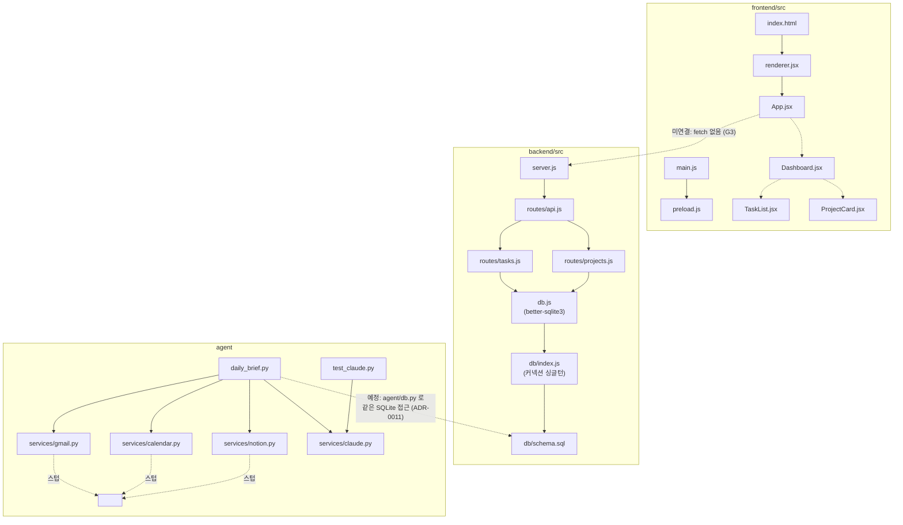

# 🔍 현행 시스템 분석 (AS-IS)

> 2026-09-02 기준 `my-setup-proj` 저장소의 실제 구현 상태.
> 무엇을 만들 것인지는 [VISION.md](VISION.md), 목표 구조는 [ARCHITECTURE.md](../architecture/ARCHITECTURE.md),
> 이 분석을 바탕으로 한 요구사항은 [REQUIREMENTS_FUNCTIONAL.md](../requirements/REQUIREMENTS_FUNCTIONAL.md) ·
> [REQUIREMENTS_NONFUNCTIONAL.md](../requirements/REQUIREMENTS_NONFUNCTIONAL.md), 설계는 [DESIGN.md](../architecture/DESIGN.md).
> 전제 조건은 [CONSTRAINTS.md](CONSTRAINTS.md), 앞으로의 리스크는 [RISKS.md](RISKS.md), 사용 흐름은 [USE_SCENARIOS.md](USE_SCENARIOS.md).
>
> **갭(G) = 지금 있는 차이**(이 문서 §4) · **리스크(R) = 앞으로 생길 수 있는 문제**([RISKS.md](RISKS.md)).

---

## 1. 한 줄 요약

**자동화 인프라(에이전트 팀·작업로그·CI)는 동작하지만, 제품 기능(프론트·백엔드·DB·에이전트)은 전부 골격 단계이며 서로 연결돼 있지 않다.**

---

## 2. 구성요소별 상태

### 2.1 Frontend — `frontend/` (Electron + React 스캐폴드)

| 항목 | 현황 | 평가 |
|---|---|---|
| Electron 메인 (`src/main.js`) | 800×600 창 생성, `preload.js` 통해 `contextIsolation` 적용, `index.html` 로드 | ✅ 동작 |
| 렌더 진입 (`src/renderer.jsx`) | `createRoot(#root).render(<App/>)` — `renderer.js`(바닐라) 제거 | ✅ Vite + React 마운트 (B1) |
| React 컴포넌트 (`App.jsx`, `Dashboard.jsx`, `TaskList.jsx`, `TaskForm.jsx`, `ProjectCard.jsx`, `ProjectForm.jsx`) | `Dashboard` 가 `useTaskStore`(B3)·`useProjectStore`(C2)로 배선됨. 할일·프로젝트 4상태(로딩/빈/정상/에러) 렌더, 프로젝트 카드 상태·진행도·삭제 + 생성 폼 | ✅ 할일(B3)·프로젝트(C2) 배선 완료, 브라우저 E2E 로컬 대기 |
| 번들러 | ✅ Vite + `@vitejs/plugin-react` (B1). `vite.config.js` root=src / base=./ / devCspPlugin | ✅ Vite + React 마운트 (B1) |
| 상태 관리 | ✅ `zustand` — `useTaskStore`(B3), `useProjectStore`(C2). 도메인별 스토어 분리 방향 | ✅ 사용 중 |
| 스타일링 | 인라인 style 만. Tailwind 미도입 | 🚧 |

**핵심 문제:** (B1 해소) 번들러(Vite)가 도입되고 `renderer.jsx` 가 `App.jsx` 를 마운트한다. `renderer.js`(바닐라)는 삭제됐다. 남은 작업은 Dashboard 이하 컴포넌트 배선(B3).

### 2.2 Backend — `backend/` (Express API 골격)

| 항목 | 현황 | 평가 |
|---|---|---|
| 서버 (`src/server.js`) | 포트 3000, `express.json()`, `GET /` 헬스체크, `/api` 라우터, 404·에러 핸들러, `unhandledRejection` 방어 | ✅ 코드상 완성 |
| API 라우터 (`src/routes/api.js`) | `GET /api/health`, `/api/tasks`·`/api/projects` 서브라우터 연결 | ✅ |
| 할일 라우트 (`src/routes/tasks.js`) | GET(목록/단건)·POST·PUT·DELETE, 검증오류 400 / 그 외 500 매핑 | ✅ |
| 프로젝트 라우트 (`src/routes/projects.js`) | tasks 와 동일 구조 CRUD. C2: `errors.js` 로 SQLite CHECK/FK → 400 한국어 매핑, status `on_hold` 통일 | ✅ + 프론트 배선(C2) |
| 오류 매핑 (`src/errors.js`) | `isValidationError`/`toClientMessage` — 일반 Error + SQLite 제약 위반(CHECK/NOTNULL/FK) → 400 한국어 (C2) | ✅ |
| `tasks.project_id` (ADR-0012) | `POST`/`PUT /api/tasks` 검증·API 응답 노출. `?project_id=` 필터는 이월 | ✅ (C2) |
| 데이터 저장 (`src/db.js`) | ✅ **better-sqlite3 (B2)** — `db/index.js` 커넥션 싱글턴 경유, WAL 모드, `DATABASE_PATH` 로 경로 주입(기본 `backend/data/app.db`). 공개 함수 10개 시그니처 불변 | ✅ 영속화 |
| CORS | `backend/src/middleware/cors.js` — 로컬 오리진 화이트리스트 + `Origin: null` | ✅ (C1, 2026-09-03) |
| 로깅 미들웨어 | `backend/src/middleware/requestLogger.js` — 모든 요청 1줄 (`METHOD path status ms`) | ✅ (C1, 2026-09-03) |
| 실행 검증 | ✅ 기동 + CRUD curl 왕복 확인 (A2). C1 후 CORS·미들웨어 스모크(TC-MW) 통과. 브라우저 E2E 는 로컬 대기 | ✅ |

**핵심 문제:** (B2 해소) `db.js` 내부가 better-sqlite3 로 교체돼 프로세스 재시작 후에도 데이터가 유지된다. 라우트·검증 로직은 무수정(NFR-MAINT-03).

### 2.3 Agent — `agent/` (Python Claude 에이전트 스텁)

| 항목 | 현황 | 평가 |
|---|---|---|
| Claude 래퍼 (`services/claude.py`) | `Anthropic()` 클라이언트, `ask(prompt, system, model)`, 기본 모델 `claude-opus-5`, `thinking: adaptive` | ✅ 코드상 완성 (실호출 미검증) |
| 연결 테스트 (`test_claude.py`) | `ANTHROPIC_API_KEY` 없으면 안내 후 종료, 있으면 1회 호출 | ✅ |
| 일일 브리핑 (`daily_brief.py`) | 수집→Claude→저장 흐름 뼈대. `build_context()` 로 이메일·일정 텍스트화 | 🚧 뼈대 |
| 서비스 스텁 (`gmail.py`, `calendar.py`, `notion.py`) | 함수 시그니처만. 실제 OAuth·토큰·API 연결 없음 | ❌ 스텁 |
| 스케줄러 | 없음 (roadmap 상 Week 6~7) | ⏳ 예정 |

**핵심 문제:** 없음(로드맵상 정상). 외부 API 연동은 Week 6 이후 작업.

### 2.4 데이터베이스

| 항목 | 현황 |
|---|---|
| SQLite | ✅ better-sqlite3 (B2) — `backend/db/index.js` + `backend/db/schema.sql` 런타임 적용, WAL |
| Supabase | ❌ 미도입 (roadmap Week 10+) |
| 스키마 정의 위치 | [ARCHITECTURE.md](../architecture/ARCHITECTURE.md) 에 `tasks`/`projects`/`emails`/`calendar_events`/`sync_logs` DDL 문서로만 존재 |

### 2.5 자동화 인프라 — `.claude/`, `scripts/`, `.github/`

| 항목 | 현황 | 평가 |
|---|---|---|
| 에이전트 팀 (`.claude/agents/`) | planner·developer·supervisor·finisher 역할·권한 분리 정의 | ✅ 동작 |
| `/feature` 파이프라인 (`.claude/commands/feature.md`) | 오케스트레이터가 4단계 위임, CHANGES_NEEDED 시 최대 2회 반복 | ✅ 동작 |
| 작업로그 (`scripts/worklog.sh` + Stop 훅) | 매 턴 종료 시 오늘 커밋 섹션 재생성 | ✅ 동작 |
| 작업로그 EOD (`scripts/worklog-eod.sh` + launchd plist) | 매일 23:50 커밋·푸시·슬랙. plist 경로 하드코딩 | ✅ 동작 (경로 이관 반영됨, 미커밋) |
| 슬랙 알림 (`scripts/slack-notify.sh`) | `SLACK_WEBHOOK_URL` 없으면 조용히 종료 | ✅ 동작 |
| CI (`.github/workflows/test.yml`) | 문법 검사 + `npm test`(backend) + `pytest -m "not network"`(agent) | ✅ Phase A3 |

### 2.6 테스트

| 항목 | 현황 |
|---|---|
| `tests/` (크로스 프로젝트) | README 만. 실제 테스트 0개 (Week 12+) |
| backend | ✅ supertest + `node --test` 18케이스 (TC-TASK-01,02,04~10 / TC-PROJ-01~06 / TC-DB-01~03), `:memory:` DB — Phase A3·B2 |
| frontend | Jest 미도입 |
| agent | ✅ pytest 3케이스 (TC-AGENT-01~03) `agent/tests/test_daily_brief.py` — Phase A3. `test_claude.py` 는 `agent/tests/` 로 이동(연결 확인용) |

### 2.7 현재 모듈 의존 관계

> 실선 = `require`/`import`, 점선 = 미연결(코드 존재하나 호출 경로 없음). 다이어그램 안내: [DIAGRAMS.md](../../setup/DIAGRAMS.md).

> **갱신 2026-09-02 (Phase A2):** 환경 구축 완료.

| 항목 | 현황 |
|---|---|
| `node` / `npm` | ✅ v26.8.1 / 11.19.0 (Homebrew). CI는 22 고정 |
| `python3` | ✅ 3.14.4. CI는 3.12 고정, `agent/venv`로 격리 |
| `.env` | ✅ `.env.example` 복사본 존재 (값은 빈 상태 — 각 기능 착수 때 채움) |
| `frontend/node_modules`, `backend/node_modules`, `agent/venv` | ✅ 설치됨 (`setup.sh`) |
| `setup.sh` / `verify.sh` | ✅ 통과 (`verify.sh` 12/0/0) |
| 백엔드 실행 | ✅ `node src/server.js` 기동, `GET /`·`/api/health`·`POST/GET /api/tasks` curl 검증 |
| 에이전트 모듈 | ✅ import + `build_context()` 동작 (Claude 실호출은 키 필요) |

---

## 4. 갭 요약 (AS-IS → TO-BE)

| # | 갭 | 심각도 | 상태 |
|---|---|:---:|---|
| G1 | React 미연결 (번들러 없음, `renderer.js` ↔ `App.jsx` 이원화) | 높음 | ✅ Phase B1 (Vite + `renderer.jsx` 마운트) |
| G2 | DB 영속성 없음 (인메모리) | 높음 | ✅ Phase B2 (better-sqlite3, WAL, DATABASE_PATH) |
| G3 | 프론트 ↔ 백엔드 연결 코드 0 (fetch/CORS/base URL 없음) | 높음 | 🚧 할일(B3)·프로젝트(C2) 배선 완료 (2026-09-03), 브라우저 E2E 로컬 수동 확인 대기 |
| G4 | 로컬 환경 미검증 | 중간 | ✅ Phase A2 완료 (2026-09-02) |
| G5 | 경로 이관 변경분 미커밋 | 낮음 | ✅ 커밋 `fc4404c` |
| G6 | 자동화 테스트 없음 (CI 문법 검사만) | 중간 | ✅ Phase A3 (backend 15 + agent 3, CI 연결) |
| G7 | 외부 API(Gmail/Calendar/Notion) 스텁 | 낮음 | ⏳ Week 6~7 (계획대로) |
| G8 | 다중 사용자·Supabase·Docker 미착수 | 낮음 | ⏳ Week 10~12 (계획대로) |
| G9 | 프로젝트 다이어그램(`docs/**/*.md` 의 Mermaid)을 저장소를 열지 않고는 볼 수 없음 — 앱 안에서 구조·진행을 그림으로 확인 불가 | 낮음 | ⏳ Phase C4 (FR-UI-05, [ADR-0014](../architecture/adr/ADR-0014-dashboard-diagram-viewer.md)) |

---

**작성:** 2026-09-02 · **갱신:** 2026-09-03 (Phase A2 / G9 추가)
