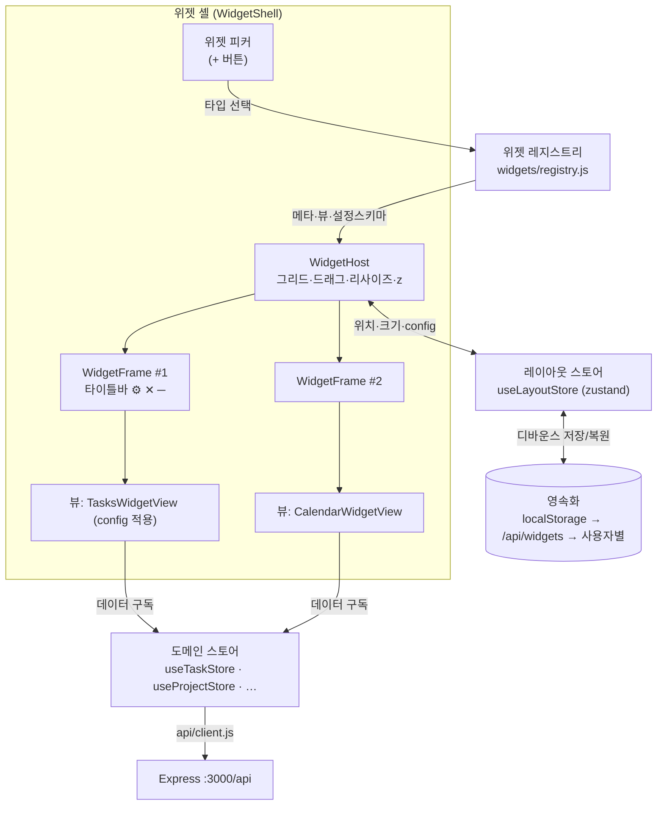

# 🪟 대시보드 OS — 위젯 셸 개념 분석

> 제품 방향 전환의 분석 문서. 기존 "고정 패널 단일 대시보드" 를
> **"각 데이터가 위젯(=앱)으로 움직이고, 위젯마다 사용자가 디자인을 꾸밀 수 있는 데스크톱 OS 형태"** 로 확장한다.
>
> 상위 비전은 [VISION.md](VISION.md), 요구사항은 [requirements/WIDGET.md](../requirements/WIDGET.md),
> 구조 결정은 [ADR-0020](../architecture/adr/ADR-0020-widget-shell-architecture.md)·[0021](../architecture/adr/ADR-0021-widget-layout-persistence.md)·[0022](../architecture/adr/ADR-0022-per-widget-theming.md).

---

## 1. 무엇을 바꾸는가

| 축 | 기존 (AS-IS) | 전환 후 (TO-BE) |
|---|---|---|
| 화면 구성 | ~~`Dashboard.jsx` 고정 배치~~ (C5 에서 제거) | **위젯 셸(`WidgetShell`)** 위에 위젯을 사용자가 배치·이동·크기조절 (C5 구현) |
| 데이터 표현 단위 | "패널" (코드에 하드코딩) | **위젯 인스턴스** (레지스트리에 등록된 위젯 타입 + 인스턴스별 설정) |
| 커스터마이즈 | 전역 디자인 토큰 1벌 | **위젯마다** 테마·표시 옵션을 따로 지정 |
| 레이아웃 | 고정 | 저장·복원 (localStorage → SQLite → 사용자별) |
| 확장 | ~~새 패널 = `Dashboard.jsx` 수정~~ | 새 위젯 = `widgets/registry.js` 에 항목 추가 + `widgets/views/` 에 뷰 (플러그인 유사) |

핵심 문장: **"각 테이블(tasks·projects·calendar_events·emails·briefs)이 위젯처럼 움직이고, 각 위젯(앱)은 각자 디자인할 수 있다."**

---

## 2. 왜 (강의·제품 양쪽)

- **강의 A 정합** — 과목명이 "AI **컴퓨터 운영체제** 실습" 이다. 위젯 셸 = 미니 윈도우 매니저:
  창(위젯) 생명주기, z-order(스택), 포커스, 레이아웃 영속화 = 프로세스·창 관리 개념의 실습 대상.
- **강의 B 정합** — 위젯 레지스트리·계약 도입은 AI 지원 설계·에이전틱 코딩(B-W4·B-W5)의 산출물이다.
- **강의 C 정합** — 위젯 계약(contract) = 컴포넌트 기반 설계(C-W6)의 실제 예. [ADR-0020](../architecture/adr/ADR-0020-widget-shell-architecture.md).
- **제품 가치** — 사용자마다 중요한 정보가 다르다. 할일 중심인 사람은 할일 위젯을 크게, 메일 중심인 사람은 메일 위젯을 위로. 고정 레이아웃은 이걸 못 한다.
- **설계 가치** — 위젯 계약(contract)을 만들면 새 기능(캘린더·브리핑·다이어그램·에이전트 큐)이 전부 같은 규격으로 붙는다. 단일 대시보드 컴포넌트 비대화([DESIGN.md](../architecture/DESIGN.md) §1 우려)를 구조로 막는다.

---

## 3. 참고 시스템 (벤치마크)

| 시스템 | 배울 점 | 안 가져올 것 |
|---|---|---|
| **macOS 알림센터 위젯 / iOS 홈 위젯** | 위젯 = 읽기 위주 요약 + 탭하면 앱으로. 크기 프리셋(S/M/L) | 프리폼 드래그 없음 |
| **Android 홈스크린 위젯** | 그리드 스냅, 리사이즈 핸들, 위젯 피커 | 런처 전체 |
| **KDE Plasma / Übersicht / Rainmeter** | 데스크톱 자유 배치, 위젯별 스킨 | 시스템 레벨 통합 |
| **Notion / Tabliss / 브라우저 새 탭 대시보드** | 블록/타일 조합, 위젯별 설정 패널 | 문서 편집 전반 |
| **react-grid-layout 쇼케이스, Grafana 패널** | 드래그·리사이즈·레이아웃 직렬화의 사실상 표준 UX | 서버측 대시보드 정의 |

**결론 방향:** *그리드 스냅 기반 배치*(Android/Grafana 계열) + *위젯별 설정·테마*(Plasma/Notion 계열). 완전 프리폼 창은 범위 밖([§6](#6-범위-경계)).

> 🎨 **화면 골격·컴포넌트·톤**의 목표 틀은 릴스 "Claude 워크스페이스 대시보드" 를 참조한다 → [../reference/UI_STYLE.md](../reference/UI_STYLE.md). 위 표는 *위젯 배치 메커니즘* 벤치마크, `UI_STYLE.md` 는 *전체 화면 룩* 참조로 역할이 다르다.

---

## 4. 위젯 모델

### 4.1 구성 요소

```
위젯 타입 (widget type)      레지스트리에 등록. C5 구현: 'tasks','projects','calendar','diagrams'
                            ('emails','brief' 는 뷰 미구현 — 향후 레지스트리 추가)
  ├─ 메타: 표시 이름, 아이콘, 기본 크기(w×h), 최소/최대 크기, 설명
  ├─ 뷰 컴포넌트: widgets/views/*WidgetView.jsx — 각자 도메인 스토어를 직접 구독
  └─ configSchema: 표시 옵션 허용 키 (C5 는 {} 스텁, C6 채움)
     ※ 별도 "데이터 훅" 은 두지 않는다 — 뷰가 스토어를 직접 구독

위젯 인스턴스 (widget instance)   사용자가 셸에 올린 하나. DO-2: 타입당 1개 (인스턴스 id = 타입 id).
  ├─ 위치·크기: x, y, w, h (그리드 단위), z (스택 순서)
  ├─ 상태: minimized (+ 복원용 prevH)
  └─ config: JSON — { theme: {...}, display: {...} }   ← 4.3 (C6)
```

### 4.2 위젯 셸 (Shell) 책임

| 책임 | 내용 |
|---|---|
| 레이아웃 | 그리드 배치, 드래그 이동, 리사이즈 핸들, 스냅, 충돌 회피 |
| 생명주기 | 위젯 추가(피커) · 제거 · 최소화 · 복원 |
| 포커스/스택 | 클릭 시 최상단(z 갱신) |
| 영속화 | 레이아웃+config 변경을 디바운스 저장, 부팅 시 복원 ([ADR-0021](../architecture/adr/ADR-0021-widget-layout-persistence.md)) |
| 격리 | 한 위젯의 에러/느린 로딩이 다른 위젯을 막지 않음 (기존 FR-UI-04 원칙 유지, 위젯 단위로) |
| 편집 모드 토글 | 평소엔 잠금(오작동 방지), "편집" 시에만 이동/리사이즈 |

### 4.3 위젯별 커스터마이즈 ("각자 디자인")

각 위젯 인스턴스는 `config` JSON 하나로 외형과 표시를 바꾼다. 셸이 위젯을 감싼 `<div data-widget-id>` 에 **스코프된 CSS 변수**로 주입한다 ([ADR-0022](../architecture/adr/ADR-0022-per-widget-theming.md)).

```jsonc
{
  "theme": {
    "bg": "#1e293b",          // 위젯 배경 (전역 --panel 오버라이드)
    "accent": "#f59e0b",      // 강조색 (진행도 바 등)
    "radius": 12,             // 모서리
    "density": "comfortable", // comfortable | compact
    "titlebar": "solid"       // solid | ghost | hidden
  },
  "display": {                // 위젯 타입마다 스키마가 다름
    "sortBy": "due_date",
    "hideCompleted": true,
    "maxItems": 20
  }
}
```

- **전역 테마** = 기본값. **위젯 config** = 오버라이드. 둘 다 없으면 하드 기본.
- 프리셋 테마 몇 개(다크/솔라라이즈드/미니멀) + 개별 조정.
- 커스터마이즈 UI: 위젯 타이틀바의 ⚙️ → 설정 패널(테마 탭 + 표시 탭).

---

## 5. 흐름 (개념)



---

## 6. 범위 경계

**C5 (위젯 셸 골격):**
- 그리드 배치·이동·리사이즈·최소화·추가/제거·포커스/스택·편집 토글
- 레이아웃 영속화 (`localStorage` `dashboard.layout.v1`, 300ms 디바운스)
- 위젯 뷰: tasks · projects · calendar · diagrams (기존 컴포넌트 무수정 재사용)
- 테마는 골격만 (`themeToVars` 스텁 + `WidgetFrame` 호출 지점)

**C6 (위젯 커스터마이즈):**
- 위젯별 테마(색·밀도·모서리·타이틀바) + 표시 옵션, `WidgetSettings` 패널, 전역 CSS 변수화

**범위 밖 (지금):**
- 완전 프리폼(픽셀 단위 자유 위치) 창, 창 겹침 애니메이션
- 위젯 마켓플레이스, 서드파티 위젯 로딩(코드 실행)
- 위젯 간 드래그&드롭 데이터 전달
- 멀티 워크스페이스(가상 데스크톱) — 확장 후보
- 모바일 레이아웃

**전제:** 위젯 뷰는 **신뢰된 1st-party 코드만**. 외부 코드 실행 없음(NFR-SEC-04 유지).

---

## 7. 공부할 것

| 주제 | 자료 | 이 프로젝트 적용 |
|---|---|---|
| 대시보드 그리드 UX | `react-grid-layout` README·예제, Grafana 패널 문서 | [ADR-0020](../architecture/adr/ADR-0020-widget-shell-architecture.md) 의 라이브러리 선택 |
| 윈도우 매니저 개념 | "Xlib/wlroots 개요", tiling WM(i3/sway) 설정 문서의 *개념* 파트 | z-order·포커스·레이아웃 직렬화 이해 |
| 레이아웃 직렬화·복원 | react-grid-layout 의 `layouts` prop, `onLayoutChange` | [ADR-0021](../architecture/adr/ADR-0021-widget-layout-persistence.md) |
| CSS 커스텀 프로퍼티 스코프 | MDN "Using CSS custom properties", `@property` | [ADR-0022](../architecture/adr/ADR-0022-per-widget-theming.md) 위젯별 테마 |
| 플러그인/레지스트리 패턴 | "Registry pattern", VS Code contribution points 개요 | `widgets/registry.js` 설계 |
| 컴포넌트 격리 | React `ErrorBoundary` per subtree, `Suspense` | 위젯 단위 에러/로딩 격리 |
| 상태 정규화 | zustand 문서, "UI state vs server state 분리" | `useLayoutStore`(UI) ↔ 도메인 스토어(server) |

---

## 8. 열린 질문 (착수 전 결정)

| # | 질문 | 결정 (C5, 2026-09-06) |
|---|---|---|
| DO-1 | 배치 방식 | **그리드 스냅** — `react-grid-layout` 2.2.4 (`/legacy` 진입점, `WidthProvider`) |
| DO-2 | 같은 타입 다중 인스턴스? | **타입당 1개** — 인스턴스 id = 타입 id. 피커에서 이미 추가된 타입 비활성 |
| DO-3 | 레이아웃 저장 위치 1차 | **`localStorage`** `dashboard.layout.v1` (SCHEMA_VERSION 1), 300ms 디바운스 |
| DO-4 | config 검증 위치 | **프론트만** — `layoutStorage.sanitizeInstances` + (C6) `themeToVars` 화이트리스트 |
| DO-5 | 항상 드래그 가능? | **편집 토글 필요** — 평소 잠금, 셸 바의 "✎ 편집" 으로만 이동/리사이즈 |
| DO-6 | 다이어그램을 위젯으로? | **위젯화** (`diagrams`) — 폭이 커서 기본 레이아웃 제외, 피커로만 추가 |

---

**작성:** 2026-09-03
