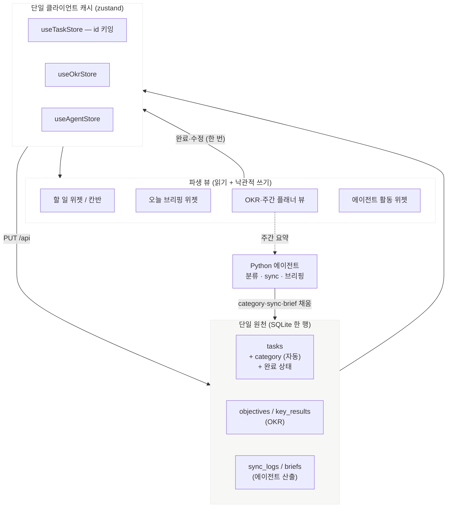

# 🧭 PERSONAL_OS — 개인 생산성 OS 로의 확장

> **한 줄 정의:** 지금까지 만든 "대시보드 OS"(위젯 셸 + 할일·프로젝트·캘린더·브리핑)를,
> **한 곳에서 완료하면 모든 곳에 반영되고, 일이 자동으로 분류되며, OKR·주간 계획이 요약되고,
> 에이전트의 작업이 눈에 보이는** 개인 생산성 OS 로 다듬는다. 룩은 **라이트 테마의
> 노션 위젯 스타일**로 통일한다.

**📂 이동:** [⬆ vision/](README.md) · [VISION.md](VISION.md) · [DASHBOARD_OS.md](DASHBOARD_OS.md) · [AS_IS.md](AS_IS.md) · [../../progress/PROGRESS.md](../../progress/PROGRESS.md)

- 상태: **방향 확정 · 문서 단계** (2026-09-07). Phase D(에이전트) 완료 직후 사용자가 제시.
- 선행: Phase A~D 완료, 웹 데모([ADR-0026](../architecture/adr/ADR-0026-web-demo-mode.md)) 배포.
- 이 문서는 **왜·무엇을** 만 잡는다. **어떻게**는 각 ADR·요구사항 문서로 이어진다(§7).

---

## 1. 배경

`VISION.md` 의 "대시보드 OS" 는 데이터 4종(할일·프로젝트·캘린더·브리핑)을 위젯으로 올리는
데까지 왔다. 여기서 두 가지가 부족하다:

1. **일이 흩어진다.** 같은 할 일이 목록·브리핑·프로젝트·(앞으로 나올) OKR 여러 곳에 나타나면
   각각 따로 논다. 완료를 한 곳에서 누르면 나머지가 안 따라온다.
2. **정리가 수동이다.** 카테고리·주간 버킷(지난주/이번주/다음주)·목표(OKR) 대비 진행률이
   전부 손으로 만들어야 보인다.
3. **에이전트가 안 보인다.** 매일 아침 도는 sync·브리핑·Notion 저장이 `sync_logs` 테이블과
   로그 파일에만 남고, 화면에는 없다.
4. **룩이 임시다.** 대부분 인라인 스타일 + 슬레이트 다크. 참조 틀(`UI_STYLE.md` 의 Cowork)이
   있었지만 구현이 못 따라갔다.

사용자가 원하는 최종 느낌: **Sunsama / Akiflow / 개인용 Linear** 계열 — 차분하고 다듬어진,
"내가 아무것도 안 해도 정리돼 있는" 생산성 도구.

## 2. 큰 그림

핵심: **완료·수정은 스토어를 한 번만 거치고, 모든 뷰는 그 스토어에서 파생된다.**
데이터를 뷰마다 다시 fetch 하지 않는다.

## 3. 역량 테마 (T1~T6)

각 테마는 §7 의 ADR·요구사항으로 상세화된다. 여기서는 무엇/지금/목표만.

### T1 — 단일 완료 (한 곳에서 완료 → 모든 곳)

| | |
|---|---|
| 무엇 | 할 일을 어느 뷰에서 완료·수정해도 그 항목이 보이는 모든 뷰가 즉시 같은 상태 |
| 지금 | `tasks` 한 행 + `useTaskStore` 한 개는 이미 있음. 뷰가 하나뿐이라 문제 미노출 |
| 목표 | `id` 로 키잉된 단일 캐시. 할일 위젯·칸반·브리핑·OKR·프로젝트 하위목록이 전부 이 스토어에서 파생. 낙관적 갱신+롤백은 기존 것 재사용 |
| 관련 | FR-TASK-02/03, FR-UI-01 · ADR-0028 (예정) · 스키마 무변경 |
| 크기 | 낮음 |

### T2 — 자동 분류 (일에 카테고리가 자동으로)

| | |
|---|---|
| 무엇 | 할 일 생성·동기화 시 에이전트(Claude)가 카테고리를 붙인다 |
| 지금 | `tasks` 에 category 컬럼 없음. `project_id`(수동)만. 에이전트는 `tasks` 읽기 전용 |
| 목표 | `tasks.category`(또는 `task_labels` 테이블). 분류 주체·시점 결정 필요(백엔드 POST 시 vs 에이전트 배치). 칩 UI 로 표시·필터 |
| 관련 | 새 FR-TASK-08 · ADR-0029 (예정, 자동 분류) · **ADR-0018 (스키마 마이그레이션 전략, 제안 상태) 결정 강제** · Claude 비용(항목당 1회) |
| 크기 | 중 |

### T3 — OKR + 주간 플래너 (지난주·이번주·다음주 요약)

| | |
|---|---|
| 무엇 | OKR(목표·핵심결과) 진행률 대시보드 + `due_date` 를 ISO 주(월~일)로 버킷팅한 "지난주 완료 N / 이번주 예정 M(완료 K) / 다음주 P" |
| 지금 | `projects.progress`(0-100)만. OKR 구조·주간 버킷 없음 |
| 목표 | `objectives` + `key_results` 테이블. 스탯 타일 그리드(KR 평균 달성률·Objective 수·KR 수·90%+/40-90%/<40% 구간) + 월별 라인차트. 주간 요약은 순수 집계, 심화 시 "Weekly Brief"(Claude)로 확장 — Daily Brief 인프라 재사용 |
| 관련 | 새 `requirements/OKR.md` (예정) · FR-OKR-* · ADR-0030 (예정, OKR 데이터 모델) · 스키마 마이그레이션 |
| 크기 | 상 (독립 Phase) |
| 메타 | 이 프로젝트의 `PROGRESS.md` 가 프로젝트에 하는 일을, 앱이 사용자에게 해준다 |

### T4 — 에이전트 활동 UI

| | |
|---|---|
| 무엇 | 에이전트(런타임: sync·브리핑·Notion 저장)의 상태·이력·다음 실행이 화면에 보인다 |
| 지금 | `GET /api/sync/logs` · `/api/sync/health` API 는 있으나 소비하는 위젯 없음. 다이어그램 뷰어는 파이프라인 *구조*만 |
| 목표 | "에이전트 활동" 위젯 — 서비스별(Gmail·Calendar·Notion) 상태 카드 + 타임라인 + 다음 launchd 실행 시각. 선택: "지금 실행" 버튼(백엔드가 python 트리거 → ADR-0011 프로세스 분리에 손대는 큰 결정) |
| 관련 | **[ADR-0013](../architecture/adr/ADR-0013-dashboard-agent-queue.md) 재활성** (제안 상태, "핵심 4기능 완성 후" 였는데 이제 완성됨) · `UI_STYLE.md` US-2("모니터" 탭) · 새 FR-AGENT-* |
| 크기 | 중 (위젯). "지금 실행"·작업 큐는 별도 |

### T5 — 라이트 비주얼 시스템

| | |
|---|---|
| 무엇 | 전 화면을 라이트 오프화이트 + 노션 위젯 스타일로 통일. 다크는 옵션으로 |
| 지금 | 전면 다크 `#0f172a`. `styles.css` `:root` 토큰(C6)은 있으나 컴포넌트는 하드코딩 hex |
| 목표 | 토큰 v2(§5) 로 `:root` 재정의 + `[data-theme]` 분기. 공통 컴포넌트(스탯 타일·점-그리드 진행바·칩) 도입. C6 테마 프리셋·`themeToVars` 화이트리스트 인프라 재사용 |
| 관련 | `UI_STYLE.md` 개정 · ADR-0027 (예정, 라이트 테마 기본 전환 + 토큰 v2) · FR-WIDGET-05/06 |
| 크기 | 중 (토큰·프레임) + 지속 (위젯별 다듬기) |

### T6 — 진행 현황 · 파일 탐색 (대시보드에서 우리가 하는 것 보기)

| | |
|---|---|
| 무엇 | 저장소를 IDE 로 열지 않고, 대시보드 위젯 하나에서 ① **왼쪽 폴더 트리** 로 프로젝트 파일 구조를 훑고 ② 파일을 클릭하면 **오른쪽 내용 패널** 에 렌더 — `PROGRESS.md`·`PERSONAL_OS.md`·`작업로그.md`·ADR·소스 파일 등. "우리가 어디까지 왔나 / 다음 순서 / 어떤 파일이 있나" 를 앱 안에서 확인 |
| 지금 | 다이어그램 뷰어(C4)는 mermaid 블록만 뽑아 렌더. 진행 본문·파일 구조는 저장소를 열어야 봄 |
| 목표 | **백엔드** ① `GET /api/tree` — 허용 루트(`docs`·`frontend/src`·`backend/src`·`agent`·`scripts`·루트 `*.md`)만 재귀 나열, `.env*`·`node_modules`·`.git`·`venv`·`.secrets`·`dist` 제외, 깊이·개수 상한 (`services/diagrams.js` 인프라 재사용). ② `GET /api/docs/:path` — 허용 파일 1개를 **의존성 없이** 토큰화(제목·목록·표·코드블록·mermaid·링크)한 JSON. `.md` 는 부분집합 토큰, `.js`/`.py` 등은 `<pre>` 코드블록. **마크다운 파서·`dangerouslySetInnerHTML` 없음** (NFR-SEC-04). **프론트** 위젯 내부 레이아웃 = 왼쪽 트리(~30%) + 오른쪽 내용(~70%). mermaid 블록은 기존 `DiagramPanel` 재사용. 셸의 별도 좌측 레일이 **아님** — DO-1 단일 그리드 유지 |
| 관련 | FR-UI-05(다이어그램 뷰어) 사촌 · 새 FR-UI-06 · ADR-0031 (예정 — 안전 마크다운 렌더 + `/api/tree`) · 다이어그램 뷰어 인프라(`resolveDocsRoot`·`resourcesPath` 폴백·상한) 재사용 |
| 크기 | 중 (`/feature` 1회) |
| 메타 | T3 의 "PROGRESS.md 가 프로젝트에 하는 일을 앱이 사용자에게" 와 짝 — 이건 프로젝트 자신을 위한 버전 |

## 4. 시각 참조

사용자 제시(2026-09-07): 유료 **노션 위젯 팩** 인스타 릴스 스크린샷 6장.

- **스타일로 채택:** 라이트 오프화이트 배경, 흰 카드, 매우 옅은 보더, 큰 굵은 숫자를 초점으로,
  **solid 진행바 대신 점-그리드(dot-grid) 진행바**, 카테고리 칩/필, 넉넉한 여백, 차분한 톤,
  숫자 색 코딩(달성 구간별 파랑/초록/주황/빨강).
- **구조 패턴으로 채택:**
  - **칸반** — 우선순위 열(우선순위 1/2/3) + 카드에 제목·날짜·**완료 체크 체크박스**·태그.
  - **OKR 대시보드** — 스탯 타일 6개(KR 평균 달성률 84.4% · Objective 수 · KR 수 ·
    90% 이상 · 40~89.9% · 40% 미만) + 월별 KR 평균 달성률 라인차트.
- **참조 아님(도메인 밖):** 개별 위젯 소재 — 주식 포트폴리오, 금·은 시세, 월급일 D-day,
  무지출 챌린지, 식물 키우기, 점심 추첨기, 플립 시계. 스타일만 참고하고 만들지 않는다.

이 참조는 `UI_STYLE.md` 의 이전 "Cowork(Claude 워크스페이스 대시보드)" 참조 틀을 **대체·증보**한다.

## 5. 디자인 토큰 v2 (초안 — ADR-0027 에서 확정)

| 토큰 | 현재 (다크) | v2 (라이트) | 용도 |
|---|---|---|---|
| `--bg` | `#0f172a` | `#f7f7f5` | 앱 배경(오프화이트) |
| `--panel` | `#1e293b` | `#ffffff` | 카드·위젯 본문 |
| `--border` | `#334155` | `#ececec` | 거의 안 보이는 경계 |
| `--text` | `#e2e8f0` | `#1a1a1a` | 본문 |
| `--muted` | `#94a3b8` | `#9b9b9b` | 보조 텍스트 |
| `--accent` | `#f59e0b` | `#2f6feb` (차분한 파랑) | 강조 숫자·활성·[실행] |
| `--ok` / `--warn` / `--bad` | — (신규) | `#2e7d5b` / `#d97642` / `#d64545` | 달성 구간·상태 색코딩 |
| `--card-radius` | `10px` | `16px` | 카드 모서리 상향 |
| `--chip-radius` | — (신규) | `999px` | 칩/필 |
| 숫자 강조 | — | `font-weight: 700; font-size: 32–48px` | 스탯 타일 focal number |
| 진행 표시 | solid bar | 점 20~24개 그리드 | 진행바 컴포넌트 |

다크는 없애지 않는다 — `[data-theme="dark"]` + C6 "다크" 프리셋으로 유지(대칭적으로 재정의).

## 6. 범위 밖 (안 만드는 것)

- 금융·자산·습관·건강·음식 등 개인 데이터 도메인 위젯 (참조는 스타일만).
- 코딩 에이전트·파일 조작·셸 실행 (ADR-0013 범위 한정 유지).
- 팀·협업·공유 (다중 사용자는 Phase E 인증부터).
- 모바일 전용 레이아웃 (단일 `lg` 브레이크포인트 유지 — DO-1).
- OKR 의 조직 정렬·CFR(대화·피드백·인정) — 개인용 목표·핵심결과·진행률까지만.

## 7. 단계 계획

> 순서: **문서 → 디자인 → 빌드.** 다이어그램은 [../../progress/PROGRESS.md](../../progress/PROGRESS.md) §개인 생산성 OS 방향.

| 단계 | 무엇 | 산출물 | 선행 |
|---|---|---|---|
| **P0** | 이 문서 + PROGRESS 다이어그램 | `PERSONAL_OS.md`, PROGRESS §추가 | — |
| **P1 (문서)** | ADR 초안 + 요구사항 | ADR-0027(라이트 테마)·0028(단일 캐시)·0029(자동 분류)·0030(OKR 모델)·0031(안전 마크다운 렌더), ADR-0013 재활성, ADR-0018 결정, `requirements/OKR.md`, `UI_STYLE.md` 개정 | P0 |
| ~~P2 (디자인)~~ ✅ | 목표 화면 목업 (2026-09-07, **v2 2026-09-08**) | design 캔버스 6 아트보드 + 토큰 v2 확정. **v2: UI_STYLE v2(라이트 + 왼쪽 사이드바) 반영해 재작성** — 같은 URL. https://claude.ai/code/artifact/a8e15d6b-2bfb-42d9-96c7-cdb0d964ebf3 | P1 |
| ~~P3 (빌드)~~ ✅ | T5 라이트 테마 1차 (2026-09-07, ADR-0027 채택) | `styles.css` `:root` 팔레트 전환(다크→라이트) + `[data-theme=dark]` 블록(정의만) + 하드코딩 hex→`var(--*)` 치환 (10개 파일) → 데모 반영. 카드 여백·라운드·점그리드·전역 다크 토글은 P4 | P2 는 P3 이후 소급 확정(2026-09-07) — PO-1/2 결정 |
| ~~P4 (빌드)~~ ✅ | T5 공통 컴포넌트 (2026-09-07) | `frontend/src/components/` — `StatTile.jsx` · `DotProgress.jsx`(+ 순수 `dotFill.js`) · `Chip.jsx` (OKR·에이전트 공용). 카드 토큰 v2(`--card-radius` 16·`--shadow-card`) + `WidgetFrame` 그림자 + `ProjectCard` 진행바 → `DotProgress`. `frontend/test/dotFill.test.mjs` TC-P4-01~05. 시각 확인 로컬 GUI 대기 | P3 |
| ~~P4.5~~ ✅ | 사이드바 셸 (UI_STYLE v2) | `AppShell`·`Sidebar`(브랜드+검색 표시+그룹 네비 4개+사용자)·`TopicView`(페이지 헤더) + `WidgetShell` `topicId` 스코프 + `useUiStore.activeTopic` + 레이아웃 저장 v1→v2 마이그레이션 + 주제별 기본/플레이스홀더 위젯. [ADR-0032](../architecture/adr/ADR-0032-sidebar-shell-per-topic-layouts.md) 채택. 데모 반영 — 구현 완료 (2026-09-08, feature/p4.5-sidebar-shell) | P4 · ✅ ADR-0032 |
| **P5** | T1 단일 캐시 + 칸반 뷰 | `useTaskStore` id 키잉, 칸반(완료 체크·우선순위 열·태그) | P3 |
| **P6** | T2 자동 분류 | 스키마 마이그레이션 + 에이전트 분류 + 칩 필터 | P4·P5 |
| **P7** | T4 에이전트 활동 위젯 | `sync_logs`/`health`/다음 실행 → 위젯 | P4 |
| **P8** | T3 OKR Phase | `objectives`/`key_results` + OKR 대시보드 + 주간 플래너 + (선택) Weekly Brief | P4·P5 |
| **P9** | T6 진행 현황 · 파일 탐색 | `GET /api/tree`(허용 루트·상한) + `GET /api/docs/:path`(안전 토큰화) + "진행 현황" 위젯(왼쪽 트리 + 오른쪽 내용, mermaid 은 `DiagramPanel` 재사용). 데모용 `demoClient.js` 목 트리 | P4 |

각 빌드 단계는 `/feature` 파이프라인 1회, 개별 브랜치·PR. `frontend/` 변경은 병합 시 데모 자동 재배포.

## 8. 열린 질문 (착수 전 결정)

| ID | 질문 | 언제 |
|---|---|---|
| PO-1 | 라이트를 **기본**으로, 다크는 프리셋 옵션? (권장) vs 다크 유지 + 라이트 프리셋 | ADR-0027 |
| PO-2 | `--accent` 를 파랑(`#2f6feb`)으로? US-1(앰버→보라)은 어떻게 되나 | ADR-0027 |
| PO-3 | 자동 분류 taxonomy: 고정 집합 vs 자유 태그 / 단일 vs 다중 | ADR-0029 |
| PO-4 | 분류 시점·주체: 백엔드 POST 시 Claude 호출 vs 에이전트 배치 vs 별도 테이블 | ADR-0029 |
| PO-5 | OKR = 1급 엔티티(`objectives`/`key_results`) vs `projects` 재해석 | ADR-0030 |
| PO-6 | 주간 요약: 순수 집계 vs Claude "Weekly Brief" | OKR.md |
| PO-7 | 칸반이 할 일 위젯을 **대체**하나, **추가 뷰**인가 (DO-2 타입당 1개와 충돌?) | ADR-0028 / WIDGET.md |
| PO-8 | 차트 라이브러리: Recharts vs 인라인 SVG (`dataviz` 스킬 참조) | P2 → **인라인 SVG 결정 (2026-09-08)** |
| ~~PO-13~~ | 사이드바 그룹·항목 최종 구성 | **종결 (2026-09-08, ADR-0032): COMMAND(개요·할일·브리핑·프로젝트·일정) / PLAN(OKR·주간) / AGENT(활동·진행현황·다이어그램) / SYSTEM(설정). 미구현 항목은 표시 + "준비 중" 플레이스홀더** |
| ~~PO-14~~ | rail 접기·⌘K 검색을 P4.5 범위에 | **종결 (2026-09-08, ADR-0032): 둘 다 P4.5 범위 밖. 검색 인풋은 표시만, 사이드바 고정 폭** |
| PO-9 | 에이전트 "지금 실행" 버튼 → 백엔드가 python 트리거 (ADR-0011 프로세스 분리 예외?) | ADR-0013 |
| PO-10 | 이 방향과 Phase E(다중 사용자)의 순서 — 병행 vs 이후 | PROGRESS |
| PO-11 | 진행 현황 뷰에 어떤 문서·섹션을 노출하나 (전체 문서 vs 큐레이션된 섹션), 접기 UI | ADR-0031 / P9 |
| PO-12 | 파일 트리 허용 루트·제외 목록 확정. 소스 파일(`.js`/`.py`)을 코드블록으로 보여줄지, `.md` 만 렌더할지 | ADR-0031 / P9 |

## 9. 관련 문서

- [VISION.md](VISION.md) — 상위 제품 정의 (이 문서가 확장)
- [DASHBOARD_OS.md](DASHBOARD_OS.md) — 위젯 셸 개념·DO-1~6
- [../reference/UI_STYLE.md](../reference/UI_STYLE.md) — 시각 참조 틀 **v2** (2026-09-08, "Confidency OS" 스타일 — 라이트 + 왼쪽 사이드바)
- [../architecture/adr/README.md](../architecture/adr/README.md) — ADR 목록
- [../../progress/PROGRESS.md](../../progress/PROGRESS.md) — 진행 다이어그램·주차 계획
- [P2 UI 기본틀 캔버스](https://claude.ai/code/artifact/a8e15d6b-2bfb-42d9-96c7-cdb0d964ebf3) — 6 아트보드 목업 (2026-09-07, **v2 2026-09-08 = UI_STYLE v2 사이드바 반영**: 개요·할일(리스트+칸반)·OKR·에이전트 활동·진행 현황·공통 컴포넌트)

---

**작성:** 2026-09-07 (Phase D 완료 + 웹 데모 배포 직후, 사용자 방향 제시)
