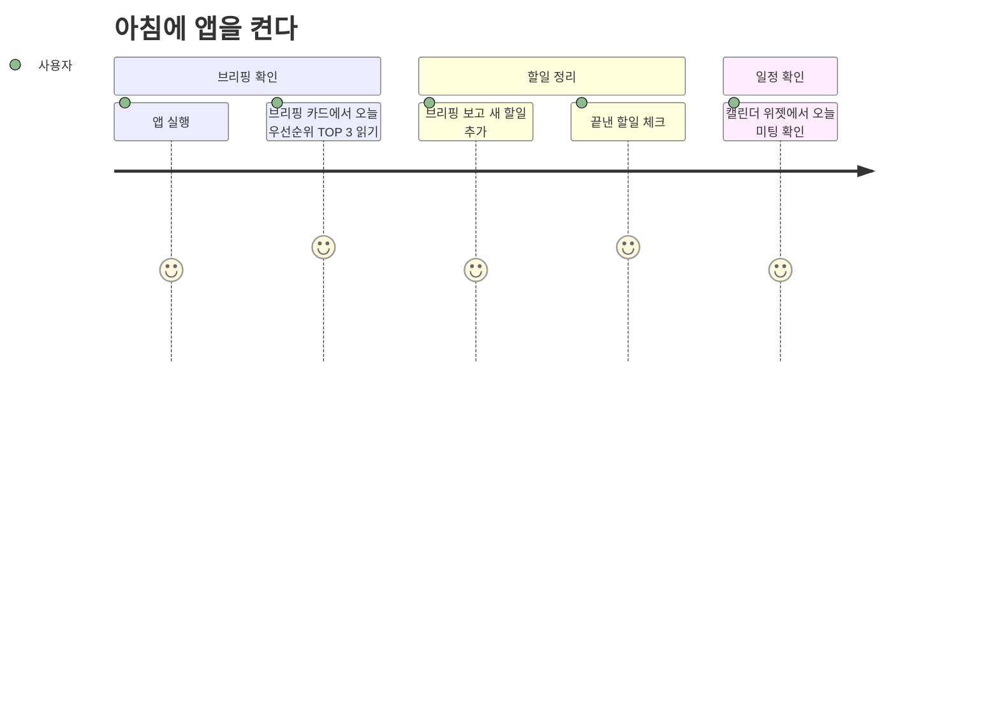
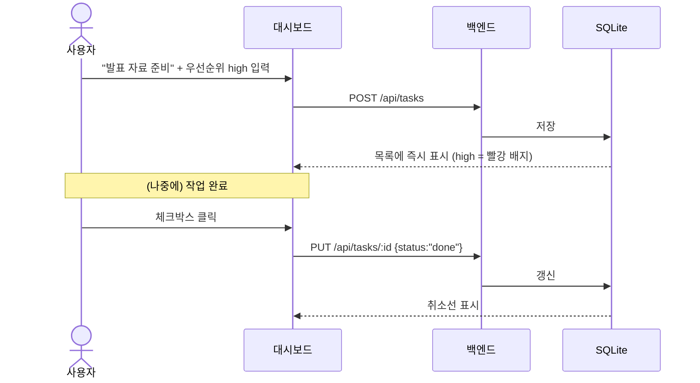
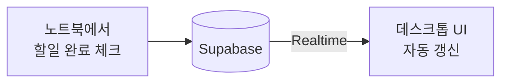

# 🎬 사용 시나리오 (Use Scenarios)

> 사용자가 실제로 앱을 쓰는 흐름. 기능(FR)이 조각이라면 이 문서는 조각을 잇는 여정이다.
> 요구사항 [requirements/](../requirements/) · 화면 [UI_SPEC.md](../reference/UI_SPEC.md) · 흐름 시퀀스 [DESIGN.md](../architecture/DESIGN.md) §6·§7.

---

## 이해관계자

| 역할 | 누구 | 기대 | 성공의 모습 |
|---|---|---|---|
| **주 사용자** | 프로젝트 개발자 본인 (학생) | 흩어진 할일·일정·메일을 한 앱에서 보고, 아침에 우선순위를 자동으로 받는다 | 매일 앱을 켜서 브리핑을 확인하고 할일을 관리한다 |
| **에이전트** | Daily Brief (Claude) | 수집한 데이터로 유용한 우선순위 요약을 만든다 | 사람이 손대지 않아도 매일 아침 브리핑이 준비돼 있다 |
| **평가자** | 강의 교수 | 강의 개념(Linux·프로세스·네트워크·배포)이 실제로 적용된 결과물 | 과제 1·2 발표와 기말 제출물로 시연 가능 |

---

## S-1. 아침 — 하루 시작 (핵심 시나리오)

**전제:** 밤사이 launchd가 08:00에 `daily_brief.py`를 실행해 뒀다.

**관련 FR:** FR-AGENT-04·05(브리핑 자동 생성·조회), FR-TASK-01·03, FR-CAL-02, FR-UI-01
**수용 조건:** 브리핑이 없어도(생성 실패) 앱은 정상, "브리핑 없음" 안내 (FR-AGENT-06, FR-UI-04)

---

## S-2. 할일을 추가하고 완료한다

**관련 FR:** FR-TASK-01·02·03 · **테스트:** TC-TASK-01·04·06 · **차이:** 현재 프론트 미연결(G3)

---

## S-3. 프로젝트 진행도를 확인한다

1. 대시보드 우측 프로젝트 패널에서 카드별 진행도 바를 본다.
2. (Week 4+) Notion에 있는 프로젝트가 자동으로 표시된다 (읽기 전용).
3. 로컬 프로젝트는 진행도를 직접 수정한다.

**관련 FR:** FR-PROJ-01·02·03 · **미결정:** 할일을 프로젝트에 묶을지 ([ADR-0012](../architecture/adr/ADR-0012-task-project-link.md))

---

## S-4. 오프라인에서 쓴다

**전제:** 네트워크 없음 (비행기, 지하).

- 할일 조회·추가·수정·삭제: **정상 동작** (로컬 SQLite).
- 캘린더·메일: **마지막으로 동기화된 캐시**를 보여주고 "오프라인" 표시.
- 브리핑: 오늘 것이 이미 생성돼 있으면 조회 가능, 없으면 "네트워크 필요" 안내.
- 네트워크 복구 시 다음 에이전트 실행에서 캐시가 갱신된다.

**관련 NFR:** NFR-REL-04 · **관련 ADR:** [0006](../architecture/adr/ADR-0006-agent-owns-external-apis.md)(오프라인 우선)

---

## S-5. 여러 기기에서 같은 상태를 본다 (Week 10+)

**관련 FR:** FR-SYNC-01·02 · **관련 ADR:** [0008](../architecture/adr/ADR-0008-supabase-deferred.md)(Week 10 이후)

---

## S-6. 과제 발표 / 최종 제출 (평가자 관점)

| 시점 | 시연 내용 | 준비물 |
|---|---|---|
| 과제 1 (Week 8) | Electron 앱 실행, 할일 CRUD, 사용한 Linux 명령어 10+ 정리 | PPT, 라이브 데모, `commands.md` |
| 과제 2 (Week 14) | Daily Brief 자동 생성 시연, Claude 통합, cron 자동화 | PPT, 코드 데모, Notion 저장 결과 |
| 기말 제출 | 4개 핵심 기능이 실제 데이터로 동작 + Docker 이미지 | 저장소, README, 발표 자료 |

**관련:** [VISION.md](VISION.md) 완료 기준 · [CONSTRAINTS.md](CONSTRAINTS.md) C-5

---

**작성:** 2026-09-02
