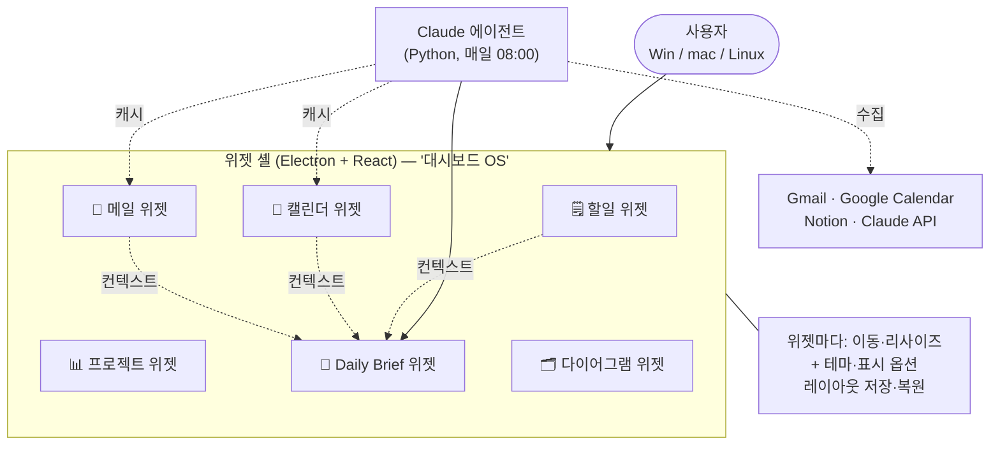

# 🎯 제품 비전 — 무엇을 만드는가

> `my-setup-proj` 가 완성됐을 때의 모습. 기술 구조는 [ARCHITECTURE.md](../architecture/ARCHITECTURE.md), 일정은 [ROADMAP.md](../ROADMAP.md) 참고.

---

## 한 줄 정의

**Windows / macOS / Linux 어디서든 켜는 "대시보드 OS"** — 할일·프로젝트·일정·메일·브리핑이 각각 **위젯(앱)처럼 움직이고, 위젯마다 사용자가 디자인을 꾸미는** 데스크톱 셸. 그리고 그 데이터를 매일 아침 정리해 주는 **Claude 기반 AI 에이전트**.

이 프로젝트는 동시에 우숭대학교 컴퓨터정보보안학과 **"AI 컴퓨터 운영체제 실습"** 강의(14주)의 실습 환경이자 최종 결과물이다. "대시보드 OS" 방향은 강의의 창·프로세스 관리 주제와 정합한다.

- 시작: 2026-09-02
- 목표 완성: 2026-11-30 (강의 종료 전)
- 대시보드 OS 개념 상세: [DASHBOARD_OS.md](DASHBOARD_OS.md)

### 큰 그림

> 완료 기준·범위 밖은 아래 절, 강의 주차 대응은 [ROADMAP.md](../ROADMAP.md), 위젯 셸 요구사항은 [../requirements/WIDGET.md](../requirements/WIDGET.md).

---

## 목표

- **단일 앱**으로 흩어진 생산성 도구를 통합한다.
- **위젯 셸**로 각 데이터를 사용자가 원하는 배치·디자인으로 둔다 (대시보드 OS).
- **클라우드 기반 데이터**로 어느 기기에서든 같은 상태를 본다.
- **AI 에이전트**가 매일 아침 우선순위를 자동으로 정리한다.
- 강의에서 배우는 Linux·프로세스·창 관리·네트워크·배포 개념을 실제 코드로 적용한다.

---

## 핵심 통합

| 대상 | 용도 |
|---|---|
| 📧 Email (Gmail 등 여러 계정) | 미읽은 메일을 한 곳에서 확인·요약 |
| 📅 Google Calendar | 일정 실시간 동기화 |
| 📝 Notion | 프로젝트·기록 관리 |
| 🤖 Claude API | 에이전트 기반 분석·브리핑 |
| ☁️ Supabase | 클라우드 백엔드 / 기기 간 동기화 |

---

## 핵심 기능 (우선순위 순)

1. **오늘/내일 할 일 정리** — 아침에 자동 브리핑 생성
2. **프로젝트 진행도 추적** — Notion 연동
3. **이메일 통합 관리** — 여러 계정을 한 화면에서
4. **캘린더 일정 확인** — 실시간 동기화

---

## 완료 기준

- 4개 핵심 기능이 실제 데이터로 동작한다.
- 각 기능이 **위젯**으로 셸에 올라가고, 이동·리사이즈·위젯별 테마·레이아웃 저장이 동작한다 (FR-WIDGET-01·02·04·05).
- Daily Brief 에이전트가 Cron으로 매일 자동 실행된다.
- Docker 이미지로 배포 가능하다.
- 강의 과제 1·2 발표와 기말 결과물로 제출 가능하다.

> 위젯 셸을 어디까지 완료 기준에 넣을지는 [ROADMAP.md](../ROADMAP.md) Phase C5~C6 진척과 시험 일정(R-1)에 따라 조정한다. 최소선: 그리드 배치 + 레이아웃 저장 + 위젯별 색.

---

## 향후 확장 (완료 기준 밖)

핵심 4기능을 완성한 뒤, 여유가 되면:

### 대시보드 기반 에이전트 작업 큐

사용자가 대시보드에서 요청을 입력하면(예: "이번 주 할 일 재정리해줘", "빈 시간에 회의 넣을 자리 찾아줘"),
백엔드가 작업을 큐에 넣고 `agent/` 의 에이전트가 처리해 결과를 대시보드에 돌려준다.
Daily Brief 의 일반화 버전.

- **범위 한정:** "내 생산성 데이터(할일·일정·메일)에 대한 분석·요약·제안" 으로 제한한다.
  코드베이스를 수정하는 코딩 에이전트는 이 제품의 범위가 아니다 (그건 Claude Code 가 하는 일).
- 강의 Week 11 "Mini Coding Agent" 실습을 이 기능으로 소화한다.
- 설계 명세: 개발 파이프라인의 [ORCHESTRATION.md](../../setup/ORCHESTRATION.md) 상태 그래프를 그대로 재사용한다.
- 요구사항 자리표시: **FR-AGENT-08** (작업 큐, [requirements/AGENT.md](../requirements/AGENT.md)), 결정 자리표시: **[ADR-0013](../architecture/adr/ADR-0013-dashboard-agent-queue.md)** (제안).
