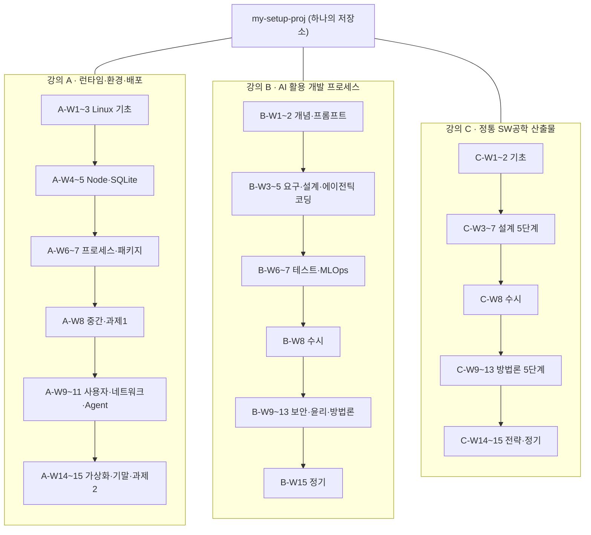

# 📚 강의 연결 맵 — 3개 강의 ↔ 프로젝트

> 이 프로젝트는 우송대학교 2026-2학기 **3개 전공 강의**의 공통 실습 환경이자 제출 산출물이다.
> 세 강의에 같은 프로젝트를 제출하되 **보여주는 층이 다르다.**

**📂 이동:** [⬆ progress/](README.md) · [🚀 ONBOARDING](../ONBOARDING.md) · [ROADMAP](../product/ROADMAP.md) · [DESIGN §8](../product/architecture/DESIGN.md) · [PROGRESS](PROGRESS.md)

---

## 0. 한눈에

3개 강의 = 같은 프로젝트를 보는 3개의 층.

| 강의 | 과목 (교수) | 층 | 대표 산출물 |
|---|---|---|---|
| **A** | AI 컴퓨터 운영체제 실습 (김태원) | **런타임·환경·배포** | `setup.sh`·`verify.sh`·[SETUP.md](../setup/SETUP.md), 3-프로세스 토폴로지([ADR-0016](../product/architecture/adr/ADR-0016-desktop-process-topology.md)·[RUNTIME_VIEW](../product/architecture/RUNTIME_VIEW.md)), [ADR-0002](../product/architecture/adr/ADR-0002-local-db-better-sqlite3.md)/[0009](../product/architecture/adr/ADR-0009-sqlite-file-location.md)/[0011](../product/architecture/adr/ADR-0011-agent-backend-db-access.md), [ADR-0007](../product/architecture/adr/ADR-0007-schedule-launchd-cron.md), NFR-SEC-04/06, Phase E(Docker), [DASHBOARD_OS §2](../product/vision/DASHBOARD_OS.md) |
| **B** | AI시대소프트웨어공학 (양현식) | **AI 활용 개발 프로세스** | `.claude/agents/{planner,developer,supervisor,finisher}.md`, `.claude/commands/{feature,build-next}.md`, [ORCHESTRATION.md](../setup/ORCHESTRATION.md), [ADR-0019](../product/architecture/adr/ADR-0019-architecture-fitness-functions.md)(제안), `agent/daily_brief.py` |
| **C** | AITool기반소프트웨어공학 (유승선) | **정통 SW공학 산출물** | `docs/product/` 전체 — FR/NFR, [ARCHITECTURE.md](../product/architecture/ARCHITECTURE.md) §0(C4/arc42), ADR 0001~0023, [TRACEABILITY.md](../product/requirements/TRACEABILITY.md), [TEST_PLAN.md](../product/testing/TEST_PLAN.md), [DESIGN.md](../product/architecture/DESIGN.md), mermaid(UML 대체) |

**강의 태그 규칙** — `<강의>-W<주차>` (예: `A-W11` = 강의 A 11주차). 복수는 `A-W5·C-W4`, 범위는 `C-W3~W7`.
태그의 단일 원천(SSOT)은 **이 문서 §4**. [TRACEABILITY.md](../product/requirements/TRACEABILITY.md) §6·[adr/README.md](../product/architecture/adr/README.md)·[GLOSSARY.md](../product/reference/GLOSSARY.md) 는 여기를 참조만 한다.

**섹션:** [§1 강의 A](#1-강의-a--ai-컴퓨터-운영체제-실습-김태원) · [§2 강의 B](#2-강의-b--ai시대소프트웨어공학-양현식) · [§3 강의 C](#3-강의-c--aitool기반소프트웨어공학-유승선) · [§4 강의 렌즈(태그 SSOT)](#4-강의-렌즈--fr-도메인adr-그룹--강의-주차) · [§5 공통 이론 모듈](#5-공통-이론-모듈-m1m3) · [§6 발표 산출물 맵](#6-발표-산출물-맵-w8--w15) · [§7 갭·리스크](#7-갭리스크) · [§8 주차 체크리스트·연결도](#8-주차-체크리스트--연결도)

> 상태 범례: ✅ 있음 / 🚧 진행 중 / ⏳ 예정 / — 대응 없음(갭)

---

## 1. 강의 A — AI 컴퓨터 운영체제 실습 (김태원)

| 항목 | 내용 |
|---|---|
| 교수 | 김태원 (W17 505호, taewony@wsu.ac.kr) |
| 교재 | IT CookBook 우분투 리눅스 (이종원, 한빛미디어, 2026 4판) |
| 기반 | 우분투 26.04 LTS, 실습실 PC + WSL2, Linux Container(가상화) + AI 활용 |
| 평가 | 출석 20 / 정기 30 / 수시 20 / 실험실습성과 30. 중간 20문제·기말 30문제 단답형(교재). 경진대회 가점, 발표 +1(max +3) |
| 과제 | (1) Ubuntu 환경 웹서비스 개발 ppt 발표 (W8) / (2) Linux 위 ollama 기반 RAG 혹은 agent 개발 ppt 발표 (W15). LMS 업로드, 리눅스 명령어 정리 포함 |

이 프로젝트가 담당하는 층 = **런타임·환경·배포**. 앱을 무엇 위에서 어떻게 띄우고 배포하는가.

| 주 | 강의 주제 | 프로젝트가 이 주를 만족시키는 산출물 | Phase | 상태 |
|---|---|---|---|---|
| A-W1 | CH01 리눅스 설치·기본 사용법 | [SETUP.md](../setup/SETUP.md) OS 확인 절차, `verify.sh` (`lsb_release`/`uname` 계열 점검) | A | ✅ |
| A-W2 | CH02 디렉터리·파일 사용법 | 저장소 폴더 구조(`frontend/backend/agent/tests/docs`), `setup.sh` 경로 처리 | A | ✅ |
| A-W3 | CH03 파일 접근 권한 관리 + 간단 C/파이썬 실습 | 스크립트 실행 권한(`chmod +x setup.sh verify.sh`), venv 파이썬. C 실습은 스택 불일치(§7) | A | ✅ (C 실습 갭) |
| A-W4 | CH04 문서 편집 + Node.JS/Next.JS 웹서버 | `frontend/` Electron+Vite+React, `backend/` Express — Node 런타임 위 웹서비스 | B1 | ✅ |
| A-W5 | CH05 셸 사용법 + SQLite DB 프로그래밍 | `backend/db/` better-sqlite3 + `schema.sql` ([ADR-0002](../product/architecture/adr/ADR-0002-local-db-better-sqlite3.md)/[0003](../product/architecture/adr/ADR-0003-schema-single-file.md)/[0009](../product/architecture/adr/ADR-0009-sqlite-file-location.md)), `.env` 환경변수 규칙([ENV_REFERENCE.md](../setup/ENV_REFERENCE.md)) | B2 | ✅ |
| A-W6 | CH06 프로세스 관리 + async·coroutine | 3-프로세스 토폴로지(Electron·Express·Python) [RUNTIME_VIEW](../product/architecture/RUNTIME_VIEW.md)·[ADR-0016](../product/architecture/adr/ADR-0016-desktop-process-topology.md), 위젯 셸=미니 윈도우 매니저 [DASHBOARD_OS §2](../product/vision/DASHBOARD_OS.md) | C5 | ✅ 코드 / [ADR-0016](../product/architecture/adr/ADR-0016-desktop-process-topology.md) 제안 |
| A-W7 | CH07 소프트웨어 관리 + CH08 파일시스템·디스크 | `npm`/`pip` 의존성 관리, 아카이빙·백업 절차(아래 상세) | B~C | 🚧 부분 |
| A-W8 | 중간고사 · 과제 1 발표 | §6 발표 맵 참조 — Ubuntu 웹서비스 데모 + 명령어 정리 | — | 🚧 |
| A-W9 | CH09 리눅스 부팅·종료 + AI Computer란? | graceful shutdown 계획 (NFR-REL-06), `systemctl`/launchd([ADR-0007](../product/architecture/adr/ADR-0007-schedule-launchd-cron.md)) | E4 | ⏳ |
| A-W10 | CH10 사용자 관리 + AI Agent·Ollama란? | 다중 사용자·데이터 분리 (FR-AUTH-02/03, Phase E1). 에이전트 개념 = `agent/` (Claude 기반, ollama 아님 §7) | E1 | ⏳ |
| A-W11 | CH11 네트워크 기초·설정 + Mini Coding Agent 개발 | 외부 API 는 HTTPS(Gmail·Calendar·Notion·Claude), `agent/` 파이프라인, CSP·CORS([ADR-0004](../product/architecture/adr/ADR-0004-front-back-http-rest.md)) | D2 | 🚧 스텁 |
| A-W12 | CH12 원격 접속·FTP + CH14 NFS·삼바 | — (프로젝트 범위 밖) | — | — |
| A-W13 | CH13 DB 서버·웹 서버 + CH15 리눅스 보안 기초 | NFR-SEC (위협 모델 [NFR §3.1](../product/requirements/REQUIREMENTS_NONFUNCTIONAL.md)), `preload.js`·`contextIsolation` | E4 | ⏳ |
| A-W14 | CH16 가상화 기술·AI 활용 + CH17 종합 프로젝트 | Dockerfile + electron-builder (Phase E3, NFR-DEPLOY-01/02) | E3 | ⏳ |
| A-W15 | 기말고사 · 과제 2 발표 | §6 발표 맵 — Daily Brief 에이전트 + cron + 네트워크·보안·Docker 종합. **ollama 갭 §7** | — | ⏳ |

<details>
<summary><b>강의 A — 주별 명령어·프로젝트 활용·발표·체크리스트 상세 (기존 내용 보존)</b></summary>

### Week 1-3: Linux 기초

- **강의:** Chapter 01-02 — WSL2 우분투 설치 및 기본 명령어, 디렉토리와 파일 사용법
- **학습 명령어:**
  ```bash
  lsb_release -a       # OS 버전 확인
  cat /etc/os-release  # OS 정보
  uname -r             # 커널 버전
  pwd                  # 현재 경로
  cd, ls, mkdir        # 파일 관리
  mkdir, rmdir         # 디렉토리 생성/삭제
  cp, mv, rm           # 파일 복사/이동/삭제
  ```
- **프로젝트 활용:**
  ```
  1. Ubuntu 폴더 구조 생성
     ~/my-setup-proj/
     ├── frontend/
     ├── backend/
     ├── agent/
     └── tests/
  2. 파일 관리 실습 — 스크립트 생성(touch), 권한 설정(chmod, Week 3), 디렉토리 정리(mv, rm)
  3. Git 저장소 초기화 — git init / git add . / git commit -m "Initial commit"
  ```
- **배우게 될 것:** 터미널 기본 명령어 · 파일 시스템 구조 · 경로 개념 · 파일 권한(chmod, chown)

### Week 4: 문서 편집 & Node.JS/Next.JS

- **강의:** Chapter 04 — vi/vim/gedit 편집기, 특별: Node.JS/Next.JS 웹서버 개발
- **학습 도구:**
  ```bash
  vi/vim              # 터미널 에디터
  gedit               # GUI 에디터
  sudo apt install gedit -y
  sudo apt install nodejs npm -y
  ```
- **프로젝트 활용:**
  ```
  1. Node.JS 프로젝트 초기화 — cd frontend / npm init / npm install react react-dom electron
  2. 첫 파일 생성(gedit) — package.json / src/App.jsx / src/index.js
  3. 서버 실행 — npm start (Electron) / npm run dev (개발 서버)
  4. VSCode 에서 개발(선택) — code .
  ```
- **배우게 될 것:** 문서 편집기 사용법 · Node.JS 기본 구조 · npm 패키지 관리 · 첫 웹 애플리케이션 실행

### Week 5: 셸 사용법 & SQLite

- **강의:** Chapter 05 — 셸 환경 변수(export, set, env), 설정(alias, history), 특별: SQLite DB 프로그래밍
- **학습 명령어:**
  ```bash
  type, chsh              # 셸 정보
  echo, export            # 환경 변수
  set, env                # 변수 확인
  alias                   # 명령어 별칭
  history                 # 명령어 히스토리
  sqlite3 mydb.db         # DB 생성
  .tables                 # 테이블 목록
  .schema                 # 스키마 확인
  ```
- **프로젝트 활용:**
  ```
  1. 환경 변수 설정 — .env 파일(코드에 하드코딩 금지, ENV_REFERENCE.md)
  2. SQLite 데이터베이스 — schema.sql 로 tasks/projects 테이블 정의, SELECT 조회
  3. alias 설정(선택) — alias ai-db='sqlite3 ~/my-setup-proj/app.db'
  4. 셸 스크립트 — setup.sh / chmod +x setup.sh / ./setup.sh
  ```
- **배우게 될 것:** 환경 변수 관리 · 셸 스크립트 기초 · SQLite · DDL

### Week 6: 프로세스 관리

- **강의:** Chapter 06 — 프로세스와 스레드, 관리 명령어, 특별: Async Programming & Coroutine
- **학습 명령어:**
  ```bash
  ps, ps -ef, pgrep       # 프로세스 목록·검색
  kill, pkill             # 프로세스 종료
  top, htop               # 모니터링
  sleep, jobs             # 대기·백그라운드 작업
  at, crontab -e          # 일회성·정기 작업
  ```
- **프로젝트 활용:**
  ```
  1. Express 서버 관리 — npm start & / ps aux | grep node / lsof -ti:3000 | xargs kill -9
  2. Daily Brief 자동 실행(Cron) — 0 8 * * * cd ~/my-setup-proj && python agent/daily_brief.py
  3. 프로세스 모니터링 — top / ps aux | grep python / htop
  4. 백그라운드 다중 작업 — Electron & Express & Python Agent 동시 실행 후 jobs
  ```
- **배우게 될 것:** 프로세스 생명주기 · 포그라운드/백그라운드 · Cron 스케줄링 · 시스템 모니터링

### Week 7: 소프트웨어 관리 & 파일 시스템

- **강의:** Chapter 07-08 — apt/dpkg/snap, 압축(tar/gzip), 디스크(fdisk/mkfs/mount)
- **학습 명령어:**
  ```bash
  apt search / apt list --installed / apt install / apt remove
  apt update && apt upgrade
  tar cvf archive.tar * / tar xvf archive.tar / gzip, gunzip
  df / du / lsblk / mount, umount
  ```
- **프로젝트 활용:**
  ```
  1. 배포 준비 — sudo apt update / npm install / pip install -r requirements.txt
  2. 백업/배포 — tar cvf my-setup-proj.tar --exclude=node_modules --exclude=venv --exclude=.git
  3. 디스크 사용량 — df -h / du -sh ~/my-setup-proj/*
     # 가장 큰 파일 찾기
     find . -type f -exec ls -lh {} \; | sort -k5 -hr | head -20
  4. Docker 이미지 관리(Week 14) — docker system df / docker image prune
  ```
- **배우게 될 것:** 패키지 관리자 · 아카이빙과 압축 · 디스크 공간 관리 · 백업 전략

### Week 8: 중간고사 & 과제 1 발표

- **중간고사:** 출제 범위 Chapter 01-07, 단답형 20문제 (chmod 권한 표기, 파일 경로, 프로세스 명령어, 환경 변수, SQLite 기본 SQL, apt). 준비 — Week 1-7 명령어 복습, SETUP.md 기본 명령어.
- **과제 1 발표 "Ubuntu 환경에서 웹서비스 개발":** 프로젝트 개요(3분) → 구현 과정(5분, 배운 Linux 명령어 사용) → 결과 시연(2분) → 배운 Linux 명령어 정리(10개 이상). 준비 자료 — PPT / 라이브 데모 / commands.md.

### Week 9-11: 고급 주제

- **Week 9 (부팅·종료, AI Computer):** shutdown/halt/poweroff/reboot/init/systemctl/uptime → 앱 재시작 로직, SIGTERM/SIGKILL 처리, graceful shutdown.
- **Week 10 (사용자 관리):** useradd/usermod/groupadd/passwd/su/sudo → 여러 사용자 지원, 권한 기반 접근 제어, 사용자별 데이터 분리.
- **Week 11 (네트워크 & Mini Coding Agent):** nmcli/ip/route/ping/traceroute/netstat/nmap/ufw + NAT·WSL2 네트워크 → Claude API 에이전트(Gmail·Calendar·Notion·Claude 전부 HTTPS), Mini Coding Agent 구현, 네트워크 모니터링(tcpdump, netstat), 방화벽 설정(ufw allow).
  ```python
  # Mini Coding Agent 의사코드 (agent/daily_brief.py 방향)
  def generate_daily_brief():
      # 1. 데이터 수집 (네트워크)
      emails = get_unread_emails()
      events = get_today_events()
      # 2. Claude API 호출 (네트워크)
      response = claude_api_call(emails, events)
      # 3. 결과 저장
      save_to_notion(response)
  ```
  ```bash
  # 네트워크 모니터링
  sudo tcpdump -i eth0 'port 443'
  netstat -tlnp | grep python
  sudo ufw allow 3000/tcp
  sudo ufw allow 443/tcp
  ```

### Week 12-13: 원격 접속·배포·보안

- **Week 12 (원격 접속, DB 서버, 웹 서버):** scp/ssh, `sudo apt install nginx`, `sudo systemctl enable nginx`.
  ```dockerfile
  # Dockerfile
  FROM node:18-alpine
  WORKDIR /app
  COPY . .
  RUN npm install
  CMD ["npm", "start"]
  ```
  ```nginx
  # Nginx 리버스 프록시
  server {
      listen 80;
      location / {
          proxy_pass http://localhost:3000;
      }
  }
  ```
  ```bash
  docker build -t my-setup-proj .
  docker run -p 3000:3000 my-setup-proj
  ```
- **Week 13 (보안 & 가상화):** `sudo ufw`, `sudo netstat -tlnp` → API 인증 확인, HTTPS(모든 API), `.env` git ignore, DB 암호화 / Docker 컨테이너·Docker Compose(다중 서비스).

### Week 14-15: 최종 발표 & 기말고사

- **기말고사:** 출제 범위 Chapter 01-17 전체, 단답형 30문제 (Linux 명령어, 파일 권한, 프로세스, 네트워크, 보안, 가상화).
- **과제 2 발표 "Ollama 기반 RAG/Agent 개발":** 프로젝트는 Claude API 기반 AI 에이전트. AI Agent 개요(3분) → Claude API 통합(3분) → 자동화 구현(2분, Cron·백그라운드·에러 처리) → 라이브 데모(2분). 준비 자료 — PPT / 코드 데모 / 학습 내용 정리. **주의:** 과제 요구사항은 ollama 기반이며 프로젝트는 Claude API 를 쓴다 → §7 갭 참조.

### 최종 결과물 (강의 A 관점)

```
my-setup-proj/
├── README.md / ARCHITECTURE.md / ROADMAP.md
├── frontend/ (Electron + React) / backend/ (Express API) / agent/ (Claude 에이전트)
├── tests/ / Dockerfile / .github/workflows/

배포 결과: Docker 이미지 · GitHub Releases · 문서(명령어 정리) · 발표 자료(PPT)
```

</details>

**평가 대응:** 정기(단답형) = 교재 기반, 프로젝트 무관 / 실험실습성과 30 = `verify.sh` 통과 로그·주차별 실습 / 수시 = W8 발표 / 과제 = W8·W15 ppt.

---

## 2. 강의 B — AI시대소프트웨어공학 (양현식)

| 항목 | 내용 |
|---|---|
| 교수 | 양현식 (소프트웨어학부 컴퓨터·소프트웨어전공) |
| 학점 | 3 (이론 2 / 실습 1), 과목번호 0014694-001 |
| 교재 | 쉽게 배우는 소프트웨어 공학 (한빛미디어) |
| 평가 | 수시평가 30 / 정기평가 30 / 출석 20 / 실험실습성과 20 |
| 운영 | 강의 + 소프트웨어 개발 프로젝트. **Problem Statement 학기초 제시**(하나 선택해 산출물 제출), 팀 구성 가능 |

> ⚠️ Problem Statement 아직 미수령 (학기초 제시). 아래 매핑은 수령 전 잠정안이며 확정 시 재검토한다.

이 프로젝트가 담당하는 층 = **AI 활용 개발 프로세스**. AI 도구로 요구사항→설계→코딩→테스트→운영을 어떻게 도는가.

| 주 | 강의 주제 | 프로젝트가 이 주를 만족시키는 산출물 | Phase | 상태 |
|---|---|---|---|---|
| B-W1 | SW공학 기본개념 — AI시대 개발 방법·라이프사이클 | [DOC_PLAN.md](../product/DOC_PLAN.md), [ROADMAP.md](../product/ROADMAP.md) Phase A~E | — | ✅ |
| B-W2 | 프롬프트 엔지니어링 | `.claude/agents/*.md` (역할별 프롬프트), [CLAUDE_INTEGRATION.md](../setup/CLAUDE_INTEGRATION.md) | — | ✅ |
| B-W3 | AI 기반 요구사항 분석 | `docs/product/requirements/` (FR·NFR·도메인별), [DOC_PLAN.md](../product/DOC_PLAN.md) §3 | — | ✅ |
| B-W4 | AI 지원 설계 및 아키텍처 | ADR 0015~0022, [ARCHITECTURE_DRIVERS.md](../product/architecture/ARCHITECTURE_DRIVERS.md) | — | ✅ (0018 채택 P6 · 0015·0016·0017·0019 제안) |
| B-W5 | 에이전틱 코딩 | `/feature` 4-에이전트 파이프라인, [ORCHESTRATION.md](../setup/ORCHESTRATION.md) | — | ✅ |
| B-W6 | AI 기반 테스트 자동화 | `backend/test/*`·`agent/tests/*` (51+3), `verify.sh`, GitHub Actions, [ADR-0019](../product/architecture/adr/ADR-0019-architecture-fitness-functions.md) 피트니스 함수 | A3~ | ✅ 테스트 / [ADR-0019](../product/architecture/adr/ADR-0019-architecture-fitness-functions.md) 제안 |
| B-W7 | MLOps 및 운영 자동화 | `scripts/worklog*.sh`·launchd([ADR-0007](../product/architecture/adr/ADR-0007-schedule-launchd-cron.md)), EOD 커밋·슬랙, `agent/daily_brief.py` cron | D3 | 🚧 |
| B-W8 | 수시 평가 | §6 발표 맵 — `/feature` 파이프라인 실행 녹화 + 프롬프트 파일 | — | ✅ 자료 |
| B-W9 | AI 보안 및 안전한 활용 | [NFR §3.1](../product/requirements/REQUIREMENTS_NONFUNCTIONAL.md) 위협 모델, NFR-SEC-*, `preload.js`·`contextIsolation`, `.env` 미커밋 | — | ✅ |
| B-W10 | 윤리·저작권·책임 | — (대응 문서 없음) | — | — (갭 §7) |
| B-W11 | 애자일 개발 방법론 | §5 M1 참조 | — | ✅ |
| B-W12 | RUP, V-모델, RAD 방법론 | §5 M2 참조 | — | ✅ |
| B-W13 | 버전 관리 및 프로세스 흐름 | §5 M3 참조 | — | ✅ |
| B-W14 | AI 활용 SW 설계·개발 전략 | 전 주기 종합 — `docs/` + `.claude/` + `agent/` | — | 🚧 |
| B-W15 | SW 개발방법론 정기평가 | §6 발표 맵 — 전 주기 발표 | — | ⏳ |

**평가 대응:** 수시(W8) = 파이프라인 데모 / 정기(W15) = 개발방법론 필기 + 프로젝트 근거 / 실습 20 = 주차별 산출물.

---

## 3. 강의 C — AITool기반소프트웨어공학 (유승선)

| 항목 | 내용 |
|---|---|
| 교수 | 유승선 (소프트웨어학부 컴퓨터공학전공) |
| 학점 | 3 (이론 1 / 실습 2), 과목번호 0014683-001 |
| 교재 | 새로 쓴 소프트웨어 공학 (최은만, 정익사). 부교재: 소프트웨어 공학 (Sommerville, 권기태 역) |
| 평가 | 수시평가 30 (Term Project 결과) / 정기평가 30 (필기) / 출석 20 / 주별리포트(실습) 20 |
| 운영 | 강의 + 개별 프로젝트. **Problem Statement 학기초 제시**, 산출물 제출 |

> ⚠️ Problem Statement 아직 미수령 (학기초 제시). 아래 매핑은 수령 전 잠정안이며 확정 시 재검토한다.

이 프로젝트가 담당하는 층 = **정통 SW공학 산출물**. 설계 5단계 + 개발방법론 5단계의 산출물이 실제로 있는가.

| 주 | 강의 주제 | 프로젝트가 이 주를 만족시키는 산출물 | Phase | 상태 |
|---|---|---|---|---|
| C-W1 | 과정 소개 — 컴퓨터프로그래밍 기초, 자격증·진로 | — (오리엔테이션) | — | — |
| C-W2 | 프로그램 개발 방법론 — C언어·개발환경·알고리즘 | 스택은 JS/Python (C 아님) → 불일치, A-W3 과 묶임 (§7) | — | — (갭 §7) |
| C-W3 | 소프트웨어 설계방법(1) — 설계 원리 | [DESIGN.md](../product/architecture/DESIGN.md) §1, [ARCHITECTURE_DRIVERS.md](../product/architecture/ARCHITECTURE_DRIVERS.md) (품질 속성 주도) | — | ✅ |
| C-W4 | 소프트웨어 설계방법(2) — 구조적 설계 | `routes → services → db` 계층 (NFR-MAINT-02), [CROSSCUTTING.md](../product/architecture/CROSSCUTTING.md) | C1 | ✅ |
| C-W5 | 소프트웨어 설계방법(3) — 객체지향 설계 | 부분 갭 — 코드가 함수형 중심. [ADR-0020](../product/architecture/adr/ADR-0020-widget-shell-architecture.md) 위젯 레지스트리 "계약"이 OO 인터페이스에 근접 (과장 금지) | C5 | 🚧 부분 |
| C-W6 | 소프트웨어 설계방법(4) — 컴포넌트·아키텍처 설계 | [ARCHITECTURE.md](../product/architecture/ARCHITECTURE.md) §0 C4, `frontend/src/widgets/registry.js` 위젯 계약, [ADR-0020](../product/architecture/adr/ADR-0020-widget-shell-architecture.md)/[0021](../product/architecture/adr/ADR-0021-widget-layout-persistence.md) | C5~C6 | ✅ |
| C-W7 | 소프트웨어 설계방법(5) — 설계도구 UML, 설계패턴 | [DIAGRAMS.md](../setup/DIAGRAMS.md) + 각 문서 mermaid (flowchart·sequence·stateDiagram — 정식 UML 아님, "UML 대체" 정직 표기) | — | 🚧 부분 |
| C-W8 | 수시 평가 | §6 발표 맵 — Term Project 중간 (설계 산출물) | — | ✅ |
| C-W9 | SW 개발방법론(1) — 전통적 개발 방법론 | §5 M1 참조 (대비 기준) | — | ✅ |
| C-W10 | SW 개발방법론(2) — 애자일 방법론 | §5 M1 참조 | — | ✅ |
| C-W11 | SW 개발방법론(3) — RUP, V-모델, RAD | §5 M2 참조 | — | ✅ |
| C-W12 | SW 개발방법론(4) — 개발 도구 및 기술 | `docs/setup/` (SETUP·CONVENTIONS·GIT_WORKFLOW·AUTOMATION·DIAGRAMS), CI | — | ✅ |
| C-W13 | SW 개발방법론(5) — 버전 관리 및 프로세스 흐름 | §5 M3 참조 | — | ✅ |
| C-W14 | 소프트웨어 설계 및 개발 전략 | [TEST_PLAN.md](../product/testing/TEST_PLAN.md) + [TRACEABILITY.md](../product/requirements/TRACEABILITY.md) 종합 | — | ✅ |
| C-W15 | 정기 평가 (필기) | §6 발표 맵 — 필기 + Term Project 최종 | — | ⏳ |

**평가 대응:** 수시 30 = Term Project 결과(설계 산출물) / 정기 30 = 필기(교재) / **주별리포트 20 = 별도 양식 필요 (§7, 범위 밖)**.

---

## 4. 강의 렌즈 — FR 도메인/ADR 그룹 → 강의-주차

> **이 표가 강의 태그의 단일 원천(SSOT).** FR 개별 행을 복제하지 않고 도메인/ADR 그룹 단위로만 잇는다. 상태 열은 두지 않는다 (상태 SSOT = [TRACEABILITY.md](../product/requirements/TRACEABILITY.md)).

| FR 도메인 / ADR 그룹 / 문서 | 강의-주차 | 메모 |
|---|---|---|
| FR-TASK-05 / ADR-0002·0003·0009 | A-W5, C-W4 | SQLite = A 의 DB 실습 / C 의 구조적 설계 |
| FR-TASK-01~04 / ADR-0004 | A-W4, B-W5, C-W4 | REST + 계층 분리 |
| FR-PROJ / ADR-0012 | B-W3, C-W4 | 요구사항 분석 / FK 설계 |
| FR-CAL·FR-MAIL / ADR-0006 | A-W11, B-W7 | 네트워크 API / 운영 자동화 |
| FR-AGENT-01~06 / ADR-0007·0011 | A-W6·A-W10·A-W11, B-W5·B-W7 | A-W6 프로세스·cron / A-W10~11 사용자·네트워크 / ollama 미사용 = A 과제2 갭 (§7) |
| ADR-0013 대시보드 에이전트 작업 큐 | B-W5 | 부분 채택 — P7 "지금 실행"(FR-AGENT-08) 파일 플래그 트리거 채택(2026-09-08) / 전체 큐(FR-AGENT-09) 제안 |
| FR-WIDGET-01~08 / ADR-0020·0021·0022 | A-W6, C-W5·C-W6 | 창·프로세스 은유 / 컴포넌트·OO 설계 |
| FR-UI-05 / ADR-0014 | C-W7 | 다이어그램 뷰어 = mermaid(UML 대체) |
| ADR-0016 / RUNTIME_VIEW | A-W6·A-W9 | 프로세스 토폴로지 (제안) |
| ADR-0015 로컬 우선 | C-W3·C-W6 | 아키텍처 스타일 (제안) |
| ADR-0017 REST 오류 계약 | C-W4 | (제안) |
| ADR-0018 마이그레이션 전략 | A-W5, C-W4 | (제안) |
| ADR-0019 피트니스 함수 | B-W6 | (제안) |
| NFR §3.1 위협 모델 / NFR-SEC-* | A-W13, B-W9 | 보안 |
| NFR-DEPLOY / Phase E3 (Docker) | A-W7·A-W14 | 가상화·배포 |
| TEST_PLAN.md | B-W6, C-W14 | 테스트 자동화 / 개발 전략 |
| GIT_WORKFLOW.md / ADR-0023 | B-W13, C-W13 | → §5 M3 |
| ORCHESTRATION.md / `.claude/` | B-W2·B-W5 | 프롬프트 / 에이전틱 코딩 |

---

## 5. 공통 이론 모듈 (M1~M3)

> 강의 B·C 가 겹치는 방법론 주제. 본문 중복 서술 없이 링크로만.

| 모듈 | 강의-주차 | 프로젝트 근거 |
|---|---|---|
| **M1 애자일** | B-W11, C-W10 (대비: C-W9 전통) | 주 단위 Phase 반복([ROADMAP.md](../product/ROADMAP.md)), [PROGRESS.md](PROGRESS.md) 주간 회고, 위젯 셸 방향 전환 = 요구사항 변화 수용 |
| **M2 RUP·V-모델·RAD** | B-W12, C-W11 | Phase 게이트([DESIGN.md](../product/architecture/DESIGN.md) §8) ↔ V-모델, [TEST_PLAN.md](../product/testing/TEST_PLAN.md) §5 머지 게이트, [TRACEABILITY.md](../product/requirements/TRACEABILITY.md) |
| **M3 버전 관리·프로세스 흐름** | B-W13, C-W13 | [GIT_WORKFLOW.md](../setup/GIT_WORKFLOW.md), [ADR-0023](../product/architecture/adr/ADR-0023-branch-model.md), [ORCHESTRATION.md](../setup/ORCHESTRATION.md), [작업로그.md](../../작업로그.md) |

---

## 6. 발표 산출물 맵 (W8 · W15)

세 강의에 같은 프로젝트를 제출하되 **보여주는 층이 다르다.**

| 시점·강의 | 요구 | 프로젝트에서 꺼낼 것 | 상태 |
|---|---|---|---|
| **W8 · A** | 과제1 ppt "Ubuntu 웹서비스" + 데모 + 명령어 정리 | `setup.sh`/`verify.sh` 실행, WSL2 위 Express+Vite, SQLite, `ps`/`crontab`/`chmod` 로그 | 🚧 WSL2 실행 검증 미확인 (개발 머신 macOS) |
| **W8 · B** | 수시평가 + Problem Statement | `/feature` 파이프라인 실행 녹화, 프롬프트 파일, 테스트 통과 | ✅ 자료 존재 |
| **W8 · C** | 수시평가 (Term Project 중간) | `docs/product/` 설계 산출물 — C4·ADR·TRACEABILITY·mermaid | ✅ |
| **W15 · A** | 과제2 ppt "ollama RAG/agent" + 종합(W14) | Daily Brief 에이전트, cron, 네트워크·보안·Docker | ⏳ + **ollama 갭 (§7)** |
| **W15 · B** | 정기평가 + 최종 | 전 주기: 프롬프트 → 요구사항 → 설계 → 에이전틱 코딩 → 테스트 → 운영 자동화 | ⏳ |
| **W15 · C** | 정기평가(필기) + Term Project 최종 | 설계 5단계 + 방법론 근거(M1~M3) | ⏳ |

> ⚠️ 확인 필요 — [ROADMAP.md](../product/ROADMAP.md) 는 중간고사 10-27·기말 12-08 로 잡혀 있으나, W1 시작 09-02 기준이면 W8=10-21~27, W15=12-09~15 로 계산된다. 날짜 불일치는 여기서 수정하지 않는다.

---

## 7. 갭·리스크

- **A-W15 과제2 (ollama):** 과제 요구는 "Linux 위 ollama 기반 RAG/agent" 인데, 프로젝트 에이전트는 Claude API(`agent/services/claude.py`) 를 쓴다. **대응은 후속 결정** (코드 미변경). 선택지:
  1. `agent/` 에 ollama 스위치(로컬 모델 백엔드) 추가
  2. 발표에서 "Claude API 로 대체 구현했고 ollama 로 바꾸려면 이 지점" 을 설명
  3. ollama 기반 별도 미니 데모를 발표용으로 따로 제작
- **B-W10 윤리·저작권·책임:** 대응 문서 없음. AI 생성 코드의 저작권·책임 관련 문서 미작성.
- **C 주별리포트 (20%):** [PROGRESS.md](PROGRESS.md)·[작업로그.md](../../작업로그.md) 는 리포트 양식이 아니다. 별도 주별 리포트 양식 필요 — **이 문서 범위 밖 (후속 결정).**
- **C-W2 / A-W3 C언어·알고리즘:** 강의는 C 언어·개발환경·알고리즘을 다루나 프로젝트 스택은 JS/Python. 언어 불일치로 직접 대응 없음.
- **B·C Problem Statement 미수령:** 학기초 제시 예정. §2·§3 매핑은 잠정이며 수령 후 재검토.
- **제안 상태 ADR:** 0013 은 **전체 작업 큐(FR-AGENT-09) 부분만** 제안 (P7 "지금 실행" FR-AGENT-08 트리거는 2026-09-08 채택). 0015·0016·0017·0019 는 아직 "제안". 렌즈 표(§4)에서 "(제안)" 표기. 임의로 "채택" 처리 금지. (0018·0027~0032 는 개인 생산성 OS 방향에서 채택됨.)

---

## 8. 주차 체크리스트 & 연결도

### 연결도

> 다이어그램 열람·이미지 내보내기: [DIAGRAMS.md](../setup/DIAGRAMS.md).



### 실습 체크리스트

각 주차별로 완료한 내용을 체크한다. (강의 A 기존 체크리스트 + B/C 행)

**강의 A**

- [ ] A-W1~3 — Ubuntu 버전 확인 / 폴더 구조 / 파일 관리 / 권한(chmod 755·644) / Git 초기화
- [ ] A-W4 — Node.js 설치 / Electron 프로젝트 / React 컴포넌트 / 첫 앱 실행
- [ ] A-W5 — `.env` 환경 변수 / SQLite DB / CREATE TABLE / SELECT
- [ ] A-W6 — Express 백그라운드 실행 / 프로세스 모니터링(ps, top) / Cron(Daily Brief) / 포트 확인(netstat)
- [ ] A-W7 — npm install / 아카이빙(tar, gzip) / 디스크 사용량(df, du)
- [ ] A-W8 — 중간고사 준비 / 과제1 PPT / 라이브 데모 / 명령어 정리 문서
- [ ] A-W9~11 — 다중 사용자 테스트 / 네트워크 모니터링 / Claude API 에이전트 / Daily Brief 자동화
- [ ] A-W12~14 — Docker 이미지 빌드 / 컨테이너 실행 / 보안 검토 / 성능 최적화
- [ ] A-W15 — 기말고사 준비 / 과제2 PPT (ollama 갭 대응 명시) / 최종 데모 / 배운 내용 정리

**강의 B**

- [ ] B-W2~5 — 프롬프트 파일 정리 / 요구사항 문서 최신화 / 설계 ADR 결정 / `/feature` 실행 녹화
- [ ] B-W6~7 — 테스트 커버리지 확인 / `verify.sh` 통과 / cron·EOD 자동화 로그
- [ ] B-W8 — 수시평가 자료 (파이프라인 데모)
- [ ] B-W9~13 — 위협 모델 검토 / 윤리·저작권 문서 (갭) / 방법론 대비 정리(M1~M3)
- [ ] B-W15 — 정기평가 + 전 주기 발표

**강의 C**

- [ ] C-W3~7 — 설계 원리 / 구조적(계층) / OO(부분) / 컴포넌트(위젯 계약) / UML 대체(mermaid) 산출물 확인
- [ ] C-W8 — Term Project 중간 (설계 산출물 묶음)
- [ ] C-W9~13 — 방법론 5단계 대비표 / 도구(setup/) / 버전 관리(GIT_WORKFLOW·ADR-0023)
- [ ] C-W14~15 — 개발 전략 종합 / 필기 준비 / Term Project 최종 / **주별리포트 양식 (별도, 갭)**

---

**마지막 업데이트:** 2026-09-06
**다음 단계:** [PROGRESS.md](PROGRESS.md) 에서 주간 진행 상황 추적
