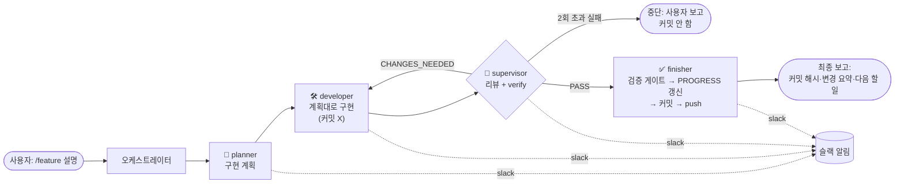

# 🤖 자동화 셋업 (Claude Code Automation)

> 이 프로젝트에 붙어 있는 "사람이 안 해도 되는 일" 목록.
> 에이전트 팀 · `/feature` 파이프라인 · 작업로그 자동화 · 슬랙 알림 · GitHub Actions 로 구성된다.

주간 계획은 [PROGRESS.md](../progress/PROGRESS.md), 일일 커밋 기록은 [작업로그.md](../../작업로그.md) 를 본다.

---

## 1. 에이전트 팀 (`.claude/agents/`)

하나의 기능을 네 역할이 나눠 완성한다. 각 역할은 별도 서브에이전트로 분리돼 있어
권한(코드 수정 / 커밋)이 역할별로 제한된다.

| 친구 | 파일 | 모델 | 역할 | 코드 수정 | 커밋 |
|---|---|---|---|:---:|:---:|
| 🧠 생각하는 친구 | `planner.md` | opus | 문서·코드베이스 조사 후 구현 계획 작성 | ✕ | ✕ |
| 🛠️ 개발하는 친구 | `developer.md` | sonnet | 계획대로만 구현 (범위 밖 금지) | ○ | ✕ |
| 👀 감독하는 친구 | `supervisor.md` | opus | diff 리뷰 + `verify.sh`·문법 검증, `PASS` / `CHANGES_NEEDED` 판정 | ✕ | ✕ |
| ✅ 마무리하는 친구 | `finisher.md` | sonnet | 검증 게이트 → `PROGRESS.md` 갱신 → 커밋·푸시 ([GIT_WORKFLOW.md](GIT_WORKFLOW.md)) | 문서만 | ○ |

핵심 규칙:

- developer 는 `.env` 하드코딩 금지, 한국어 주석, 과설계 금지, **커밋 안 함**.
- finisher 는 실제로 실행돼 FAIL 난 검사가 있으면 커밋하지 않고, `git push --force`·`main` 강제 푸시 금지. 브랜치 정책은 [GIT_WORKFLOW.md](GIT_WORKFLOW.md) §2.
- Claude 모델은 최신(`claude-opus-5` 등)을 쓴다. 상세 규칙은 [CONVENTIONS.md](CONVENTIONS.md).

---

## 2. `/feature` 파이프라인 (`.claude/commands/feature.md`)

```
/feature Week 3 - Supabase 테이블 스키마와 마이그레이션 스크립트 추가
```

오케스트레이터가 직접 코딩하지 않고 아래 순서로 위임한다:



- `CHANGES_NEEDED` 반복은 **최대 2회**. 그래도 통과 못 하면 커밋하지 않고 멈춘다.
- 각 단계 종료 시 슬랙에 한 줄 알림 (`scripts/slack-notify.sh`, webhook 없으면 조용히 스킵).
- 커밋·푸시 판정 규칙은 [GIT_WORKFLOW.md](GIT_WORKFLOW.md), 상태 전이·정지 조건은 [ORCHESTRATION.md](ORCHESTRATION.md).

### `/build-next` — 로드맵 자동 진행 (`.claude/commands/build-next.md`)

`/feature` 를 사람이 매번 부르는 대신, `/build-next` 가 [DESIGN.md](../product/architecture/DESIGN.md) §8 +
[TRACEABILITY.md](../product/requirements/TRACEABILITY.md) 를 읽어 **다음 스텝을 스스로 골라** `/feature` 를 반복한다.
제안 상태 ADR 미결정·`.env` 키 누락·대화형 준비 필요 등 **사람이 결정할 지점에서만 멈춘다**
(정지 상태와 보고 내용은 [ORCHESTRATION.md](ORCHESTRATION.md) §3). 한 호출당 최대 3스텝.

---

## 2.5 병합된 브랜치 정리 (`scripts/prune-merged-branches.sh`)

작업 한 건이 PR 로 `main` 에 병합되면, 그 로컬 브랜치는 더 필요 없다. 예전에는 다음 세션의
"첫 할 일" 로 손수 지웠다 ([NEXT_SESSION.md](../progress/NEXT_SESSION.md)). 이제 자동이다.

**언제 도는가:**

| 계기 | 구현 |
|---|---|
| 새 세션 시작 (= 새 계획 착수) | `.claude/settings.json` 의 `SessionStart` 훅 (타임아웃 30초, 실패해도 세션 안 막음) |
| `/feature` 착수 직전 | `feature.md` 0단계 |
| `/build-next` 루프 진입 시 1회 | `build-next.md` 0단계 (TIDY) |
| 사람이 직접 | `bash scripts/prune-merged-branches.sh` |

**무엇을 지우나:** `git branch --merged origin/main` 후보를 `git merge-base --is-ancestor` 로
한 번 더 확인해, **origin/main 에 확실히 병합된** `feature/ · docs/ · fix/ · design/ · chore/ ·
refactor/` 접두어 브랜치만. 현재 체크아웃된 브랜치와 `main` 은 제외. 미병합 브랜치는 절대
건드리지 않는다. 원격 브랜치는 `git fetch --prune` 로 사라진 추적 참조만 정리한다.

---

## 3. 작업로그 자동화

`작업로그.md` 는 날짜별로 **요약**(사람·Claude 작성)과 **커밋**(git 이력에서 자동) 두 부분을 가진다.

### 매 턴 종료 — `scripts/worklog.sh` (Stop 훅)

`.claude/settings.json` 의 `Stop` 훅이 매 턴 끝에 호출한다.

- **전체 git 이력**에서 `작업로그.md` 의 커밋 섹션을 다시 만든다 (한 턴 놓쳐도 다음 실행에 복구).
- `<!-- SUMMARY:날짜 -->` ~ `<!-- /SUMMARY:날짜 -->` 사이의 요약은 **절대 지우지 않는다.**
- 커밋·푸시·슬랙 전송은 하지 않는다. 파일만 갱신.
- 타임아웃 20초, 실패해도 세션을 막지 않는다 (`|| true`).

### 요약은 누가 쓰나

- **`finisher`** 가 커밋 직전에 오늘 `SUMMARY` 블록을 이번 작업 내용으로 갱신(누적)한다 (`finisher.md` §3).
- 사용자가 "작업로그 정리" 를 요청하면 Claude 가 그날 요약을 다시 정리한다.
- 요약 항목은 "무엇을 왜 했는지" 한두 줄. 커밋 해시는 아래 자동 섹션에 이미 있으므로 반복하지 않는다.

### 매일 23:50 — `scripts/worklog-eod.sh` (launchd)

`scripts/com.aicomputeros.worklog.plist` 예약 작업이 실행한다.

1. `worklog.sh` 로 로그 최신화
2. `작업로그.md` 에 변경이 있으면 `docs: 작업로그 <날짜>` 로 커밋 후 현재 브랜치에 푸시
3. **오늘 요약 블록**을 슬랙 채널에 전송 (커밋 목록이 아니라 요약 + 커밋 수)

설치 (경로 자동 생성 — plist 를 직접 복사하지 않는다):

```bash
bash scripts/install-worklog-launchd.sh            # 설치/재설치
bash scripts/install-worklog-launchd.sh --uninstall
```

시간 변경은 `scripts/install-worklog-launchd.sh` 의 `Hour`/`Minute` 수정 후 다시 실행.

> `scripts/com.aicomputeros.worklog.plist` 는 참고용 템플릿이다. 경로가 개발 머신 기준이므로
> 다른 컴퓨터에서는 반드시 위 install 스크립트로 설치한다(ROOT 자동 계산).

---

## 3.5 일일 브리핑 자동 실행 (FR-AGENT-05)

매일 아침 **07:30**(기본) 에 `scripts/daily-brief-run.sh` 가 `agent/trigger.py`(밀린 "지금 실행" 플래그 소비 폴백)
→ `agent/sync.py` → `agent/daily_brief.py` 순으로 실행된다. sync 가 실패해도 캐시된 데이터로 브리핑은 시도한다.

- **시각을 바꿀 때는 install 스크립트 인자와 `.env` 의 `DAILY_BRIEF_HOUR`/`DAILY_BRIEF_MINUTE` 를 함께 고친다.**
  전자는 launchd 예약 시각을, 후자는 활동 위젯의 "다음 실행" 표시를 결정한다(백엔드는 plist 를 파싱하지 않음).
- 로그: `scripts/daily-brief.log` (1MB 초과 시 `.log.1` 로 1회 회전, `.gitignore` 대상)
- 래퍼가 `agent/venv` 활성화 + `.env` 명시 로딩(launchd 는 셸 프로파일 미로딩)
- 실패해도 재시도하지 않는다 (`KeepAlive` 없음) — 다음 날 스케줄까지 대기

**macOS (launchd):**

```bash
bash scripts/install-dailybrief-launchd.sh          # 07:30 설치/재설치
bash scripts/install-dailybrief-launchd.sh 8 15     # 08:15 로 설치
bash scripts/install-dailybrief-launchd.sh --uninstall
```

**Linux (cron):**

```cron
30 7 * * * /절대경로/스크립트/daily-brief-run.sh
```

> `scripts/com.aicomputeros.dailybrief.plist` 는 `__REPO_ROOT__` 플레이스홀더 템플릿이다.
> 직접 복사하지 말고 install 스크립트를 쓴다.

---

## 3.6 에이전트 "지금 실행" 트리거 (FR-AGENT-08, P7)

대시보드 활동 위젯의 **"지금 실행"** 버튼이 `POST /api/agent/run-now` 를 호출하면 백엔드는
`agent/.triggers/run-now` 플래그 파일만 쓴다(파이썬 spawn 없음 — ADR-0011). launchd `WatchPaths` 가
그 디렉터리 변경을 감지해 `scripts/agent-run-now.sh` → `agent/trigger.py` → `sync.sync_all()` 을 1회 실행하고
플래그를 삭제한다. `daily-brief-run.sh` 도 시작 시 밀린 플래그를 소비한다(폴백).

**macOS (launchd):**

```bash
bash scripts/install-runnow-launchd.sh              # 설치/재설치 (WatchPaths = agent/.triggers)
bash scripts/install-runnow-launchd.sh --uninstall
```

- 로그: `scripts/run-now.log` (1MB 초과 시 1회 회전, `.gitignore` 대상)
- `scripts/com.aicomputeros.runnow.plist` 는 `__REPO_ROOT__` 템플릿 — 직접 복사 금지, install 스크립트 사용
- Ubuntu 는 launchd 가 없다 → 파일 감시 도구(inotifywait)로 대체하거나 정기 sync 폴백에 의존
- **WatchPaths 실제 감지는 로컬 launchd 환경이 필요해 개발/CI 머신에서 미검증**

---

## 4. 슬랙 알림 (`scripts/slack-notify.sh`)

```bash
bash scripts/slack-notify.sh "✅" "마무리하는 친구" "커밋 abc123 푸시 완료"
```

- `.env` 의 `SLACK_WEBHOOK_URL` 을 읽는다. **없으면 조용히 종료**하므로 항상 호출해도 안전하다.
- 발급: Slack → Apps → *Incoming Webhooks* → Add to Slack → 채널 선택 → URL 복사 → `.env` 에 추가.
- (선택) 양방향: 대화형 세션에서 `/install-slack-app` 실행 + claude.ai 커넥터 인증 → 슬랙에서 `@Claude /feature ...` 로 직접 실행.

---

## 5. GitHub Actions (`.github/workflows/test.yml`)

모든 브랜치 push 와 PR 에서 실행. 빌드는 안 하고 **문법 검사만** 한다 (Week 1 수준).

| job | 하는 일 |
|---|---|
| `backend` | `npm install` → `node -c src/server.js` |
| `frontend` | `npm install` → `node -c src/main.js` |
| `agent` | `pip install -r requirements.txt` → `python -m compileall .` |

---

## 6. 로컬 검증 스크립트

| 스크립트 | 용도 |
|---|---|
| `setup.sh` | frontend/backend `npm install` + agent Python venv 생성·설치, `.env` 없으면 `.env.example` 복사 |
| `verify.sh` | 환경(설치·의존성) + 주요 파일 문법 확인. `--code-only` 로 문법만. 검사 도구가 없으면 SKIP(실패 아님). 커밋 판정 규칙은 [GIT_WORKFLOW.md](GIT_WORKFLOW.md) |

커밋·푸시 시 에이전트가 따르는 규칙은 [GIT_WORKFLOW.md](GIT_WORKFLOW.md) 에 정리돼 있다 (검증 게이트 해석, 브랜치 정책, 미프로비저닝 머신 처리, 사후 CI 확인).

---

## 파일 한눈에

```
.claude/
  settings.json              # SessionStart 훅 → prune-merged-branches.sh · Stop 훅 → worklog.sh · PreToolUse 훅 → hook-code-branch-guard.sh
  agents/{planner,developer,supervisor,finisher}.md
  agents/README.md
  commands/feature.md        # /feature — 한 기능 파이프라인
  commands/build-next.md     # /build-next — 로드맵 자동 진행 상위 루프
scripts/
  worklog.sh                 # 매 턴: 오늘 섹션 갱신
  prune-merged-branches.sh   # SessionStart / 파이프라인 착수: origin/main 에 병합된 로컬 브랜치 삭제
  hook-code-branch-guard.sh  # PreToolUse: 코드 소스를 main 에서 직접 편집 시 승인 프롬프트 (CONVENTIONS §6)
  worklog-eod.sh             # 23:50: 커밋·푸시·슬랙
  slack-notify.sh            # 슬랙 Incoming Webhook 전송
  render-diagrams.sh         # docs/ 의 Mermaid 블록 → SVG (docs/setup/DIAGRAMS.md)
  daily-brief-run.sh         # 07:30: trigger → sync → daily_brief 래퍼 (FR-AGENT-05)
  agent-run-now.sh           # "지금 실행" 트리거 래퍼 → trigger.py (FR-AGENT-08, P7)
  seed-demo.js               # 데모/프로토타입용 샘플 데이터 시드 (node scripts/seed-demo.js [--reset])
  install-worklog-launchd.sh / install-dailybrief-launchd.sh / install-runnow-launchd.sh  # launchd 설치(경로 자동)
  com.aicomputeros.worklog.plist / com.aicomputeros.dailybrief.plist / com.aicomputeros.runnow.plist  # launchd 템플릿
.github/workflows/test.yml   # 문법 검사 CI
setup.sh / verify.sh         # 로컬 환경 구축·점검
```
