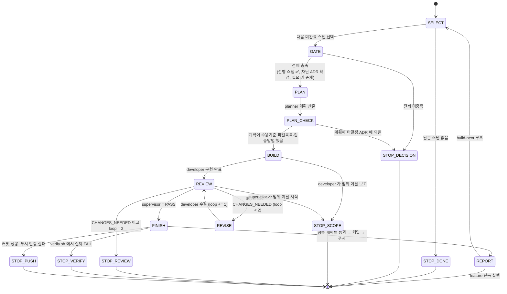

# 🕸️ 오케스트레이션 그래프 (Orchestration Graph)

> 에이전트 파이프라인을 **명시적 상태 그래프**로 정의한다. `feature.md`(한 기능)와 `build-next.md`(로드맵 자동 진행)가 이 그래프를 따른다.
> 역할 정의는 [AUTOMATION.md](AUTOMATION.md) §1, 커밋 규칙은 [GIT_WORKFLOW.md](GIT_WORKFLOW.md), 다이어그램 안내는 [DIAGRAMS.md](DIAGRAMS.md).

---

## 1. 두 개의 루프

```
build-next (상위 루프)  ──선택──▶  feature (하위 파이프라인)  ──완료──▶  다음 스텝
     ▲                                                                    │
     └────────────────────────  로드맵에 남은 스텝이 있으면  ◀────────────┘
```

- **feature**: 하나의 스텝(예: B1)을 planner→developer→supervisor→finisher 로 완성.
- **build-next**: [DESIGN.md](../product/DESIGN.md) §8 + [TRACEABILITY.md](../product/TRACEABILITY.md) 를 읽어 **다음 스텝을 스스로 골라** feature 를 반복 실행. 사람이 결정해야 하는 지점에서만 멈춘다.

---

## 2. 상태 그래프



---

## 3. 상태별 계약

| 상태 | 담당 | 입력 | 출력 | 다음 전이 조건 |
|---|---|---|---|---|
| **SELECT** | 오케스트레이터 | DESIGN §8, TRACEABILITY §3·§5 | 착수할 스텝 1개 (예: `B1`) | 선행 스텝이 모두 ✅ 인 첫 ⏳ 스텝. 없으면 `STOP_DONE` |
| **GATE** | 오케스트레이터 | 선택된 스텝, TRACEABILITY §5, `.env` | 통과 / 차단 사유 | 차단 ADR 이 `제안`이 아니고, 필요한 `.env` 키가 채워졌고, 대화형 준비(OAuth 등) 완료 → `PLAN`. 아니면 `STOP_DECISION` |
| **PLAN** | planner | 스텝 설명 + 관련 문서 (planner.md 목록) | 마크다운 계획: 배경·커버 FR/NFR·수용기준·파일목록·작업내용·재사용·검증(TC)·위험 | 항상 `PLAN_CHECK` |
| **PLAN_CHECK** | 오케스트레이터 | planner 계획 | OK / 반려 | 계획에 수용기준+파일목록+검증방법이 있으면 `BUILD`. 미결정 ADR 의존이면 `STOP_DECISION` |
| **BUILD** | developer | planner 계획 전문 | 변경 파일 목록 + 계획과 다른 점 + 문법 확인 결과 | 완료 → `REVIEW`. 범위 이탈 → `STOP_SCOPE` |
| **REVIEW** | supervisor | 원래 계획 + diff | `판정: PASS \| CHANGES_NEEDED` + 지적사항 + 검증 결과 | PASS → `FINISH`. CHANGES_NEEDED & loop<2 → `REVISE`. loop=2 → `STOP_REVIEW`. 범위 이탈 → `STOP_SCOPE` |
| **REVISE** | developer | supervisor 지적사항 | 수정된 변경 | loop += 1, `REVIEW` 로 |
| **FINISH** | finisher | 통과된 diff | 커밋 해시·브랜치·푸시 결과, PROGRESS·TRACEABILITY 갱신 | 검증 게이트 통과+푸시 → `REPORT`. verify FAIL → `STOP_VERIFY`. 푸시 실패 → `STOP_PUSH` |
| **REPORT** | 오케스트레이터 | 전체 결과 | 사용자 보고 + 슬랙 | build-next면 `SELECT`, feature 단독이면 종료 |

### 정지 상태 (무엇을 보고하고 멈추는가)

| 상태 | 트리거 | 보고 내용 | 사람이 할 일 |
|---|---|---|---|
| `STOP_DONE` | 로드맵 Phase 의 남은 스텝 없음 | 완료 요약 | 다음 Phase 진행 여부 결정 |
| `STOP_DECISION` | 차단 ADR 미확정 / `.env` 키 누락 / OAuth 등 대화형 필요 | **정확히 무엇을 결정/입력해야 하는지** (ADR 번호, 키 이름) | ADR 결정, 키 입력, `/install-slack-app` 등 |
| `STOP_SCOPE` | developer·supervisor 가 계획 범위를 벗어나야 한다고 보고 | 왜 범위를 벗어나는지, 두 가지 옵션 | 범위 조정 또는 별도 스텝으로 분리 |
| `STOP_REVIEW` | CHANGES_NEEDED 2회 후에도 미통과 | 남은 지적사항 목록 | 계획 재검토 또는 직접 개입 |
| `STOP_VERIFY` | `verify.sh` 에서 실제 실행된 검사가 FAIL | 실패 출력 전문 | 원인 수정 (보통 새 `/feature` 로) |
| `STOP_PUSH` | 푸시 인증 실패 | 로컬 커밋은 보존됨 | `gh auth login` / PAT 설정 후 재시도 |

---

## 4. 불변 규칙 (모든 전이에 적용)

1. 한 번에 한 에이전트만 활성. 이전 상태의 출력을 다음 에이전트에 명확한 컨텍스트로 넘긴다.
2. `REVISE` 루프는 **최대 2회**. 카운터는 스텝마다 초기화.
3. **커밋은 finisher 만.** developer 는 절대 커밋하지 않는다.
4. 실제로 실행돼 FAIL 난 검사가 있으면 커밋하지 않는다. SKIP 은 커밋 메시지에 명시 ([GIT_WORKFLOW.md](GIT_WORKFLOW.md) §1).
5. 정지 상태에 도달하면 **임의로 진행하지 않는다.** 사용자에게 보고하고 멈춘다.
6. 각 상태 진입·이탈 시 슬랙 한 줄 (`scripts/slack-notify.sh`, 없으면 조용히 스킵).

---

## 5. 병렬화 (현재: 없음)

전 상태가 순차 실행이다. 향후 가능한 병렬:

| 후보 | 조건 | 현재 안 하는 이유 |
|---|---|---|
| 독립 스텝 2개를 각각 feature 로 동시 진행 | 두 스텝이 **공유 파일이 없어야** 함 (TRACEABILITY 코드 위치로 판단) | 커밋·브랜치 충돌 관리 부담. Week 3 이후 feature 브랜치 도입 후 재검토 |
| planner 의 문서 읽기 | 이미 한 에이전트 내부 동작 | 해당 없음 |
| supervisor 리뷰 + finisher 사전 검증 | 리뷰 PASS 전에 커밋 금지 규칙과 충돌 | 규칙 우선 |

---

## 6. build-next 실행 예

```
/build-next            # 막힐 때까지 로드맵을 따라 진행
/build-next B          # Phase B 스텝만
/build-next --once     # 스텝 1개만 하고 멈춤
```

동작: `SELECT → GATE → (feature 파이프라인) → REPORT → SELECT ...` 를 정지 상태까지 반복.
각 스텝 커밋은 개별로 남고, 정지하면 **무엇을 결정해야 하는지** 명확히 보고한다.

---

**작성:** 2026-09-02
